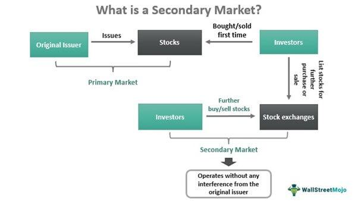

In today’s digital-driven world, the ever-evolving landscape of financial markets significantly impacts how investors operate. Technological advancements have revolutionized the mechanisms through which these markets function, leading to profound transformations in investor engagement. One critical aspect of this evolution is the increased prominence of the secondary market. This market is essential for ensuring liquidity, which is the ease with which assets can be bought or sold without affecting their price. It also enhances economic efficiency by enabling investors and institutions to trade existing securities, thus fostering a dynamic pricing environment through supply and demand dynamics. 

In addition to the burgeoning significance of the secondary market, algorithmic trading, commonly known as algo trading, has gained considerable momentum. This method of trading harnesses computational algorithms to execute trades at speeds and volumes that greatly surpass human capabilities. Algo trading automates the process by utilizing set parameters for analyzing market data and executing trades, which offers substantial advantages in terms of speed, accuracy, and the capacity to handle complex trading strategies with precision. 

This article examines the complexities of investing in financial markets, placing particular emphasis on understanding the secondary market and the transformative impact of algorithmic trading. These elements not only contribute to the growth and maturation of financial systems but also present vast opportunities and challenges for both individual investors and large financial institutions.

## Table of Contents

## Understanding the Secondary Market

The secondary market serves as a critical component of the financial system, providing a platform where existing securities, such as stocks, bonds, and other financial instruments, are exchanged among investors. Unlike the primary market, where securities are initially issued and sold to investors, the secondary market is characterized by the trading of already issued securities. Central to its function is the provision of liquidity, enabling investors to easily convert assets into cash by buying and selling securities. This liquidity is essential for maintaining market stability and investor confidence.

Key examples of secondary markets include major stock exchanges like the New York Stock Exchange (NYSE) and the NASDAQ. These exchanges facilitate the continuous buying and selling of securities, playing a vital role in the global financial ecosystem. The secondary market operates through various mechanisms, including electronic trading platforms and over-the-counter (OTC) markets, which provide flexibility to investors in terms of trading conditions and transparency.

The secondary market contributes to economic value creation by determining the fair price of securities. This price discovery process is driven by supply and demand dynamics. For instance, if there is a high demand for a specific stock with limited availability, the price is likely to increase until it reaches a point where supply meets demand. Conversely, if a stock is readily available but demand is low, the price will likely decrease. This constant interplay ensures that securities are priced accurately, reflecting all available information and investor sentiment.

Overall, the secondary market plays a vital role in enhancing market efficiency by facilitating the optimal allocation of resources and capital. It allows investors to adjust their portfolios according to their risk preferences and market outlook, contributing to a dynamic and responsive financial market environment.

## The Role of Algorithmic Trading

Algorithmic trading employs predefined algorithms to automate trading processes by analyzing vast quantities of market data and executing orders based on specific parameters. This strategic approach enhances the trading process in several significant ways.

Firstly, [algorithmic trading](/wiki/algorithmic-trading) offers remarkable speed and precision. The automation of trade execution allows trades to be completed in fractions of a second, surpassing human capabilities and accommodating high volumes of transactions with exceptional accuracy. This speed is particularly valuable in fast-paced markets where timely execution can critically impact profitability.

Secondly, algorithmic trading facilitates the management of complex trading strategies. By utilizing computational algorithms, traders can integrate intricate strategies that consider a multitude of factors and market conditions. This capability assists in the identification and exploitation of market anomalies or inefficiencies that may not be immediately apparent through manual analysis.

High-frequency trading ([HFT](/wiki/high-frequency-trading-strategies)) represents a substantial element of algorithmic trading. HFT strategies execute a large number of orders at extremely rapid speeds, often within milliseconds. This method significantly influences the stock, [forex](/wiki/forex-system), and [cryptocurrency](/wiki/cryptocurrency) markets by increasing market [liquidity](/wiki/liquidity-risk-premium) and reducing bid-ask spreads. However, it can also contribute to market [volatility](/wiki/volatility-trading-strategies) due to the sheer [volume](/wiki/volume-trading-strategy) and rapid pace of transactions.

Furthermore, the utilization of algorithms empowers traders with extensive data analysis capabilities. By swiftly processing and analyzing large datasets, algorithms enable traders to make informed and timely decisions. This data-driven approach supports the identification of trends and patterns in market behavior, allowing traders to optimize their strategies.

The integration of [machine learning](/wiki/machine-learning) and [artificial intelligence](/wiki/ai-artificial-intelligence) into algorithmic trading is set to further enhance these capabilities. These technologies can improve the adaptability and predictive accuracy of trading algorithms, paving the way for more sophisticated and efficient trading systems. The continuous evolution of technology promises to maintain algorithmic trading as a pivotal component of modern financial markets.

## Investment Strategies in Secondary Markets

In the secondary market, various investment strategies are employed to enhance profitability and reduce risk, with algorithmic trading serving as a critical tool in this endeavor. Algorithmic strategies efficiently exploit market inefficiencies and volatility, utilizing advanced techniques like mean reversion, statistical [arbitrage](/wiki/arbitrage), trend-following, pairs trading, and [market making](/wiki/market-making).

Mean reversion is a popular strategy based on the statistical premise that asset prices will revert to their mean or average over time. The strategy involves identifying assets that have deviated significantly from their historical average price and betting on a return to this equilibrium. In mathematical terms, let $P_t$ represent the price of a security at time $t$. The mean reversion strategy posits that $E[P_{t+1} - P_t] = \mu - P_t$, where $\mu$ is the long-term mean.

Statistical arbitrage is another sophisticated strategy that relies heavily on quantitative models to identify pricing inefficiencies between related financial instruments. This strategy involves creating a portfolio of assets that is market-neutral, meaning it has no net long or short positions, thereby minimizing exposure to market risk. Traders look to exploit small, temporary movements in asset prices, a process that often involves complex mathematical models and high-frequency trading technology.

Trend-following algorithms aim to capitalize on the [momentum](/wiki/momentum) of securities. The core idea is to identify trends in asset prices and generate buy or sell signals accordingly. Trend-following is based on technical indicators such as moving averages or relative strength index (RSI). A simple form of a trend-following rule is: 
$$
\text{Signal} = 
\begin{cases} 
\text{Buy}, & \text{if } P_t > MA(P, \tau) \\ 
\text{Sell}, & \text{if } P_t < MA(P, \tau) 
\end{cases} 
$$
where $MA(P, \tau)$ is the moving average of price $P$ over period $\tau$.

Pairs trading is a market-neutral strategy where the performance of two correlated securities is analyzed, allowing investors to profit from relative price movements. The strategy involves finding two stocks that historically move together and placing a long position on the underperforming stock while shorting the outperforming one, assuming convergence in their prices.

Market making and liquidity provision are pivotal functions facilitated by algorithmic trading in the secondary market. Market makers provide liquidity by continuously quoting buy and sell prices for a specific asset, profiting from the bid-ask spread. This activity ensures efficient market operations and narrow spreads, benefiting all market participants.

Algorithmic trading in these strategies is crucial as it allows for the handling of vast amounts of data at high speeds, enabling quick decision-making and execution of trades. The synergy of these sophisticated strategies in the secondary market contributes significantly to enhancing liquidity, ensuring efficiency, and providing numerous opportunities for profit.

## Challenges and Risks of Algorithmic Trading

Despite its advantages, algorithmic trading is accompanied by a range of challenges and risks that must be carefully managed to ensure market stability and protect financial interests.

Market volatility presents a significant challenge to algorithmic trading. Algorithms designed to capitalize on predictable patterns may struggle in highly volatile conditions, potentially incurring considerable financial risk. Sudden market shifts can lead to substantial losses if these algorithms are not adequately programmed to respond to unexpected changes. For instance, rapid price fluctuations can trigger automated trades that exacerbate market movements, contributing to flash crashes. Risk management protocols, such as setting stop-loss orders and incorporating volatility indicators, are essential to mitigate these risks.

Technical failures also pose substantial risks. Algorithmic trading systems rely heavily on complex software and hardware infrastructure, making them susceptible to failures. A minor coding error or hardware malfunction can cascade through the system, resulting in large-scale financial losses. Given the high volume and speed of trades executed by algorithms, even a brief technical glitch can have far-reaching consequences. Regular testing, robust system architecture, and redundancy measures are critical to ensure the reliability and resilience of these systems.

Cyber-security threats further complicate the landscape for algorithmic trading. High-value trading systems are prime targets for cyber-attacks, which can compromise algorithms and lead to unauthorized trades or data breaches. Protecting sensitive financial data and algorithms requires significant investment in security measures, such as encryption, secure authentication processes, and continuous monitoring for suspicious activities.

Regulatory challenges represent another layer of complexity. The rapid evolution of high-frequency trading strategies has prompted regulatory bodies to introduce policies aimed at mitigating associated risks. These include measures like circuit breakers to curb excessive volatility and requirements to maintain a minimum level of liquidity. Firms must stay abreast of these regulations to ensure compliance, which often requires significant time and resource investments.

In summary, while algorithmic trading offers unparalleled speed and efficiency, it introduces several potential risks linked to market volatility, technical and security vulnerabilities, and evolving regulatory landscapes. Effective risk management strategies and proactive compliance efforts are essential for mitigating these challenges and harnessing the full potential of algorithmic trading systems.

## The Future of Algo Trading and Secondary Markets

As technology continues to advance, the future of algorithmic trading in secondary markets appears promising, marked by increased sophistication and integration of artificial intelligence (AI) and machine learning. These technologies enable more precise analysis of market patterns, leading to improved decision-making and optimized trading strategies. AI and machine learning algorithms can process vast amounts of data in real-time, allowing for dynamic model adjustments based on evolving market conditions. As a result, these technologies are set to enhance the predictive capabilities and responsiveness of algorithmic trading systems.

Sustainable investing is increasingly becoming a focal point for investors worldwide, emphasizing Environmental, Social, and Governance ([ESG](/wiki/esg-investing)) criteria. This trend is likely to influence the development of algorithmic trading strategies designed to align with ESG compliance. Such strategies could involve the integration of ESG data into trading algorithms to identify and prioritize investments in companies with strong sustainability practices. By doing so, algorithmic trading can contribute to more responsible investing without sacrificing performance.

The emergence of Decentralized Finance (DeFi) and blockchain technologies is revolutionizing trading activities in secondary markets. These technologies facilitate new methods of trading that do not rely on traditional intermediaries. Blockchain, with its transparent and immutable ledger, enables secure and efficient transactional processes. DeFi platforms, utilizing smart contracts, automate various trading functions, reducing the need for centralized control. This decentralization has the potential to increase market transparency, reduce transaction costs, and mitigate counterparty risks, thereby enhancing market efficiency.

Furthermore, the increasing accessibility of financial markets through user-friendly platforms is expected to democratize participation for retail investors. Technology-driven platforms that offer intuitive interfaces and educational resources can bridge the gap between retail investors and complex financial markets. This democratization allows a broader spectrum of individuals to engage in trading activities, potentially leading to a more diverse and resilient market ecosystem. The proliferation of mobile applications and online platforms can provide retail investors with tools previously accessible only to institutional players, fostering a more inclusive financial market environment.

In summary, the future of algorithmic trading in secondary markets is characterized by advanced AI and machine learning techniques, an emphasis on sustainable investing, the transformative role of DeFi and blockchain technologies, and increased accessibility for retail investors. These developments are set to redefine market dynamics, offering new opportunities and challenges for all market participants.

## Conclusion

The secondary market and algorithmic trading have firmly established themselves as pillars of the contemporary financial ecosystem, crucial in ensuring liquidity and operational efficacy. The secondary market facilitates the easy exchange of previously issued securities among investors, ensuring that markets remain dynamic and responsive to the demands of supply and demand. This liquidity is fundamental for investors seeking to enter or [exit](/wiki/exit-strategy) positions swiftly, contributing to market stability and confidence.

Algorithmic trading further enhances these markets by offering unparalleled speed and precision in executing trades. With algorithms capable of analyzing vast datasets and executing transactions within milliseconds, the scale and efficiency of trading operations have been exponentially increased. Despite inherent challenges such as market volatility, technical failures, and regulatory constraints, the strategic advantages offered by algorithmic methods continue to outweigh potential negatives. They allow market participants to execute sophisticated trading strategies that may not have been feasible in the pre-algorithmic era.

However, to capitalize on these opportunities, investors and financial institutions must maintain a vigilant stance, continuously updating their understanding and strategies in response to technological advancements and regulatory changes. As artificial intelligence and machine learning potentially reshape algorithmic trading models, and as decentralized finance broadens the accessibility of secondary markets, staying informed and adaptable is more significant than ever.

In conclusion, a thorough grasp of the roles and functions of secondary markets and algorithmic trading is essential for making prudent and forward-thinking investment decisions. With ongoing innovation and transformation, both sectors are set to offer even more comprehensive benefits, underscoring their critical position within today's global financial framework.

## References & Further Reading

[1]: Bergstra, J., Bardenet, R., Bengio, Y., & Kégl, B. (2011). ["Algorithms for Hyper-Parameter Optimization."](https://dl.acm.org/doi/10.5555/2986459.2986743) Advances in Neural Information Processing Systems 24.

[2]: ["Advances in Financial Machine Learning"](https://www.amazon.com/Advances-Financial-Machine-Learning-Marcos/dp/1119482089) by Marcos Lopez de Prado

[3]: ["Evidence-Based Technical Analysis: Applying the Scientific Method and Statistical Inference to Trading Signals"](https://www.amazon.com/Evidence-Based-Technical-Analysis-Scientific-Statistical/dp/0470008741) by David Aronson

[4]: ["Machine Learning for Algorithmic Trading"](https://github.com/stefan-jansen/machine-learning-for-trading) by Stefan Jansen

[5]: ["Quantitative Trading: How to Build Your Own Algorithmic Trading Business"](https://www.amazon.com/Quantitative-Trading-Build-Algorithmic-Business/dp/1119800064) by Ernest P. Chan