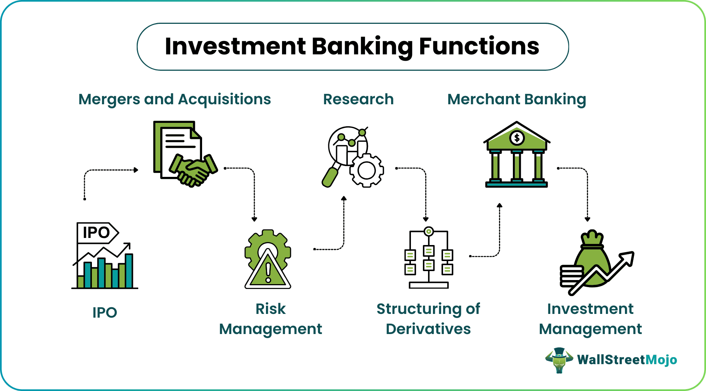

## Table of Contents

## What is an investment bank?

An investment bank is a type of financial institution that helps companies and governments raise money by issuing and selling securities like stocks and bonds. They act as a middleman between the people or organizations that need money and the investors who want to buy these securities. Investment banks also provide advice on financial strategies, mergers, and acquisitions, helping their clients make big business decisions.

In addition to helping with fundraising, investment banks also offer services like trading securities, managing assets, and providing research and analysis on markets and companies. They often work with large corporations, but they can also assist smaller businesses and even individuals with their financial needs. Investment banks play a crucial role in the economy by facilitating the flow of capital and helping businesses grow and succeed.

## How do investment banks differ from commercial banks?

Investment banks and commercial banks are both types of financial institutions, but they have different main jobs. An investment bank helps companies and governments raise money by selling stocks and bonds. They also give advice on big business decisions like mergers and acquisitions. On the other hand, a commercial bank is more focused on everyday banking services for people and businesses. They offer things like checking and savings accounts, loans, and credit cards.

Another big difference is who they work with. Investment banks usually work with big companies, governments, and sometimes very rich people. They help these clients with complex financial needs. Commercial banks, however, serve a much wider range of customers, from individuals to small businesses. They help with everyday financial needs like saving money, borrowing for a car or house, and managing daily transactions.

In summary, while investment banks focus on raising money through securities and giving strategic advice, commercial banks concentrate on basic banking services for the general public. Both are important parts of the financial system, but they serve different purposes and clients.

## What are the primary roles of investment banks?

Investment banks help companies and governments get money by selling stocks and bonds. They work like a middleman, connecting those who need money with investors who want to buy these stocks and bonds. This process is called underwriting, and it's a big part of what investment banks do. They also help companies decide when and how to sell their stocks or bonds to get the best price.

Besides helping with money, investment banks give advice on big business decisions. This includes things like mergers, where two companies join together, and acquisitions, where one company buys another. They use their knowledge to help companies make smart choices that can help them grow. Investment banks also do research on markets and companies, which they share with their clients to help them understand the financial world better.

In short, investment banks are key players in the financial world. They help raise money through stocks and bonds, give advice on big business moves, and provide research to help clients make good decisions. This makes them very important for companies and governments looking to grow and succeed.

## What services do investment banks provide to corporations?

Investment banks help corporations in many ways. One big way is by helping them raise money. They do this by selling stocks and bonds for the company. This is called underwriting. When a company wants to grow or start a new project, it needs money. Investment banks help by finding people or other companies who want to invest in the company by buying its stocks or bonds. They make sure the company gets the money it needs at the best possible price.

Investment banks also give advice on big business decisions. For example, if a company wants to buy another company or merge with it, investment banks help plan and [carry](/wiki/carry-trading) out these moves. They use their knowledge of the market to help the company make smart choices. Besides this, investment banks do research on markets and other companies. They share this information with their clients to help them understand what's happening in the financial world and make better decisions.

## How do investment banks assist with mergers and acquisitions?

Investment banks help companies when they want to merge with another company or buy one. They give advice on whether it's a good idea to do the merger or acquisition. They look at things like how much the other company is worth, if the deal makes financial sense, and how it will affect the company in the future. They also help figure out the best way to pay for the deal, whether it's with cash, stocks, or a mix of both.

Once the company decides to go ahead with the merger or acquisition, investment banks help make it happen. They find other companies that might want to merge or be bought. They talk to these companies and negotiate the terms of the deal. They also help with all the paperwork and make sure everything is done correctly. This can be a very complicated process, but investment banks use their expertise to make it smoother and help the company get the best possible outcome.

## What is the process of underwriting securities?

Underwriting securities is when an investment bank helps a company sell its stocks or bonds to raise money. The investment bank agrees to buy the securities from the company and then sell them to investors. This means the investment bank takes on the risk of selling the securities. If they can't sell all of them, they might lose money. But if they sell them at a higher price than they bought them, they make a profit.

The process starts when a company decides it wants to raise money by selling securities. They hire an investment bank to help them. The investment bank does research to decide how much the securities should be sold for. They also help the company prepare all the documents needed to sell the securities. Once everything is ready, the investment bank buys the securities from the company and starts selling them to investors. They use their network and knowledge of the market to find the right buyers and make sure the company gets the money it needs.

## How do investment banks help in raising capital for businesses?

Investment banks help businesses raise money by selling stocks and bonds. When a business needs money to grow or start new projects, they can't always borrow from a regular bank. So, they work with an investment bank. The investment bank helps the business create stocks or bonds and then sells these to investors. This way, the business gets the money it needs, and investors get a chance to own part of the business or earn interest on their investment.

The investment bank does a lot of work to make sure the business gets the best deal. They figure out how much the stocks or bonds should be sold for by doing research on the market. They also help the business prepare all the paperwork needed to sell the securities. Once everything is ready, the investment bank buys the stocks or bonds from the business and then sells them to investors. They use their connections and knowledge to find the right buyers and make sure the business gets the money it needs at a good price.

## What role do investment banks play in the stock market?

Investment banks help companies sell their stocks in the stock market. When a company wants to raise money, they can sell parts of their business as stocks. Investment banks help by figuring out how much each stock should cost and finding people who want to buy them. They make sure the company gets the money it needs by selling these stocks to investors. This process is called an initial public offering (IPO), and it's how many big companies start trading on the stock market.

Besides helping with IPOs, investment banks also help companies sell more stocks later on. If a company needs more money, they can sell more stocks, and investment banks help with this too. They also give advice to companies about when and how to sell their stocks to get the best price. Investment banks use their knowledge of the stock market to help companies make smart decisions and raise the money they need to grow.

## How do investment banks manage risk?

Investment banks manage risk by being very careful about the deals they take on. They do a lot of research to understand the market and the companies they work with. This helps them figure out how risky a deal might be. They also use special tools and models to predict what might happen in the future. By understanding the risks, they can decide if a deal is worth doing or if they need to change it to make it safer.

Another way investment banks manage risk is by spreading it out. They don't put all their money into one deal. Instead, they work on many different deals at the same time. This way, if one deal goes bad, it won't hurt them too much because they have other deals that might do well. They also use insurance and other financial products to protect themselves from big losses. By doing all these things, investment banks can handle the ups and downs of the financial world and keep their business safe.

## What are the ethical considerations for investment banks?

Investment banks have to think about ethics a lot. They need to be honest and fair in everything they do. When they help companies sell stocks or bonds, they need to make sure they give the right information to investors. They can't hide bad news or make things sound better than they are. This is important because investors trust them to help them make good choices. If investment banks lie or trick people, it can hurt the whole financial system and make people lose trust in banks.

Another big part of ethics for investment banks is how they treat their clients. They need to put their clients' needs first, not just try to make money for themselves. This means giving good advice and not pushing clients into risky deals just to make a quick profit. Investment banks also need to follow all the rules and laws that are there to protect people and keep the financial system fair. By doing the right thing, investment banks can help build a strong and trustworthy financial world.

## How has technology impacted the functions of investment banks?

Technology has changed a lot of things for investment banks. It makes their work faster and easier. For example, they use computers and software to do research and analyze data. This helps them figure out the best prices for stocks and bonds and find the right investors. They also use technology to talk to their clients and do deals from anywhere in the world. This means they can work faster and help more people.

Another big change is that technology has made some jobs easier to do without people. This is called automation. Investment banks use special computer programs to do things like trading stocks and managing risks. These programs can work all the time and make decisions very quickly. But, even with all this technology, people are still important. They use their knowledge and experience to make sure the computers are doing the right things and to help clients with big decisions.

## What are the future trends and challenges facing investment banks?

Investment banks are facing some big changes and challenges in the future. One big trend is the use of technology. More and more, investment banks are using computers and special programs to do their work. This can make things faster and cheaper, but it also means they need to keep up with new technology all the time. Another trend is that more people and businesses around the world are using investment banks. This is good because it means more business, but it also means they need to understand different markets and follow different rules in different countries.

There are also some challenges that investment banks need to deal with. One big challenge is keeping things fair and honest. With so much money and so many deals, it's important that investment banks always do the right thing and don't trick people. They also need to be careful about risks. The financial world can change quickly, and a bad deal can cause big problems. So, investment banks need to be smart about the deals they take on and always be ready for surprises.

## References & Further Reading

[1]: Lopez de Prado, M. (2018). ["Advances in Financial Machine Learning"](https://www.amazon.com/Advances-Financial-Machine-Learning-Marcos/dp/1119482089). Wiley.

[2]: Aronson, D. R. (2006). ["Evidence-Based Technical Analysis: Applying the Scientific Method and Statistical Inference to Trading Signals"](https://www.amazon.com/Evidence-Based-Technical-Analysis-Scientific-Statistical/dp/0470008741). John Wiley & Sons.

[3]: Chan, E. P. (2008). ["Quantitative Trading: How to Build Your Own Algorithmic Trading Business"](https://github.com/ftvision/quant_trading_echan_book). Wiley.

[4]: Jansen, S. (2020). ["Machine Learning for Algorithmic Trading"](https://github.com/stefan-jansen/machine-learning-for-trading).

[5]: Bergstra, J., Bardenet, R., Bengio, Y., & Kégl, B. (2011). ["Algorithms for Hyper-Parameter Optimization."](https://proceedings.neurips.cc/paper/2011/file/86e8f7ab32cfd12577bc2619bc635690-Paper.pdf) Advances in Neural Information Processing Systems 24.