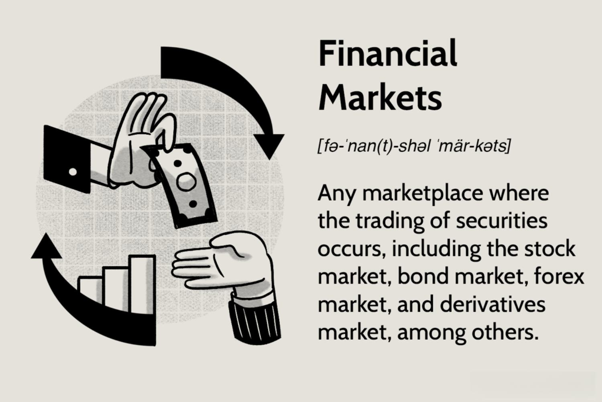

Financial markets and algorithmic trading play a pivotal role in the global economy. These markets serve as platforms for the buying and selling of various financial instruments, enabling capital flow, risk management, and economic growth. They comprise different types, including stock, bond, forex, and derivatives markets, each catering to specific investment and financing needs. The seamless operation of these markets is vital for the efficient allocation of resources, liquidity provision, and price discovery, impacting economies worldwide. 

Algorithmic trading, on the other hand, has revolutionized how transactions are executed in these markets. By utilizing complex algorithms and high-speed data networks, algorithmic trading achieves rapid and precise order execution, significantly enhancing market efficiency. These algorithms can analyze vast quantities of market data within milliseconds, making informed trading decisions that are virtually impossible for human traders to match. Consequently, understanding financial markets and algorithmic trading is crucial for investors, traders, and individuals interested in financial economics. These concepts not only underpin the mechanics of modern finance but also offer insights into the dynamics that influence global financial stability and growth.



## Table of Contents

## Overview of Financial Markets and Their Economic Roles

Financial markets serve as pivotal platforms where borrowers, investors, and traders meet to facilitate the transfer of capital and subsequent risk mitigation. Their primary role lies in channeling savings and investments between suppliers and consumers of funds, promoting economic growth and stability.

**Definition and Importance of Financial Markets**

Financial markets constitute a broad category encompassing any marketplace where trading of securities occurs, including stocks, bonds, currencies, and derivatives. They are integral to the efficient functioning of a capitalistic economy, facilitating price discovery, liquidity, and the diversification of risk. Well-functioning financial markets contribute to economic stability and growth by allocating resources efficiently, encouraging savings, and increasing investment levels.

**Different Types of Financial Markets**

**1. Stock Markets:** Stock markets allow companies to issue shares to the public, providing them with essential capital for expansion and operations. They serve as a platform for investors to trade shares, determining a company’s market value through supply and demand dynamics.

**2. Bond Markets:** Bond markets provide a mechanism for entities such as governments and corporations to raise funds by issuing debt securities. They are crucial for financing public infrastructure projects and corporate operations. Bondholders typically earn regular interest payments and receive the principal at maturity.

**3. Forex Markets:** The foreign exchange (forex) markets are global decentralized platforms where currencies are traded. Massive daily transaction volumes in forex facilitate international trade and investments by allowing for currency conversions. This market also offers opportunities for hedging currency risk.

**4. Derivatives Markets:** Derivatives are financial contracts whose value is derived from underlying assets, such as stocks, bonds, commodities, or currencies. These markets permit the transfer of risk between parties and are crucial for hedging strategies and speculative prospects.

**Role of Financial Markets in Economic Development and Resource Allocation**

Financial markets contribute significantly to economic development by enabling efficient resource allocation. They allow savings to be directed towards fruitful investments, amplifying productivity and fostering economic growth. By offering a mechanism for price setting, financial markets provide valuable information about asset values and future economic conditions. 

Moreover, these markets enhance [liquidity](/wiki/liquidity-risk-premium) — the ease with which assets can be converted into cash without significant losses — encouraging more active participation and investment from both individuals and institutions. Financial markets also facilitate domestic and international trade by offering various financial instruments that cater to diverse financial needs and risk appetites.

In conclusion, financial markets lie at the heart of economic systems worldwide, influencing the distribution of wealth and resources. Their ability to facilitate capital flow, enhance liquidity, and provide market participants with essential information and tools underscores their immense economic value.

## Types of Financial Markets

### Types of Financial Markets

Financial markets are essential avenues where participants can trade securities and other financial instruments. These markets play a critical role in the allocation of resources and the facilitation of capital formation. Their structure comprises various types, with the stock, bond, derivatives, and [forex](/wiki/forex-system) markets standing as primary categories.

#### Stock Markets

Stock markets are platforms where shares of publicly listed companies are bought and sold. They serve numerous functions, including enabling corporations to raise capital by issuing shares and providing investors with opportunities to gain equity ownership and profit. Key participants in the stock market include individual and institutional investors, brokers, market makers, and regulators. These entities interact within exchanges such as the New York Stock Exchange (NYSE) or NASDAQ, where share prices are determined largely through supply and demand dynamics. The stock market also plays a pivotal role in providing liquidity, giving investors the ability to buy and sell shares with ease.

#### Bond Markets

Bond markets facilitate the trading of debt securities, wherein participants lend money to issuers such as governments, municipalities, or corporations in exchange for periodic interest payments and the return of the bond's face value at maturity. They are crucial for financing and investment purposes. The primary bond market involves the issuance of new bonds directly from the issuer to investors, whereas the secondary bond market allows for the trading of existing bonds. These markets are vital in influencing interest rates and providing governments and companies with the capital necessary for operations and growth. The bond market's impact on the broader economy is substantial, affecting everything from mortgage rates to corporate investment decisions.

#### Derivatives and Forex Markets

Derivatives markets are specialized venues where financial contracts derive their value from underlying assets, such as stocks, bonds, commodities, or currencies. Common derivatives include futures, options, and swaps. These instruments are mainly used for hedging risk, speculation, and [arbitrage](/wiki/arbitrage). For example, a futures contract might lock in a price for a commodity to be delivered at a future date, mitigating the risk of price fluctuations.

The forex (foreign exchange) market is the global platform for trading currencies. As the largest and most liquid market in the world, it operates round the clock, facilitating currency conversion which is essential for international trade and investments. Forex markets are characterized by major participants including banks, currency speculators, governments, and multinational corporations. They play a critical role in determining exchange rates and are instrumental in the global flow of capital.

Each of these financial markets operates with unique dynamics and mechanisms, contributing significantly to the stability and growth of the global economy. Understanding how these markets function individually and collectively is key to comprehending their impact on financial systems worldwide.

## Algorithmic Trading: Revolutionizing Market Transactions

Algorithmic trading refers to the use of computer algorithms to automate trading decisions in financial markets. This form of trading leverages mathematical models and computational algorithms to execute trades according to pre-defined strategies, eliminating human intervention in the trading process. By integrating market data inputs with algorithmic controls, trading systems can initiate buy or sell orders based on specific criteria such as price, [volume](/wiki/volume-trading-strategy), and timing.

Key benefits of [algorithmic trading](/wiki/algorithmic-trading) lie in its speed and precision. Algorithms can process market data and execute trades much faster than any human trader, which is crucial in fast-paced financial markets. This automation allows traders to respond to market fluctuations in a fraction of a second, significantly reducing latency compared to manual trading. Furthermore, precision is enhanced as algorithms can continuously monitor market conditions and act with mathematical accuracy, minimizing the likelihood of human error.

In terms of market liquidity and efficiency, algorithmic trading plays a transformative role. It contributes to increased liquidity by executing a high volume of trades, ensuring that buy and sell orders are matched more efficiently. Enhanced liquidity often leads to tighter bid-ask spreads, which can reduce trading costs for all market participants. Furthermore, algorithmic trading enhances market efficiency by integrating vast amounts of data and identifying arbitrage opportunities swiftly, helping to bring prices more in line with their true market value. However, it is critical to be aware that while algorithmic trading can improve liquidity and efficiency, it also introduces new challenges, such as the potential for market manipulation and flash crashes if not properly managed.

## Types of Algorithmic Trading Strategies

Algorithmic trading employs a range of strategies, each designed to capitalize on market opportunities with speed and precision. Among the most common strategies are trend-following, arbitrage, high-frequency trading ([HFT](/wiki/high-frequency-trading-strategies)), and black-box algorithms. Each strategy serves a unique function and leverages technology to optimize trading processes.

**Trend-Following and Arbitrage**

Trend-following strategies are rooted in technical analysis and aim to exploit market [momentum](/wiki/momentum). Traders using these strategies identify and follow patterns in price movements to capitalize on upward or downward trends. This approach operates on the assumption that once a trend is established, it is likely to continue for some time. Mathematical models and algorithms are used to determine entry and [exit](/wiki/exit-strategy) points, often relying on historical data analysis to predict future price movements.

Arbitrage strategies involve the simultaneous purchase and sale of an asset in different markets to profit from price discrepancies. This strategy leverages the concept of market inefficiency, where the same asset may be priced differently across various exchanges or trading venues. Arbitrage can be conducted across geographical locations, asset classes, or timeframes. The goal is to achieve risk-free profit by exploiting these disparities, although the window to do so is often very narrow, requiring high-speed execution.

```python
def calculate_arbitrage_opportunity(price_exchange_1, price_exchange_2, transaction_cost):
    """Calculate potential arbitrage profit after transaction costs."""
    profit = price_exchange_2 - price_exchange_1
    net_profit = profit - transaction_cost
    return net_profit if net_profit > 0 else 0

# Example usage
exchange_1_price = 100
exchange_2_price = 105
transaction_cost = 2
print(calculate_arbitrage_opportunity(exchange_1_price, exchange_2_price, transaction_cost))  # Output: 3
```

**High-Frequency Trading (HFT)**

High-frequency trading represents a class of trading strategies executed at exceptionally high speeds. These strategies rely on sophisticated algorithms and high-powered computer systems to process vast amounts of market data, execute trades, and manage risk — all in fractions of a second. HFT is characterized by rapid order execution, a large number of trades executed per day, and minimal holding periods for traded securities.

The key attributes of HFT include low latency, high turnover rates, and a focus on high-volume trades. Due to the speed and complexity of these operations, high-frequency traders often co-locate their servers with exchanges to reduce the time it takes for information to travel. While HFT can enhance market liquidity and efficiency, it also raises concerns about market [volatility](/wiki/volatility-trading-strategies) and fairness, as not all market participants can access the same technological resources.

**Black-Box Algorithms**

Black-box algorithms, also known as proprietary trading algorithms, are systems where the underlying logic and decision-making processes are not transparent to the user. These algorithms are typically developed by quantitative analysts and are heavily reliant on statistical models, [machine learning](/wiki/machine-learning), and [artificial intelligence](/wiki/ai-artificial-intelligence). The inherent purpose is to automatically make trading decisions based on pre-defined criteria and data input, without human intervention.

The impact of black-box algorithms on markets can be profound, as they can operate across multiple markets and time zones simultaneously. However, their lack of transparency poses challenges, as traders and regulators may struggle to understand why and how specific trading decisions are made. This opacity can lead to unintended consequences, including market disruptions and flash crashes when automated systems react to market events in unforeseen ways.

In summary, the diverse range of algorithmic trading strategies, from trend-following and arbitrage to HFT and black-box algorithms, has substantially transformed how financial markets operate. These strategies leverage advanced technology to enhance precision and speed in trading, albeit with challenges that necessitate careful management and regulatory oversight.

## Advantages and Limitations of Algorithmic Trading

Algorithmic trading, a process that employs computer programs to automate trading decisions, provides several advantages in financial markets. One key benefit is the reduction of human error. Traders, who can be influenced by fatigue, stress, or miscalculations, can make costly mistakes. Algorithms, however, follow predefined rules and data sets, consistently executing trades with precision and accuracy.

Emotional bias, a common obstacle for traders, is also mitigated through algorithmic trading. Human traders may succumb to fear or greed, leading to irrational decision-making. Automated systems remove these emotional biases, ensuring that trades are executed based solely on objective data analysis and strategic parameters.

Despite these advantages, algorithmic trading comes with its set of limitations. System failure is a significant risk. Technical glitches or software errors can result in unintended consequences, such as errant trades or substantial financial losses. Additionally, the lack of transparency in decision-making processes poses a challenge. Algorithms, especially sophisticated ones, can function as "black boxes," making it difficult for traders and regulators to understand how certain trading decisions are made.

Furthermore, algorithmic trading presents several regulatory challenges. The high speed and volume at which these trades occur can create market volatility, necessitating robust oversight to prevent manipulative practices. Regulatory bodies must grapple with the balance between fostering innovation and ensuring market integrity. Algorithmic strategies need to be monitored to prevent practices that could destabilize financial systems, such as the 2010 Flash Crash, where an algorithmic trading strategy caused a brief but severe market crash.

In conclusion, while algorithmic trading offers notable advantages, including the minimization of human error and emotional bias, it also presents risks that require careful management and regulation. Addressing these challenges is crucial to harnessing the full potential of algorithmic trading while safeguarding market stability.

## Real-World Impacts and Examples

Financial markets have historically played crucial roles in both economic crises and recoveries, with several notable case studies illustrating their impacts. During the global financial crisis of 2008, financial markets were at the epicenter of economic turmoil. The collapse of Lehman Brothers, a major investment bank, triggered a massive sell-off in stock markets worldwide. In this instance, financial markets acted as conduits, amplifying the crisis through interconnected trades and asset devaluations, which ultimately required extensive governmental intervention for stabilization and subsequent recovery. 

Post-crisis, financial markets demonstrated resilience and adaptability, contributing to economic recovery. Central banks, such as the U.S. Federal Reserve, implemented unconventional monetary policies like quantitative easing. These measures alleviated liquidity constraints and restored investor confidence, leading to gradual market recovery. Financial markets facilitated the reallocation of resources, thus aiding economic stabilization and growth following widespread distress.

Algorithmic trading has significantly improved trade execution and market efficiency, offering several advantages. One notable example is the improvement in execution speeds and reduction in trading costs. Algorithms can execute orders at lightning-fast speeds, minimizing market impact and providing traders with better price discovery. This speed and precision optimize trade execution, particularly in high-frequency trading where milliseconds matter. 

Moreover, algorithmic trading enhances liquidity by providing tighter bid-offer spreads and a steady flow of buying and selling, which stabilizes prices. The presence of algorithmic trading systems ensures that markets remain operationally efficient, enabling swift transactions and maintaining market equilibrium.

However, the complexity of algorithmic trading systems has occasionally led to market disruptions, often referred to as "flash crashes." One such example is the Flash Crash of May 6, 2010, where the U.S. stock market plunged abruptly before a rapid recovery within minutes. Investigations revealed that the crash was exacerbated by algorithmic trading systems that misinterpreted selling pressure, triggering automated responses that intensified the market decline. Such events underscore the potential for systemic risk induced by algorithmic strategies not accounting for rare yet impactful market scenarios.

These examples demonstrate both the sophistication and the challenges associated with financial markets and algorithmic trading, highlighting the delicate balance between technology-driven efficiency and the need for robust risk management practices. As financial markets evolve, continued scrutiny and regulatory oversight are essential to harnessing the benefits while mitigating potential risks associated with technological advancements.

## The Future of Financial Markets and Algorithmic Trading

Emerging trends in financial markets are shaping the global economic landscape with increasing velocity. A major shift is the digitization of financial services, which is expanding access to markets and democratizing investment opportunities. Blockchain technology and cryptocurrencies are becoming more mainstream, presenting both opportunities and risks. Decentralized finance (DeFi) is another trend challenging traditional financial systems by offering financial instruments without relying on central financial intermediaries. This shift is leading to greater inclusivity but also introduces regulatory challenges.

Algorithmic trading is evolving rapidly due to advancements in artificial intelligence (AI) and machine learning. These technologies enhance the ability to process vast amounts of data and make complex trading decisions with improved accuracy and speed. Machine learning algorithms can identify patterns and predict market movements that are imperceptible to human traders. As a result, traders are able to optimize strategies and execute large volumes of trades in fractions of a second. An example is the use of [reinforcement learning](/wiki/reinforcement-learning), where algorithms learn optimal trading strategies through trial and error.

```python
# Example of a simple moving average crossover strategy using a Python library
import numpy as np
import pandas as pd
import yfinance as yf

# Download historical data for a particular stock
data = yf.download('AAPL', start='2020-01-01', end='2023-01-01')
data['SMA_50'] = data['Close'].rolling(window=50).mean()
data['SMA_200'] = data['Close'].rolling(window=200).mean()

# Signal generation
data['Signal'] = 0
data['Signal'][50:] = np.where(data['SMA_50'][50:] > data['SMA_200'][50:], 1, 0)

# Calculating returns
data['Returns'] = data['Signal'].shift(1) * data['Close'].pct_change()
portfolio_returns = data['Returns'].sum()

print(f"Total Strategy Returns: {portfolio_returns:.2%}")
```

This simplistic example illustrates how algorithms can be programmed to execute trades based on predefined signals generated from data trends.

Potential regulatory developments are anticipated to address the rising influence of technology in trading and market operations. As algorithmic trading strategies become more complex, regulators are focused on ensuring transparency, fairness, and stability in financial markets. Policymakers may introduce frameworks to monitor algorithmic trading activities and mitigate risks associated with high-frequency trading, such as market manipulation and flash crashes. Additionally, regulations concerning the use of AI and machine learning in trading aim to ensure ethical standards and accountability.

The global shift towards more robust regulatory environments is crucial as it could foster greater trust and stability in financial markets while protecting investors and market integrity. Future regulatory frameworks may also promote technological innovation by encouraging collaboration between regulators and market participants, creating a secure yet dynamic trading ecosystem.

## Conclusion

Financial markets are indispensable to the global economy, serving as the mechanisms through which capital and resources are efficiently allocated. These markets, encompassing various forms such as stock, bond, forex, and derivatives, each play a unique role in economic development. Stock markets enable companies to raise capital while providing investors with opportunities for growth and income. Bond markets facilitate debt financing and are pivotal in determining interest rates. Forex markets support international trade and investment by enabling currency exchange, and derivatives markets allow for risk management and speculation on future price movements.

Algorithmic trading represents a significant evolution in how financial markets operate, harnessing the power of technology to execute trades with unprecedented speed and accuracy. This transformation has led to enhanced market liquidity and efficiency, removing human error and emotional bias from trading decisions. Algorithmic trading strategies, including high-frequency trading and arbitrage, have reshaped market dynamics and introduced new challenges and opportunities.

As financial markets and algorithmic trading continue to evolve, it is essential for investors, traders, and policymakers to deepen their understanding of these complex systems. The future promises further integration of artificial intelligence and machine learning, potentially revolutionizing market operations even further. By exploring these dynamic financial elements, stakeholders can better navigate the intricacies of modern finance and contribute to more robust and resilient market infrastructures.

## References & Further Reading

[1]: Pardo, R. (2008). ["The Evaluation and Optimization of Trading Strategies."](https://onlinelibrary.wiley.com/doi/book/10.1002/9781119196969) Wiley Finance.

[2]: Easley, D., & Lopez de Prado, M. J. (2012). ["The Microstructure of the 'Flash Crash': Flow Toxicity, Liquidity Crashes, and the Probability of Informed Trading."](https://papers.ssrn.com/sol3/papers.cfm?abstract_id=1695041) The Journal of Portfolio Management, 37(2), 118-128.

[3]: Bandyopadhyay, P. (2019). ["Algorithmic Trading: Winning Strategies and Their Rationale."](https://books.google.com/books/about/Algorithmic_Trading.html?id=WAlFDwAAQBAJ) CRC Press.

[4]: Aldridge, I. (2013). ["High-Frequency Trading: A Practical Guide to Algorithmic Strategies and Trading Systems."](https://books.google.com/books/about/High_Frequency_Trading.html?id=8QpIsVUMhmEC) Wiley Finance.

[5]: Harris, L. (2003). ["Trading & Exchanges: Market Microstructure for Practitioners."](https://academic.oup.com/book/52292) Oxford University Press.