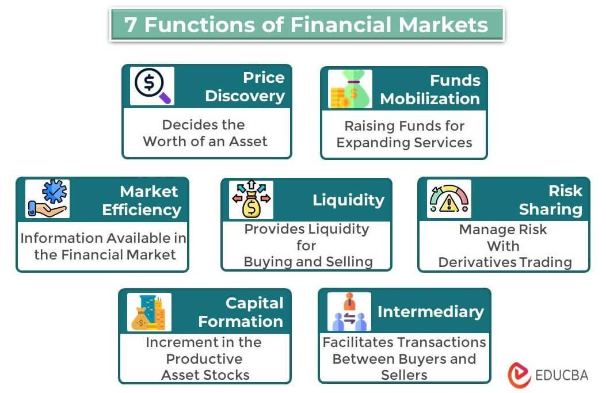

## Table of Contents

## What are financial markets?

Financial markets are places where people and businesses can buy and sell things like stocks, bonds, and currencies. These markets help people invest their money and companies raise funds to grow their business. Think of it like a big store where instead of buying clothes or food, you're buying pieces of companies or loans to governments.

There are different types of financial markets, like the stock market where you can buy shares of companies, or the bond market where you can buy government or corporate bonds. These markets are important because they help the economy by moving money from people who have extra to those who need it to start or grow businesses. They also help set prices for financial products, which can tell us how the economy is doing.

## What types of financial markets exist?

There are several types of financial markets, each with its own purpose. The stock market is where people can buy and sell shares of companies. When you buy a stock, you own a small part of that company. The bond market is another type where people can buy bonds, which are like loans to companies or governments. These bonds pay back the money with interest over time. The forex market, or foreign exchange market, is where people trade different currencies. This helps businesses that need to buy or sell things in other countries.

Another important financial market is the commodity market, where people trade raw materials like oil, gold, and wheat. This helps set prices for these important resources. The derivatives market is a bit more complex. It's where people trade contracts that get their value from something else, like stocks or commodities. These are used for things like managing risk or betting on future price changes. Each of these markets plays a role in helping the economy work smoothly by connecting people who need money with those who have it to invest.

## How do financial markets function?

Financial markets work by bringing together people who want to buy things like stocks, bonds, or currencies with people who want to sell them. Imagine a big marketplace where instead of fruits and vegetables, you're trading pieces of companies or loans. When someone wants to buy a stock, they find someone who wants to sell it, and they agree on a price. This price can change all the time based on what people think the stock is worth. The same thing happens with bonds, currencies, and other financial products. These markets help companies raise money by selling stocks or bonds, and they help people invest their money to hopefully make more money over time.

These markets also help the economy by setting prices for financial products. When lots of people want to buy a stock, the price goes up. If fewer people want it, the price goes down. This tells us a lot about what people think about the economy and specific companies. Financial markets use big computers and special places like stock exchanges to make all these trades happen quickly and fairly. They have rules to make sure everyone plays by the same rules and to stop cheating. By doing all this, financial markets help move money around the economy, from people who have extra to those who need it to start or grow businesses.

## What is the role of financial markets in the economy?

Financial markets play a big role in the economy by helping money move around. They connect people who have extra money with those who need it to start or grow businesses. When someone buys a stock or a bond, they are giving money to a company or a government. This helps these companies and governments do things like build factories, create jobs, or fix roads. Without financial markets, it would be hard for companies to get the money they need to grow, and people wouldn't have a place to invest their savings to hopefully make more money over time.

These markets also help set prices for things like stocks, bonds, and even raw materials like oil and gold. When lots of people want to buy something, the price goes up. If fewer people want it, the price goes down. These prices tell us a lot about what people think about the economy and specific companies. If stock prices are going up, it might mean people think the economy is doing well. If prices are going down, it might mean people are worried. By setting these prices, financial markets help everyone make better decisions about where to put their money and how to plan for the future.

## How do financial markets facilitate capital allocation?

Financial markets help move money from people who have extra to those who need it to start or grow businesses. When someone buys a stock or a bond, they are giving money to a company or a government. This money helps companies build new factories, create jobs, or do other things that help the economy grow. Without financial markets, it would be hard for companies to get the money they need to do these things.

These markets also help decide where money should go. When lots of people want to buy a stock or a bond, the price goes up. This tells companies that people think they are doing well and should get more money. If fewer people want to buy, the price goes down, and companies might need to change what they are doing. By setting these prices, financial markets help make sure money goes to the places where it can do the most good for the economy.

## What is the importance of financial markets for economic growth?

Financial markets are very important for economic growth because they help move money around the economy. They connect people who have extra money with those who need it to start or grow businesses. When someone buys a stock or a bond, they are giving money to a company or a government. This money helps companies build factories, create jobs, and do other things that help the economy grow. Without financial markets, it would be hard for companies to get the money they need to do these things.

These markets also help decide where money should go. When lots of people want to buy a stock or a bond, the price goes up. This tells companies that people think they are doing well and should get more money. If fewer people want to buy, the price goes down, and companies might need to change what they are doing. By setting these prices, financial markets help make sure money goes to the places where it can do the most good for the economy. This helps the whole economy grow and become stronger over time.

## How do financial markets impact monetary policy?

Financial markets play a big role in how central banks set monetary policy. Central banks, like the Federal Reserve in the U.S., use tools like interest rates to control the amount of money in the economy. When financial markets are doing well, with stock prices going up and people feeling good about the economy, central banks might raise interest rates to slow things down a bit. This helps keep the economy from growing too fast and causing inflation. On the other hand, if financial markets are struggling, with stock prices going down and people feeling worried, central banks might lower interest rates to encourage more spending and investment.

The information from financial markets also helps central banks make better decisions. For example, if bond prices are going up, it might mean people think inflation will be low, so central banks might keep interest rates steady. If bond prices are going down, it could mean people expect higher inflation, and central banks might need to raise rates to control it. By watching what's happening in financial markets, central banks can adjust their policies to help the economy stay stable and grow in a healthy way.

## What are the risks associated with financial markets?

Financial markets can be risky because the prices of things like stocks and bonds can go up and down a lot. This means you could lose money if you buy something and its price goes down. Sometimes, the whole market can go down at once, like during a big economic crisis. This can make a lot of people lose money at the same time. Also, there can be problems with the people or companies you're investing in. If a company is not doing well, its stock price might drop, and you could lose money.

Another risk is that some people might try to cheat in financial markets. They might lie about how well a company is doing to make its stock price go up, or they might use secret information to make money. This is called fraud or insider trading, and it can hurt a lot of people who are investing honestly. Also, using borrowed money to invest, called leverage, can make things even riskier. If the price goes down, you could lose more than you put in. So, while financial markets can help you make money, they also come with a lot of risks that you need to be careful about.

## How do financial markets influence business cycles?

Financial markets play a big role in how the economy goes up and down, which we call business cycles. When financial markets are doing well, with stock prices going up and people feeling good about the economy, businesses feel more confident. They might borrow money to grow, hire more workers, and invest in new projects. This can help the economy grow faster. But if financial markets start to struggle, with stock prices going down and people feeling worried, businesses might get scared. They might cut back on spending, stop hiring, or even lay off workers. This can slow down the economy and even lead to a recession.

Financial markets also help set the mood for the whole economy. When people see stock prices going up, they might feel richer and spend more money, which can help the economy grow. But if they see prices going down, they might get scared and start saving more, which can slow things down. Central banks watch financial markets closely and might change interest rates to try to keep the economy stable. If markets are too hot, they might raise rates to cool things down. If markets are struggling, they might lower rates to help things pick up again. So, financial markets can both drive and reflect the ups and downs of business cycles.

## What is the role of financial markets in global trade?

Financial markets help global trade by making it easier for countries to buy and sell things from each other. When a company in one country wants to buy something from another country, they might need to use a different currency. The [forex](/wiki/forex-system) market, where people trade different currencies, helps them do this. It sets the prices for different currencies, so companies know how much they need to pay. This makes it easier for businesses to plan and do deals with other countries.

Financial markets also help companies get the money they need to do business around the world. If a company wants to build a new factory in another country, it might sell stocks or bonds to raise money. People from all over the world can buy these stocks and bonds, giving the company the money it needs to grow. By doing this, financial markets help move money from places where people have extra to places where it can help businesses grow and create jobs. This makes global trade stronger and helps the whole world's economy.

## How do financial markets contribute to financial stability?

Financial markets help keep the economy stable by making sure money moves around smoothly. They connect people who have extra money with those who need it to start or grow businesses. When companies can easily get money by selling stocks or bonds, they can keep working and creating jobs, even during tough times. This helps the economy stay strong and avoid big problems. Financial markets also help set prices for things like stocks and bonds, which tells everyone how the economy is doing. If prices are going up, it might mean the economy is doing well. If prices are going down, it might mean people are worried. By setting these prices, financial markets help everyone make better decisions about where to put their money.

Central banks also use financial markets to help keep the economy stable. They watch what's happening in these markets and might change interest rates to control how much money is in the economy. If financial markets are doing too well and the economy is growing too fast, central banks might raise interest rates to slow things down and stop inflation. If markets are struggling and the economy is slowing down, they might lower rates to encourage more spending and investment. By doing this, central banks can use financial markets to help keep the economy stable and growing in a healthy way.

## What advanced mechanisms do financial markets use to manage and mitigate systemic risk?

Financial markets use a few smart tools to help keep the whole system safe from big problems. One of these tools is called "circuit breakers." These are like emergency brakes for the stock market. If stock prices start falling really fast, circuit breakers can stop trading for a little while. This gives everyone a chance to calm down and think before making more trades. It helps stop a small problem from turning into a big one that could hurt the whole economy.

Another tool is called "margin requirements." This is about how much money people need to put down when they borrow to invest. If markets are doing well, people might need to put down less money. But if things start to look risky, the rules can change, and people might need to put down more money. This helps make sure that people aren't borrowing too much and taking too many risks. By changing these rules, financial markets can help keep things stable and stop big problems from spreading.

## References & Further Reading

[1]: Pardo, R. (2008). ["The Evaluation and Optimization of Trading Strategies."](https://onlinelibrary.wiley.com/doi/book/10.1002/9781119196969) Wiley Finance.

[2]: Easley, D., & Lopez de Prado, M. J. (2012). ["The Microstructure of the 'Flash Crash': Flow Toxicity, Liquidity Crashes, and the Probability of Informed Trading."](https://papers.ssrn.com/sol3/papers.cfm?abstract_id=1695041) The Journal of Portfolio Management, 37(2), 118-128.

[3]: Bandyopadhyay, P. (2019). ["Algorithmic Trading: Winning Strategies and Their Rationale."](https://books.google.com/books/about/Algorithmic_Trading.html?id=WAlFDwAAQBAJ) CRC Press.

[4]: Aldridge, I. (2013). ["High-Frequency Trading: A Practical Guide to Algorithmic Strategies and Trading Systems."](https://books.google.com/books/about/High_Frequency_Trading.html?id=8QpIsVUMhmEC) Wiley Finance.

[5]: Harris, L. (2003). ["Trading & Exchanges: Market Microstructure for Practitioners."](https://academic.oup.com/book/52292) Oxford University Press.