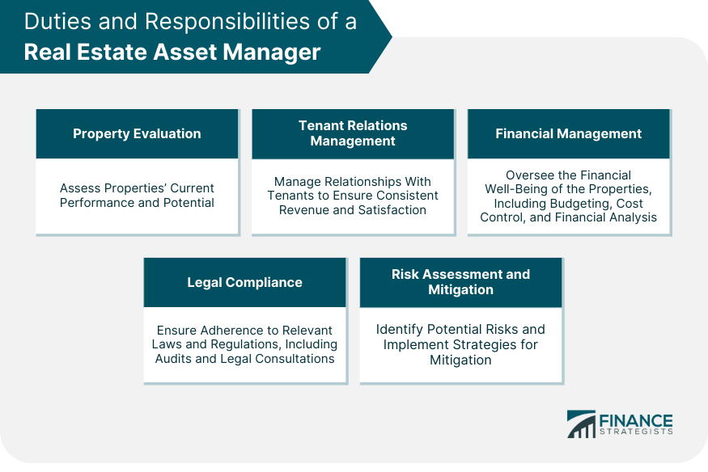

## Table of Contents

## What is an asset manager in the context of real estate?

An asset manager in real estate is someone who looks after properties to make sure they are doing well and making money. They work for companies that own many buildings, like apartments, offices, or shopping centers. Their job is to keep these properties in good shape, find good tenants, and make sure the buildings are being used in the best way possible to earn the most profit.

Asset managers also keep an eye on the money coming in and going out of the properties. They decide when to spend money on fixing up the buildings or when to sell them. They use their knowledge of the real estate market to make smart choices that help the properties grow in value over time. This way, the companies they work for can make more money from their investments.

## What are the primary responsibilities of a real estate asset manager?

A real estate asset manager's main job is to take care of properties and make sure they make money. They work for companies that own lots of buildings, like apartments, offices, or shopping centers. Their job is to keep these buildings in good shape, find good people to rent or lease the spaces, and make sure the buildings are used in the best way to earn the most profit. They also need to keep track of the money coming in from rent and the money going out for things like repairs and maintenance.

Another big part of their job is to watch the money closely. They decide when it's a good time to spend money on fixing up the buildings or when it might be better to sell them. They use their knowledge of the real estate market to make smart choices that help the properties grow in value over time. This way, the companies they work for can make more money from their investments.

## How does an asset manager contribute to the value of a real estate investment?

An asset manager helps increase the value of a real estate investment by making sure the properties are well taken care of and used in the best way possible. They find good tenants who will pay rent on time and take care of the property. They also make sure the buildings are in good shape, fixing things that need repair and keeping everything clean and nice. By doing this, they make the properties more attractive to people who might want to rent or buy them, which can make the property worth more money.

Asset managers also keep a close eye on the money coming in and going out of the properties. They decide when it's a good idea to spend money on improvements that can make the property more valuable, like adding new features or updating old ones. They also know when it might be better to sell a property if it's not making enough money or if the market is good for selling. By making smart choices about when to spend and when to sell, asset managers help the real estate investments grow in value over time, making more money for the companies they work for.

## What skills are essential for someone aspiring to be a real estate asset manager?

To be a good real estate asset manager, you need to be good with numbers. You need to understand how to read financial reports and make budgets. This helps you keep track of the money coming in and going out of the properties you manage. You also need to know about the real estate market. This means understanding what kinds of properties are popular, how much they cost, and when it's a good time to buy or sell them. Being good at talking to people is also important. You'll need to work with tenants, property managers, and other people involved in the properties.

Another important skill is being able to solve problems. When things go wrong with a property, like a broken pipe or an unhappy tenant, you need to find a way to fix it quickly and well. You also need to be good at planning. This means thinking about the future and deciding what improvements to make to the properties to make them worth more money. Being organized helps you keep track of all the different properties and tasks you need to manage. Overall, being a real estate asset manager is about using your skills to make the properties you manage better and more valuable.

## How does an asset manager differ from a property manager?

An asset manager and a property manager both work with real estate, but they have different jobs. An asset manager looks at the big picture. They work for companies that own many buildings, and their job is to make sure these buildings make money and grow in value. They decide when to spend money on fixing up the buildings or when to sell them. They use their knowledge of the real estate market to make smart choices that help the properties do well over time.

A property manager, on the other hand, focuses on the day-to-day running of a property. They make sure the building is in good shape, find tenants, collect rent, and handle any problems that come up. They work closely with the tenants and take care of the small details that keep the property running smoothly. While an asset manager is thinking about the overall strategy and financial health of the property, a property manager is dealing with the everyday tasks and maintenance.

## What are the typical daily tasks of a real estate asset manager?

A real estate asset manager starts their day by checking financial reports. They look at how much money is coming in from rent and how much is going out for things like repairs and maintenance. They also talk to property managers to see if there are any problems with the buildings they manage. If there are issues, the asset manager decides how to fix them and makes sure the money is spent wisely.

In the afternoon, the asset manager might meet with tenants or potential buyers. They work on finding good tenants who will take care of the property and pay rent on time. They also keep an eye on the real estate market to see if it's a good time to sell any properties. At the end of the day, they plan for the future, thinking about what improvements to make to the properties to make them worth more money.

## How do asset managers use market analysis to make decisions in real estate?

Asset managers use market analysis to understand what is happening in the real estate world. They look at things like how much people are paying for rent, what kinds of buildings are popular, and if the prices of properties are going up or down. By knowing these things, asset managers can decide if it's a good time to buy new properties or sell the ones they already have. For example, if the market analysis shows that office buildings are in high demand, an asset manager might decide to buy more office buildings to make more money.

They also use market analysis to plan for the future. If the analysis shows that people are starting to like living in apartments more than houses, the asset manager might decide to spend money on fixing up their apartment buildings to make them nicer. This can attract more tenants and make the properties worth more money. By always keeping an eye on the market, asset managers can make smart choices that help the properties they manage do well and grow in value over time.

## What role does an asset manager play in property acquisition and disposition?

An asset manager helps decide when to buy new properties and when to sell the ones they already have. They look at the real estate market to see if it's a good time to buy. If the market analysis shows that certain types of buildings are in high demand and their prices are going up, the asset manager might decide to buy more of those buildings. They also think about how much money the new properties can make and if they fit well with the other properties the company already owns.

When it comes to selling properties, the asset manager looks at how well the buildings are doing. If a property is not making enough money or if the market is really good for selling, they might decide it's time to sell. They use their knowledge of the market to find the best time to sell and get the most money for the property. By making smart choices about buying and selling, the asset manager helps the company make more money and grow their real estate investments.

## How do asset managers handle risk management in real estate portfolios?

Asset managers work to keep real estate portfolios safe by looking at all the risks that could affect their properties. They think about things like the economy, how easy it is to find good tenants, and if something big and unexpected might happen, like a natural disaster. By understanding these risks, they can make plans to protect their properties. For example, they might buy insurance to cover damages from storms or floods. They also might spread out their investments across different types of properties and in different areas to make sure that if one property has problems, the others can still make money.

Another way asset managers handle risk is by always keeping an eye on the real estate market. If they see that the market is changing in a way that could hurt their properties, they can take action. They might decide to sell a property that's not doing well or buy new ones that are less risky. They also make sure that the properties are well taken care of and have good tenants, which helps lower the chance of losing money. By being smart about risks, asset managers help keep the real estate portfolios strong and profitable.

## What advanced strategies do expert asset managers use to optimize real estate assets?

Expert asset managers use advanced strategies to make their real estate assets work harder and earn more money. One strategy is called value-add investing. This means they buy properties that need some work and then fix them up to make them worth more. For example, they might update old buildings with new features like better lighting or modern kitchens. By doing this, they can charge higher rent or sell the property for more money. Another strategy is to use technology to keep track of everything. They use special software to see how well each property is doing and make quick decisions about what to do next.

Another way expert asset managers optimize real estate assets is by diversifying their investments. They spread their money across different types of properties, like apartments, offices, and shopping centers, and in different areas. This helps them avoid big losses if one type of property or one area has problems. They also pay close attention to the real estate market and use what they learn to make smart choices. For example, if they see that people are starting to like living in certain neighborhoods more, they might buy properties there. By always thinking ahead and using these advanced strategies, expert asset managers help their real estate investments grow and make more money.

## How do asset managers incorporate sustainability into their management practices?

Asset managers are starting to think more about sustainability when they take care of properties. They know that making buildings more eco-friendly can save money and make the properties worth more. They do things like putting in energy-saving lights, using water-saving devices, and making sure the buildings are well insulated. They also look for ways to use less energy, like putting solar panels on the roof or using green roofs that help keep the building cool. By doing these things, they can lower the costs of running the buildings and make them more attractive to people who care about the environment.

Another way asset managers focus on sustainability is by thinking about the future. They know that laws and rules about the environment might change, so they plan ahead. They might choose to build or buy properties that are already eco-friendly or can be easily changed to be more sustainable. They also talk to tenants about how to use less energy and water, and they might even offer rewards for being green. By making sustainability a big part of their plans, asset managers help make sure their properties stay valuable and good for the planet.

## What are the emerging trends and technologies affecting asset management in real estate?

One big trend in real estate asset management is the use of smart technology. Asset managers are using special software and tools to keep track of their properties better. These tools can help them see how much energy a building uses, how well it's doing financially, and even predict when something might need to be fixed. This helps them make quick decisions and save money. Another technology they use is called IoT, which stands for Internet of Things. This lets them connect all the devices in a building, like lights and thermostats, to the internet. By doing this, they can control everything from one place and make the building more efficient.

Another trend is focusing more on sustainability. People are starting to care more about the environment, so asset managers are making their buildings greener. They're using things like solar panels, energy-saving lights, and water-saving devices to make their properties more eco-friendly. This not only helps the planet but also saves money on bills and makes the buildings more attractive to tenants. Asset managers are also looking at new ways to make their properties more sustainable, like using green roofs or building with materials that are better for the environment.

A third trend is the use of data analytics. Asset managers are using big data to understand the real estate market better. They look at lots of information to see what kinds of properties are popular, how much people are willing to pay for rent, and where the best places to invest might be. By using this data, they can make smarter choices about buying, selling, and managing their properties. This helps them stay ahead of the competition and make their real estate investments more successful.

## References & Further Reading

[1]: Baum, A., & Devaney, S. (2019). ["Property Boom and Banking Bust: The Role of Commercial Real Estate in the 2008 Financial Crisis."](https://books.google.com/books/about/Property_Investment_Appraisal.html?id=4-ASEAAAQBAJ) John Wiley & Sons.

[2]: Lopuch, M. (2014). ["Real Estate Investment: Market Analysis, Valuation Techniques, and Risk Management."](https://link.springer.com/book/10.1007/978-3-319-06397-3) Springer.

[3]: Tsatsaronis, K., & Zhu, H. (2004). ["What Drives Housing Price Dynamics: Cross-Country Evidence."](https://www.bis.org/publ/qtrpdf/r_qt0403f.pdf) BIS Quarterly Review March 2004.

[4]: Black, R. T., & Hughes, W. T. (1997). ["Price Dispersion in the Housing Market."](https://www.sciencedirect.com/science/article/pii/S0378426697000101) The Journal of Real Estate Research, 13(1), 101-110.

[5]: Gilli, M., Maringer, D., & Schumann, E. (2011). ["Numerical Methods and Optimization in Finance: Algorithms, Models, and Applications."](https://www.sciencedirect.com/science/article/pii/S1057521924007269) Elsevier.