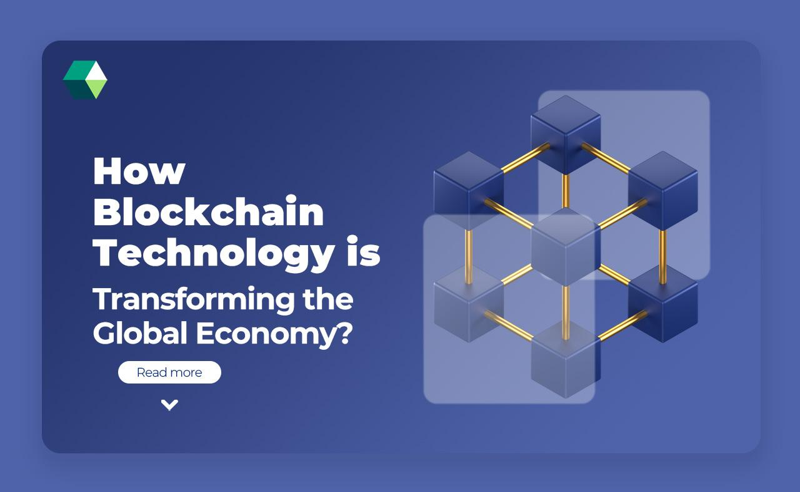

## Table of Contents

## What is blockchain technology?

Blockchain technology is a way to store information securely and transparently. It's like a digital ledger where data is recorded in blocks, and these blocks are linked together in a chain. Once data is added to a block, it's very hard to change or delete it, which makes the system trustworthy. People use blockchain for things like cryptocurrencies, where it helps keep track of who owns what without needing a bank or other middleman.

The way blockchain works is by having many computers, called nodes, all over the world that agree on what data should be added to the chain. This process is called consensus, and it makes sure that no single person can control the information. Because of this, blockchain is used not just for money, but also for things like tracking shipments or verifying the authenticity of products. It's a powerful tool that can help make systems more open and fair.

## How does blockchain work?

Blockchain works by grouping data into blocks, and then linking these blocks together to form a chain. Each block contains a list of transactions or other data, and once a block is filled, it gets added to the chain. To add a new block, a special math problem needs to be solved, which is done by computers around the world working together. When the problem is solved, the new block is added, and everyone on the network agrees that it's correct. This agreement is called consensus, and it's what makes blockchain secure and trustworthy.

The computers that help solve these math problems are called nodes, and they all have a copy of the entire blockchain. If someone tries to change data in a block, the other nodes will notice because their copies won't match. This makes it very hard to cheat or change the data without everyone knowing. Because of this, blockchain is used for things like cryptocurrencies, where it keeps track of who owns what without needing a bank or other middleman. It's a way to make sure that data is safe, transparent, and can't be easily tampered with.

## What are the basic principles of blockchain?

Blockchain is based on the idea of storing information in a way that is safe and easy to check. It works by putting data into blocks, and then connecting these blocks together to make a chain. Every block has a list of things that happened, like money being sent from one person to another. When a block is full, it gets added to the chain, but first, it needs to be checked by lots of computers around the world. These computers solve a special math problem to make sure the block is correct, and then they all agree to add it to the chain. This agreement is called consensus, and it's what makes blockchain trustworthy.

Once a block is added to the chain, it's very hard to change or delete it. This is because every computer that helps with the blockchain has a copy of all the blocks. If someone tries to change something in a block, the other computers will see that their copies don't match, and they won't agree to the change. This makes the data in the blockchain very secure. Because of this, blockchain is used for things like keeping track of money or making sure products are real. It's a powerful way to make sure information is safe and that everyone can trust it.

## What is the global economy and why is it important to protect it?

The global economy is like a big network where countries all over the world buy and sell things from each other. It includes everything from goods like food and clothes to services like banking and travel. When countries trade with each other, it helps them grow and create jobs. It also means that people can have more choices and sometimes cheaper prices for things they need.

It's important to protect the global economy because it helps keep the world stable and fair. If something goes wrong, like a big financial crisis, it can hurt a lot of people and make it hard for them to live their lives. By protecting the global economy, we can make sure that countries can keep trading, people can keep working, and everyone has a chance to do well.

## How can blockchain enhance security in financial transactions?

Blockchain can make financial transactions safer by keeping a record of every transaction in a way that's hard to change or cheat. Imagine a big book where every time someone sends money, it gets written down. This book is not kept in one place but is copied on many computers around the world. If someone tries to change what's written in the book, the other computers will notice because their copies won't match. This makes it very hard for anyone to steal money or mess with the records without everyone knowing.

Because blockchain uses many computers to agree on what's true, it's like having lots of people watching over the transactions. This helps stop fraud and makes sure that when you send money, it goes to the right person and stays safe. Banks and other financial companies can use blockchain to make their systems more secure, which means people can trust that their money is safe when they use these services.

## What role does blockchain play in preventing fraud and corruption?

Blockchain helps prevent fraud and corruption by keeping a clear and unchangeable record of everything that happens. Imagine a diary where every action, like sending money or recording a vote, is written down. Once something is written in this diary, it's very hard to erase or change it because the diary is shared with many people around the world. If someone tries to cheat by changing what's written, the other people will see that their copies don't match, and they won't agree to the change. This makes it tough for anyone to lie or steal without getting caught.

Because blockchain uses many computers to agree on what's true, it's like having a group of honest friends watching over everything. This system can be used in many places where fraud and corruption might happen, like in banks, voting systems, or government records. By making it hard to change the records, blockchain helps keep things fair and honest. It's a powerful tool that can help build trust and make sure that people's actions are open for everyone to see.

## How does blockchain contribute to transparency in global trade?

Blockchain helps make global trade more transparent by keeping a clear record of everything that happens. Imagine a big notebook where every time a product is made, shipped, or sold, it gets written down. This notebook is shared with many people around the world, so everyone can see what's happening. If someone tries to change what's written, the other people will notice because their copies won't match. This makes it hard to hide or lie about what's going on in trade.

Because everyone can see the same information, it's easier to trust that the records are true. This is important in global trade where things move across many countries. With blockchain, companies can show that their products are real and safe, and customers can check where things come from. This helps make trade fairer and more honest, which is good for everyone involved.

## What are smart contracts and how do they impact economic activities?

Smart contracts are like digital agreements that automatically do what they're supposed to do when certain things happen. Imagine a vending machine: you put in money, and it gives you a snack. Smart contracts work the same way but on the internet. They're written in code and stored on a blockchain, which makes them safe and hard to change. When the conditions of the contract are met, like sending money or finishing a job, the smart contract does its job without needing someone to make it happen.

Smart contracts can change how we do business by making things faster and cheaper. Because they work automatically, they can cut out the middleman, like lawyers or banks, who usually help make sure deals happen. This can save time and money, and make it easier for people to trust each other. For example, if you're buying something online, a smart contract can make sure you get what you paid for as soon as the seller sends it. This can make economic activities more efficient and fair for everyone.

## Can blockchain help in reducing costs and increasing efficiency in global economic operations?

Blockchain can help make global economic operations cheaper and faster. It does this by keeping a clear record of everything that happens, so there's less need for middlemen like banks or lawyers. When you use blockchain, you can send money or do business directly with someone else, which saves time and money. For example, if you're buying something from another country, blockchain can make sure the payment goes through quickly and safely without needing a bank to handle it.

Smart contracts, which are like digital agreements that work automatically, also help make things more efficient. They can do things like release payment as soon as a job is done or a product is delivered, without needing someone to check and approve it. This means businesses can work faster and spend less on making sure deals happen. Overall, blockchain can make the global economy run smoother and help everyone save money.

## What are the challenges and limitations of implementing blockchain in the global economy?

Using blockchain in the global economy can be tricky because it's a new technology and not everyone understands it yet. It can be hard to set up because it needs a lot of computers to work together and agree on what's true. This can be slow and use a lot of energy, which is bad for the environment. Also, the rules for using blockchain are different in every country, so it can be hard to make it work everywhere. Some people might not trust it because it's new, and they might worry about losing their money if something goes wrong.

Another challenge is that blockchain can be expensive to use. Every time you add something to the blockchain, you might have to pay a fee, and these fees can add up. It can also be hard to fix mistakes because once something is on the blockchain, it's very hard to change. This means if there's an error, it could cause big problems. Even though blockchain can make things safer and more open, these challenges mean it's not always the best choice for every part of the global economy.

## How are governments and international organizations utilizing blockchain to protect the global economy?

Governments and international organizations are starting to use blockchain to make the global economy safer and more open. They see that blockchain can help keep track of money moving around the world, making it easier to stop fraud and corruption. For example, some countries are using blockchain to make sure that money sent across borders is safe and can be checked by everyone. This helps build trust and makes it harder for bad people to hide what they're doing.

International organizations like the United Nations are also looking at blockchain to help with things like tracking aid money. They want to make sure that money meant for helping people in need actually gets to them, and blockchain can help show where the money goes. By using blockchain, these groups can make sure that the global economy is fair and that everyone can see what's happening. This can help protect the economy and make sure it works well for everyone.

## What future developments in blockchain technology could further enhance the protection of the global economy?

In the future, blockchain technology could become even better at protecting the global economy by making it faster and using less energy. Right now, adding something to the blockchain can take a while and use a lot of power. But new ideas like "proof of stake" could change this. Instead of many computers solving hard math problems, only a few would be chosen to add new blocks. This would make the process quicker and kinder to the environment. If this happens, more people and businesses might start using blockchain, making the global economy safer and easier to trust.

Another way blockchain could help protect the global economy is by making it easier to use across different countries. Right now, the rules for using blockchain are different everywhere, which can be confusing. But if countries start working together to make the same rules, blockchain could be used more often for things like sending money or tracking goods. This would make global trade more open and fair, helping to stop fraud and corruption. By making blockchain easier to use and understand, it could become a big part of keeping the global economy safe and strong.

## References & Further Reading

[1]: Narayanan, A., Bonneau, J., Felten, E., Miller, A., & Goldfeder, S. (2016). ["Bitcoin and Cryptocurrency Technologies: A Comprehensive Introduction."](https://press.princeton.edu/books/hardcover/9780691171692/bitcoin-and-cryptocurrency-technologies) Princeton University Press.

[2]: Tapscott, D., & Tapscott, A. (2016). ["Blockchain Revolution: How the Technology Behind Bitcoin Is Changing Money, Business, and the World."](https://dl.acm.org/doi/10.5555/3051781) Penguin.

[3]: Antonopoulos, A. M. (2017). ["Mastering Bitcoin: Unlocking Digital Cryptocurrencies."](https://books.google.com/books/about/Mastering_Bitcoin.html?id=IXmrBQAAQBAJ) O'Reilly Media.

[4]: Mougayar, W. (2016). ["The Business Blockchain: Promise, Practice, and Application of the Next Internet Technology."](https://books.google.com/books/about/The_Business_Blockchain.html?id=CEsPDAAAQBAJ) Wiley.

[5]: Yermack, D. (2017). ["Corporate Governance and Blockchains."](https://econpapers.repec.org/RePEc:oup:revfin:v:21:y:2017:i:1:p:7-31.) National Bureau of Economic Research.