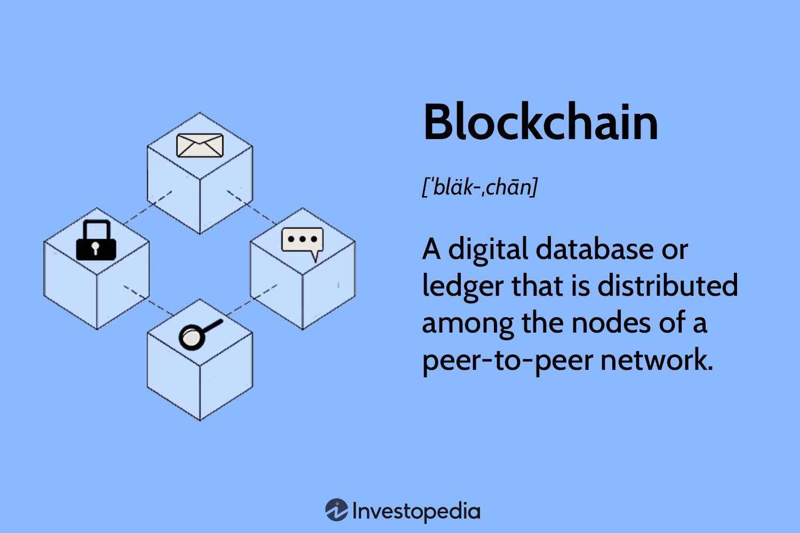

The rise of blockchain technology has introduced a new dynamic to the global economy, fundamentally altering how financial protection and efficiency can be achieved. This emerging technology presents an innovative approach to managing financial transactions, data integrity, and transparency, all of which are crucial for a secure economic environment. 

Blockchain operates as a decentralized ledger system. This characteristic alone provides substantial opportunities for increasing transparency and trust in economic activities. By removing intermediaries traditionally involved in financial transactions, blockchain offers the dual benefits of reduced transaction costs and increased speed. Such transformations are not limited to the financial sector alone; industries such as supply chain management, healthcare, and real estate are also experiencing significant shifts in their operational models due to blockchain's capabilities.

The potential impact of blockchain on fostering economic protection is pronounced. Its inherent ability to provide immutable and transparent records creates a bulwark against fraudulent activities and financial crises. Historical events, such as the Great Financial Crisis of 2008, underscore the necessity for technological safeguards within financial systems. Blockchain’s provision of real-time data and analytics aids in preventing asset mismanagement and ensures compliance with regulatory standards, which is essential for maintaining economic stability.

Algorithmic trading presents another arena where blockchain can induce substantial advancements. This form of trading, which relies on complex mathematical models and computing power, benefits significantly from blockchain's integration. Enhanced data security and reduced risk of market manipulation are among the key advantages. Blockchain-enabled algorithmic trading not only facilitates better audit trails but also heightens overall market transparency. These improvements can lead to more efficient market practices and bolster investor confidence.

By embracing blockchain technology, economic systems are positioned to achieve greater protection against both fraud and inefficiencies. Such adoption promises a future where transparency, security, and efficiency are integral elements of global economic activities. In addressing both the current challenges and future opportunities, this article seeks to investigate how blockchain can redefine traditional trading systems and enhance economic protection through integration with algorithmic trading.

## Table of Contents

## Blockchain in the Global Economy

Blockchain technology is revolutionizing the global economy by offering a decentralized ledger system that significantly enhances transparency and trust in economic transactions. Unlike traditional financial systems, which rely heavily on intermediaries, blockchain employs a distributed network of nodes to validate and record transactions. This decentralized approach not only ensures the integrity of data by making it virtually tamper-proof but also enhances transparency, as all participants in the network have access to the same information. Consequently, this transparency fosters trust among parties involved in economic activities, which is essential for efficient market functioning.

One of the significant advantages of blockchain is its capacity to eliminate intermediaries from the transaction process. By doing so, blockchain technology reduces transaction costs, a critical [factor](/wiki/factor-investing) in enhancing economic efficiency. For instance, in cross-border payments, the traditional banking system involves multiple intermediaries, each imposing a fee and contributing to slower transaction times. Blockchain streamlines this process by directly connecting the transacting parties, significantly reducing both costs and time. This capability is not only revolutionizing finance but could be transformative for other sectors where transaction costs are a significant concern.

Industries beyond finance are also harnessing blockchain's transformative potential. In supply chain management, for example, the technology enables the recording of each transaction in a product's journey with enhanced accuracy and transparency. This visibility across the supply chain can lead to improved efficiency, traceability, and risk management, benefiting both businesses and consumers. Moreover, blockchain's application extends to sectors such as healthcare, where it can ensure the accuracy of patient records, and to media, where it may prevent digital piracy by ensuring content creators are properly compensated.

The potential of blockchain technology to address global economic challenges is further underscored by its ability to mitigate corruption and inefficiency. The immutable nature of blockchain records means that alterations are virtually impossible without consensus from the network, reducing opportunities for fraudulent activities. In countries where corruption is prevalent, blockchain can provide an incorruptible ledger of governmental and financial transactions, thus promoting accountability and reducing illicit practices. Moreover, the efficiency gains achieved by reducing transaction costs and times can contribute significantly to economic development by freeing up resources otherwise spent on lengthy and expensive transaction processes.

Overall, blockchain's ability to enhance transparency, trust, and efficiency marks its significance in modern economic systems. By addressing some of the fundamental inefficiencies of traditional systems, blockchain stands as a pivotal technology with the potential to redefine economic practices worldwide. As its adoption grows across various industries, the technology's impact on the global economy is expected to expand, offering innovative solutions to longstanding economic challenges.

## Economic Protection through Blockchain

Blockchain technology, characterized by its immutable and transparent nature, provides substantial protection against fraud and financial crises. This technology establishes an incorruptible digital ledger system where every transaction is recorded in a manner that cannot be altered retroactively. Such a structure significantly curtails the risk of fraud by ensuring that all actions are transparent and traceable. During the Great Financial Crisis of 2008, the world witnessed the vulnerabilities of traditional financial systems, where opaque practices and lack of accountability led to widespread economic turmoil. In contrast, blockchain technology introduces a level of transparency that can serve as a technological safeguard for modern financial systems, reducing the susceptibility to similar crises.

A critical advantage of blockchain is its ability to provide real-time data and analytics, pivotal for preventing asset mismanagement and ensuring regulatory compliance. By continuously updating transaction records that are accessible to all participants in the network, blockchain allows for instantaneous oversight. In sectors plagued by inefficiencies and risks, such as real estate or supply chain management, blockchain can be particularly beneficial. The technology’s capacity to offer detailed, verifiable records prevents errors and misconduct, thereby fostering a more stable economic environment.

Furthermore, the application of blockchain technology in high-risk sectors contributes to economic stabilization. By enabling secure and verifiable transaction records, blockchain minimizes the chances of data breaches and fraudulent transactions. This is especially pertinent in financial sectors where the accuracy of transaction data is paramount. For instance, in international trade, blockchain can simplify complex logistics processes by providing a single source of truth that all parties trust. This can reduce disputes and enhance the efficiency of cross-border transactions, in turn stabilizing economies that depend heavily on trade.

In conclusion, the decentralized and tamper-proof attributes of blockchain offer a powerful tool for enhancing economic protection. As global economies continue to leverage this technology, the potential to mitigate risks and promote stability becomes increasingly evident. Through ensuring transparency, accountability, and real-time data access, blockchain stands to play a vital role in safeguarding economic systems from future crises.

## The Role of Algorithmic Trading

Algorithmic trading utilizes advanced mathematical models and computer algorithms to execute trades at speeds and efficiencies unattainable by human traders. This trading method analyzes vast datasets, identifying optimal trading opportunities across global markets in real time. The core advantage of [algorithmic trading](/wiki/algorithmic-trading) lies in its ability to process and respond to market data at incredible speeds, allowing for strategies such as [arbitrage](/wiki/arbitrage), [trend following](/wiki/trend-following), and [market making](/wiki/market-making), which are impossible to execute manually at the same pace.

The integration of blockchain technology into algorithmic trading systems introduces enhanced levels of data security and market integrity. Blockchain's decentralized and immutable ledger system ensures that trading data is recorded with a high degree of transparency and resistance to tampering. This characteristic significantly reduces the risk of market manipulation, as each transaction is permanently recorded in the blockchain, providing a transparent audit trail. Market participants can verify trades independently, which enhances trust and confidence in the trading process.

Blockchain-enabled algorithmic trading platforms facilitate improved auditability by ensuring that every transaction record is accurate, consistent, and tamper-proof. This level of transparency is particularly important in complex trading environments, where verifying the provenance and integrity of data can be challenging. Through blockchain, regulators and market overseers can maintain better oversight of trading activities, ensuring compliance with financial regulations and minimizing the potential for fraudulent activities.

The combination of blockchain technology and algorithmic trading also leads to more efficient market practices. By streamlining the validation and reconciliation processes traditionally required in trading systems, blockchain removes time-consuming manual checks and reduces operational bottlenecks. This can result in lower transaction costs and faster settlement times, ultimately benefiting both traders and investors. The increased transparency and efficiency brought by blockchain can improve investor confidence, fostering a more stable and robust market environment.

In summary, algorithmic trading, when combined with blockchain technology, holds great potential to transform traditional trading systems. This integration not only enhances the speed and accuracy of trades but also fortifies the security and transparency of market activities. As both technologies continue to evolve, they promise to provide innovative solutions for achieving more efficient and trustworthy global financial markets.

## Challenges and Opportunities

Despite its transformative potential, blockchain technology encounters several notable challenges as it seeks broader integration within economic systems. A primary concern is scalability. Blockchain networks, particularly those employing proof-of-work algorithms, like Bitcoin, often suffer from limitations in transaction processing speed and network throughput. This scalability issue restricts the technology's ability to handle a vast number of transactions simultaneously, which is crucial for its application in global economic activities. Efforts to enhance blockchain scalability, such as sharding and off-chain solutions like the Lightning Network, are in development, but widespread implementation remains limited.

Regulatory hurdles represent another significant challenge, as the decentralized nature of blockchain often clashes with existing regulatory frameworks. Governments and financial institutions frequently express apprehension about blockchain's potential to disrupt traditional profit models and regulatory oversight mechanisms. Regulatory bodies worldwide are grappling with how to address blockchain's unique characteristics while ensuring consumer protection, financial stability, and the prevention of illicit activities. The lack of a unified regulatory approach can create uncertainties and hinder investment and innovation in blockchain technologies.

Adoption resistance further complicates blockchain's integration. Established financial institutions and enterprises may be reluctant to adopt blockchain due to its disruptive potential and the substantial investments required for overhauling existing infrastructures. Concerns regarding the technology's maturity, interoperability with existing systems, and talent scarcity also contribute to hesitancy. Additionally, the energy consumption associated with certain blockchain operations, particularly those utilizing proof-of-work protocols, raises environmental concerns that may impede widespread acceptance.

Conversely, substantial opportunities lie in addressing these challenges. Regulatory harmonization offers a pathway to mitigate uncertainties and facilitate blockchain integration into mainstream economic systems. Collaborative efforts among stakeholders, including regulators, technologists, and industry leaders, can foster a conducive environment for developing comprehensive regulatory frameworks that balance innovation with protection.

Technological advancements also present opportunities for overcoming scalability issues. Research and development efforts focused on enhancing blockchain’s efficiency and interoperability hold promise. Innovations such as proof-of-stake, layer-2 solutions, and cross-chain communication protocols aim to address current limitations and improve blockchain’s performance and utility across diverse applications.

Ultimately, the successful integration of blockchain into trading and economic activities hinges on collaborative approaches among stakeholders. Engaging governments, financial institutions, and technology developers in dialogues and partnerships can facilitate the development of standardized protocols and best practices. Such collaborative efforts can unlock blockchain's full potential, enabling more secure, efficient, and transparent economic systems.

## Future Outlook

The future of blockchain technology in the global economy is bright, with substantial potential for widespread integration across diverse economic sectors. As innovations in blockchain infrastructure and applications continue to evolve, the technology promises more robust and efficient economic systems. Emerging solutions address persistent issues of transparency, security, and operational efficiency, which are critical for fostering trust and accelerating adoption.

The maturation of blockchain technology is expected to significantly influence the landscape of algorithmic trading and financial protection. With attributes such as immutable records, decentralized control, and enhanced audit capabilities, blockchain can bolster the integrity of automated trading systems. These improvements present opportunities to refine market practices, diminish the risk of interference, and enhance confidence among investors, subsequently redefining global economic frameworks.

Despite the technology's youth, blockchain's untapped potential promises various avenues for stimulating economic growth and resilience. Its decentralized nature challenges traditional models, promoting inclusivity and democratizing access to economic resources. Furthermore, as blockchain technology continues to mature, its applications could extend far beyond current predictions, driving innovation in sectors like supply chain management, healthcare, and public governance.

In summary, while the development of blockchain technology presents challenges such as scalability, regulatory adaptation, and infrastructural refinement, its prospects for enhancing financial systems are immense. As stakeholders—ranging from governments to private enterprises—collaborate to harness blockchain, the global economy stands on the brink of a transformative era marked by increased stability and growth potential.

## Conclusion

Blockchain technology holds transformative potential for the global economy, particularly in enhancing economic protection and advancing algorithmic trading. The decentralized nature of blockchain offers unparalleled transparency and security, which are crucial for reducing fraud and inefficiency in financial systems. These benefits allow blockchain to construct a more resilient and robust economic environment.

Strategic implementation is essential to leveraging blockchain's benefits fully. Overcoming challenges, such as scalability issues and regulatory hurdles, will be crucial. Scalability affects the blockchain's ability to handle an increasing [volume](/wiki/volume-trading-strategy) of transactions without sacrificing performance or speed. Additionally, global regulatory frameworks must adapt to integrate blockchain technology, ensuring security and compliance without stifling innovation.

As blockchain technology becomes more integrated within economic frameworks, it promises a future characterized by increased transparency, security, and efficiency. The incorporation of blockchain with algorithmic trading presents opportunities for heightened market integrity and investor confidence. Data security, audit trails, and reduced market manipulation risks are enhanced when blockchain is used in tandem with algorithmic models.

In conclusion, blockchain's full potential is yet to be realized, but it offers significant possibilities for driving economic growth and resilience. Its adoption could redefine global economic paradigms, facilitating a transition toward more secure, transparent, and efficient economic activities. The path forward involves strategic efforts to overcome barriers and embrace the opportunities this technology presents for a sustainable economic future.

## References & Further Reading

[1]: Narayanan, A., Bonneau, J., Felten, E., Miller, A., & Goldfeder, S. (2016). ["Bitcoin and Cryptocurrency Technologies: A Comprehensive Introduction."](https://press.princeton.edu/books/hardcover/9780691171692/bitcoin-and-cryptocurrency-technologies) Princeton University Press.

[2]: Tapscott, D., & Tapscott, A. (2016). ["Blockchain Revolution: How the Technology Behind Bitcoin Is Changing Money, Business, and the World."](https://dl.acm.org/doi/10.5555/3051781) Penguin.

[3]: Antonopoulos, A. M. (2017). ["Mastering Bitcoin: Unlocking Digital Cryptocurrencies."](https://books.google.com/books/about/Mastering_Bitcoin.html?id=IXmrBQAAQBAJ) O'Reilly Media.

[4]: Mougayar, W. (2016). ["The Business Blockchain: Promise, Practice, and Application of the Next Internet Technology."](https://books.google.com/books/about/The_Business_Blockchain.html?id=CEsPDAAAQBAJ) Wiley.

[5]: Yermack, D. (2017). ["Corporate Governance and Blockchains."](https://econpapers.repec.org/RePEc:oup:revfin:v:21:y:2017:i:1:p:7-31.) National Bureau of Economic Research.