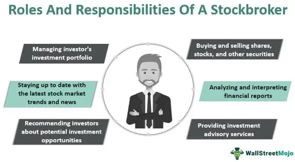

The stock market offers numerous investment opportunities for individuals seeking to grow their wealth over time. By acquiring stocks, investors purchase ownership stakes in public companies, hoping to benefit from appreciation in stock value and potential dividends. Navigating the stock market effectively requires an understanding of several key components, including how to buy stocks, select an appropriate broker, and incorporate advanced strategies like algorithmic trading.

Buying stocks begins with establishing a brokerage account, which serves as a platform for executing trade orders. Through these accounts, investors can buy and sell stocks, potentially benefiting from market fluctuations. The choice between different types of stock orders, such as market orders, where trades are executed immediately at current prices, and limit orders, where trades occur only at specified prices, can significantly impact trading outcomes.



Selecting the right broker is a critical decision that influences an investor’s trading experience. Traditional brokers provide personalized advice and services, whereas online brokers like Interactive Brokers offer lower fees and user-friendly platforms suited for self-directed investors. Evaluating factors such as fees, available platforms, access to research, and customer service is essential in making an informed choice.

The advent of technology has revolutionized the way trading is conducted, notably through algorithmic trading. This sophisticated method uses pre-programmed trading instructions to make real-time decisions and execute orders at optimal times. By leveraging speed and precision beyond human capabilities, algorithmic trading can offer a competitive edge in volatile markets. It typically employs strategies such as trend-following, arbitrage, and mean reversion to capitalize on market inefficiencies.

As investors look to optimize their stock market strategies, understanding the roles of stock purchasing, broker selection, and technology integration becomes paramount. This article will explore these elements, offering insights into how technology continues to transform the investment landscape, ultimately enhancing trading efficiency and potential returns.

## Table of Contents

## The Basics of Buying Stocks

Buying stocks represents acquiring a portion of ownership in a company, with the anticipation that the value of these stocks will appreciate over time. To facilitate this process, an individual must have a brokerage account, which serves as a medium through which one can place and execute trade orders.

A brokerage account acts as a necessary conduit for participating in the stock market. Setting up such an account can be accomplished through various types of brokers, including traditional brokerage firms and online platforms catering to self-directed investors. Once established, the account allows the investor to buy and sell stocks, manage investments, and track the performance of the portfolio.

Understanding stock orders is crucial before initiating investments. Different types of stock orders can yield varying outcomes, especially in volatile market conditions. Key order types include:

1. **Market Orders**: A market order is an instruction to buy or sell a stock immediately at the best available current price. This type of order guarantees execution but does not guarantee the execution price. Market orders are generally used when immediacy of execution is more important than obtaining a specific price.

2. **Limit Orders**: A limit order sets a specific price at which an investor is willing to buy or sell a stock. This type of order ensures that the trade is executed at the set price or better, providing price control but not guaranteeing execution. Limit orders are beneficial when investors seek to enter or exit positions at predefined price levels.

3. **Stop Orders**: These include stop-loss orders, which become market orders once a stock reaches a specified price, known as the stop price. Stop orders are a tool for investors to limit potential losses or protect unrealized gains by automating the sale process when the stock price drops to a predetermined level.

4. **Stop-Limit Orders**: Combining features of stop orders and limit orders, a stop-limit order becomes a limit order at the stop price, as opposed to a market order. It specifies the minimum price at which the stock can be traded, providing both price control and risk management.

Each order type has distinct implications regarding execution certainty and price control. For example, while market orders prioritize swift execution, which is crucial in rapidly changing markets, they may result in unexpected prices due to market [volatility](/wiki/volatility-trading-strategies). Conversely, limit orders prioritize favorable pricing but may not execute if the market price never reaches the investor's specified limit.

By mastering these fundamental concepts and utilizing the appropriate types of stock orders, investors can strategically manage their entry and [exit](/wiki/exit-strategy) in the stock market. This knowledge is foundational for anyone aspiring to effectively navigate the complexities of stock market investments.

## Choosing the Right Broker

Selecting the right broker is a fundamental step in stock trading, heavily influenced by an individual’s investment goals and personal preferences. The choice between a traditional broker and an online brokerage can dramatically affect both the investment experience and the potential returns.

**1. Online Brokers: Advantages and Features**  
Online brokers, such as [Interactive Brokers](/wiki/interactive-brokers-api), Fidelity, and E*TRADE, have seen a surge in popularity due to their accessible platforms and lower fees. These brokers cater to self-directed investors who prefer managing their own portfolios. They typically offer:

- **Lower Fees:** Online brokers generally have a more cost-effective fee structure than traditional brokers. They offer lower commission rates on trades and often provide zero-commission trading for stocks, ETFs, and sometimes options.

- **User-friendly Platforms:** Most online brokers have developed intuitive trading platforms that include a variety of tools to assist traders. These platforms often come with customizable dashboards, stock screeners, and real-time data feeds to facilitate informed trading decisions.

- **Comprehensive Research Tools:** Access to a wealth of research materials, including analyst reports, market news, and fundamental and technical analysis tools, is typically provided. This empowers investors to make data-driven decisions.

- **Trading Flexibility:** Online platforms allow investors to trade a wide range of securities, including stocks, options, mutual funds, ETFs, and sometimes even cryptocurrencies, depending on the broker.

**2. Choosing Based on Investment Goals and Preferences**  
When selecting a broker, investors should evaluate how well the broker aligns with their specific investment goals. Here are factors to consider:

- **Cost Structure:** Analyzing the fee structure, including account maintenance fees, trading commissions, and any hidden costs, is crucial. While some brokers might offer no-fee trading for specific securities, others might compensate lower trading fees with higher margin rates.

- **Platform Functionality:** Depending on their trading style, investors might prioritize certain platform features, such as advanced charting tools, algorithmic trading capabilities, or mobile app functionality. A demo account can be a useful way to test these features without financial commitment.

- **Research and Educational Resources:** For investors, especially beginners, the availability of robust educational content and research can greatly aid in understanding market mechanics and developing trading strategies.

- **Customer Service:** Reliable customer support is essential, as it ensures prompt assistance with any trading platform issues or account queries. Check the availability of support channels such as phone, email, live chat, and the responsiveness of the customer service team.

Ultimately, the decision lies in weighing these factors against personal preferences and investment strategies. Whether opting for the autonomy and cost-effectiveness of online brokers or the personalized advice and management offered by traditional brokers, the key is aligning the broker’s offerings with one's financial goals and trading style.

For further guidance on choosing a suitable broker, websites like Investopedia or NerdWallet often provide detailed reviews and comparisons based on user-specific needs.

## Understanding Algorithmic Trading

Algorithmic trading, often referred to as algo trading, involves using computer algorithms to manage trading decisions in financial markets. These algorithms execute pre-defined trading instructions, such as timing, price, or [volume](/wiki/volume-trading-strategy), with the goal of optimizing trade efficiency. By automating the trading process, [algorithmic trading](/wiki/algorithmic-trading) reduces the need for human intervention and minimizes emotional bias, making it a powerful tool in modern finance.

One of the primary advantages of algorithmic trading is its ability to operate at speeds and frequencies that far surpass those attainable by human traders. As markets move quickly, the ability to execute trades in microseconds can provide significant advantages in terms of price and [liquidity](/wiki/liquidity-risk-premium). This high-frequency trading capability allows traders to capitalize on small price discrepancies that might occur for very brief moments.

Common strategies within algorithmic trading include:

1. **Trend-Following**: This strategy involves making buy or sell decisions based on the direction of market prices. The idea is to capitalize on continued trends by using indicators like moving averages or channel breakouts. For example, a simple moving average crossover system would buy when a short-term average crosses above a long-term average, and sell when the opposite occurs.

   Python Example:
   ```python
   def moving_average(prices, window):
       return sum(prices[-window:]) / window

   def trend_following_strategy(prices, short_window=20, long_window=50):
       short_ma = moving_average(prices, short_window)
       long_ma = moving_average(prices, long_window)
       if short_ma > long_ma:
           return "Buy"
       elif short_ma < long_ma:
           return "Sell"
       else:
           return "Hold"
   ```

2. **Arbitrage**: This involves exploiting price differences of the same asset in different markets. For example, if a stock is traded at slightly different prices on two exchanges, an algorithm can quickly buy at the lower price and sell at the higher one, profiting from the discrepancy.

3. **Mean Reversion**: This strategy is based on the assumption that the price of a security will revert to its average or mean value over time. Traders identify stocks that have deviated significantly from their average price and anticipate that the price will move back towards the mean.

   Mathematical Representation:
$$
   P_t = \mu + \epsilon_t

$$
   where $P_t$ is the price at time $t$, $\mu$ is the mean price, and $\epsilon_t$ is the deviation from the mean. Mean reversion strategies involve trading based on the size of $\epsilon_t$.

These strategies, among others, leverage the inherent computational advantages of algorithms to enhance trading performance and efficiency. However, the effectiveness of algorithmic trading requires a robust understanding of the market as well as continuous monitoring and adjustment of the algorithms to adapt to new market conditions.

## Pros and Cons of Algorithmic Trading

Algorithmic trading, often referred to as algo trading, is a method of executing trades using automated, pre-programmed trading instructions. This approach leverages mathematical models and complex algorithms to make trading decisions, significantly transforming the dynamics of stock market activities. 

One of the primary benefits of algorithmic trading is the reduction of emotion-driven decisions. Human traders are often influenced by psychological factors such as fear and greed, potentially leading to impulsive and suboptimal trading choices. By utilizing algorithms, trades are executed purely based on predefined criteria, removing emotional bias and enhancing decision-making consistency.

Another notable advantage is the enhanced execution speed. Algorithms can process large volumes of data and execute trades at speeds unattainable by human traders—measured in milliseconds or even microseconds. This speed advantage is critical in volatile markets where rapid price movements can impact the profitability of trades.

Furthermore, algorithmic trading enables efficient trade execution. It allows traders to implement complex strategies that capitalize on short-term market anomalies. For instance, strategies such as [arbitrage](/wiki/arbitrage), where simultaneous buying and selling of securities take advantage of price differentials across markets, can be executed more effectively through algorithmic means.

Despite these benefits, there are also potential downsides associated with algorithmic trading. It requires significant technological infrastructure, including powerful computing resources and reliable internet connections, which can be costly to maintain. Additionally, the reliance on technology introduces the risk of technical glitches, such as system failures or errors in programming, which can result in financial losses.

Limited human oversight in algorithmic trading poses another risk. While algorithms can operate without continuous manual intervention, their performance in unforeseen market conditions remains uncertain. The absence of human judgment can sometimes lead to unintended trading outcomes, especially in atypical market situations.

Successful algorithmic trading necessitates meticulous strategy development and extensive [backtesting](/wiki/backtesting). Backtesting involves analyzing how a trading strategy would have performed retrospectively using historical data. This process is essential for verifying the algorithm’s reliability before live implementation. The importance of strategy robustness cannot be overstated, as even a minor error in the algorithm's logic could lead to significant financial implications.

In summary, algorithmic trading offers significant advantages in terms of speed, efficiency, and emotion-free trading. However, the associated challenges, such as technological reliance and the need for careful oversight, cannot be ignored. Traders must meticulously design and backtest their strategies to navigate these challenges effectively.

## Getting Started With Algorithmic Trading

Algorithmic trading provides a powerful means to execute trades at speeds and frequencies that would be impossible for a human trader to achieve. For beginners looking to enter this arena, platforms such as Botsfolio and TrendSpider offer a straightforward way to start without the need for extensive coding expertise. These platforms focus on user-friendly interfaces and simplified algorithmic parameters to facilitate learning and initial trading experiences.

As traders gain more experience, they may want to explore platforms that offer greater customization and coding capabilities. Advanced traders often migrate to platforms that support programming languages like Python or C++. Such platforms enable the development of bespoke trading algorithms tailored to specific strategies and risk profiles. For example, traders may write a Python script to implement a moving average crossover strategy:

```python
def moving_average_crossover(prices, short_window=40, long_window=100):
    signals = pd.DataFrame(index=prices.index)
    signals['price'] = prices
    signals['short_mavg'] = prices.rolling(window=short_window, min_periods=1).mean()
    signals['long_mavg'] = prices.rolling(window=long_window, min_periods=1).mean()
    signals['signal'] = 0.0
    signals['signal'][short_window:] = np.where(signals['short_mavg'][short_window:] > signals['long_mavg'][short_window:], 1.0, 0.0)   
    signals['positions'] = signals['signal'].diff()
    return signals
```

This script calculates moving averages over specified windows and generates buy or sell signals based on crossovers.

Regardless of experience level, continuous monitoring and adjustment of algorithms are crucial. Market conditions are constantly evolving, requiring traders to adapt their strategies to maintain effectiveness. This adaptation often involves backtesting, where algorithms are tested against historical data to evaluate performance prior to deployment in live trading. Continuous learning and strategy refinement are essential to keep pace with the dynamic nature of financial markets. Traders should ensure their algorithms are consistently evaluated for robustness and adjusted according to real-time market feedback.

## Conclusion

Navigating the stock market successfully demands well-informed decision-making and strategic foresight. Selecting an appropriate broker forms the cornerstone of a trader's journey, determining the breadth of market access and cost efficiency. Opting for the right brokerage—whether traditional or online—depends heavily on individual investment goals, preferences, and the sophistication of the trading platforms they offer. Online brokers, such as Interactive Brokers, present a significant advantage with their lower fees and user-friendly interfaces, particularly for self-directed investors.

The integration of technology into trading practices underscores the importance of balancing traditional and algorithmic strategies. Algorithmic trading offers a powerful tool for optimizing returns and enhancing trading efficiency. By utilizing algorithms, traders can execute pre-programmed instructions to capitalize on market opportunities at speeds unattainable by manual trading. This technological edge reduces the influence of emotions on trading decisions and allows for refined execution strategies.

However, the rapid pace of technological advancements necessitates continuous education and adaptation. Traders must remain vigilant, continuously enhancing their skill set and knowledge base to maintain a competitive advantage. Understanding both the potential and limitations of algorithmic trading is crucial. While it presents opportunities for significant gains, it also requires a robust technological infrastructure and a sound understanding of market dynamics to manage risks effectively.

Ultimately, thriving in modern stock trading lies in the fusion of informed decision-making, strategic use of technology, and a continual commitment to learning. By staying abreast of new developments and refining their trading approaches, investors can navigate the complexities of the stock market with increased confidence and success.

## References & Further Reading

[1]: ["Advances in Financial Machine Learning"](https://www.amazon.com/Advances-Financial-Machine-Learning-Marcos/dp/1119482089) by Marcos Lopez de Prado

[2]: ["Evidence-Based Technical Analysis: Applying the Scientific Method and Statistical Inference to Trading Signals"](https://www.amazon.com/Evidence-Based-Technical-Analysis-Scientific-Statistical/dp/0470008741) by David Aronson

[3]: ["Machine Learning for Algorithmic Trading"](https://github.com/PacktPublishing/Machine-Learning-for-Algorithmic-Trading-Second-Edition) by Stefan Jansen

[4]: ["Quantitative Trading: How to Build Your Own Algorithmic Trading Business"](https://www.amazon.com/Quantitative-Trading-Build-Algorithmic-Business/dp/1119800064) by Ernest P. Chan

[5]: Bergstra, J., Bardenet, R., Bengio, Y., & Kégl, B. (2011). ["Algorithms for Hyper-Parameter Optimization."](https://proceedings.neurips.cc/paper/2011/file/86e8f7ab32cfd12577bc2619bc635690-Paper.pdf) Advances in Neural Information Processing Systems 24.