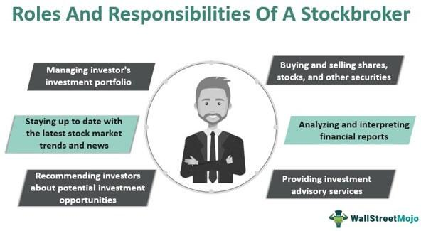

## Table of Contents

## What is a broker in the context of stock trading?

A broker in stock trading is a person or a company that helps you buy and sell stocks. When you want to invest in the stock market, you need a broker to place your orders. They act as a middleman between you and the stock exchange, making sure your trades happen smoothly.

Brokers can offer different services depending on what you need. Some brokers just execute your trades for a small fee, while others provide advice and manage your investments for you. Choosing the right broker depends on how much help you want and how much you are willing to pay for their services.

## How do brokers facilitate the buying and selling of stocks?

Brokers help you buy and sell stocks by connecting you to the stock market. When you decide you want to buy a stock, you tell your broker which stock and how many shares you want. The broker then sends your order to the stock exchange, where it gets matched with someone who wants to sell the same stock. Once the trade is done, the broker updates your account to show that you now own those shares.

When you want to sell your stocks, the process is similar. You tell your broker which stocks you want to sell and how many shares. The broker then sends your sell order to the stock exchange to find someone who wants to buy those shares. Once the trade is complete, the broker updates your account to reflect that you no longer own those shares and adds the money from the sale to your account. This way, brokers make it easy for you to trade stocks without having to deal directly with the stock exchange.

## What are the different types of brokers available to investors?

There are mainly two types of brokers that investors can choose from: full-service brokers and discount brokers. Full-service brokers offer a lot more than just buying and selling stocks. They give you advice on what to invest in, help you plan your investments, and sometimes even manage your portfolio for you. They are like financial advisors who know a lot about the market and can help you make smart choices. But, because they offer so much help, their fees are usually higher.

Discount brokers, on the other hand, are more straightforward. They mainly focus on executing your trades quickly and at a low cost. They don't usually give investment advice or manage your portfolio. This makes them a good choice if you know what you want to invest in and just need someone to make the trades for you. Their fees are much lower than full-service brokers, which can save you money if you are doing a lot of trading.

Some brokers also offer a mix of services, falling somewhere in between full-service and discount brokers. These hybrid brokers might offer some advice and additional services, but at a lower cost than full-service brokers. This can be a good option if you want some guidance but don't want to pay high fees.

## What are the fees and commissions typically charged by brokers?

Brokers charge fees and commissions for their services, and the amounts can vary a lot depending on the type of broker you choose. Full-service brokers usually charge higher fees because they offer a lot of help, like giving you advice on what to buy and sell, and even managing your investments for you. Their fees can be a flat rate per trade, or they might charge a percentage of the money you invest. They might also have yearly fees for managing your account. These fees can add up, so it's good to know what you're paying for.

Discount brokers, on the other hand, have much lower fees. They mainly focus on making your trades happen quickly and don't give much advice. Their fees are usually just a small amount per trade, sometimes as low as a few dollars. This can be a good choice if you know what you want to invest in and just need someone to make the trades for you. Some discount brokers might also charge other small fees, like for transferring money in and out of your account, but these are usually pretty low too.

Hybrid brokers, which offer a mix of services, have fees that are somewhere in between full-service and discount brokers. They might charge a bit more than discount brokers but less than full-service brokers. Their fees could include a mix of trade commissions and some fees for advice or other services. It's important to look at all the fees carefully to make sure you're getting good value for what you pay.

## How does a beginner choose the right broker for stock trading?

Choosing the right broker for stock trading can feel a bit tricky, especially if you're just starting out. The first thing to think about is what kind of help you need. If you want someone to give you advice and help you plan your investments, a full-service broker might be a good choice. They know a lot about the market and can guide you, but they charge more for their services. On the other hand, if you already know what you want to invest in and just need someone to make the trades for you, a discount broker could be better. They charge less because they don't give much advice, which can save you money if you're doing a lot of trading.

Another thing to consider is the fees and commissions. Full-service brokers have higher fees because they offer more help, while discount brokers have lower fees because they focus on just making your trades happen. It's a good idea to compare the fees of different brokers to see which one fits your budget. Also, think about how easy it is to use their website or app. You want a broker that makes it simple for you to buy and sell stocks. Reading reviews from other users can help you see if a broker is easy to use and if they have good customer service. By thinking about these things, you can pick a broker that's right for you and helps you start trading stocks with confidence.

## What is the role of a full-service broker versus a discount broker?

A full-service broker is like a personal guide in the world of stock trading. They do more than just buy and sell stocks for you. They give you advice on what to invest in, help you plan your investments, and sometimes even manage your portfolio for you. Because they offer so much help, their fees are usually higher. If you're new to investing or want someone to help you make smart choices, a full-service broker can be a good choice. They know a lot about the market and can help you feel more confident about your investments.

A discount broker, on the other hand, is more straightforward. They focus on making your trades happen quickly and at a low cost. They don't usually give investment advice or manage your portfolio. This makes them a good choice if you know what you want to invest in and just need someone to make the trades for you. Their fees are much lower than full-service brokers, which can save you money if you're doing a lot of trading. If you're comfortable making your own investment decisions, a discount broker can help you keep more of your money.

## How do brokers ensure the security of client transactions and data?

Brokers take many steps to keep your transactions and data safe. They use strong encryption to protect your information when you're buying or selling stocks. This means your data is turned into a secret code that only the broker can understand. They also have strict rules about who can see your information, so only people who really need to know can access it. Plus, they use special systems to watch for any strange activity that might mean someone is trying to do something they shouldn't.

Brokers also have to follow rules set by the government and other groups to make sure they're keeping your money and data safe. They have to do regular checks to make sure everything is secure. If something goes wrong, they have insurance to help cover any losses. This way, you can feel more confident that your investments and personal information are protected when you're using a broker.

## What advanced tools and services do brokers offer to experienced traders?

Brokers offer many advanced tools and services that can help experienced traders make better decisions and manage their investments more effectively. One key tool is real-time market data, which shows what's happening in the stock market right now. This helps traders see the latest prices and make quick trades. Brokers also provide advanced charting tools that let traders look at stock prices in different ways, like seeing trends over time or comparing different stocks. These charts can help traders spot good times to buy or sell. Another useful service is access to research reports and analysis from experts, which can give traders new ideas and insights about the market.

In addition to these tools, brokers often offer trading platforms that are designed for experienced traders. These platforms have features like customizable dashboards, where traders can set up the information they want to see in one place. They also have order types that let traders set up more complex trades, like stop-loss orders that automatically sell a stock if its price drops too much. Some brokers even offer algorithmic trading, where traders can use computer programs to make trades based on certain rules. This can help traders take advantage of market opportunities faster than they could on their own.

## How do brokers comply with regulatory requirements in stock trading?

Brokers have to follow many rules to make sure they're doing things the right way. These rules come from government agencies like the Securities and Exchange Commission (SEC) in the United States. Brokers need to register with these agencies and follow their rules about how to handle money and information. They also have to keep good records of all the trades they do, so they can show that everything is done fairly and honestly. If they don't follow these rules, they can get in big trouble.

To make sure they're following the rules, brokers do regular checks on themselves. They use special systems to watch for anything that might look wrong, like if someone is trying to cheat. They also have to report to the regulators and let them know about any problems right away. This helps keep the stock market safe and fair for everyone. By following all these rules, brokers help make sure that your investments are protected and that the market works the way it should.

## What impact do brokers have on the efficiency of the stock market?

Brokers play a big role in making the stock market work smoothly. They help people buy and sell stocks quickly and easily. When you want to trade, your broker sends your order to the stock exchange, where it gets matched with someone else's order. This process is fast because brokers use computers and special systems to make trades happen. Without brokers, it would be much harder for people to trade stocks, and the market wouldn't be as efficient.

Brokers also help keep the market fair and safe. They follow strict rules set by the government to make sure everyone is treated the same way. They watch for any strange activity that might mean someone is trying to cheat. By doing this, brokers help make sure that the stock market is a place where people can trust their investments. This trust is important for keeping the market running well and helping people feel confident about trading stocks.

## How do algorithmic trading and brokers interact in modern stock markets?

In modern stock markets, brokers and algorithmic trading work together to make trading faster and more efficient. Algorithmic trading uses computer programs to buy and sell stocks based on certain rules. These programs can make trades very quickly, often in just a few seconds. Brokers provide the platform and tools that traders need to use these algorithms. When a trader wants to use an algorithm, they can set it up through their broker's trading platform. The broker then sends the orders from the algorithm to the stock exchange, where they get matched with other orders.

This interaction helps the stock market run smoothly. Because algorithms can make trades so quickly, they can take advantage of small changes in the market that a person might miss. Brokers make sure these trades happen safely and follow all the rules. They also provide the data and tools that algorithms need to work well. By working together, brokers and algorithmic trading help make the stock market more efficient and fair for everyone.

## What future trends are expected to influence the role of brokers in stock purchases?

In the future, technology will keep changing how brokers help people buy and sell stocks. One big trend is the use of [artificial intelligence](/wiki/ai-artificial-intelligence) (AI) and [machine learning](/wiki/machine-learning). These tools can look at a lot of data very quickly and help brokers give better advice to their clients. For example, AI can find patterns in the market that people might miss. This means brokers can offer more personalized services and help people make smarter choices about their investments. Also, more people might start using apps on their phones to trade stocks, so brokers will need to make sure their apps are easy to use and safe.

Another trend is that more people might want to do their own trading without much help from brokers. This is called self-directed investing. Because of this, brokers might focus more on giving people the tools they need to trade on their own, like better trading platforms and more real-time data. At the same time, rules and regulations might change to make sure the stock market stays fair and safe. Brokers will need to keep up with these changes and make sure they follow all the new rules. Overall, the role of brokers will keep evolving to meet the needs of investors and keep up with new technology and rules.

## What is Understanding Algorithmic Trading?

Algorithmic trading, often referred to as algo trading, involves using computer algorithms to manage trading decisions in financial markets. These algorithms execute pre-defined trading instructions, such as timing, price, or [volume](/wiki/volume-trading-strategy), with the goal of optimizing trade efficiency. By automating the trading process, [algorithmic trading](/wiki/algorithmic-trading) reduces the need for human intervention and minimizes emotional bias, making it a powerful tool in modern finance.

One of the primary advantages of algorithmic trading is its ability to operate at speeds and frequencies that far surpass those attainable by human traders. As markets move quickly, the ability to execute trades in microseconds can provide significant advantages in terms of price and [liquidity](/wiki/liquidity-risk-premium). This high-frequency trading capability allows traders to capitalize on small price discrepancies that might occur for very brief moments.

Common strategies within algorithmic trading include:

1. **Trend-Following**: This strategy involves making buy or sell decisions based on the direction of market prices. The idea is to capitalize on continued trends by using indicators like moving averages or channel breakouts. For example, a simple moving average crossover system would buy when a short-term average crosses above a long-term average, and sell when the opposite occurs.

   Python Example:
   ```python
   def moving_average(prices, window):
       return sum(prices[-window:]) / window

   def trend_following_strategy(prices, short_window=20, long_window=50):
       short_ma = moving_average(prices, short_window)
       long_ma = moving_average(prices, long_window)
       if short_ma > long_ma:
           return "Buy"
       elif short_ma < long_ma:
           return "Sell"
       else:
           return "Hold"
   ```

2. **Arbitrage**: This involves exploiting price differences of the same asset in different markets. For example, if a stock is traded at slightly different prices on two exchanges, an algorithm can quickly buy at the lower price and sell at the higher one, profiting from the discrepancy.

3. **Mean Reversion**: This strategy is based on the assumption that the price of a security will revert to its average or mean value over time. Traders identify stocks that have deviated significantly from their average price and anticipate that the price will move back towards the mean.

   Mathematical Representation:
$$
   P_t = \mu + \epsilon_t

$$
   where $P_t$ is the price at time $t$, $\mu$ is the mean price, and $\epsilon_t$ is the deviation from the mean. Mean reversion strategies involve trading based on the size of $\epsilon_t$.

These strategies, among others, leverage the inherent computational advantages of algorithms to enhance trading performance and efficiency. However, the effectiveness of algorithmic trading requires a robust understanding of the market as well as continuous monitoring and adjustment of the algorithms to adapt to new market conditions.

## References & Further Reading

[1]: ["Advances in Financial Machine Learning"](https://www.amazon.com/Advances-Financial-Machine-Learning-Marcos/dp/1119482089) by Marcos Lopez de Prado

[2]: ["Evidence-Based Technical Analysis: Applying the Scientific Method and Statistical Inference to Trading Signals"](https://www.amazon.com/Evidence-Based-Technical-Analysis-Scientific-Statistical/dp/0470008741) by David Aronson

[3]: ["Machine Learning for Algorithmic Trading"](https://github.com/PacktPublishing/Machine-Learning-for-Algorithmic-Trading-Second-Edition) by Stefan Jansen

[4]: ["Quantitative Trading: How to Build Your Own Algorithmic Trading Business"](https://www.amazon.com/Quantitative-Trading-Build-Algorithmic-Business/dp/1119800064) by Ernest P. Chan

[5]: Bergstra, J., Bardenet, R., Bengio, Y., & Kégl, B. (2011). ["Algorithms for Hyper-Parameter Optimization."](https://proceedings.neurips.cc/paper/2011/file/86e8f7ab32cfd12577bc2619bc635690-Paper.pdf) Advances in Neural Information Processing Systems 24.