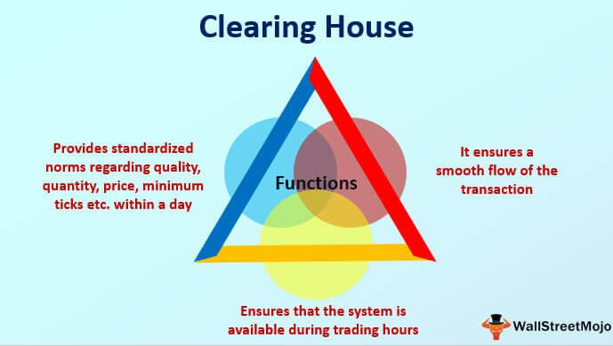

The financial markets have undergone a profound transformation driven by the integration of technology and automation. This evolution has significantly increased the complexity, speed, and efficiency of market operations. At the heart of this transformation are two critical components: clearinghouses and algorithmic trading. Clearinghouses serve an essential function in maintaining the stability and integrity of financial transactions by acting as intermediaries between buyers and sellers. Not only do they ensure that trades are settled efficiently and securely, but they also mitigate counterparty risk by guaranteeing the execution of trade settlements. Meanwhile, algorithmic trading represents a modern approach to executing trades. It leverages sophisticated algorithms to automate and optimize trading strategies, significantly enhancing the capability to conduct high-frequency trades with minimal human intervention.

Clearinghouses and algorithmic trading collectively contribute to the smooth functioning of financial markets. By providing a robust infrastructure for trade settlement, clearinghouses facilitate the rapid execution and completion of transactions that algorithmic trading demands. This interplay is crucial in an environment where market participants seek to capitalize quickly on price movements, often executing thousands of trades in fractions of a second. Understanding the clearinghouse as a financial intermediary within this context is essential as it underscores the pivotal role these entities play in ensuring operational and systemic stability in today's financial markets.



This article will provide insights into how clearinghouses operate within the framework of algorithmic trading, highlighting their indispensable role in fostering efficient, reliable, and risk-managed financial transactions.

## Table of Contents

## Understanding the Role of a Clearinghouse

A clearinghouse serves as an essential intermediary in financial markets, acting as a buffer between buyers and sellers to ensure the smooth and efficient completion of transactions. Clearinghouses perform critical functions that facilitate the post-trade process, including the settlement and validation of transactions, risk management, and reporting.

One of the primary roles of a clearinghouse is to manage the settlement process, where transactions between parties are finalized. After a trade is executed, the clearinghouse steps in to confirm the details of the transaction, ensuring accuracy in the trade's recorded terms. This involves verifying the parties involved, the price agreed upon, and the quantity and quality of the financial instrument being traded.

In addition to settlement, clearinghouses play a pivotal role in risk management. They significantly reduce counterparty risk, which is the possibility that one party in a transaction might default before the transaction is completed. Clearinghouses do this by acting as the counterparty to both sides of a trade. Once a trade is matched, the clearinghouse becomes the buyer to the seller and the seller to the buyer, essentially guaranteeing the fulfillment of the trade. This process is known as novation.

By interjecting themselves as intermediaries, clearinghouses provide a level of certainty and reliability that would otherwise be more challenging to achieve. They manage their risk exposure through the collection of margin from trading parties. Margin is a form of collateral that ensures that the parties have a vested interest in fulfilling their obligations. The amount of margin required is typically determined based on the [volatility](/wiki/volatility-trading-strategies) and risk profile of the traded asset.

Furthermore, clearinghouses contribute to market transparency and stability by providing detailed reporting on transactions. This reporting not only helps in the regulatory oversight of market activities but also aids in maintaining the confidence of market participants.

In summary, clearinghouses mitigate significant counterparty risks, oversee the effective settlement of transactions, and perform vital risk management and reporting functions. By doing so, they enhance the integrity and stability of financial markets, supporting seamless and secure trading activities.

## Clearinghouses in Different Financial Markets

In the financial markets, clearinghouses fulfill a crucial role by facilitating the settlement of securities transactions and reducing counterparty risk. In the United States, the National Securities Clearing Corporation (NSCC) acts as a primary clearing entity for securities. Established in 1976, the NSCC is a subsidiary of the Depository Trust & Clearing Corporation (DTCC). It provides centralized clearing, settlement, and risk management services to the equity, corporate bond, and municipal bond markets. By netting trades, the NSCC reduces the amount of securities and payments that need to be exchanged, thus improving market efficiency and reducing systemic risk.

Euroclear, a prominent clearinghouse in the European Union, serves a similar purpose by validating and clearing a wide range of domestic and cross-border securities transactions. Founded in 1968, Euroclear supports the financial markets by offering settlement services across multiple asset classes, including equities, bonds, and investment funds. Its extensive network and robust infrastructure enable it to provide secure and efficient post-trade services, contributing to market stability and investor confidence.

Each financial market is equipped with its designated clearinghouse to address specific regulatory requirements and operational challenges. In Asia, for instance, the Japan Securities Clearing Corporation (JSCC) and the China Securities Depository and Clearing Corporation (CSDC) are responsible for clearing and settling trades in their respective countries. These institutions play a significant role in ensuring that trades are executed smoothly and that market participants can manage their risk exposure effectively.

In summary, clearinghouses are vital components of financial markets worldwide, each tailored to meet the regulatory and operational needs of their respective regions. By facilitating secure and efficient trade settlements, they enhance the overall functionality and reliability of global financial markets.

## Algorithmic Trading: A Modern Approach

Algorithmic trading, also known as algo trading, involves utilizing computer algorithms to automate trading activities. These algorithms make execution decisions based on pre-defined criteria, which may include timing, price, and [volume](/wiki/volume-trading-strategy). This approach has become a fundamental component of modern financial markets, primarily due to its efficiency and ability to process high-volume transactions swiftly.

The main advantage of [algorithmic trading](/wiki/algorithmic-trading) is its capacity to execute high-frequency trades. High-frequency trading ([HFT](/wiki/high-frequency-trading-strategies)) is a subset of algorithmic trading characterized by rapid trade execution, often measured in milliseconds or microseconds. This method reduces human error, optimizing profitability by exploiting small price discrepancies in securities that can be observed only at exceedingly high speeds. Traders employ statistical models and historical data analyses to foster strategies that make real-time decisions on potentially profitable trading opportunities.

The infrastructure offered by clearinghouses is pivotal for algorithmic trading. Clearinghouses provide crucial mechanisms for the settlement and validation of trades, which are essential given the speed and volume at which algorithmic trades occur. They ensure that trades are executed accurately and settled within the specified time frames, thereby maintaining market integrity and reducing counterparty risk.

One key feature of algorithmic trading is its reliance on predefined instructions, which are expressed mathematically. These instructions can be translated into code using languages such as Python, known for its flexibility and extensive libraries suited for financial analysis. Here is a simple example demonstrating how a basic trading algorithm might look in Python:

```python
import yfinance as yf  # For more datasets, visit: https://paperswithbacktest.com/datasets

# Define criteria for buying or selling
def simple_moving_average(ticker, short_window, long_window):
    # Fetch historical data
    stock_data = yf.download(ticker, start='2023-01-01', end='2023-12-31')

    # Calculate moving averages
    stock_data['Short_MA'] = stock_data['Close'].rolling(window=short_window).mean()
    stock_data['Long_MA'] = stock_data['Close'].rolling(window=long_window).mean()

    # Generate signals
    stock_data['Signal'] = 0
    stock_data['Signal'][short_window:] = np.where(
        stock_data['Short_MA'][short_window:] > stock_data['Long_MA'][short_window:], 1, 0
    )

    # Buying and Selling points
    stock_data['Position'] = stock_data['Signal'].diff()

    return stock_data

# Example usage for Apple
apple_trading_strategy = simple_moving_average('AAPL', 40, 100)
print(apple_trading_strategy.tail())  # Outputs recent data with signals
```

In this example, the algorithm calculates the short-term and long-term moving averages to generate buy or sell signals, simulating a simplified strategy for algorithmic trading. 

Overall, algorithmic trading leverages computational efficiency to capitalize on trading opportunities that are often too complex and rapid for human traders to manage manually. The symbiotic relationship with clearinghouses underpins its reliability, ensuring that the vast number of trades executed are settled accurately and promptly.

## Integration between Clearinghouses and Algorithmic Trading

Clearinghouses play a pivotal role in ensuring that algorithmic trading, particularly high-frequency trading (HFT), is executed with precision and minimal risk. By utilizing sophisticated techniques such as netting and risk management, clearinghouses facilitate the processing of large trading volumes efficiently and securely.

Netting is a process that reduces the number of transactions that need to be settled. By offsetting buy and sell positions, netting minimizes the overall exposure and lowers the settlement burden. For instance, if an entity has multiple buy and sell orders for a particular security within the same period, netting allows for the consolidation of these orders into a single position. This reduces transactional discrepancies and streamlines the settlement process.

Risk management is another critical function that clearinghouses perform to support algorithmic trading. Clearinghouses employ robust risk assessment mechanisms to ensure that counterparties fulfill their obligations, thereby reducing the counterparty risk. This involves maintaining margin accounts, performing mark-to-market calculations, and setting default fund requirements to cover potential losses from defaults. By doing so, clearinghouses provide a safety net that maintains market stability even during volatile trading conditions.

Moreover, clearinghouses leverage technology to enhance the efficiency of these processes. Advanced algorithms are deployed to predict and manage risk dynamically, accommodating the rapid pace of HFT. These systems continuously monitor market conditions, assessing potential risks in real-time, and adjusting margin requirements accordingly. This level of automation is crucial for handling the vast quantities of data processed by high-frequency trading systems.

In conclusion, the integration of clearinghouses with algorithmic trading platforms is essential for ensuring that trades are executed with reduced risk and operational cost. By employing netting and risk management techniques, clearinghouses help maintain market integrity and provide the essential infrastructure for the fast, automated execution of trades characteristic of algorithmic trading.

## Automation in Clearing and Settlement

Automation in both trading and clearing processes has become increasingly essential for managing the ever-growing volumes of trades in the financial markets. By leveraging technology, these processes can handle more transactions efficiently and accurately, reducing human intervention and the potential for error.

One of the key technologies revolutionizing the automation of clearing and settlement is blockchain. Blockchain technology provides a decentralized and distributed ledger system that enhances transparency and security. Every transaction is recorded on a public ledger, which can be accessed by all parties involved, significantly reducing the risk of fraud or data manipulation. The immutability and traceability of blockchain make it a powerful tool for ensuring that trades are settled accurately and promptly, with all stakeholders having confidence in the system.

For example, consider a Python script that illustrates a simple blockchain transaction mechanism:

```python
import hashlib

class Block:
    def __init__(self, previous_hash, transaction):
        self.previous_hash = previous_hash
        self.transaction = transaction
        self.block_hash = self.hash_block()

    def hash_block(self):
        combined_text = self.previous_hash + self.transaction
        return hashlib.sha256(combined_text.encode()).hexdigest()

# Example of creating a blockchain with three blocks
blockchain = [Block("initial_hash", "Trader A to Trader B: 500 shares of XYZ"),
              Block(blockchain[-1].block_hash, "Trader B to Trader C: 200 shares of XYZ"),
              Block(blockchain[-1].block_hash, "Trader A to Trader D: 300 shares of XYZ")]

for block in blockchain:
    print(f"Block hash: {block.block_hash}")
```

In addition to blockchain, [artificial intelligence](/wiki/ai-artificial-intelligence) (AI) is playing a critical role in automating clearing and settlement processes. AI algorithms are used to analyze large sets of market data, predicting patterns, optimizing trade executions, and managing risk. Machine learning models can quickly adapt to new information, learning from past transactions to improve the accuracy and efficiency of settlements.

Automation also contributes to enhanced market stability. By minimizing human error and expediting transaction processing, financial markets can maintain more consistent and reliable operations. Automated systems ensure that trades are not only settled faster but also with precise validation, helping to maintain [liquidity](/wiki/liquidity-risk-premium) and reduce the potential for market disruptions.

As the financial market grows more complex, the need for automated clearing and settlement solutions becomes more pronounced. The integration of these advanced technologies not only improves operational efficiency but also sets the foundation for a more secure and resilient trading environment.

## Challenges in Clearing and Settlement

Clearing and settlement processes in financial markets face several challenges despite technological advancements. The primary concerns include operational risks, cybersecurity threats, and market volatility. These elements can affect the stability and efficiency of financial transactions, necessitating continuous adaptation and innovation in clearinghouse operations.

Operational risks stem from inadequacies or failures in internal processes, systems, or policies that can lead to transaction errors or delays. For instance, the complex automation involved in clearing and settlement processes introduces vulnerabilities that may disrupt the seamless execution of trades. Mitigating these risks requires sophisticated risk management practices and robust internal controls. Clearinghouses must employ accurate data handling and efficient transaction monitoring systems to minimize the potential for operational failures.

Cybersecurity threats represent a critical challenge in the digital era, with clearinghouses being lucrative targets for cybercriminals due to the sensitive financial information they handle. Cyberattacks, such as data breaches and system infiltrations, can jeopardize the integrity and confidentiality of the settlement processes. To counteract these threats, clearinghouses invest in state-of-the-art cybersecurity measures, including encryption, intrusion detection systems, and regular security audits. Furthermore, collaboration with regulatory bodies ensures adherence to cybersecurity standards and promotes the resilience of financial infrastructures against cyber threats.

Market volatility also poses a significant challenge to clearing and settlement operations. Sudden price movements and high trading volumes can strain the capacity of clearinghouses, leading to increased risks and potential errors. Efficient liquidity management and real-time transaction processing systems are necessary to cope with volatile market conditions. Clearinghouses can use predictive analytics and stress testing to assess their preparedness for extreme market scenarios and adjust their risk management strategies accordingly.

Addressing these challenges requires continuous technological updates and strict regulatory compliance. Emerging technologies, such as artificial intelligence and blockchain, offer potential solutions to enhance transparency, speed, and security in clearing and settlement processes. For example, blockchain's distributed ledger technology provides an immutable record of transactions, reducing the risk of tampering and increasing trust among market participants. Similarly, AI can automate complex risk management processes, allowing for faster and more accurate decision-making.

Regulatory compliance is paramount to maintaining the integrity and stability of financial markets. Clearinghouses must navigate an evolving regulatory landscape, ensuring their operations meet the standards set by financial authorities. This compliance involves regular assessments and updates to internal policies and systems to align with regulatory requirements. By fostering a culture of compliance, clearinghouses play a pivotal role in safeguarding market credibility and protecting participants' interests.

In conclusion, clearinghouses must dynamically adapt to address the challenges of operational risks, cybersecurity threats, and market volatility. The integration of cutting-edge technologies and adherence to regulatory standards are essential to ensure robust risk management and market protection. As financial markets continue to evolve, clearinghouses will remain crucial intermediaries, facilitating secure and efficient transactions.

## Future of Clearinghouses and Algorithmic Trading

As technology continues to advance, the future of clearinghouses is poised for significant transformation, enhancing their role in facilitating secure and efficient trades. The integration of advanced technologies, such as blockchain, artificial intelligence (AI), and [machine learning](/wiki/machine-learning), is pivotal in this evolution. These technologies offer the potential to create more resilient and adaptable clearing processes, addressing current inefficiencies and implementing real-time risk management.

Blockchain technology, for instance, can enhance the transparency and security of transactions by creating immutable ledgers that allow for instant verification and settlement of trades. This decentralization reduces the reliance on traditional systems and accelerates the entire clearing process. Additionally, blockchain's ability to automate smart contracts could streamline the post-trade process, eliminating manual intervention and reducing settlement times.

AI and machine learning also stand to refine clearinghouse operations by predicting trade patterns and optimizing settlement strategies. These technologies can analyze vast datasets to foresee market trends, detect anomalies, and anticipate potential counterparty risks, thus enabling preemptive risk mitigation measures. In practice, AI could automate decision-making within clearinghouses to ensure timely settlement and enhance operational efficiencies.

Moreover, as algorithmic trading strategies evolve, they will increasingly require the support of sophisticated clearinghouse infrastructures. High-frequency trading, which demands minimal latency and high transaction throughput, benefits from clearinghouses that can quickly and efficiently process large volumes of trades. By leveraging new technologies, clearinghouses can offer the necessary support to sustain these trading strategies, thereby fostering market liquidity and stability.

The symbiotic relationship between clearinghouses and algorithmic trading suggests that both will continue to shape the financial markets extensively. Clearinghouses' ability to adapt to and integrate emerging technologies will be crucial for supporting seamless trade executions in the future. As the financial landscape becomes more interconnected and complex, the role of clearinghouses will expand, ensuring that markets remain robust, efficient, and resilient against potential disruptions.

These advancements also highlight the need for continuous regulatory and technological updates to align with new market realities. By proactively adopting and integrating cutting-edge technologies, clearinghouses can better manage risks and bolster market confidence, ultimately contributing to a more stable and efficient financial ecosystem.

## Conclusion

Clearinghouses are indispensable intermediaries in the financial markets, performing vital services that underpin trading activities. By acting as a neutral party between buyers and sellers, they ensure that transactions are executed securely and efficiently. Clearinghouses play a critical role in reducing counterparty risk, a fundamental concern in financial trading, by guaranteeing the settlement of trades. This ensures that all parties fulfill their contractual obligations, thereby maintaining trust and integrity within the financial systems.

The symbiotic relationship between clearinghouses and algorithmic trading has led to significant advancements in market transactions. Algorithmic trading, characterized by the use of sophisticated computer algorithms to execute trades at high frequencies, relies heavily on the infrastructure and processes managed by clearinghouses. This relationship facilitates robust, efficient, and reliable market transactions by leveraging the clearinghouses' risk management and settlement functions, which are optimized for speed and accuracy crucial for high-frequency trading.

As the financial industry continues to evolve with technological advancements, innovations in automation and regulatory frameworks are expected to enhance the effectiveness of clearinghouses further. Technologies such as blockchain and artificial intelligence are beginning to be integrated into the clearing and settlement processes, promising increased transparency, reduced errors, and improved market stability. These innovations, coupled with ongoing regulatory developments aimed at ensuring market safety, are poised to strengthen the role of clearinghouses.

In conclusion, the ongoing enhancements in clearinghouse operations and the continuous evolution of algorithmic trading are integral to adapting to the dynamic landscape of the financial markets. By continually advancing their capabilities, clearinghouses will continue to support the seamless execution of trades and contribute to the resilience and adaptability of global financial markets.

## References & Further Reading

[1]: Pirrong, C. (2011). ["The Economics of Clearing in Derivatives Markets: Netting, Asymmetric Information, and the Sharing of Default Risks Through a Central Counterparty."](https://www.bauer.uh.edu/spirrong/clearing_organization.pdf) Federal Reserve Bank of New York.

[2]: D'Hulster, K. (2009). ["The Leverage Ratio."](https://documents.worldbank.org/curated/en/260961468158726436/pdf/530440BRI0Cris10Box345594B01PUBLIC1.pdf) The World Bank Financial Systems Practice Note.

[3]: Cont, R., & Kokholm, T. (2010). ["Central clearing of OTC derivatives: Bilateral vs multilateral netting."](https://arxiv.org/pdf/1304.5065.pdf) Journal of Financial Engineering.

[4]: Gomber, P., Arndt, B., Lutat, M., & Uhle, T. (2011). ["High-Frequency Trading."](https://papers.ssrn.com/sol3/papers.cfm?abstract_id=1858626) Springer.

[5]: Hasbrouck, J., & Saar, G. (2013). ["Low-latency trading."](https://www.sciencedirect.com/science/article/abs/pii/S1386418113000165) The Review of Financial Studies, 26(9), 2375-2415.

[6]: Duffie, D., & Zhu, H. (2011). ["Does a Central Clearing Counterparty Reduce Counterparty Risk?"](https://www.mit.edu/~zhuh/DuffieZhu_CCP.pdf) The Review of Asset Pricing Studies, 1(1), 74-95.

[7]: Treleaven, P., Galas, M., & Lalchand, V. (2013). ["Algorithmic Trading Review."](https://www.researchgate.net/publication/262239006_Algorithmic_Trading_Review) Communications of the ACM, 56(11), 76-85.

[8]: Malkiel, B. G. (2019). ["A Random Walk Down Wall Street: The Time-Tested Strategy for Successful Investing"](https://yourknowledgedigest.org/wp-content/uploads/2020/04/a-random-walk-down-wall-street.pdf). W. W. Norton & Company.

[9]: Naughton, J. (2020). ["The Future of Finance: The Impact of FinTech, AI, and Crypto on Financial Services"](https://link.springer.com/book/10.1007/978-3-030-14533-0). Oxford University Press.