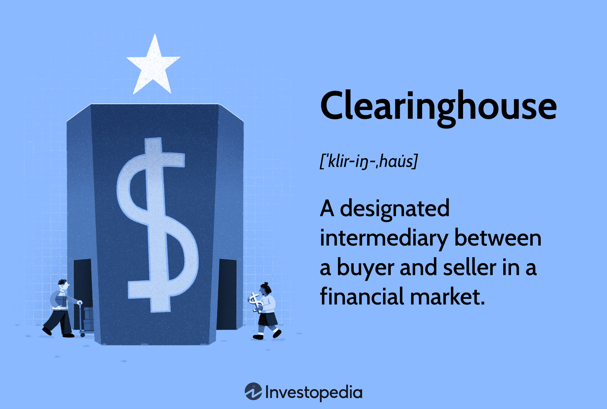

## Table of Contents

## What is a clearinghouse in financial markets?

A clearinghouse in financial markets is like a middleman that helps make sure trades happen smoothly and safely. When people buy and sell things like stocks or futures, the clearinghouse steps in to make sure both sides keep their promises. It does this by taking the opposite side of every trade, so if one person can't pay, the clearinghouse steps in to cover it. This reduces the risk that someone won't follow through on their part of the deal.

Clearinghouses also help manage the money and assets that are part of these trades. They keep track of who owes what and make sure everything is settled correctly. By doing this, they help keep the financial markets stable and trustworthy. Without clearinghouses, trading would be riskier because there would be no one to guarantee that trades would be completed as agreed.

## How does a clearinghouse function in trading?

When you trade in financial markets, a clearinghouse acts like a referee. It makes sure that if you agree to buy something, you actually get it, and if you agree to sell something, you actually give it away. Imagine you want to buy some stocks. You find someone who wants to sell them. Instead of dealing directly with that person, the clearinghouse steps in. It takes the stocks from the seller and gives them to you, the buyer. This way, the clearinghouse makes sure that both you and the seller do what you promised.

The clearinghouse also keeps track of money. If you're buying stocks, you need to pay for them. The clearinghouse makes sure you have the money and that the seller gets paid. It does this by holding onto the money and the stocks until everything is settled. This helps prevent problems, like if one person can't pay or decides not to go through with the trade. By doing all this, the clearinghouse makes trading safer and more reliable for everyone involved.

## What are the primary roles of a clearinghouse?

A clearinghouse is like a helper in trading. It makes sure that when people buy and sell things like stocks, both sides do what they promised. When you want to buy something, the clearinghouse takes it from the seller and gives it to you. If you're selling, it takes your item and gives it to the buyer. This way, it makes sure the trade happens smoothly and everyone gets what they agreed to.

The clearinghouse also keeps track of money. It makes sure that if you're buying, you have enough money to pay for it. And if you're selling, it makes sure you get paid. The clearinghouse holds onto the money and the items until everything is settled. This helps prevent problems, like if someone can't pay or changes their mind. By doing all this, the clearinghouse makes trading safer and more trustworthy for everyone.

## Why are clearinghouses important for financial stability?

Clearinghouses are important for financial stability because they act like a safety net for trades. When people buy and sell things like stocks, the clearinghouse makes sure that both sides follow through on their promises. If someone can't pay or decides not to go through with the trade, the clearinghouse steps in to fix it. This reduces the risk that a trade won't happen as planned, which helps keep the market stable. Without clearinghouses, trading would be riskier because there would be no one to guarantee that trades would be completed.

They also help by keeping track of money and assets during trades. Clearinghouses make sure that buyers have enough money and that sellers get paid correctly. By holding onto the money and the items until everything is settled, clearinghouses prevent problems and make sure everything is fair. This helps keep the financial markets trustworthy and reliable, which is important for the overall stability of the economy.

## What is the difference between a clearinghouse and an exchange?

A clearinghouse and an exchange are both important parts of financial markets, but they do different jobs. An exchange is like a marketplace where people come to buy and sell things like stocks or futures. It's where the actual trading happens. Think of it as a big store where you can pick out what you want to buy or sell. The exchange makes sure the trading is fair and follows the rules, but it doesn't get involved in the actual trade once it's made.

On the other hand, a clearinghouse steps in after the trade is made on the exchange. It acts like a middleman to make sure the trade goes through smoothly. The clearinghouse makes sure that if you buy something, you get it, and if you sell something, you get paid. It does this by taking the stocks from the seller and giving them to the buyer, and by holding onto the money until everything is settled. This way, the clearinghouse reduces the risk that someone won't follow through on their part of the deal, making trading safer and more reliable.

## How do clearinghouses mitigate counterparty risk?

Clearinghouses help reduce counterparty risk by acting as the middleman in trades. When you buy or sell something like stocks, the clearinghouse steps in to make sure both sides do what they promised. If you're buying, the clearinghouse takes the stocks from the seller and gives them to you. If you're selling, it takes your stocks and gives them to the buyer. This way, the clearinghouse makes sure the trade happens even if one person can't pay or changes their mind.

The clearinghouse also keeps track of money and assets during trades. It makes sure that if you're buying, you have enough money to pay for it. And if you're selling, it makes sure you get paid. The clearinghouse holds onto the money and the items until everything is settled. By doing this, it prevents problems and makes sure everyone gets what they agreed to. This reduces the risk that someone won't follow through on their part of the deal, making trading safer and more reliable for everyone involved.

## What are the processes involved in clearing and settlement?

Clearing and settlement are two important steps that happen after you make a trade. Clearing is when the clearinghouse makes sure that both the buyer and the seller have what they need to complete the trade. If you're buying stocks, the clearinghouse checks that you have enough money to pay for them. If you're selling, it checks that you actually have the stocks to sell. The clearinghouse also makes sure that the trade details are correct and that both sides agree on everything. This step helps prevent problems by making sure everyone is ready to go through with the trade.

Settlement happens after clearing and is when the actual exchange of money and stocks takes place. Once the clearinghouse is sure everything is in order, it moves the stocks from the seller to the buyer and the money from the buyer to the seller. This usually happens a few days after the trade, depending on the rules of the market. The clearinghouse keeps track of everything to make sure that the stocks and money end up where they are supposed to be. By doing this, the clearinghouse makes sure that the trade is completed safely and fairly for everyone involved.

## Can you explain the margin requirements set by clearinghouses?

Clearinghouses set margin requirements to make sure that people can pay for their trades. When you trade, you have to put down some money as a deposit, called the initial margin. This is like a safety net for the clearinghouse. It makes sure that if the value of what you're trading goes down, you can still cover the loss. The initial margin is a certain percentage of the total value of your trade. For example, if you're buying stocks worth $10,000, you might need to put down $1,000 as your initial margin.

Besides the initial margin, there's also a maintenance margin. This is the minimum amount of money you need to keep in your account to keep your trade going. If the value of your trade goes down and your account falls below the maintenance margin, you'll need to add more money, called a margin call. This helps make sure that you can still cover any losses. By setting these margin requirements, clearinghouses help reduce the risk that someone won't be able to pay for their trades, making the market safer for everyone.

## How do clearinghouses handle defaults?

When someone can't pay for their trade, it's called a default. Clearinghouses have ways to handle this to keep the market safe. If a trader defaults, the clearinghouse uses the money the trader put down as a deposit, called the margin, to cover the loss. This margin is like a safety net that helps make sure the clearinghouse can pay the other side of the trade. If the margin isn't enough, the clearinghouse might use a special fund, called a default fund, which is made up of money from all the members of the clearinghouse.

The clearinghouse also has rules to make sure everyone follows them. If a trader keeps breaking the rules or can't pay, the clearinghouse might stop them from trading. This helps prevent more defaults and keeps the market stable. By having these steps in place, clearinghouses make sure that even if someone can't pay, the trade still goes through, and the market stays safe for everyone else.

## What is the impact of clearinghouses on market liquidity?

Clearinghouses help make the market more liquid by making trading safer and easier. When people know that a clearinghouse is there to make sure trades happen smoothly, they feel more confident about buying and selling. This confidence means more people are willing to trade, which makes the market more active. More trading means there are more buyers and sellers, which makes it easier to buy or sell things quickly. This is what we call liquidity - how easily you can turn something into cash.

Clearinghouses also help by reducing the risk that someone won't pay for their trade. If people are worried about not getting paid, they might not want to trade as much. But with a clearinghouse, this risk is lower because the clearinghouse steps in to make sure everyone gets what they're supposed to. This makes people more willing to trade, which again helps keep the market liquid. So, clearinghouses play a big role in keeping the market moving smoothly and making sure there's always someone ready to buy or sell.

## What are the regulatory requirements for clearinghouses?

Clearinghouses have to follow a lot of rules set by governments and financial watchdogs to make sure they do their job right and keep the market safe. These rules are there to make sure clearinghouses can handle trades well and don't take too many risks. For example, clearinghouses need to have enough money and resources to step in if someone can't pay for their trade. They also have to keep good records of all the trades they handle and report this information to the regulators regularly. This helps the regulators keep an eye on what's happening in the market and make sure everything is fair and safe.

Another big part of the rules is making sure clearinghouses are strong and can handle problems. They have to have plans for what to do if something goes wrong, like if a lot of people can't pay at the same time. Clearinghouses also need to test their systems often to make sure they work well and can handle a lot of trades without breaking down. By following these rules, clearinghouses help keep the financial markets stable and trustworthy, which is good for everyone who trades.

## How have clearinghouses evolved with technological advancements?

Clearinghouses have changed a lot because of new technology. They used to do everything by hand, which was slow and could lead to mistakes. Now, they use computers and special software to handle trades much faster and more accurately. This means that when you buy or sell something, the clearinghouse can quickly check if you have enough money and make sure the trade happens smoothly. They also use technology to keep better records and make sure everything is safe and secure.

Another big change is that clearinghouses now use technology to handle more trades at the same time. They can manage trades from all over the world without needing to be in the same place as the buyers and sellers. This makes the market more connected and easier to use. Plus, new technology helps clearinghouses find and fix problems quickly, which makes trading safer and more reliable for everyone involved.

## References & Further Reading

[1]: Pirrong, C. (2011). ["The Economics of Clearing in Derivatives Markets: Netting, Asymmetric Information, and the Sharing of Default Risks Through a Central Counterparty."](https://www.bauer.uh.edu/spirrong/clearing_organization.pdf) Federal Reserve Bank of New York.

[2]: D'Hulster, K. (2009). ["The Leverage Ratio."](https://documents.worldbank.org/curated/en/260961468158726436/pdf/530440BRI0Cris10Box345594B01PUBLIC1.pdf) The World Bank Financial Systems Practice Note.

[3]: Cont, R., & Kokholm, T. (2010). ["Central clearing of OTC derivatives: Bilateral vs multilateral netting."](https://arxiv.org/pdf/1304.5065.pdf) Journal of Financial Engineering.

[4]: Gomber, P., Arndt, B., Lutat, M., & Uhle, T. (2011). ["High-Frequency Trading."](https://papers.ssrn.com/sol3/papers.cfm?abstract_id=1858626) Springer.

[5]: Hasbrouck, J., & Saar, G. (2013). ["Low-latency trading."](https://www.sciencedirect.com/science/article/abs/pii/S1386418113000165) The Review of Financial Studies, 26(9), 2375-2415.

[6]: Duffie, D., & Zhu, H. (2011). ["Does a Central Clearing Counterparty Reduce Counterparty Risk?"](https://www.mit.edu/~zhuh/DuffieZhu_CCP.pdf) The Review of Asset Pricing Studies, 1(1), 74-95.

[7]: Treleaven, P., Galas, M., & Lalchand, V. (2013). ["Algorithmic Trading Review."](https://www.researchgate.net/publication/262239006_Algorithmic_Trading_Review) Communications of the ACM, 56(11), 76-85.

[8]: Malkiel, B. G. (2019). ["A Random Walk Down Wall Street: The Time-Tested Strategy for Successful Investing"](https://yourknowledgedigest.org/wp-content/uploads/2020/04/a-random-walk-down-wall-street.pdf). W. W. Norton & Company.

[9]: Naughton, J. (2020). ["The Future of Finance: The Impact of FinTech, AI, and Crypto on Financial Services"](https://link.springer.com/book/10.1007/978-3-030-14533-0). Oxford University Press.