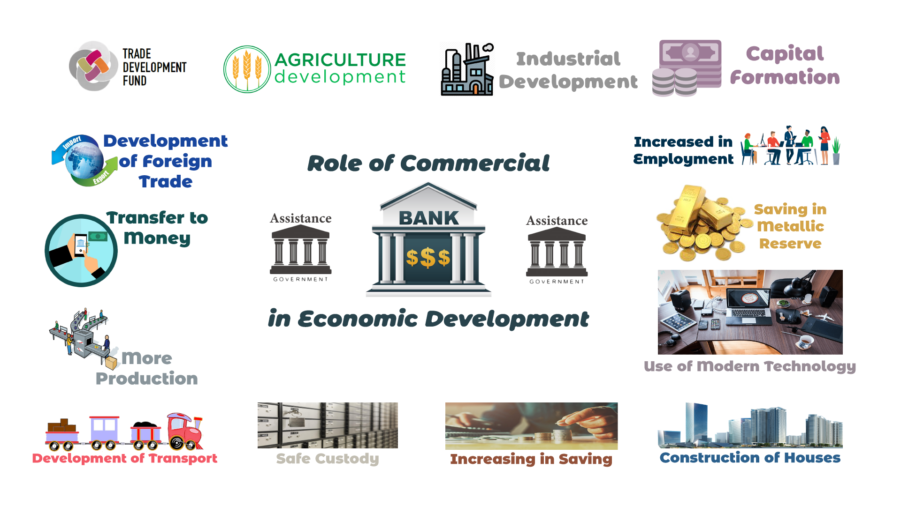

## Table of Contents

## What is a commercial bank?

A commercial bank is a type of bank that provides services to businesses and individuals. These services include accepting deposits, offering loans, and providing basic investment products. People and companies use commercial banks to manage their money, save for the future, and borrow money when they need it.

Commercial banks make money by charging interest on loans and fees for other services. They use the money from deposits to give out loans, which helps the economy grow. When people and businesses borrow money, they can invest in new projects, buy homes, or start new companies. This helps create jobs and improve living standards.

In summary, commercial banks are important because they help people and businesses manage their finances and support economic growth. They are different from other types of banks, like investment banks, which focus more on trading and helping companies raise money through stocks and bonds.

## How do commercial banks differ from other types of banks?

Commercial banks are different from other types of banks because they focus on everyday banking services for people and businesses. They take in money from deposits, give out loans, and offer basic investment options. People use them to save money, pay bills, and borrow for things like homes or cars. Businesses use them for similar reasons, but also to manage their daily money needs.

Investment banks, on the other hand, are more about helping big companies and governments with financial deals. They help these clients raise money by selling stocks and bonds, and they also give advice on big business decisions like mergers and acquisitions. Investment banks don't usually take in deposits from the public like commercial banks do.

There are also central banks, which are different from both commercial and investment banks. Central banks, like the Federal Reserve in the U.S., control a country's money supply and set interest rates. They don't deal directly with the public but work to keep the economy stable. They can lend money to commercial banks in emergencies, but their main job is to manage the overall economy, not to serve individual customers.

## What are the primary functions of commercial banks?

Commercial banks have several main jobs. One big job is to take in money from people and businesses as deposits. This money can be in checking or savings accounts. People trust the bank to keep their money safe and let them take it out when they need it. The bank uses this money to give out loans to others who need it. This helps people buy homes, cars, or start businesses. The bank makes money by charging interest on these loans.

Another important job of commercial banks is to help people and businesses manage their money. They offer services like paying bills, transferring money, and using ATMs. They also provide credit cards and other ways to borrow money. This makes it easier for people to handle their daily money needs. By doing all these things, commercial banks play a big role in helping the economy grow and keeping it running smoothly.

## How do commercial banks contribute to economic growth?

Commercial banks help the economy grow by taking in money from people and businesses and then lending it out. When people save their money in a bank, the bank uses that money to give loans to others. These loans help people buy homes, start businesses, or pay for school. When businesses get loans, they can grow bigger, hire more people, and make more things. This creates jobs and helps the economy get stronger.

Another way commercial banks help the economy is by making it easier for people to spend and invest their money. Banks offer services like credit cards, online banking, and ATMs, which make it simple for people to buy things and move their money around. When people feel confident about their money, they are more likely to spend and invest, which keeps the economy moving. By doing all these things, commercial banks play a big part in making the economy grow and stay healthy.

## What role do commercial banks play in the money supply?

Commercial banks help control the money supply in the economy. When people put their money into the bank, it becomes part of the bank's reserves. The bank doesn't keep all this money locked away; instead, it lends out most of it to other people and businesses. This lending creates new money in the economy because people can now spend the money they borrowed. So, when banks lend more, the money supply grows.

But banks also have to follow rules set by the central bank about how much money they can lend. The central bank can change these rules to make sure the economy stays balanced. For example, if the economy is growing too fast, the central bank might tell commercial banks to lend less money. This slows down the growth of the money supply and helps keep inflation under control. By working together, commercial banks and the central bank help manage the amount of money in the economy.

## How do commercial banks facilitate investment and savings?

Commercial banks help people save their money by offering savings accounts. When someone puts money into a savings account, the bank keeps it safe and often pays them a little bit of interest. This encourages people to save more because they know their money will grow over time. Banks also make it easy to save by letting people set up automatic transfers from their checking account to their savings account. This way, people can save without even thinking about it.

Commercial banks also help people invest their money. They offer different investment options like certificates of deposit (CDs) and money market accounts. These options usually pay more interest than regular savings accounts, so people can earn more on their money. Banks also work with investment companies to help people buy stocks, bonds, and mutual funds. By providing these services, banks make it easier for people to grow their money over time, which helps the economy grow too.

## What is the impact of commercial banks on small businesses and entrepreneurs?

Commercial banks help small businesses and entrepreneurs a lot. They give loans to these businesses so they can start up or grow. This money can be used to buy things they need, like equipment or supplies, or to hire more people. When small businesses get loans, they can do more and make more money. This is really important because starting a business can be hard, and having a bank that believes in them makes a big difference.

Banks also help small businesses by letting them open accounts to manage their money. They can use these accounts to pay bills, get paid by customers, and keep track of their money. Banks also offer credit cards and other ways to borrow money quickly, which can be a big help when a business needs money right away. By doing all these things, commercial banks help small businesses and entrepreneurs succeed and grow, which is good for the whole economy.

## How do commercial banks manage risk and ensure financial stability?

Commercial banks manage risk by being careful about who they lend money to. They check a person's or business's credit history to see if they are likely to pay back the loan. Banks also set aside some money, called reserves, to cover any loans that might not get paid back. This helps them stay safe even if some people can't pay. Banks also spread out their risk by lending to different types of people and businesses. This way, if one type of loan goes bad, the bank won't lose too much money.

To ensure financial stability, commercial banks follow rules set by the government and central banks. These rules say how much money banks need to keep in reserve and how much they can lend out. Banks also have to report their financial health regularly so that regulators can make sure they are doing well. By following these rules, banks help keep the economy stable. They also work together with other banks and the central bank to share information and support each other, which helps prevent big problems from happening.

## What are the regulatory frameworks governing commercial banks and their economic roles?

Commercial banks are watched over by rules made by governments and central banks to make sure they work well and safely. These rules help banks stay strong and keep the economy running smoothly. In the United States, the main rule-makers are the Federal Reserve, the Office of the Comptroller of the Currency (OCC), and the Federal Deposit Insurance Corporation (FDIC). They set rules about how much money banks need to keep in reserve, how much they can lend, and how they should treat their customers. These rules help stop banks from taking too many risks that could hurt them and the economy.

The Basel Accords are important rules that many countries follow. These rules were made by the Basel Committee on Banking Supervision to help banks around the world stay safe. They tell banks how much money they need to have to cover risks, like loans that might not get paid back. By following these rules, banks can be more stable and less likely to cause big problems in the economy. These rules also help make sure that banks are treating their customers fairly and helping the economy grow in a healthy way.

## How do commercial banks influence monetary policy?

Commercial banks help shape monetary policy by working with the central bank. The central bank, like the Federal Reserve in the U.S., sets rules about how much money banks need to keep in reserve. When the central bank changes these rules, it can affect how much money commercial banks can lend out. If the central bank wants more money in the economy, it might lower the reserve requirement, letting banks lend more. If it wants less money in the economy, it might raise the reserve requirement, making banks lend less. This way, commercial banks help the central bank control the money supply and keep the economy stable.

Commercial banks also influence monetary policy through the interest rates they charge on loans. When the central bank changes its key interest rate, commercial banks usually follow by changing their own rates. If the central bank lowers its rate, commercial banks might lower their loan rates, making it cheaper for people and businesses to borrow money. This can encourage more spending and investment, helping the economy grow. On the other hand, if the central bank raises its rate, commercial banks might raise their rates too, making borrowing more expensive and slowing down the economy. By adjusting their rates, commercial banks play a big role in how well the central bank's monetary policy works.

## What are the challenges faced by commercial banks in modern economies?

Commercial banks in modern economies face many challenges. One big challenge is dealing with new technology. Banks have to keep up with things like online banking, mobile apps, and digital payments. If they don't, people might go to other banks or use new financial companies that are quicker and easier to use. Also, keeping customer information safe from hackers is very important. Banks have to spend a lot of money on security to make sure their customers' money and information are safe.

Another challenge is dealing with changes in the economy. When the economy goes up and down, banks have to be careful about who they lend money to. If they lend too much during good times, they might have problems if the economy gets worse. Banks also have to follow lots of rules from the government and central banks. These rules can change, and banks have to make sure they are always following them. This can be hard and costly, but it helps keep the banks and the economy safe.

Lastly, commercial banks have to compete with other types of financial companies. These companies might offer new ways to borrow or invest money, and they can sometimes do it cheaper or faster than banks. Banks need to find ways to keep their customers happy and loyal, even when there are so many other choices out there. By meeting these challenges, banks can stay strong and help the economy grow.

## How has the role of commercial banks evolved with technological advancements and globalization?

The role of commercial banks has changed a lot because of new technology and globalization. Before, people had to go to a bank branch to do their banking. Now, with things like online banking and mobile apps, people can do almost everything from their phones or computers. This makes banking easier and faster. Banks also use technology to make better decisions about who to lend money to. They can look at a lot of data to see if someone is likely to pay back a loan. Because of globalization, banks now work in many different countries. They help businesses move money around the world and offer services in different languages and currencies.

Another big change is how banks use technology to keep their customers' money and information safe. They have to protect against hackers who might try to steal money or data. This means banks have to spend a lot of money on security. Globalization also means that banks have to follow rules from different countries, which can be hard. But it also gives banks the chance to help more people and businesses around the world. By using technology and working globally, commercial banks can offer more services and help the economy grow in new ways.

## References & Further Reading

[1]: ["The Glass-Steagall Act: A Legal and Policy Analysis"](https://crsreports.congress.gov/product/pdf/R/R44349) authored by Kenneth H. George

[2]: Hull, John C. (2014). ["Options, Futures, and Other Derivatives"](https://www.amazon.com/Options-Futures-Other-Derivatives-9th/dp/0133456315) — Provides insights into financial instruments and the impact of trading technologies in financial markets.

[3]: Hendershott, Terrence, Jones, Charles M., & Menkveld, Albert J. (2011). ["Does Algorithmic Trading Improve Liquidity?"](https://onlinelibrary.wiley.com/doi/full/10.1111/j.1540-6261.2010.01624.x) The Review of Financial Studies, 24(1), 146–185.

[4]: ["High-Frequency Trading and the New Market Makers"](https://www.sciencedirect.com/science/article/pii/S1386418113000281) by Sarah A. Johnson — This article by the CFA Institute explores the role of high-frequency trading in modern markets.

[5]: Narang, Rishi K. (2013). ["Inside the Black Box: The Simple Truth About Quantitative Trading"](https://www.amazon.com/Inside-Black-Box-Quantitative-Trading/dp/0470432063) — Offers a detailed look at the mechanics behind algorithmic trading systems.