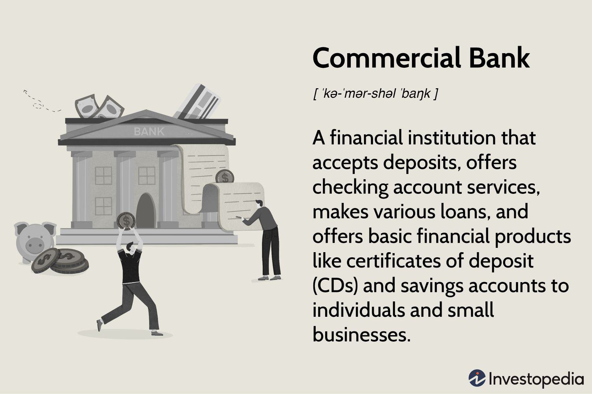

Commercial banks are integral components of the economic system, pivotal in facilitating financial operations and driving economic growth. By offering essential services such as accepting deposits, providing loans, and offering investment products, these banks enable the effective circulation of money within the economy. This dynamic fosters trade, supports businesses, and aids individuals in achieving financial goals.

In recent years, a significant transformation in the banking landscape has been precipitated by the advent of algorithmic trading, also known as algo trading. This technological innovation utilizes computer algorithms to execute trading strategies at speeds and efficiencies far surpassing human capability. By enabling high-frequency trading, algorithmic trading enhances market efficiency, including increased liquidity and tighter bid-ask spreads, thereby altering traditional financial market dynamics.

This article investigates the substantial role commercial banks hold in the economy and their ongoing adaptation to technological trends. Analyzing the ways in which banks maintain financial stability and the growing impact of automation on trading, we will highlight the dual aspects of traditional banking operations and modern technological advancements.

Moreover, as commercial banks integrate algorithmic trading into their operations, implications arise for both individuals and businesses. While the promise of efficiency and competitive financial products grows, considerations around market access and equity for consumers emerge as critical topics. The fusion of banking with cutting-edge technology represents a frontier of economic opportunity and regulatory challenge that must be navigated for sustainable progress.

## Table of Contents

## Understanding Commercial Banks

Commercial banks are pivotal financial institutions that serve a multitude of functions crucial to the economy. Primarily, they accept deposits from individuals and businesses, ensuring these funds are safe and readily available when needed. By providing loans, commercial banks facilitate investment and consumption, oiling the wheels of economic activity. Their portfolio often extends to offering various investment products tailored to meet the financial goals of their clients.

Regulation is a cornerstone of commercial banking, ensuring these institutions uphold the integrity and smooth functioning of the financial system. Governments and regulatory bodies oversee banks to maintain confidence in the financial system, protect depositors, and prevent systemic risk. Regulatory frameworks often demand that banks meet specific capital requirements, conduct risk assessments, and adhere to ethical banking practices.

A critical role of commercial banks is maintaining [liquidity](/wiki/liquidity-risk-premium) in the economy. They achieve this by transforming short-term liabilities, such as deposits, into long-term assets, like loans. This process is commonly referred to as maturity transformation and is vital for supporting economic activities. By mobilizing savings from depositors, banks can extend credit to borrowers, thus enabling investment in businesses, housing, and consumer goods.

Historically, legislation such as the Glass-Steagall Act was introduced in the United States to prevent commercial banks from engaging in investment banking activities, leading to a clear division between these banking functions. However, the financial landscape has evolved, and many modern banks now integrate both commercial and investment banking services. After the repeal of portions of the Glass-Steagall Act in 1999, banks started to adopt a more universal banking model, offering a suite of financial services under one roof.

Prominent examples of such institutions include JPMorgan Chase, which exemplifies the convergence of traditional commercial banking functions with investment banking activities. This evolution reflects the dynamic nature of the banking sector, as these institutions continuously adapt to meet the diverse and sophisticated needs of their clients. Through mergers, acquisitions, and strategic expansions, large banks have become one-stop financial service providers, broadening their roles and contributions to the global economy.

## The Role of Commercial Banks in the Economy

Commercial banks are fundamental to economic development by serving as principal suppliers of credit to businesses and individuals. They help in channeling savings into investments, thereby facilitating capital formation and growth. A key function of commercial banks is to manage deposits and provide loans, which ensures the continuous circulation of money in the economy, fostering trade and consumption. This role is essential in promoting entrepreneurial ventures and stimulating economic activities, which collectively contribute to national and global economic advancement.

The financial ecosystem relies significantly on the ability of commercial banks to allocate financial resources efficiently. By granting loans and credit, they dictate the terms of capital availability, impacting interest rates, and thus the overall cost of borrowing. This ability to influence the availability and cost of capital underscores their strategic importance in economic planning and development.

Moreover, commercial banks provide stability to the financial system through mechanisms designed to protect depositors. In the United States, the Federal Deposit Insurance Corporation (FDIC) insurance is a pivotal example of such a mechanism. It guarantees depositor funds up to a certain limit, reducing the risk of bank runs and maintaining public confidence in the financial system. This security measure, along with prudent regulatory oversight, works to uphold the integrity and stability of banking operations.

Conversely, the failure of commercial banks can have catastrophic repercussions across the economic landscape. Historical financial crises have shown that bank insolvency can trigger systemic shocks, leading to widespread economic disruption and loss of public confidence in the financial system. For instance, the collapse of Lehman Brothers in 2008 acted as a catalyst for the global financial crisis, illustrating the profound impact of bank failures on global economic stability.

This intricate network of banking activities emphasizes the indispensable role of commercial banks in everyday financial operations. By balancing liquidity needs with risk management, they not only drive economic prosperity but also contribute to the resilience and sustainability of the financial systems they serve.

## The Rise of Algorithmic Trading

Algorithmic trading, also known as algo trading, utilizes sophisticated mathematical models and advanced algorithms to make trading decisions in financial markets. These algorithms execute trades at a speed and efficiency that far surpass human capabilities. One of the primary characteristics of [algorithmic trading](/wiki/algorithmic-trading) is its capacity to process and analyze vast amounts of data almost instantaneously, enabling traders to capitalize on market movements and execute trades in real-time. This method is particularly advantageous in high-frequency trading ([HFT](/wiki/high-frequency-trading-strategies)), where speed is critical, as it allows for rapid buying and selling of securities, thereby providing liquidity and tightening spreads.

High-frequency trading, a subset of algorithmic trading, is instrumental in maintaining liquidity within the markets. By generating large volumes of trades, HFT reduces the difference between the bid and ask prices, known as the spread, making markets more efficient. This efficiency can benefit investors by providing better price execution.

However, the rise of algorithmic trading also presents significant challenges. One of the primary concerns is the potential for increased market [volatility](/wiki/volatility-trading-strategies). Algorithms can react to market events much faster than humans, and in instances of market stress, this can lead to rapid and sometimes extreme price movements. For example, the 2010 "Flash Crash" saw the Dow Jones Industrial Average plunge nearly 1,000 points in a matter of minutes, with algorithmic trading being partly blamed for the incident.

To mitigate these risks, there is a growing need for robust regulatory frameworks. Regulators are tasked with ensuring that trading algorithms are designed and tested to prevent disruptive trading behavior. This includes implementing circuit breakers and other safeguards to stabilize markets during periods of excessive volatility.

Commercial banks are increasingly integrating algorithmic trading into their operations to gain a competitive edge. By leveraging algorithmic strategies, banks can enhance their investment portfolio management and align their trading activities with overall strategic goals. The use of algorithms enables banks to manage large positions more efficiently and reduce the impact of market timing errors.

Another advantage of implementing automated trading systems is improved risk management. Algorithms can be programmed to follow predefined strategies and controls, allowing for consistent execution without human intervention. This reduces the emotional [factor](/wiki/factor-investing) in trading decisions and ensures adherence to risk limits and other trading policies.

In conclusion, while algorithmic trading brings numerous benefits, its implementation requires careful management to address associated risks. It is essential for both financial institutions and regulators to continue developing and enforcing frameworks that promote market integrity and financial stability.

## Implications for the Banking Sector

The incorporation of algorithmic trading (algo trading) within commercial banks is fundamentally transforming their operational strategies and interactions within financial markets. As technology evolves, banks are allocating significant resources to develop and enhance the infrastructure necessary to support automated trading systems. This shift not only enhances efficiency but also places commercial banks on a competitive edge by allowing them to execute high-frequency trades with greater precision and speed than traditional methods.

With the integration of algorithmic trading, commercial banks face the challenge of innovating beyond conventional banking practices. This technological transformation necessitates a reevaluation and redesign of business models to accommodate advanced trading capabilities. Banks are required to invest in sophisticated software and hardware that support complex algorithms and high data processing speeds. The use of predictive analytics and [machine learning](/wiki/machine-learning) in trading processes further highlights the demand for skilled personnel capable of managing these systems.

However, these advancements also pose significant regulatory challenges. Authorities must ensure that the proliferation of automated trading does not compromise market stability or integrity. Incidents such as the "Flash Crash" of 2010, where rapid and significant drops in financial markets were triggered, exemplify the potential risks posed by algo trading. Consequently, regulators are intensifying their efforts to create robust frameworks that can adequately oversee these advanced trading practices, ensuring that they do not lead to systemic risks or unfair market conditions.

For consumers, the integration of algo trading adds a layer of complexity to market accessibility and equity. While these technological advancements often result in more competitive banking products and services, they can inadvertently create barriers for smaller investors or traditional banking clients who may not have the technological means or expertise to engage with sophisticated systems. This raises important questions about market democratization and the potential for increased inequality within the financial landscape.

In conclusion, while the integration of algorithmic trading within commercial banks presents numerous opportunities for enhancing market efficiency and competitiveness, it also requires careful management and regulatory consideration to ensure equity and stability in the financial sector.

## Conclusion

Commercial banks remain integral to the economic structure due to their ability to adapt to technological innovations such as algorithmic trading. This adaptability ensures their continued relevance in facilitating economic activities. Algorithmic trading, characterized by its use of computer algorithms to execute trades at speeds beyond human capability, presents both significant opportunities and challenges for these institutions. It enhances efficiency, liquidity, and accuracy in financial markets but also necessitates stringent management and robust regulatory oversight to mitigate potential risks, such as increased market volatility and the potential for systemic failures.

The trajectory of banking will likely be shaped by the interplay between technological integration, strategic innovation, and the ceaseless pursuit of efficiency. As commercial banks harness advanced technologies, they must continue to innovate their operational strategies to maintain and enhance their competitive edge. This evolution necessitates not only investment in cutting-edge technological infrastructure but also the development of new business models that accommodate these technological shifts.

For stakeholders, including regulators, investors, and customers, comprehending the dynamics between traditional commercial banking operations and the advancements brought about by algorithmic trading is essential. This understanding can facilitate informed decision-making and strategic planning. The evolution of algo trading within the banking sector offers a prospect for more competitive products and services but also raises concerns about market accessibility and fairness, emphasizing the need for balanced innovation and regulation.

In conclusion, by effectively balancing innovation with regulation, commercial banks can continue to uphold their critical role as stewards of economic stability and growth. As they navigate the challenges and harness the opportunities presented by algorithmic trading, these institutions have the potential to enhance their contribution to the global economy, ensuring they remain pivotal economic entities.

## References & Further Reading

[1]: ["The Glass-Steagall Act: A Legal and Policy Analysis"](https://crsreports.congress.gov/product/pdf/R/R44349) authored by Kenneth H. George

[2]: Hull, John C. (2014). ["Options, Futures, and Other Derivatives"](https://www.amazon.com/Options-Futures-Other-Derivatives-9th/dp/0133456315) — Provides insights into financial instruments and the impact of trading technologies in financial markets.

[3]: Hendershott, Terrence, Jones, Charles M., & Menkveld, Albert J. (2011). ["Does Algorithmic Trading Improve Liquidity?"](https://onlinelibrary.wiley.com/doi/full/10.1111/j.1540-6261.2010.01624.x) The Review of Financial Studies, 24(1), 146–185.

[4]: ["High-Frequency Trading and the New Market Makers"](https://www.sciencedirect.com/science/article/pii/S1386418113000281) by Sarah A. Johnson — This article by the CFA Institute explores the role of high-frequency trading in modern markets.

[5]: Narang, Rishi K. (2013). ["Inside the Black Box: The Simple Truth About Quantitative Trading"](https://www.amazon.com/Inside-Black-Box-Quantitative-Trading/dp/0470432063) — Offers a detailed look at the mechanics behind algorithmic trading systems.