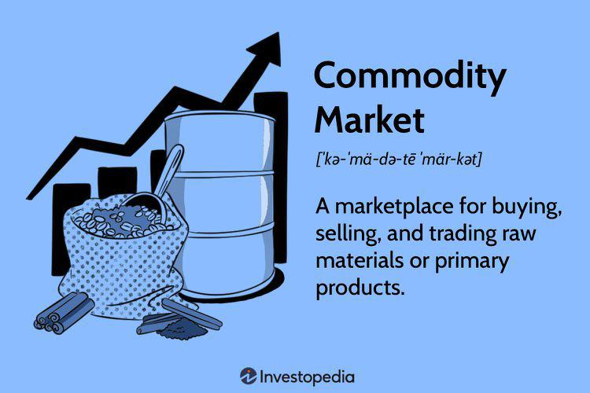

## Table of Contents

## What are commodities and how do they influence market movements?

Commodities are basic goods that are used in everyday life, like oil, gold, wheat, and coffee. They are traded on special markets called commodity exchanges. These goods are important because they are used to make other products or are consumed directly. For example, oil is used to make gasoline, and wheat is used to make bread. Because commodities are so essential, their prices can affect many parts of the economy.

When the prices of commodities go up or down, it can cause big changes in the market. For example, if the price of oil goes up, it can make the cost of shipping goods higher, which can lead to higher prices for many products. This can slow down the economy because people have less money to spend on other things. On the other hand, if the price of a commodity like gold goes up, it can make investors feel more confident, which can help the stock market. So, commodities can have a big impact on how the market moves and how the economy performs.

## How do commodity prices affect inflation and economic growth?

Commodity prices can affect inflation a lot. When the prices of things like oil, food, and metals go up, it can make the cost of living higher. This is because these things are used to make lots of other products. For example, if oil prices go up, it can make the cost of gasoline and shipping go up, which can make the prices of many things we buy every day go up too. This is called inflation. When inflation is high, people might have less money to spend on other things, which can slow down the economy.

Commodity prices can also affect how fast the economy grows. If the prices of important commodities like oil and steel go down, it can make it cheaper for businesses to make things. This can help the economy grow because businesses can make more stuff and sell it for less money, which can make more people want to buy things. But if commodity prices go up a lot, it can make it harder for businesses to make things, and it can slow down economic growth. So, keeping an eye on commodity prices can help us understand what might happen to inflation and the economy.

## What is the role of commodities in portfolio diversification?

Commodities can help make your investment portfolio more diverse. When you have different types of investments, like stocks, bonds, and commodities, it can help spread out the risk. This means if one type of investment goes down in value, the others might not go down as much, or they might even go up. Commodities often move differently than stocks and bonds, so adding them to your portfolio can help balance things out.

For example, when the stock market is not doing well, commodities like gold might go up in value. This can help protect your money when other parts of your portfolio are losing value. By including commodities, you can have a smoother ride in your investments over time. It's like having a safety net that can help you feel more secure about your money.

## How do geopolitical events impact commodity markets?

Geopolitical events can shake up commodity markets a lot. When there's trouble between countries, like wars or trade disagreements, it can mess with how much of a commodity is available and how much it costs. For example, if there's a war in a country that makes a lot of oil, it might be harder to get that oil, which can make the price go up. Or if two countries can't agree on trade, they might put up barriers that make it harder to move commodities around, which can also change prices.

These changes in commodity prices can have a big ripple effect. When the price of something important like oil goes up because of geopolitical events, it can make everything else more expensive too. This can lead to higher inflation and can even slow down the economy. So, keeping an eye on what's happening around the world is important for understanding what might happen to commodity prices and the economy.

## What are the differences between hard and soft commodities in market dynamics?

Hard commodities and soft commodities are different in how they act in the market. Hard commodities are things that come from the ground, like gold, oil, and copper. They are often used in making things like buildings, cars, and electronics. Because they are so important for making stuff, the prices of hard commodities can be pretty steady over time. But they can also change a lot if there are big changes in how much people want them or if there are problems with getting them out of the ground.

Soft commodities are different because they come from living things, like plants and animals. They include things like wheat, coffee, and livestock. The prices of soft commodities can change a lot because they depend on things like the weather and how much people want to eat or drink them. For example, if there's a bad drought, it can hurt crops and make the prices of things like corn go up. So, soft commodities can be a bit more unpredictable than hard commodities.

## How can investors use commodity futures to hedge against market volatility?

Investors can use commodity futures to protect their money from big ups and downs in the market. A commodity future is like a promise to buy or sell a commodity at a certain price in the future. If an investor thinks the price of a commodity like oil might go down, they can buy a future that lets them sell oil at today's price later on. This way, even if the price of oil drops, they can still sell it at the higher price they locked in with the future. It's like having insurance against falling prices.

On the other hand, if an investor thinks the price of a commodity might go up, they can use futures to buy it at today's price for later. For example, if they think the price of wheat will go up because of a bad harvest, they can buy a future to get wheat at today's lower price. This can help them save money if the price does go up. By using commodity futures, investors can make their investments more stable and protect themselves from sudden changes in the market.

## What role do commodities play in the supply and demand balance of global markets?

Commodities are really important for keeping the balance between what people want and what's available in the world. They are things like oil, wheat, and gold that everyone uses. When there's a lot of a commodity and not many people want it, the price goes down. But if a lot of people want it and there's not enough to go around, the price goes up. This balance between how much there is and how much people want is always changing. Things like weather, wars, and new technology can change how much of a commodity we have or how much people want it.

For example, if there's a drought in a place that grows a lot of wheat, there will be less wheat to go around. This can make the price of wheat go up because there's not enough to meet everyone's needs. On the other hand, if a new way to find oil makes it easier to get, there might be more oil available, which can make the price go down. These changes in supply and demand can affect not just the price of the commodity, but also the prices of other things that use that commodity. So, keeping an eye on what's happening with commodities can help us understand what might happen to the economy and prices around the world.

## How do technological advancements affect commodity production and market trends?

Technological advancements can change how we make commodities and how much they cost. New technology can make it easier to find and get commodities like oil and minerals from the ground. For example, better drilling machines can reach oil in places that were hard to get to before. This can make more oil available, which might make the price go down. Also, new farming technology can help farmers grow more food with less work. This can mean more wheat or corn, which can also make prices go down. So, technology can help make more of a commodity, which can change how much it costs.

These changes in how we make commodities can also affect what people want and how the market works. When new technology makes a commodity cheaper, more people might want to buy it. For example, if new technology makes solar panels cheaper, more people might want to use solar power instead of oil or gas. This can change how much people want those commodities, which can affect their prices. Also, technology can help us find new ways to use commodities, like turning corn into biofuel. This can make people want more corn, which can make its price go up. So, technology can shake up the market by changing both how much we have and how much people want of a commodity.

## What are the key indicators to watch for predicting commodity price movements?

To predict how commodity prices might change, it's important to keep an eye on a few key things. First, watch the supply and demand balance. If there's a lot of a commodity and not many people want it, the price will likely go down. But if there's not enough of it and a lot of people want it, the price will go up. Things like weather, wars, and strikes can change how much of a commodity is available. Also, pay attention to how strong the economy is. When the economy is doing well, people might want more commodities, which can push prices up.

Another important thing to watch is what's happening in the world. Geopolitical events, like wars or trade disagreements between countries, can mess with how much of a commodity is available and how much it costs. For example, if there's a problem in a country that makes a lot of oil, it might be harder to get that oil, which can make the price go up. Also, keep an eye on what investors are doing. If a lot of investors are buying or selling commodities, it can change the price. So, watching these things can help you guess where commodity prices might be headed.

## How do commodity markets interact with currency markets?

Commodity markets and currency markets are closely linked. When the price of a commodity like oil or gold goes up, it can make the currency of the country that makes a lot of that commodity stronger. For example, if oil prices go up, countries like Saudi Arabia, which make a lot of oil, might see their currency get stronger. This happens because other countries need to buy more of that currency to pay for the oil, which makes the currency more valuable. On the other hand, if the price of a commodity goes down, it can make the currency of the country that makes it weaker.

Currency markets can also affect commodity prices. If a country's currency gets stronger, it can make commodities that are priced in that currency more expensive for people in other countries. For example, if the U.S. dollar gets stronger, oil, which is often priced in dollars, can become more expensive for people who don't use dollars. This can make them want to buy less oil, which can push the price down. So, the strength of a currency can change how much people want to buy a commodity, which can affect its price.

## What strategies can traders use to capitalize on commodity market cycles?

Traders can use different strategies to make money from the ups and downs of commodity markets. One way is to watch the cycles closely and buy commodities when prices are low and sell them when prices go up. This means keeping an eye on things like supply and demand, the economy, and what's happening around the world. For example, if a trader sees that oil prices are low because there's a lot of oil available, they might buy oil and wait for the price to go up when the supply gets smaller. They can then sell the oil at a higher price and make a profit.

Another strategy is using commodity futures to bet on where prices might go. Traders can buy futures contracts to lock in prices for buying or selling commodities in the future. If a trader thinks the price of wheat will go up because of a bad harvest, they can buy a futures contract to buy wheat at today's lower price. If the price does go up, they can sell the wheat at the higher price and make money. This can help traders take advantage of the ups and downs in commodity prices without having to actually buy and store the commodities themselves.

## How do environmental policies and sustainability concerns influence commodity markets?

Environmental policies and worries about keeping the planet healthy can change what happens in commodity markets. When countries make rules to cut down on pollution or protect nature, it can change how much of certain commodities we can use or make. For example, if a country makes a rule that cars have to use less gas, it can make people want less oil. This can make the price of oil go down. Also, if a country says farmers can't use certain chemicals, it might be harder to grow crops like wheat or corn. This can make the price of those crops go up because there's less to go around.

Sustainability concerns can also make people want different kinds of commodities. More and more people want things that are good for the environment, like electric cars instead of gas ones. This can make the price of oil go down and the price of metals like lithium, which is used in batteries, go up. Also, if people start caring more about where their food comes from, they might want to buy food that's grown in ways that don't hurt the planet. This can make the price of organic or sustainably grown food go up. So, when we think about the environment and try to take care of it, it can change what we want and how much we're willing to pay for different commodities.

## References & Further Reading

[1]: Bergstra, J., Bardenet, R., Bengio, Y., & Kégl, B. (2011). ["Algorithms for Hyper-Parameter Optimization."](https://dl.acm.org/doi/10.5555/2986459.2986743) Advances in Neural Information Processing Systems 24. 

[2]: ["Advances in Financial Machine Learning"](https://www.amazon.com/Advances-Financial-Machine-Learning-Marcos/dp/1119482089) by Marcos Lopez de Prado 

[3]: ["Evidence-Based Technical Analysis: Applying the Scientific Method and Statistical Inference to Trading Signals"](https://www.amazon.com/Evidence-Based-Technical-Analysis-Scientific-Statistical/dp/0470008741) by David Aronson 

[4]: ["Machine Learning for Algorithmic Trading"](https://github.com/stefan-jansen/machine-learning-for-trading) by Stefan Jansen 

[5]: ["Quantitative Trading: How to Build Your Own Algorithmic Trading Business"](https://www.amazon.com/Quantitative-Trading-Build-Algorithmic-Business/dp/1119800064) by Ernest P. Chan 

[6]: Focardi, S. M., & Fabozzi, F. J. (2004). ["The Mathematics of Financial Modeling and Investment Management."](https://archive.org/details/mathematicsoffin0000foca) Wiley 

[7]: Aldridge, I. (2013). ["High-Frequency Trading: A Practical Guide to Algorithmic Strategies and Trading Systems."](https://www.amazon.com/High-Frequency-Trading-Practical-Algorithmic-Strategies/dp/1118343506) Wiley

[8]: Geman, H. (2005). ["Commodities and Commodity Derivatives: Modeling and Pricing for Agriculturals, Metals and Energy."](https://download.e-bookshelf.de/download/0000/5675/90/L-G-0000567590-0015270354.pdf) Wiley