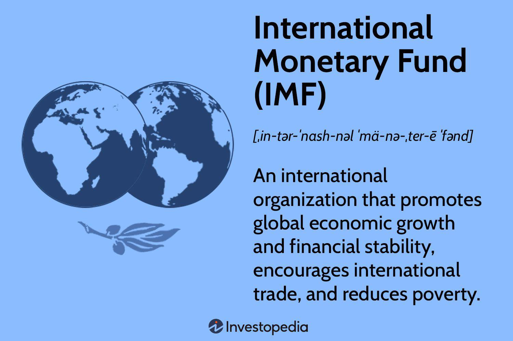

The International Monetary Fund (IMF) is a pivotal institution in the global financial system, fostering monetary cooperation and ensuring economic stability across nations. Established in 1944, its primary mission is to maintain international economic stability by overseeing exchange rates and offering financial assistance to countries in need. The IMF's influence extends into areas such as exchange rate consistency, balance of payments adjustments, and fiscal policy guidance, thereby affecting global financial market conditions profoundly. As economies became more interconnected, the IMF's role evolved to address complex financial challenges, positioning itself as a cornerstone of global economic governance.

Concurrently, the advent of algorithmic trading has significantly reshaped financial markets. Algorithmic trading involves executing trades based on pre-programmed financial strategies, employing advanced mathematical models and computational power. This method has become increasingly dominant in financial trading due to its ability to process high-frequency trading (HFT) efficiently. Its rise is attributed to technological advancements that allow rapid data analysis and decision-making, which enhances market liquidity and price efficiency. However, the automation of trading also introduces systemic risks, including increased volatility and potential market anomalies.



This article examines the intersection of IMF policies and algorithmic trading, exploring how these influential forces interact and potentially influence global economic dynamics. By analyzing the symbiotic relationship between macroeconomic policy interventions by the IMF and the microeconomic actions driven by algorithmic trading systems, we aim to shed light on their combined impact. Understanding these interactions is essential for grasping the broader economic outcomes that shape international finance.

The discussion will provide insights into the mutual influences between IMF strategies and algorithmic trading methodologies. It will highlight how IMF interventions, particularly in currency and financial stability, impact the strategies adopted by algorithmic traders, who constantly adjust to new economic data and forecasts. Conversely, the widespread use of algorithmic trading poses challenges for policymakers, necessitating enhanced oversight and regulatory measures to ensure stability without stifling innovation.

In summary, the article seeks to map out the roles that both the IMF and algorithmic trading play in determining global economic trajectories. By understanding their interplay, we aim to provide a comprehensive view of these entities' contributions to shaping economic outcomes worldwide.

## Table of Contents

## Understanding the IMF and Its Role

The International Monetary Fund (IMF) was established in 1944 with the primary aim of promoting international monetary cooperation and ensuring economic stability across its member countries. The organization plays a critical role in stabilizing the global economy through its multifaceted functions, which include surveillance, financial assistance, and capacity development.

Surveillance is one of the IMF's core functions, enabling it to oversee the economic and financial policies of its member countries. By engaging in regular monitoring and assessment, the IMF works to identify and mitigate potential risks to global economic stability. This surveillance process involves analyzing key economic indicators such as GDP growth, inflation rates, and fiscal policies, thereby allowing the IMF to provide necessary policy advice. For example, when a country faces potential economic turmoil, the IMF may recommend adjustments in fiscal or monetary policies to stabilize the nation's economy.

The IMF also provides essential financial assistance to member countries grappling with balance of payments problems. This assistance is often delivered through programs that offer financial aid in exchange for the implementation of economic reforms designed to restore growth and stability. These programs, tailored to the specific needs of each country, can include structural adjustments to improve economic efficiency or fiscal consolidation measures to manage public debt. The IMF's financial assistance serves as a critical lifeline for countries in distress, enabling them to stabilize their economies while implementing necessary reforms.

Capacity development is another crucial aspect of the IMF's operations. Through technical assistance and training, the IMF seeks to develop the economic institutions and expertise of its member countries. By enhancing the capacity of national institutions in areas such as tax policy, public financial management, and monetary policy, the IMF fosters sustainable economic growth and stability. This capacity-building endeavor helps nations strengthen their economic frameworks, ultimately facilitating resilient and self-reliant economies.

Despite its influential role, the IMF has faced criticisms regarding its policy impacts and governance structure. Some critics argue that IMF policies, particularly those accompanying financial assistance programs, can lead to adverse social and economic consequences. For instance, the conditionality attached to financial aid often requires austerity measures that can result in reduced public spending on essential services, leading to increased poverty and social unrest. Moreover, the governance structure of the IMF has been scrutinized for its perceived bias towards the interests of wealthier nations, as voting power is largely determined by financial contribution, granting more influence to richer countries over decision-making processes.

In summary, the IMF is a pivotal institution in the pursuit of international monetary cooperation and financial stability. Through its roles in surveillance, financial assistance, and capacity development, the IMF influences key aspects of the global economy, including exchange rate stability, international trade, and economic growth. However, the organization continues to face challenges related to the implications of its policies and its governance structure, which remain subjects of ongoing debate and reform efforts.

## The Rise of Algorithmic Trading

Algorithmic trading automates the process of executing trades in financial markets by utilizing advanced computer algorithms to make decisions at a speed and frequency impossible for human traders. The rise of [algorithmic trading](/wiki/algorithmic-trading) has been significantly fueled by advances in technology, including improvements in computational power, network speeds, and the development of high-frequency trading platforms. These platforms enable traders to execute orders in fractions of a second, thus capitalizing on fleeting market conditions that are not perceptible to human traders.

The primary advantage of algorithmic trading is its ability to enhance market efficiency and [liquidity](/wiki/liquidity-risk-premium). By automating trades, these algorithms can analyze vast sets of data, identify patterns, and execute trades much faster than any human. This efficiency contributes to tighter bid-ask spreads and increased market liquidity, as the continuous presence of algorithmic traders helps balance buy and sell orders.

However, algorithmic trading is not without its risks. One significant concern is the potential for increased market [volatility](/wiki/volatility-trading-strategies). Algorithms can react instantaneously to market changes, and in times of market stress, this can exacerbate price fluctuations. For example, a rapid sell-off triggered by algorithms might lead to a chain reaction, further destabilizing the market and leading to extreme volatility, such as the "flash crash" events observed in recent years.

Moreover, algorithmic trading raises important issues around transparency, fairness, and accountability. The opacity of these algorithms means that market participants often have little insight into their decision-making processes. This lack of transparency can lead to unfair advantages, where those with advanced algorithms can dictate market dynamics, potentially leading to manipulative practices such as "quote stuffing" or "spoofing."

To address these concerns, regulators and market participants advocate for increased transparency and oversight. Implementing rigorous audit trails, ensuring algorithms adhere to ethical trading standards, and promoting fair market access are crucial steps toward mitigating the risks associated with algorithmic trading.

In sum, while algorithmic trading has brought about significant advances in trading efficiency and market liquidity, it simultaneously poses challenges related to market stability and fairness. Balancing these positives and negatives requires ongoing assessment and adaptation by both market regulators and participants to ensure the long-term health and stability of financial markets.

## Interactions Between IMF Policies and Algorithmic Trading

The intersection between International Monetary Fund (IMF) policies and algorithmic trading is instrumental in shaping global financial markets. The IMF’s influence on economic policies, currency markets, and financial stability inherently affects algorithmic trading strategies, which are increasingly prevalent in contemporary markets.

IMF interventions in financial markets, such as adjustments to monetary policy or exchange rate recommendations, serve as powerful signals that algorithmic trading systems may react to. For instance, when the IMF releases economic forecasts or undertakes currency interventions, algorithmic trading models may adjust their parameters to align with these new insights. These systems utilize complex algorithms to process large datasets rapidly and execute trades, potentially leading to significant trading [volume](/wiki/volume-trading-strategy) changes in response to IMF announcements.

Algorithmic trading strategies often rely on economic data and forecasts provided by institutions like the IMF to refine their predictions and risk assessments. For instance, algorithms may incorporate time-series analysis of historical data correlated with IMF policy changes to predict asset price movements. Additionally, [machine learning](/wiki/machine-learning) models might be trained on IMF economic forecasts to anticipate market trends and adjust trading positions accordingly.

Despite the benefits of algorithmic trading, such as increased market efficiency and liquidity, the IMF has raised concerns about the potential risks these systems pose, including heightened market volatility and systemic risks. To mitigate these risks, the IMF has recommended enhanced monitoring and greater transparency in algorithmic trading operations. This involves fostering an environment where market participants have access to critical information, enabling them to understand and anticipate the market impacts of automated trading systems.

The feedback loop created by currency market interventions presents another challenge. When the IMF intervenes in currency markets, it can lead to rapid shifts in exchange rates, to which algorithmic trading systems may react unpredictably. For example, an IMF decision to stabilize a currency could trigger algorithmic strategies that rapidly buy or sell that currency, amplifying price movements rather than stabilizing them. This underscores the need for the IMF to consider the potential responses of algorithmic traders when designing and implementing policy interventions.

In conclusion, the relationship between IMF policies and algorithmic trading is multifaceted, encompassing both opportunities and challenges. As algorithmic trading becomes an integral part of financial markets, the IMF's role in fostering stability and transparency becomes increasingly critical to ensure these advanced trading practices contribute positively to global economic stability.

## Impacts on Global Economy

IMF policies significantly influence global economic trends, shaping the environment in which algorithmic trading operates. By determining interest rates, exchange rate stability, and international liquidity, the IMF establishes conditions that impact financial markets worldwide. These conditions serve as critical inputs for algorithmic trading models, directly affecting trading strategies and outcomes.

Algorithmic trading, characterized by high-frequency and automated decision-making processes, can enhance market efficiency by facilitating faster transactions and narrower bid-ask spreads. Nonetheless, this method also has the potential to increase market volatility and systemic risks. The rapid execution of trades by algorithms can exacerbate market movements, especially during periods of economic uncertainty or policy shifts. For instance, sudden changes in interest rates or foreign exchange interventions by the IMF can trigger widespread algorithmic responses, sometimes leading to flash crashes or liquidity shortages.

Emerging markets experience unique challenges due to the combined effects of IMF policies and algorithmic trading activities. These markets are often characterized by less mature financial systems and lower liquidity levels, making them susceptible to increased volatility induced by rapid algorithmic trades. Additionally, IMF policy implementations—such as fiscal austerity measures—can have pronounced effects on these economies, further complicating the trading environment. The interplay between IMF directives and algorithmic trading thus requires careful navigation to protect these markets from undue instability.

Balancing regulatory oversight and the benefits of algorithmic trading is crucial for maintaining financial stability. Effective regulation must ensure transparency and fairness while safeguarding against potential systemic risks posed by algorithmic activities. Regulatory bodies may need to adopt advanced monitoring tools and collaborate with technology experts to create adaptable frameworks that accommodate the fast-evolving trading landscape. This balance is vital to reap the benefits of algorithmic trading, such as enhanced liquidity and efficiency, without compromising the stability of financial systems globally.

## Future Prospects and Challenges

The advancing technology landscape presents both opportunities and challenges for the International Monetary Fund (IMF) as it seeks to remain agile and effective in its policy strategies. Technological innovations, particularly those related to financial technology (fintech), demand a paradigm shift in regulatory frameworks and underscore the need for collaboration with technology entities. 

One of the fundamental aspects of this shift is the IMF's adoption of digital tools to enhance policy effectiveness. Digitalization can streamline the IMF's surveillance and financial assistance operations by allowing for real-time data analysis and predictive modeling. Leveraging big data and [artificial intelligence](/wiki/ai-artificial-intelligence) (AI), the IMF can improve its economic forecasts and policy recommendations for member countries. For instance, machine learning models could analyze global economic indicators to predict financial crises more accurately. Here is a hypothetical Python code snippet using a machine learning library like Scikit-learn to demonstrate how predictive modeling could be employed:

```python
from sklearn.model_selection import train_test_split
from sklearn.ensemble import RandomForestRegressor
import pandas as pd

# Load a dataset of economic indicators
data = pd.read_csv('economic_indicators.csv')

# Splitting dataset into features and target
X = data.drop(columns='GDP_growth')
y = data['GDP_growth']

# Splitting data into training and testing sets
X_train, X_test, y_train, y_test = train_test_split(X, y, test_size=0.2, random_state=42)

# Initializing and training the model
model = RandomForestRegressor(n_estimators=100, random_state=42)
model.fit(X_train, y_train)

# Predicting GDP growth
predictions = model.predict(X_test)
```

The code above could hypothetically assist in predicting GDP growth rates, thereby enabling the IMF to provide more timely financial assistance to struggling economies.

Moreover, the future role of the IMF will heavily depend on its ability to balance the benefits of innovation with the necessary regulatory oversight. While technological advancements facilitate market efficiency and transparency, they also introduce new risks, including cybersecurity threats and systemic risks associated with algorithmic trading. The IMF needs to work closely with international regulatory bodies to craft guidelines that ensure robust risk management while promoting innovation.

Collaboration with technology companies will be crucial. Partnerships with fintech companies can provide the IMF access to advanced technological solutions, such as blockchain for secure and transparent transaction records. Engaging with the private sector will also allow the IMF to stay at the forefront of financial innovation and regulatory practices.

Overall, navigating the interplay between technological progress and regulatory needs will define the IMF's trajectory in the future. By embracing technological advancements while maintaining a vigilant regulatory stance, the IMF can effectively support global economic stability in an era of rapid digital transformation.

## Conclusion

The International Monetary Fund (IMF) and algorithmic trading are critical components in the development of a dynamic and complex global financial landscape. The IMF plays a pivotal role in setting and influencing global economic policies, while algorithmic trading reshapes how financial markets operate through the use of sophisticated computer algorithms. Together, they form a synergistic relationship that can either stabilize or destabilize financial markets depending on their interaction.

For effective management of the challenges posed by this interaction, it is essential for financial institutions and technology innovators to collaborate closely. This collaboration ensures that the benefits of technological advancements in trading are harnessed without compromising the stability of global financial systems. Enhanced cooperation can lead to the development of improved monitoring systems and regulatory frameworks that address concerns such as market volatility and systemic risks associated with algorithmic trading.

Understanding the interplay between IMF policies and algorithmic trading strategies is critical to fostering economic resilience. Such understanding can lead to the implementation of strategies that mitigate negative impacts while boosting positive outcomes, aiding in the promotion of global economic stability. Financial regulators must keep pace with evolving technologies and adapt their approaches to maintain robust oversight over trading practices that have widespread implications.

The dynamic relationship between the IMF and algorithmic trading is expected to continue exerting significant influence on global economic trends. As technology evolves and trading algorithms become more sophisticated, the need for adaptive policies and regulations will become increasingly important. Policymakers and market participants need to remain vigilant and proactive to ensure that this evolving relationship contributes to sustained economic growth and stability across the world.

## References & Further Reading

[1]: ["Algorithmic Trading: Winning Strategies and Their Rationale"](https://www.wiley.com/en-us/Algorithmic+Trading%3A+Winning+Strategies+and+Their+Rationale-p-9781118460146) by Ernie Chan

[2]: ["The Quants: How a New Breed of Math Whizzes Conquered Wall Street and Nearly Destroyed It"](https://www.amazon.com/Quants-Whizzes-Conquered-Street-Destroyed/dp/0307453383) by Scott Patterson

[3]: International Monetary Fund. ["IMF Surveillance."](https://www.imf.org/external/pubs/ft/ar/2024/what-we-do/economic-surveillance/)

[4]: International Monetary Fund. ["IMF Lending."](https://www.imf.org/external/pubs/ft/ar/2024/what-we-do/lending/)

[5]: Hendershott, T., Jones, C. M., & Menkveld, A. J. (2011). ["Does Algorithmic Trading Improve Liquidity?"](https://onlinelibrary.wiley.com/doi/full/10.1111/j.1540-6261.2010.01624.x) The Journal of Finance, 66(1), 1-33.

[6]: Cartea, Á., Jaimungal, S., & Penalva, J. (2015). ["Algorithmic and High-Frequency Trading"](https://assets.cambridge.org/97811070/91146/frontmatter/9781107091146_frontmatter.pdf) by Álvaro Cartea, Sebastian Jaimungal, and José Penalva

[7]: Mackenzie, D. (2018). ["Material Signals: A Historical Sociology of High-Frequency Trading."](https://www.semanticscholar.org/paper/Material-Signals%3A-A-Historical-Sociology-of-MacKenzie/a3347764ea03c35bddbc703940a907c6e52f6f6b) Sociology, 52(4), 739-757.