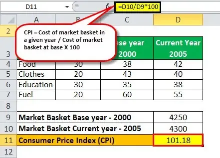

Algorithmic trading has fundamentally transformed financial markets by employing pre-programmed strategies to efficiently execute trades. These strategies are heavily reliant on economic indicators and index numbers, which provide critical data and insights into market conditions. Economic indicators encompass a wide array of metrics, including GDP, employment rates, and inflation, that are pivotal in analyzing and forecasting economic health. Index numbers further simplify complex data, presenting it in a more comprehensible form to aid in economic analysis and decision-making.

In this article, we explore how these economic indicators and index numbers form the backbone of algorithmic trading strategies. Traders utilize these tools to construct sophisticated algorithms capable of adapting to ever-changing market dynamics. By tapping into these quantifiable metrics, traders can enhance their strategies, allowing for informed decision-making. Understanding the economic context and utilizing analytical tools effectively are crucial for anyone active in the financial markets.



Algorithmic trading thrives on the data derived from economic indices, as these numbers offer an objective basis for predicting market movements and trends. The technical aspects of algorithmic trading integrate this data smoothly, enabling the execution of trades at unparalleled speed and precision. In this evolving landscape, a solid grasp of economic indicators and their application within algorithmic frameworks remains crucial for traders seeking to maintain a competitive edge.

## Table of Contents

## Understanding Economic Indicators

Economic indicators are vital statistics that provide insights into the performance and potential future trajectories of an economy. These indicators are utilized by traders, policymakers, economists, and business leaders to gauge economic health and inform strategic decisions. Among the key categories of economic indicators are Gross Domestic Product (GDP), employment rates, inflation, and consumer confidence. Each of these metrics offers a unique perspective on the economic environment.

**Gross Domestic Product (GDP):** GDP is a comprehensive measure of an economy's overall output and performance. It represents the total monetary value of all goods and services produced over a specific period. GDP helps to determine the economic growth rate and provides a snapshot of economic health. Analysts often track changes in GDP to assess whether the economy is expanding or contracting.

**Employment Rates:** Employment statistics, including the unemployment rate and job creation numbers, provide insight into labor market conditions. A low unemployment rate typically indicates a healthy economy with job opportunities, while high unemployment may signal economic distress.

**Inflation:** Inflation measures the rate at which the general level of prices for goods and services is rising, thereby eroding purchasing power. Common indices used to gauge inflation are the Consumer Price Index (CPI) and the Producer Price Index (PPI). Understanding inflation dynamics is critical for assessing cost-of-living changes and making investment decisions.

**Consumer Confidence:** This indicator reflects the degree of optimism or pessimism that consumers feel about the economy's condition. High consumer confidence suggests more consumer spending, which can drive economic growth, while low confidence may lead to reduced spending and slower growth.

Economic indicators are typically classified into three types: leading, coincident, and lagging indicators. 

**Leading Indicators:** These indicators, such as stock market returns and manufacturing activity, signal future economic activities. For example, the stock market often anticipates economic trends and can serve as a barometer for investor confidence. Manufacturing orders might indicate future production increases, signaling economic expansion.

**Coincident Indicators:** These indicators provide real-time data reflecting the current state of the economy. GDP and employment levels are often considered coincident indicators as they offer direct insights into ongoing economic activity.

**Lagging Indicators:** Lagging indicators, such as unemployment rates and corporate profits, confirm trends after economic activities have occurred. They are typically used to verify the direction and health of the economy post-factum.

Understanding and analyzing these indicators allows traders to align their strategies with current economic conditions. An adept interpretation of the indicators aids in making informed predictions about market movements, optimizing investment portfolios, and managing risks effectively.

## Role of Economics Index Numbers

Index numbers in economics function as simplified metrics, allowing comparison of data across diverse time periods or geographic regions. These indices, crucial in economic analysis, facilitate understanding of various economic phenomena by condensing complex datasets into easily interpretable figures.

One primary function of index numbers is adjusting for inflation in price indices. For example, the Consumer Price Index (CPI) measures the average change over time in the prices paid by urban consumers for a market basket of consumer goods and services. Similarly, the Producer Price Index (PPI) provides insights into the average change over time in the selling prices received by domestic producers for their output. Both CPI and PPI are foundational in understanding inflation dynamics. 

Inflation adjustment is vital for assessing real economic growth as it allows for the differentiation between nominal and real values. The formula for converting a nominal value to a real value using an index number is:

$$
\text{Real Value} = \frac{\text{Nominal Value}}{\text{Index Number at Current Time}} \times \text{Base Period Index}
$$

Evaluation of consumer spending trends, another critical application, leverages indices to understand shifts in purchasing behavior over time. They help policymakers and businesses adapt strategies according to changes in consumer demand patterns identified through these indices.

Another significant role of economic index numbers is assessing economic growth. For instance, the GDP deflator, a more comprehensive measure than the CPI, encompasses all goods and services produced domestically. By offering insights into inflation-adjusted GDP, it enables analysts to gauge the economy's purchasing power and real output changes.

Traders utilize these indices to predict financial market movements based on economic health. For instance, a rising CPI might signal potential [interest rate](/wiki/interest-rate-trading-strategies) hikes by central banks, influencing bond and equity markets. Analyzing trends through indices can provide foresight into market adjustments, enabling traders to position their investment strategies advantageously.

Index numbers' ability to streamline extensive datasets into straightforward metrics makes them indispensable in forming economic policies. These indices allow for informed decision-making in both government policy and individual financial strategies by providing a clear view of economic trends. Through their precise depiction of economic fluctuations, index numbers equip traders and policymakers alike with the tools necessary to navigate and respond to changing economic landscapes effectively.

## Integrating Economic Indicators in Algorithmic Trading

Algorithmic trading employs economic indicators to make swift, data-driven decisions, allowing traders to execute orders at speeds and frequencies unattainable by human intuition alone. Economic indicators serve as a primary input to the algorithms, equipping them with current market conditions that facilitate the real-time adjustment of trading strategies. This dynamic adaptability is crucial for optimizing returns and managing the risk inherent in financial markets that are subject to rapid changes and uncertainty.

For instance, the adaptability of algorithms is underscored by their ability to process real-time data and integrate it with historical trends to predict market movements. This capability not only optimizes decision-making but also enables traders to capitalize on market inefficiencies or shifts with minimal delay. High-frequency trading, a subset of [algorithmic trading](/wiki/algorithmic-trading), relies heavily on this data-centric approach to execute a large number of orders within fractions of a second.

Several trading firms, such as Two Sigma and Renaissance Technologies, leverage these algorithmic strategies grounded in economic indicators to develop a competitive edge. These firms analyze vast datasets that encompass a broad array of economic indicators including GDP growth rates, employment figures, and inflation metrics. By refining their algorithms with robust data analytics and [machine learning](/wiki/machine-learning) techniques, these companies enhance their capacity to forecast market behavior with greater precision.

To illustrate, consider a scenario where an algorithm uses the unemployment rate as a leading indicator for certain sectors’ stock performance. Python code for implementing a basic predictive model might look like this:

```python
import pandas as pd
from sklearn.linear_model import LinearRegression

# Example dataset
data = {'UnemploymentRate': [3.5, 4.0, 4.5, 5.0, 5.5],
        'SectorPerformance': [120, 115, 110, 105, 100]}
df = pd.DataFrame(data)

# Model training
X = df[['UnemploymentRate']]
y = df['SectorPerformance']
model = LinearRegression().fit(X, y)

# Predict future performance based on new unemployment rate
future_unemployment_rate = [[4.2]]
predicted_performance = model.predict(future_unemployment_rate)

print("Predicted Sector Performance:", predicted_performance[0])
```

Here, the model uses historical unemployment rates to predict sector performance, offering traders a basis for adjusting their portfolios.

Ultimately, the intersection of algorithmic trading and economic indicators represents a robust framework for navigating the complexities of financial markets. As algorithms continue to evolve and improve, their reliance on comprehensive economic data helps ensure more accurate predictions and more efficient trading strategies.

## Popular Algorithmic Trading Techniques Using Index Numbers

Technical indicators, such as Moving Averages (MA) and the Relative Strength Index (RSI), are integral components of algorithmic trading strategies, providing a structured approach to predict market movements. These indicators, derived from historical economic data, allow traders to identify trends, [momentum](/wiki/momentum), and potential reversals in asset prices, thereby facilitating more informed trading decisions.

Moving Averages smooth out price data by creating a constantly updated average price, thus providing a clear view of the direction of the trend and eliminating noise from random price fluctuations. For example, the Simple Moving Average (SMA) is calculated by taking the arithmetic mean of a given set of prices over a specific number of days. On the other hand, the Exponential Moving Average (EMA) gives more weight to recent prices, making it more responsive to new information.

The RSI measures the speed and change of price movements, typically using a 14-day timeframe to calculate its values. The formula for RSI is:

$$

RSI = 100 - \left( \frac{100}{1 + RS} \right) 
$$

where $RS$ (Relative Strength) is the average gain of up periods divided by the average loss of down periods.

The integration of these technical indicators into algorithmic trading platforms significantly reduces human error and increases the speed of trade execution. Algorithms can rapidly process vast amounts of market data, enabling traders to swiftly execute buy or sell orders based on pre-determined criteria, thus minimizing the latency associated with human decision-making.

Advanced calculations, such as the Fibonacci Retracement and Bollinger Bands, further enhance trading strategies. Fibonacci Retracement levels are horizontal lines that indicate potential support and resistance levels, calculated based on the Fibonacci sequence. Traders use these levels to predict reversal points, helping them to identify optimal entry and [exit](/wiki/exit-strategy) points in a trade.

Bollinger Bands consist of a middle band (SMA) and two outer bands calculated as:

$$

Upper\ Band = SMA + (Standard\ Deviation \times n) 
$$

$$

Lower\ Band = SMA - (Standard\ Deviation \times n) 
$$

where $n$ is the number of standard deviations, typically set to 2. These bands adjust dynamically to market volatility, thus pinpointing price levels that are unusually high or low.

The precision offered by these technical indicators, when combined with algorithmic trading, has made them popular among both institutional and retail traders. Institutions like hedge funds leverage these strategies to manage large volumes of transactions, while retail traders use them to gain a competitive edge in fast-moving markets. Python libraries, such as Pandas and TA-Lib, provide an accessible means for traders to compute these indicators, facilitating the implementation of sophisticated trading algorithms. As technology continues to evolve, traders are increasingly able to customize these indicators to suit their strategies, enhancing their ability to anticipate market behavior accurately.

## Conclusion

The fusion of economic indicators and index numbers with algorithmic trading creates a robust toolkit for modern traders. These tools provide objective, quantifiable metrics that significantly enhance the ability to navigate the complexities of financial markets with precision. Economic indicators, such as GDP, employment rates, and inflation figures, offer critical insights into the broader economic landscape. When these metrics are integrated into algorithmic trading systems, they allow for data-driven decision-making which is both faster and potentially more accurate than human traders alone.

Technical indicators, including Moving Averages and Relative Strength Index (RSI), while useful for identifying market trends and potential reversals, need to be contextualized within a comprehensive understanding of economic fundamentals. Without this broader economic perspective, traders might misinterpret signals or miss significant turning points driven by macroeconomic shifts.

Continuous learning and adaptability are essential for mastering the use of these indicators within algorithmic trading strategies. The dynamic nature of financial markets means that traders must be willing to update their models and algorithms as new data and insights become available. This might involve recalibrating trading strategies in response to unexpected political events, economic reports, or changes in market sentiment.

As financial markets continue to evolve, staying informed about economic trends and utilizing the appropriate tools will be crucial for achieving sustained success in algorithmic trading. This involves not just reacting to data but anticipating future trends by employing predictive models. By leveraging the interplay between economic indicators, economics index numbers, and algorithmic strategies, traders can better position themselves to capitalize on emerging market opportunities and mitigate risks.

## References & Further Reading

[1]: Bergstra, J., Bardenet, R., Bengio, Y., & Kégl, B. (2011). ["Algorithms for Hyper-Parameter Optimization."](https://dl.acm.org/doi/10.5555/2986459.2986743) Advances in Neural Information Processing Systems 24.

[2]: ["Advances in Financial Machine Learning"](https://www.amazon.com/Advances-Financial-Machine-Learning-Marcos/dp/1119482089) by Marcos Lopez de Prado

[3]: ["Evidence-Based Technical Analysis: Applying the Scientific Method and Statistical Inference to Trading Signals"](https://www.amazon.com/Evidence-Based-Technical-Analysis-Scientific-Statistical/dp/0470008741) by David Aronson

[4]: ["Machine Learning for Algorithmic Trading"](https://github.com/stefan-jansen/machine-learning-for-trading) by Stefan Jansen

[5]: ["Quantitative Trading: How to Build Your Own Algorithmic Trading Business"](https://www.amazon.com/Quantitative-Trading-Build-Algorithmic-Business/dp/1119800064) by Ernest P. Chan