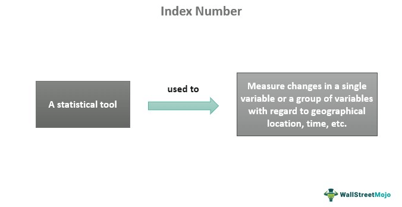

## Table of Contents

## What are index numbers in economics?

Index numbers in economics are tools used to measure changes in a group of related variables over time. They help us understand how things like prices, wages, or production levels change compared to a base period. For example, the Consumer Price Index (CPI) shows how the average prices of goods and services that people buy have changed over time.

These numbers are useful because they simplify complex data into a single, easy-to-understand figure. By comparing current values to a base year, index numbers can show trends and patterns. This helps economists, businesses, and policymakers make informed decisions. For instance, if the CPI goes up, it might mean that inflation is increasing, which could affect interest rates and economic policies.

## How are index numbers calculated?

Index numbers are calculated by comparing the current value of something to its value in a base period. First, you pick a base year and set its value to 100. This is your starting point. Then, you look at the value of the same thing in another year. You divide this new value by the base year value and multiply by 100. This gives you the index number for that year. If the index number is above 100, it means the value has gone up since the base year. If it's below 100, the value has gone down.

For example, let's say you want to calculate the price index for a basket of goods. In the base year, the total cost of the basket is $100. In the next year, the total cost rises to $105. To find the index number, you divide $105 by $100 and multiply by 100. This gives you an index of 105, meaning prices have increased by 5% since the base year. This simple calculation helps us see how prices, or any other economic variable, change over time.

## What is the purpose of using index numbers in economic analysis?

Index numbers help economists understand how things change over time. They take a bunch of information and turn it into a simple number that shows if something has gone up or down compared to a starting point. For example, if you want to see how prices have changed, you can use the Consumer Price Index (CPI). If the CPI is higher than it was last year, it means prices have gone up.

Using index numbers makes it easier to see trends and patterns. This is important for making decisions. For instance, if the CPI shows that prices are rising fast, the government might need to do something to control inflation. Businesses also use index numbers to plan for the future. If they see that their costs are going up, they might need to change their prices or find ways to save money.

## Can you explain the difference between a price index and a quantity index?

A price index measures how the average prices of goods and services change over time. It compares the cost of a basket of goods in a current year to the cost of the same basket in a base year. For example, the Consumer Price Index (CPI) shows how much more or less you have to pay for things like food, housing, and transportation compared to a chosen starting point. If the CPI goes up, it means prices are rising, which can help us understand inflation.

A quantity index, on the other hand, looks at how the amount of goods and services produced or consumed changes over time. It compares the quantity of a basket of goods in a current year to the quantity in a base year. For instance, the Industrial Production Index measures how much more or less factories are making compared to a chosen starting point. If the quantity index goes up, it means more goods are being produced or consumed, which can help us understand economic growth.

Both types of indexes are important for understanding the economy. Price indexes help us see if we're paying more for the same things, while quantity indexes show if we're getting more of those things. Together, they give a fuller picture of what's happening in the economy.

## What are some common types of economic index numbers?

Economic index numbers are used to track changes in different parts of the economy. One common type is the Consumer Price Index (CPI), which measures how the prices of goods and services that people buy change over time. If the CPI goes up, it means things are getting more expensive, which can help us understand inflation. Another type is the Producer Price Index (PPI), which looks at the prices businesses pay for things they need to make their products. If the PPI goes up, it might mean businesses will have to charge more for their products.

Another important index is the Gross Domestic Product (GDP) Deflator, which measures how the prices of all goods and services produced in a country change. This helps us see how the overall economy is doing. The Industrial Production Index measures how much factories, mines, and utilities are producing. If this index goes up, it means the economy is making more things. Lastly, the Employment Cost Index tracks changes in wages and benefits for workers, which can show how the cost of labor is changing. These indexes all help economists, businesses, and governments make better decisions.

## How do index numbers help in measuring inflation?

Index numbers help measure inflation by tracking how prices change over time. The most common index for this is the Consumer Price Index (CPI). The CPI looks at the prices of a basket of goods and services that people typically buy, like food, housing, and transportation. By comparing the cost of this basket in the current year to the cost in a base year, the CPI can show if prices are going up. If the CPI number is higher than it was in the base year, it means prices have risen, which is a sign of inflation.

Using index numbers like the CPI makes it easier to understand inflation because they turn complex price data into a simple number. This number can tell us how fast prices are rising, which is important for making economic decisions. For example, if the CPI shows that prices are going up quickly, the government might need to take action to slow down inflation. Businesses also use this information to adjust their prices and plan for the future. So, index numbers are a key tool for keeping an eye on inflation and helping the economy run smoothly.

## What role do index numbers play in comparing economic data over time?

Index numbers help us compare economic data over time by giving us a simple way to see how things have changed. They do this by picking a starting point, called the base year, and setting its value to 100. Then, they compare the value of the same thing in other years to this base year. If the index number is higher than 100, it means the value has gone up. If it's lower, the value has gone down. This makes it easy to see trends and patterns without having to look at a lot of complicated numbers.

For example, if you want to know how prices have changed, you can use the Consumer Price Index (CPI). The CPI looks at the cost of a basket of goods and services that people buy. If the CPI is 110 this year and it was 100 last year, it means prices have gone up by 10%. This helps economists, businesses, and governments understand what's happening in the economy and make better decisions. By using index numbers, they can see if things like prices, production, or wages are going up or down over time, which is important for planning and policy-making.

## How can index numbers be used to assess economic growth?

Index numbers help us see if the economy is growing by looking at how much more or less is being made or sold over time. One common index for this is the Gross Domestic Product (GDP) index. It measures the total value of all goods and services produced in a country. If the GDP index is higher than it was in the base year, it means the economy is making more stuff, which shows growth. For example, if the GDP index goes from 100 to 105, it means the economy has grown by 5% since the base year.

Another way index numbers help assess economic growth is by looking at the Industrial Production Index. This index measures how much factories, mines, and utilities are producing. If the index goes up, it means these industries are making more things, which can be a sign that the economy is growing. For instance, if the Industrial Production Index goes from 100 to 103, it means production has increased by 3% since the base year. By using these indexes, economists can get a clear picture of whether the economy is getting bigger or smaller over time.

## What are the limitations of using index numbers in economic analysis?

Index numbers are really helpful for understanding how things change in the economy, but they do have some limits. One big problem is that they can be affected by what's chosen for the base year. If the base year isn't a good representation of normal times, the index numbers might not show the real changes. Also, index numbers often use a fixed basket of goods or services, which means they might not catch new products or changes in what people buy. This can make the index less accurate over time.

Another issue is that index numbers can hide differences within the data. For example, the Consumer Price Index (CPI) might go up, but that doesn't tell us which specific prices are going up the most. This can make it hard to understand the full picture of what's happening in the economy. Also, index numbers can be affected by how they're calculated. Small changes in the method can lead to big differences in the final number, which can make it hard to compare data over time or between different places.

## How do different base years affect the interpretation of index numbers?

Choosing a different base year can change how we see the numbers in an index. If the base year is a time when prices or production were really high or really low, the index numbers might look different than if we picked a more normal year. For example, if we use a year with very low prices as the base, the index numbers in later years might seem a lot higher, even if prices haven't changed much. This can make it hard to understand if things are really going up or down.

Because of this, it's important to pick a base year that is a good average of what's normal. If we don't, the index numbers might not show the real changes in the economy. Economists often update the base year to keep the index numbers accurate. This helps make sure the numbers we're looking at give us a true picture of what's happening over time.

## What advanced techniques are used to adjust index numbers for seasonal variations?

To make index numbers more accurate, economists use special methods to take out the effects of seasons. For example, people might buy more ice cream in the summer and less in the winter. If we don't adjust for this, the index numbers could make it look like the economy is doing better in the summer just because of ice cream sales. To fix this, economists use a technique called seasonal adjustment. They look at data from many years to see what's normal for each season and then take that out of the current numbers. This way, the index numbers show the real changes in the economy, not just the changes that happen every year because of the seasons.

Another method used is called the X-12-ARIMA model. This is a bit more complicated, but it's really good at figuring out seasonal patterns. It uses past data to predict what the seasonal changes will be and then removes those changes from the current data. This helps make sure the index numbers are as accurate as possible. By using these techniques, economists can get a clearer picture of what's really happening in the economy, without the ups and downs that come from the seasons.

## How do economists use index numbers in forecasting economic trends?

Economists use index numbers to help them guess what might happen in the economy in the future. They look at how index numbers have changed over time to see if they can spot patterns. For example, if the Consumer Price Index (CPI) has been going up a little bit every year, they might predict that it will keep going up. This can help them figure out if prices will keep rising, which is important for understanding inflation. By looking at these patterns, economists can make better guesses about what might happen next.

Another way economists use index numbers for forecasting is by looking at different indexes together. For instance, they might look at the Gross Domestic Product (GDP) index and the Industrial Production Index at the same time. If both indexes are going up, it could mean the economy is growing. By putting all this information together, economists can make more accurate predictions about the future. This helps businesses and governments plan ahead and make smart decisions.

## What is the role of Economics Index Numbers?

Index numbers in economics function as simplified metrics, allowing comparison of data across diverse time periods or geographic regions. These indices, crucial in economic analysis, facilitate understanding of various economic phenomena by condensing complex datasets into easily interpretable figures.

One primary function of index numbers is adjusting for inflation in price indices. For example, the Consumer Price Index (CPI) measures the average change over time in the prices paid by urban consumers for a market basket of consumer goods and services. Similarly, the Producer Price Index (PPI) provides insights into the average change over time in the selling prices received by domestic producers for their output. Both CPI and PPI are foundational in understanding inflation dynamics. 

Inflation adjustment is vital for assessing real economic growth as it allows for the differentiation between nominal and real values. The formula for converting a nominal value to a real value using an index number is:

$$
\text{Real Value} = \frac{\text{Nominal Value}}{\text{Index Number at Current Time}} \times \text{Base Period Index}
$$

Evaluation of consumer spending trends, another critical application, leverages indices to understand shifts in purchasing behavior over time. They help policymakers and businesses adapt strategies according to changes in consumer demand patterns identified through these indices.

Another significant role of economic index numbers is assessing economic growth. For instance, the GDP deflator, a more comprehensive measure than the CPI, encompasses all goods and services produced domestically. By offering insights into inflation-adjusted GDP, it enables analysts to gauge the economy's purchasing power and real output changes.

Traders utilize these indices to predict financial market movements based on economic health. For instance, a rising CPI might signal potential [interest rate](/wiki/interest-rate-trading-strategies) hikes by central banks, influencing bond and equity markets. Analyzing trends through indices can provide foresight into market adjustments, enabling traders to position their investment strategies advantageously.

Index numbers' ability to streamline extensive datasets into straightforward metrics makes them indispensable in forming economic policies. These indices allow for informed decision-making in both government policy and individual financial strategies by providing a clear view of economic trends. Through their precise depiction of economic fluctuations, index numbers equip traders and policymakers alike with the tools necessary to navigate and respond to changing economic landscapes effectively.

## What are Popular Algorithmic Trading Techniques Using Index Numbers?

Technical indicators, such as Moving Averages (MA) and the Relative Strength Index (RSI), are integral components of algorithmic trading strategies, providing a structured approach to predict market movements. These indicators, derived from historical economic data, allow traders to identify trends, [momentum](/wiki/momentum), and potential reversals in asset prices, thereby facilitating more informed trading decisions.

Moving Averages smooth out price data by creating a constantly updated average price, thus providing a clear view of the direction of the trend and eliminating noise from random price fluctuations. For example, the Simple Moving Average (SMA) is calculated by taking the arithmetic mean of a given set of prices over a specific number of days. On the other hand, the Exponential Moving Average (EMA) gives more weight to recent prices, making it more responsive to new information.

The RSI measures the speed and change of price movements, typically using a 14-day timeframe to calculate its values. The formula for RSI is:

$$

RSI = 100 - \left( \frac{100}{1 + RS} \right) 
$$

where $RS$ (Relative Strength) is the average gain of up periods divided by the average loss of down periods.

The integration of these technical indicators into algorithmic trading platforms significantly reduces human error and increases the speed of trade execution. Algorithms can rapidly process vast amounts of market data, enabling traders to swiftly execute buy or sell orders based on pre-determined criteria, thus minimizing the latency associated with human decision-making.

Advanced calculations, such as the Fibonacci Retracement and Bollinger Bands, further enhance trading strategies. Fibonacci Retracement levels are horizontal lines that indicate potential support and resistance levels, calculated based on the Fibonacci sequence. Traders use these levels to predict reversal points, helping them to identify optimal entry and [exit](/wiki/exit-strategy) points in a trade.

Bollinger Bands consist of a middle band (SMA) and two outer bands calculated as:

$$

Upper\ Band = SMA + (Standard\ Deviation \times n) 
$$

$$

Lower\ Band = SMA - (Standard\ Deviation \times n) 
$$

where $n$ is the number of standard deviations, typically set to 2. These bands adjust dynamically to market volatility, thus pinpointing price levels that are unusually high or low.

The precision offered by these technical indicators, when combined with algorithmic trading, has made them popular among both institutional and retail traders. Institutions like hedge funds leverage these strategies to manage large volumes of transactions, while retail traders use them to gain a competitive edge in fast-moving markets. Python libraries, such as Pandas and TA-Lib, provide an accessible means for traders to compute these indicators, facilitating the implementation of sophisticated trading algorithms. As technology continues to evolve, traders are increasingly able to customize these indicators to suit their strategies, enhancing their ability to anticipate market behavior accurately.

## References & Further Reading

[1]: Bergstra, J., Bardenet, R., Bengio, Y., & Kégl, B. (2011). ["Algorithms for Hyper-Parameter Optimization."](https://dl.acm.org/doi/10.5555/2986459.2986743) Advances in Neural Information Processing Systems 24.

[2]: ["Advances in Financial Machine Learning"](https://www.amazon.com/Advances-Financial-Machine-Learning-Marcos/dp/1119482089) by Marcos Lopez de Prado

[3]: ["Evidence-Based Technical Analysis: Applying the Scientific Method and Statistical Inference to Trading Signals"](https://www.amazon.com/Evidence-Based-Technical-Analysis-Scientific-Statistical/dp/0470008741) by David Aronson

[4]: ["Machine Learning for Algorithmic Trading"](https://github.com/stefan-jansen/machine-learning-for-trading) by Stefan Jansen

[5]: ["Quantitative Trading: How to Build Your Own Algorithmic Trading Business"](https://www.amazon.com/Quantitative-Trading-Build-Algorithmic-Business/dp/1119800064) by Ernest P. Chan