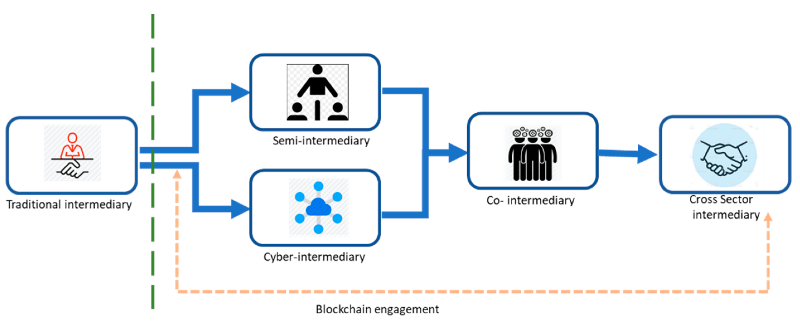

## Table of Contents

## What is an intermediary in the context of traditional financial systems?

In traditional financial systems, an intermediary is a person or an organization that helps to connect people who want to do business with each other. For example, banks act as intermediaries between people who want to save money and those who want to borrow money. Banks take in deposits from savers and then lend that money to borrowers. This way, savers earn interest on their savings, and borrowers can use the money for things like buying a house or starting a business.

Intermediaries are important because they make financial transactions easier and safer. They handle the complex parts of moving money around, keeping track of who owes what, and making sure that everyone follows the rules. Without intermediaries, it would be much harder for people to trust each other and do business together. However, using intermediaries can also mean paying fees and following their rules, which might not always be convenient for everyone.

## How does blockchain technology aim to reduce the need for intermediaries?

Blockchain technology aims to reduce the need for intermediaries by allowing people to do business directly with each other without needing a middleman. In a blockchain system, transactions are recorded on a shared, public ledger that everyone can see. This means that instead of trusting a bank or another intermediary to keep track of transactions, people can trust the blockchain itself. Because the ledger is decentralized and maintained by many different computers, it's very hard for anyone to cheat or change the records.

This direct approach can save time and money because people don't have to pay fees to intermediaries. It also gives people more control over their own money and data. For example, with blockchain, you can send money to someone else anywhere in the world quickly and cheaply, without needing a bank to process the transaction. While blockchain isn't perfect and still faces some challenges, it offers a new way for people to connect and do business without relying on traditional intermediaries.

## What are some examples of intermediaries in blockchain ecosystems?

In blockchain ecosystems, intermediaries still exist but they are different from traditional ones. One example is [cryptocurrency](/wiki/cryptocurrency) exchanges. These are platforms where people can buy, sell, or trade digital currencies. They act as a middleman between buyers and sellers, making sure the transactions go smoothly and safely. Another example is wallet providers. These are services that help people store and manage their digital money. They make it easier for users to keep their cryptocurrencies safe and to send or receive them.

Even though blockchain aims to cut down on the need for intermediaries, these services are still important. They help make the technology easier to use for people who might not understand it well. For example, if someone wants to use Bitcoin but doesn't know how to set up their own wallet, a wallet provider can help them get started. These intermediaries can also add extra security features, like two-[factor](/wiki/factor-investing) authentication, to protect users' funds. So, while blockchain reduces the need for traditional intermediaries, new types of intermediaries have emerged to support the ecosystem.

## How do intermediaries function in decentralized finance (DeFi) platforms?

In decentralized finance (DeFi) platforms, intermediaries still play a role, but they are different from the ones in traditional finance. Instead of banks or other big institutions, DeFi uses smart contracts. Smart contracts are like computer programs that run on the blockchain. They automatically do things like lending money or trading assets without needing a person or a big company to oversee them. This makes DeFi more open and fair because everyone can use these services without asking permission from a middleman.

Even though DeFi aims to cut out traditional intermediaries, some new types of intermediaries have popped up. For example, there are platforms that help people connect to DeFi services more easily. These platforms might offer user-friendly interfaces or extra security features to make it simpler for people to use DeFi. They don't control the money or the transactions like traditional banks do, but they help bridge the gap between users and the complex world of blockchain technology. So, while DeFi reduces the need for traditional intermediaries, it still relies on these new kinds of helpers to make everything work smoothly.

## What role do intermediaries play in enhancing blockchain security?

Intermediaries in blockchain ecosystems help make things more secure by adding extra layers of protection. For example, cryptocurrency exchanges and wallet providers often have strong security measures like two-factor authentication and encryption. These help keep users' digital money safe from hackers. By using these services, people can feel more confident that their money is protected, even though they're using a new technology like blockchain.

Another way intermediaries enhance blockchain security is by helping users navigate the complex world of blockchain. They provide easy-to-use platforms and guides that help people avoid common mistakes that could lead to security risks. For instance, a wallet provider might warn users about the dangers of sharing their private keys. By educating users and making blockchain easier to use, intermediaries play a big role in keeping the whole system more secure.

## Can intermediaries in blockchain be fully eliminated, and why or why not?

Intermediaries in blockchain can't be fully eliminated because they still do important jobs that help the system work well. Even though blockchain wants to cut out the middleman, some people need help to use it safely and easily. For example, cryptocurrency exchanges make it simple for people to buy and sell digital money. Without them, it would be harder for regular people to get into blockchain. Also, wallet providers keep users' digital money safe and help them manage it. These services make blockchain more user-friendly and secure.

While blockchain does a great job at letting people do business directly with each other, it's still a complex technology. Many people don't understand how it works and need help to use it right. Intermediaries fill this gap by making blockchain easier to use and safer. They offer guides, user-friendly tools, and extra security features that help keep everything running smoothly. So, even though blockchain reduces the need for traditional middlemen, some kind of intermediaries will probably always be needed to support users and keep the system secure.

## How do regulatory bodies view the role of intermediaries in blockchain?

Regulatory bodies often see intermediaries in blockchain as important because they help keep things safe and follow the rules. They think that exchanges and wallet providers can help stop fraud and protect users' money. These services can also make it easier for regulators to watch what's happening in the blockchain world. By working with intermediaries, regulatory bodies can make sure that people using blockchain are doing it the right way and not breaking any laws.

However, some regulators worry that too much control by intermediaries might go against what blockchain is all about. Blockchain is meant to let people do things without needing a middleman, so too many rules could slow it down. Regulators have to find a balance. They want to keep things safe and fair, but they also want to let blockchain grow and help people. It's a tricky job, but they're working to make sure that blockchain can be both safe and useful for everyone.

## What are the economic implications of intermediaries in blockchain networks?

Intermediaries in blockchain networks can change how money moves around. They can make it easier for people to use blockchain by offering services like exchanges and wallets. This can help more people get into blockchain, which is good for the economy. But, these services also charge fees. So, while they help people use blockchain, they can also make it more expensive. This means that the money people save by using blockchain might be less than they thought.

On the other hand, intermediaries can help the economy by making blockchain safer and more trusted. When people feel safe using blockchain, they are more likely to use it for things like buying and selling. This can make the economy grow because more business happens. But, if intermediaries have too much control, it might slow down the growth of blockchain. People might not like having to go through a middleman when they want to use blockchain directly. So, finding the right balance is important for the economy.

## How do intermediaries affect the scalability and efficiency of blockchain transactions?

Intermediaries can help make blockchain transactions more efficient by making them easier to do. They offer services like user-friendly platforms and guides that help people use blockchain without getting confused. This can make transactions happen faster because people don't have to spend a lot of time figuring out how to use blockchain on their own. For example, a wallet provider can help someone send money quickly and easily, which makes the whole system work better.

However, intermediaries can also make blockchain less scalable. This means that as more people start using blockchain, it might get slower or more expensive if too many transactions have to go through these middlemen. Every time someone uses an intermediary, they might have to pay a fee, and that can add up if a lot of people are doing it. So, while intermediaries can make things easier in the short term, they might slow down the growth of blockchain in the long term if they become too important or too costly.

## What are the potential conflicts of interest that intermediaries might face in blockchain?

Intermediaries in blockchain might face conflicts of interest because they have to balance helping users with making money for themselves. For example, a cryptocurrency exchange might want to charge high fees to make more profit, but this could make it harder for users to use blockchain. If the fees are too high, people might stop using the exchange, which is bad for both the users and the exchange. So, the exchange has to find a way to make money without making things too expensive for users.

Another conflict can happen when intermediaries try to keep things safe. They might want to add a lot of security features to protect users' money, but this can make using blockchain more complicated. If the platform is too hard to use, people might go somewhere else. On the other hand, if the intermediary doesn't add enough security, users' money could be at risk. So, intermediaries have to find the right balance between safety and ease of use to keep everyone happy.

## How can smart contracts replace or modify the traditional roles of intermediaries?

Smart contracts can change how intermediaries work by letting people do things automatically without a middleman. In traditional systems, if you want to buy a house, you need a bank to help with the loan and a lawyer to check the contract. With smart contracts on blockchain, you can set up the rules for buying a house in a computer program. When everyone follows the rules, the smart contract does the work automatically. This means you don't need a bank or a lawyer to help, which can save time and money.

Even though smart contracts can replace some jobs of intermediaries, they can't do everything. They are good at simple tasks that follow clear rules, but they can't handle things that need human judgment or special knowledge. For example, if there's a problem with the house you're buying, a smart contract can't help you fix it. You might still need a lawyer to solve the problem. So, smart contracts can make some parts of using intermediaries easier, but they won't completely get rid of the need for them.

## What future developments might influence the role of intermediaries in blockchain technology?

In the future, new technology could change how intermediaries work in blockchain. One big change might be better ways to use smart contracts. If smart contracts get smarter and can do more things, people might not need intermediaries as much. For example, if a smart contract can handle a loan from start to finish without any help, then banks might not be needed for that job. Also, if blockchain gets easier to use, more people might feel okay doing things without intermediaries. This could mean fewer fees and more control over their own money.

But, some things might keep intermediaries important. For one, new rules from governments could make intermediaries more necessary. If laws say that blockchain needs to be watched closely, then intermediaries like exchanges might have to do more to make sure everything is safe and legal. Also, as blockchain grows, it might get more complicated. People might still want intermediaries to help them understand and use blockchain safely. So, even though technology might reduce the need for intermediaries, other factors could keep them around.

## References & Further Reading

[1]: Nakamoto, S. (2008). ["Bitcoin: A Peer-to-Peer Electronic Cash System."](https://nakamotoinstitute.org/library/bitcoin/) Bitcoin.org.

[2]: Tapscott, D., & Tapscott, A. (2016). ["Blockchain Revolution: How the Technology Behind Bitcoin Is Changing Money, Business, and the World."](https://dl.acm.org/doi/10.5555/3051781) Penguin.

[3]: Peters, G. W., & Panayi, E. (2015). ["Understanding Modern Banking Ledgers through Blockchain Technologies: Future of Transaction Processing and Smart Contracts on the Internet of Money."](https://papers.ssrn.com/sol3/papers.cfm?abstract_id=2692487) SWIFT Institute Working Paper No. 2015-007.

[4]: De Filippi, P., & Wright, A. (2018). ["Blockchain and the Law: The Rule of Code."](https://www.jstor.org/stable/j.ctv2867sp) Harvard University Press.

[5]: Böhme, R., et al. (2015). ["Bitcoin: Economics, Technology, and Governance."](https://www.aeaweb.org/articles?id=10.1257/jep.29.2.213) Journal of Economic Perspectives, 29(2), 213-238.