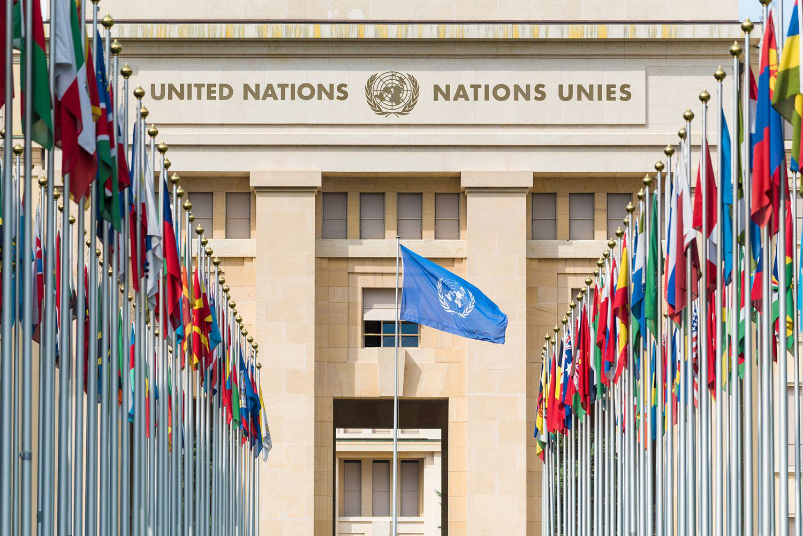

## Table of Contents

## What is a nation-state?

A nation-state is a country where most people share the same culture, language, and history. It is a place where the government rules over a group of people who see themselves as a single nation. For example, Japan is a nation-state because most people there speak Japanese and share a common culture and history.

Sometimes, creating a nation-state can be difficult. Not all countries have people who share the same culture or language. When different groups live together, it can lead to conflicts. Leaders of nation-states often try to make everyone feel like they belong to the same nation, even if they are different. This can help keep the country united and peaceful.

## What is globalization?

Globalization is when countries around the world connect and work together more than before. It means that people, goods, and ideas can move easily from one country to another. For example, you might eat food from another country or use a phone made in a different part of the world. This happens because of better technology, like the internet and faster transportation.

Sometimes, globalization can be good because it can create jobs and help people learn about different cultures. But it can also be hard because it might make some people lose their jobs if companies move to other countries where it's cheaper to make things. Also, it can make it harder for small local businesses to compete with big companies from other countries. Overall, globalization changes how we live and work, bringing both opportunities and challenges.

## How do nation-states influence global economic policies?

Nation-states play a big role in shaping global economic policies. They do this by making rules and agreements with other countries. For example, they might set up trade deals that decide what goods can be sold between countries and at what price. These agreements help control how money and goods move around the world. Nation-states also join groups like the World Trade Organization to work together on these rules. By doing this, they can make sure that their own country benefits from global trade.

Sometimes, nation-states use their power to protect their own economy. They might put taxes on goods coming from other countries to make their own products more competitive. This is called a tariff. They might also set rules about how much money can be moved in and out of their country. These actions can affect the global economy because other countries have to react to these policies. For example, if one country raises tariffs, others might do the same, which can lead to trade wars. Overall, nation-states have a lot of influence on how the world's economy works.

## What role do nation-states play in international trade agreements?

Nation-states are very important in making international trade agreements. They sit down with other countries to talk about rules for buying and selling things across borders. These rules can say what goods can be traded, how much they should cost, and how they should be treated when they move from one country to another. By making these agreements, nation-states try to make sure their own businesses can sell more things and make more money. They also join big groups like the World Trade Organization to work together on these rules and make sure everyone follows them.

Sometimes, nation-states use these agreements to protect their own economy. They might agree to lower taxes on goods from certain countries, which can make those goods cheaper and easier to buy. But they might also put higher taxes on goods from other countries to make their own products look better. This can be good for their own businesses, but it can make things harder for businesses in other countries. Overall, nation-states use international trade agreements to help their own economy while also trying to work well with other countries.

## How do nation-states manage their sovereignty in the context of globalization?

Nation-states try to keep their sovereignty, or their power to make their own rules, even when the world is becoming more connected through globalization. They do this by setting their own laws and policies, even if they are part of big groups like the United Nations or the World Trade Organization. For example, a nation-state might decide to put taxes on goods coming from other countries to protect its own businesses. This shows that even though they work with other countries, they still want to control what happens inside their own borders.

Sometimes, managing sovereignty can be hard because globalization means more rules and agreements between countries. Nation-states have to balance following these global rules with doing what is best for their own people. They might join trade agreements that help their economy grow, but they also need to make sure these agreements don't take away too much of their power to make decisions. By carefully choosing which agreements to join and how to use their own laws, nation-states can keep some control over their own affairs while still being part of the global community.

## What are the impacts of globalization on national cultures and identities?

Globalization can change national cultures and identities in big ways. When people from different countries mix more because of travel and the internet, they start to share ideas, food, music, and fashion. This can make cultures around the world more similar. For example, you might see people in different countries wearing similar clothes or eating the same fast food. While this can be exciting and help people learn about other cultures, it can also make some people worry that their own culture is getting lost or less important.

On the other hand, globalization can also help people feel more proud of their own culture. When people see different cultures mixing, they might want to hold onto their own traditions even more. They might celebrate their national holidays more or try to keep their language strong. This can make national identities stronger because people want to show who they are and where they come from. So, while globalization can make cultures more alike, it can also make people more aware of and proud of their own unique culture.

## How do nation-states address global environmental challenges?

Nation-states work together to tackle big environmental problems like climate change and pollution. They make agreements, like the Paris Agreement, where countries promise to cut down on things that harm the environment. These agreements help set goals and rules that everyone can follow. Nation-states also work through groups like the United Nations to share ideas and help each other. By working together, they can do more to protect the planet than they could alone.

Sometimes, nation-states also take their own actions to deal with environmental challenges. They might pass laws to reduce pollution or protect wildlife. For example, a country might decide to use more clean energy like wind or solar power instead of dirty energy like coal. These actions show that even though global problems need global solutions, each country can still make a big difference on its own. By balancing their own efforts with working together, nation-states can help keep the environment healthy for everyone.

## What is the role of nation-states in global security and peacekeeping?

Nation-states are very important for keeping the world safe and peaceful. They work together in groups like the United Nations to stop wars and help countries that are in trouble. For example, if there is a fight between two countries, other nation-states might send soldiers to help keep the peace. They also make agreements to control weapons and stop terrorism. By working together, nation-states can make sure that problems don't get worse and that people can live safely.

But nation-states also take care of their own security. They have armies and police to protect their people and borders. Sometimes, they might not agree with other countries on how to keep the peace, which can make things harder. Still, they try to talk and work things out through meetings and treaties. By balancing their own needs with working together, nation-states help keep the world a safer place for everyone.

## How do nation-states navigate the tensions between global integration and national interests?

Nation-states often have to balance the benefits of working together with other countries with the need to look after their own people. Global integration means countries can work together on big problems like climate change or trade, which can help everyone. But sometimes, what is good for the whole world might not be the best for one country. For example, a trade deal might help the global economy, but it could hurt local jobs. So, nation-states have to carefully choose which global agreements to join and how to use them to help their own people.

To manage these tensions, nation-states use different strategies. They might join international groups like the United Nations to work on global issues, but they also keep their own laws and policies to protect their national interests. For instance, a country might agree to lower taxes on goods from other countries to help global trade, but it might also put higher taxes on certain goods to protect its own businesses. By balancing global cooperation with their own needs, nation-states try to make sure they can take part in the global community while still looking after their own people.

## What are the theories that explain the relationship between nation-states and globalization?

One theory about the relationship between nation-states and globalization is called hyperglobalism. This theory says that globalization is making nation-states less important. As more trade and communication happens across borders, the power of individual countries might go down. Companies and global groups, like the World Trade Organization, start to have more say in how the world works. People who believe in hyperglobalism think that nation-states will have to work together more and give up some of their power to keep up with global changes.

Another theory is called the skeptical view. This theory says that nation-states are still very important, even with globalization. It believes that countries will always want to protect their own interests and keep their power. Even though they might join global groups and make agreements, nation-states still control a lot of what happens inside their borders. People who support this view think that globalization might change some things, but it won't take away the main role of nation-states in the world.

A third theory is called transformationalism. This theory says that globalization is changing the world, but it's not clear yet how much. It believes that nation-states and global forces are both important and they affect each other. Sometimes, nation-states might lose some power, but they can also gain new power by working together on global issues. People who believe in transformationalism think that the relationship between nation-states and globalization is always changing and it's hard to say exactly where it will go.

## How do nation-states utilize international organizations to further their agendas in globalization?

Nation-states use international organizations to help them reach their goals in globalization. These groups, like the United Nations or the World Trade Organization, give countries a place to talk and make deals. For example, a country might join a trade group to sell more of its goods to other countries. By working together in these organizations, nation-states can make rules that help their own economy grow. They can also use these groups to get help with big problems like climate change or poverty, which they can't solve alone.

Sometimes, nation-states might use international organizations to make their own ideas more popular around the world. They might push for rules that fit their own culture or beliefs. For example, a country might want to change global laws to match its own ideas about human rights or the environment. By working through these groups, nation-states can spread their influence and make sure their voice is heard on the global stage. This way, they can shape globalization to fit their own needs and goals.

## What future challenges and opportunities do nation-states face in an increasingly globalized world?

In the future, nation-states will face many challenges because of globalization. One big challenge is keeping their own culture and identity strong while the world becomes more connected. As people share more ideas and goods across borders, it can be hard for a country to hold onto what makes it unique. Another challenge is managing the economy. Globalization can create jobs and help businesses grow, but it can also hurt local workers if companies move to other countries where it's cheaper to make things. Nation-states will need to find ways to protect their people and businesses while still being part of the global market.

But there are also many opportunities for nation-states in a globalized world. They can work together with other countries to solve big problems like climate change and poverty. By joining groups like the United Nations, nation-states can share ideas and resources to make the world a better place. Globalization also opens up new markets for businesses, which can lead to more jobs and a stronger economy. If nation-states can balance their own needs with working together, they can take advantage of these opportunities and help their people thrive in a connected world.

## References & Further Reading

[1]: Hendershott, T., Jones, C. M., & Menkveld, A. J. (2011). ["Does Algorithmic Trading Improve Liquidity?"](https://onlinelibrary.wiley.com/doi/full/10.1111/j.1540-6261.2010.01624.x) The Journal of Finance, 66(1), 1-33.

[2]: European Securities and Markets Authority (ESMA), ["MiFID II: Coverage of Algorithmic Trading"](https://www.esma.europa.eu/publications-and-data/interactive-single-rulebook/mifid-ii).

[3]: Friedman, T. L. (2005). ["The World is Flat: A Brief History of the Twenty-First Century."](https://psycnet.apa.org/record/2005-13366-000) Farrar, Straus and Giroux.

[4]: Castells, M. (2010). ["The Rise of the Network Society."](https://onlinelibrary.wiley.com/doi/book/10.1002/9781444319514) Wiley-Blackwell.

[5]: O'Brien, R. (1991). ["Global Financial Integration: The End of Geography."](https://archive.org/details/globalfinanciali0000obri_o9w2) Palgrave Macmillan.

[6]: de Prado, M. L. (2018). ["Advances in Financial Machine Learning."](https://www.amazon.com/Advances-Financial-Machine-Learning-Marcos/dp/1119482089) Wiley.