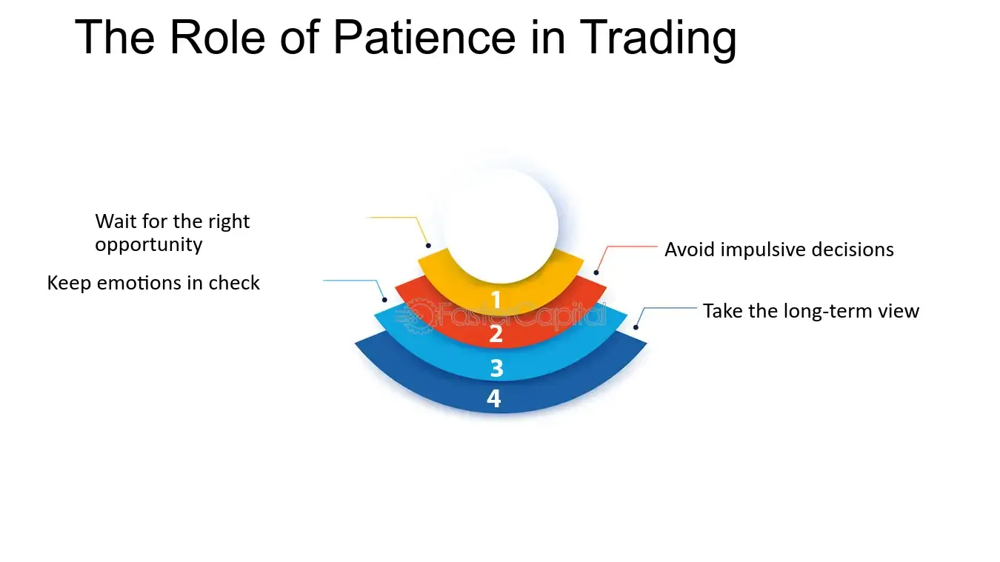

## Table of Contents

## What is patience in the context of trading?

Patience in trading means waiting for the right moment to buy or sell without rushing. It's important because the market can be unpredictable, and acting too quickly can lead to mistakes. Traders who are patient take their time to study the market and wait for clear signs before making a move. This helps them make better decisions and avoid losing money because of hasty actions.

Being patient also helps traders stick to their trading plans. Instead of getting swayed by short-term changes in the market, patient traders focus on their long-term goals. They understand that good opportunities don't come every day, and they are willing to wait for the right ones. This approach can lead to more successful trades and a calmer trading experience overall.

## Why is patience considered important for beginner traders?

Patience is really important for beginner traders because it helps them learn and grow without making big mistakes. When you start trading, it's easy to get excited and want to jump into the market right away. But if you're patient, you take the time to watch and learn how the market works. This means you can see patterns and understand what makes prices go up or down. Instead of rushing in and losing money, you wait until you're sure about what you're doing.

Also, being patient helps beginners stick to their plans. It's easy to get scared or too excited when the market moves a lot, but if you're patient, you don't let those feelings push you into bad decisions. You wait for the right time to buy or sell, and you don't get too upset if things don't go your way right away. This patience can help you become a better trader over time, as you learn to trust your plan and make smarter choices.

## How can impatience negatively affect trading outcomes?

Impatience can make trading go wrong in a big way. When traders are not patient, they might jump into buying or selling too fast without thinking it through. This can lead to buying at the wrong time when prices are too high or selling when prices are too low. It's like trying to catch a moving bus without looking where it's going. You might end up losing money because you didn't wait for a better chance.

Also, impatience can make traders ignore their plans. When the market moves a lot, it's easy to feel rushed and make quick choices that don't follow the plan. This can lead to big losses because the trader didn't stick to what they knew was a good strategy. Being impatient can also make trading stressful and less fun, because you're always worried about missing out on something. It's better to take your time and wait for the right moment.

## What are some common scenarios where traders need to exercise patience?

One common time traders need to be patient is when they're waiting for the right price to buy or sell. The market can go up and down a lot, and it's easy to feel like you need to act fast. But if you wait for a good price, you can make more money. For example, if you want to buy a stock, you might wait until the price goes down a bit before buying. This way, you get a better deal. It's hard to wait, but it can pay off in the end.

Another scenario is when a trade doesn't go well right away. Sometimes, the market moves against what you expected, and it's tempting to sell quickly to stop the loss. But if you're patient, you might see that the market turns around and your trade becomes profitable. It's important to stick to your plan and not panic. Patience helps you avoid making quick, bad decisions that can hurt your trading.

Lastly, traders need patience when they're learning. It takes time to understand how the market works and to get good at trading. New traders might feel like they need to start making big trades right away, but it's better to take it slow. Watch the market, learn from others, and practice with small trades first. Being patient in learning can help you become a better trader over time.

## Can you provide examples of successful trades that required patience?

One example of a successful trade that needed patience is when a trader waited to buy a stock at a lower price. Let's say a trader wanted to buy shares of a company but the price was too high. Instead of buying right away, the trader waited for weeks. During that time, the stock price dropped because of some bad news about the company. The trader then bought the stock at a much lower price. Later, when the company's news got better, the stock price went up again. The trader made a good profit because they were patient and waited for the right time to buy.

Another example is when a trader held onto a stock even when its price went down. Imagine a trader bought a stock that they believed in, but then the price started to fall. Many people might sell the stock quickly to avoid losing more money. But this trader was patient and kept the stock. Over time, the company did well and the stock price went back up. The trader made money because they didn't panic and sell when the price was low. Patience helped them stick to their plan and wait for the stock to recover.

## What psychological factors contribute to impatience in trading?

One big reason traders feel impatient is because of something called FOMO, or the "Fear Of Missing Out." When traders see the market moving quickly, they worry that if they don't act fast, they'll miss a good chance to make money. This fear can make them jump into trades without thinking carefully. They might see others making money and feel like they need to do the same right away, even if it's not a smart move.

Another reason is the pressure to make money fast. Some traders start trading because they want to get rich quickly. This can make them impatient because they're always looking for the next big win. They might not want to wait for the right moment to buy or sell, and instead, they rush into trades hoping to make a quick profit. This rush can lead to bad choices and losing money instead of making it.

## How can traders develop and improve their patience?

Traders can improve their patience by setting clear goals and sticking to a plan. When you know what you want to achieve and have a strategy to get there, it's easier to wait for the right time to act. Instead of jumping into trades because you feel rushed, you can follow your plan and take your time. This helps you avoid making quick decisions that might not be good for your trading. It's like having a map to guide you, so you don't get lost or feel like you need to hurry.

Another way to build patience is by practicing mindfulness and managing stress. Trading can be stressful, and when you're stressed, it's hard to be patient. By doing things like deep breathing or taking breaks, you can calm down and think more clearly. This helps you stay patient even when the market is moving a lot. It's also good to remind yourself that good trading takes time and that it's okay to wait for the right opportunities. Over time, this practice can help you become a more patient and better trader.

## What strategies can be used to maintain patience during volatile market conditions?

One way to keep patience during times when the market is moving a lot is by sticking to your trading plan. When prices go up and down quickly, it's easy to feel like you need to do something fast. But if you have a plan, you can follow it and wait for the right time to act. This helps you not make quick choices that might be bad. It's like having a map to follow, so you don't get lost or feel rushed.

Another way is to take breaks and stay calm. When the market is moving a lot, it can be stressful. If you feel stressed, take a deep breath or step away from your screen for a bit. This can help you think more clearly and not act too fast. It's also good to remind yourself that the market can be unpredictable and that it's okay to wait for the right moment. By staying calm, you can keep your patience and make better trading choices.

## How does patience influence long-term versus short-term trading strategies?

Patience plays a big role in long-term trading strategies. When you're planning to hold onto stocks or other investments for a long time, you need to be patient and not worry about small changes in the market every day. Long-term traders believe in the value of their investments over years, not days or weeks. They wait for the right time to buy and hold onto their investments even if the price goes down for a while. This patience helps them avoid selling too soon and missing out on big gains over time. It's like planting a seed and waiting for it to grow into a big tree.

In short-term trading, patience is also important, but it's a bit different. Short-term traders might hold onto their investments for just a few days or even hours. Even though they're looking for quick profits, they still need to wait for the right moment to buy and sell. Being patient in short-term trading means not jumping into every small move in the market. Instead, short-term traders wait for clear signs that the market is moving in their favor. This patience helps them make better trades and avoid losing money from acting too fast. It's like waiting for the perfect wave before you surf.

## What role does patience play in risk management and position sizing?

Patience is really important when it comes to managing risk in trading. When you're patient, you take the time to think about how much risk you're willing to take. Instead of rushing into a trade and risking too much money, you wait and make sure you're comfortable with the risk. This means you might not put all your money into one trade, but instead, you spread it out over different trades. Being patient helps you avoid big losses because you're not in a hurry to make a quick decision. It's like taking your time to cross a busy street safely instead of running across without looking.

Patience also helps with deciding how big your trades should be, which is called position sizing. When you're patient, you don't jump into big trades right away. You might start with smaller trades and slowly get bigger as you learn more about the market. This way, you can see how things go without risking too much money at once. Being patient with position sizing helps you grow your trading skills and your account slowly and safely. It's like learning to ride a bike with training wheels before you go full speed.

## How do experienced traders use patience to gain a competitive edge?

Experienced traders use patience to gain a competitive edge by waiting for the best times to buy and sell. Instead of jumping into every little move in the market, they watch and wait for clear signs that the market is going their way. This means they might miss out on some quick profits, but they also avoid big losses from acting too fast. By being patient, they can buy at lower prices and sell at higher prices, which can lead to bigger gains over time. It's like waiting for the perfect moment to take a shot in a game, instead of shooting every time you get the ball.

Patience also helps experienced traders stick to their plans and not get swayed by emotions. When the market moves a lot, it's easy to feel rushed or scared, but patient traders don't let these feelings push them into bad decisions. They know that the market can be unpredictable, and they're willing to wait for the right opportunities. This helps them manage risk better and make more thoughtful trades. By staying calm and patient, they can keep a clear head and make better choices, which gives them an edge over traders who act too quickly.

## Can patience be quantified or measured in trading performance metrics?

Patience in trading can be hard to measure with numbers, but there are some ways to see how it affects performance. One way is by looking at how long a trader waits before making a trade. If a trader often waits for the right price to buy or sell, this can show they are patient. Another way is by checking how often a trader sticks to their trading plan. If they don't change their plan a lot, even when the market is moving fast, it can mean they are patient and not letting emotions control their choices.

Another thing to look at is how a trader handles losses. If they can wait and not sell right away when a trade goes bad, it shows patience. This can be seen in how long they hold onto a losing trade before deciding to sell. Also, looking at the size of trades over time can show patience. If a trader starts with small trades and slowly makes them bigger, it means they are taking their time to learn and grow, which is a sign of patience. By watching these things, you can get an idea of how patient a trader is and how it helps their trading.

## References & Further Reading

[1]: Bergstra, J., Bardenet, R., Bengio, Y., & Kégl, B. (2011). ["Algorithms for Hyper-Parameter Optimization."](https://dl.acm.org/doi/10.5555/2986459.2986743) Advances in Neural Information Processing Systems 24.

[2]: ["Advances in Financial Machine Learning"](https://www.amazon.com/Advances-Financial-Machine-Learning-Marcos/dp/1119482089) by Marcos Lopez de Prado

[3]: ["Evidence-Based Technical Analysis: Applying the Scientific Method and Statistical Inference to Trading Signals"](https://www.amazon.com/Evidence-Based-Technical-Analysis-Scientific-Statistical/dp/0470008741) by David Aronson

[4]: ["Machine Learning for Algorithmic Trading"](https://github.com/stefan-jansen/machine-learning-for-trading) by Stefan Jansen

[5]: ["Quantitative Trading: How to Build Your Own Algorithmic Trading Business"](https://www.amazon.com/Quantitative-Trading-Build-Algorithmic-Business/dp/1119800064) by Ernest P. Chan