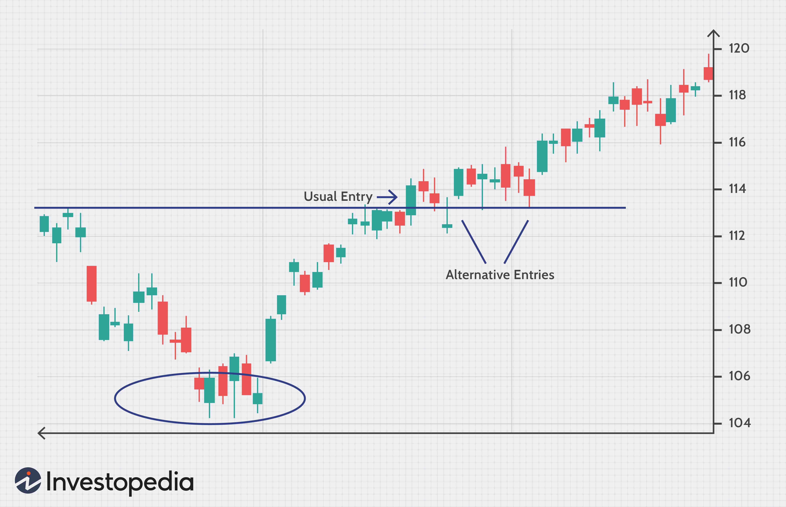

In today's fast-paced financial markets, the importance of patience is immense, particularly in trading and algorithmic trading. Patience is a fundamental quality that can significantly influence decision-making, trade execution, and trading success. For both traditional and algorithmic traders, patience is not merely a passive state of waiting but an active discipline that guides strategic decisions and actions amidst market volatility. 

Traders often navigate complex and rapidly changing environments where impulsive decisions can lead to significant financial losses. By maintaining patience, traders are better equipped to assess information critically, wait for optimal trading conditions, and execute trades that align with their strategic goals. Whether engaging in manual trading or deploying advanced algorithmic systems, patience serves as a crucial differentiator between loss-making and profitable trading activities.



Algorithmic trading, characterized by automated and rapid decision-making processes, requires structured patience, often embedded within trading algorithms. This involves programming algorithms to wait for specific signals or market conditions before making trades, reducing unnecessary transactions and transaction costs. Understanding and nurturing patience can lead to increased trading efficiency and profitability.

As we explore the impact of patience throughout the lifecycle of a trade, the application of patience-enhanced strategies becomes apparent. The advantages of patience extend beyond isolated trades, incorporating a holistic approach that can transform the trader’s overall methodology.

## Table of Contents

## The Importance of Patience in Trading

Patience in trading is often the cornerstone of successful trading strategies, allowing clearer decision-making independent of market volatility. This quality equips traders to manage complex emotions and impulses that are regularly encountered in the trading environment. Emotional turmoil can lead to impulsive decisions, which are frequently detrimental to trading outcomes. By adopting a patient, disciplined approach, traders can navigate these emotional challenges and make more informed decisions, even during periods of high volatility.

The strategic application of patience extends beyond simply timing entry and exit points; it significantly influences how traders manage their ongoing positions. Patience allows a trader to wait for optimal trading conditions, thus increasing the likelihood of executing trades profitably. This means exercising restraint and applying due diligence rather than succumbing to the immediate urge to act, even when market conditions appear unfavorable. Through careful assessment and the willingness to wait for the right opportunities, patient traders can enhance their decision-making processes.

Empirical data and anecdotal evidence underscore a clear trend: traders who practice patience tend to outperform their impulsive counterparts. This is often evidenced through case studies, where traders who wait for confirmation of trend reversals or ensure alignment with broader market indicators achieve greater success. For instance, patient traders are more likely to achieve a higher average rate of return, as they minimize premature entries and exits that erode potential profits through unnecessary transaction costs.

The success of patient trading strategies is not only demonstrated through individual trader experiences but is also reflected in statistical analyses. These analyses often reveal that portfolia managed with an emphasis on patience and strategic timing outperform those driven by impulsive or emotional decisions over the long term. For quantifiable transparency, one might consider running simulations of trading outcomes where decisions are based on both patient and impulsive approaches, tracking the variance in outcomes over time.

In summary, embracing patience in trading allows for a more structured, strategic approach that can reduce emotional trading pressures and lead to more consistent profitability. Developing this attribute can thus be seen as a significant advantage within both the fast-paced trading world and the more methodical domain of long-term investment.

## Patience in Algorithmic Trading

Algorithmic trading relies heavily on structured decision-making processes, where algorithmic patience can be pivotal. Unlike manual trading, where human emotions can drive impulse decisions, algorithmic systems can be programmed to operate with patience, optimizing market interactions and enhancing performance outcomes.

Algorithms designed with patience factors emphasize waiting for optimal market conditions, reducing the frequency of trades and consequently cutting transaction costs. By setting algorithms to execute trades only when specific market signals or technical indicators are met, traders can avoid unnecessary actions that may arise from transient market fluctuations. This can involve parameters such as \textit{moving averages}, \textit{Relative Strength Index (RSI)}, or \textit{Bollinger Bands} which help in determining the most opportune times for market entry or [exit](/wiki/exit-strategy). For example, an algorithm could be programmed in Python as follows:

```python
def should_trade(current_price, moving_average, rsi, threshold_rsi):
    if current_price > moving_average and rsi < threshold_rsi:
        return True
    return False
```

Implementing patience within algorithms also involves leveraging historical data to predict future market conditions, effectively simulating patience by "waiting" without engaging in trades during periods of uncertainty. This delayed gratification approach means that algorithms are not only reactive but also predictive. By using techniques like [backtesting](/wiki/backtesting), algorithms can assess how patience would have impacted past trades, providing insights into potential future successes.

The integration of patience in algorithmic strategies typically leads to fewer but higher-quality trades, minimizing transactional risks and enhancing profitability. Such strategies can benefit from [machine learning](/wiki/machine-learning) approaches that optimize algorithmic patience by adjusting trade execution based on dynamic market conditions. For instance, [reinforcement learning](/wiki/reinforcement-learning) can be leveraged to train algorithms to maximize long-term returns by selectively implementing trades that meet pre-defined criteria of success, inherently embedding patience:

```python
import numpy as np
from sklearn.ensemble import RandomForestRegressor

# Simulate patience by choosing trades based on market simulation data
class TradingAgent:
    def __init__(self, patience_model):
        self.patience_model = patience_model

    def decide(self, market_data):
        prediction = self.patience_model.predict(market_data)
        return prediction

# Train a model on historical data
market_data = np.array([...])  # Placeholder for actual market data
trade_labels = np.array([...])  # Placeholder for past trade outcomes
patience_model = RandomForestRegressor().fit(market_data, trade_labels)

agent = TradingAgent(patience_model)
decision = agent.decide(np.array([current_market_conditions]))
```

In summary, embedding patience into [algorithmic trading](/wiki/algorithmic-trading) systems reduces impulsive decisions, lowers trading costs, and ultimately results in a more robust trading strategy. This disciplined approach enables algorithms to achieve higher success rates with fewer, more thoughtful market entries, leading to improved risk management and profit optimization.

## Techniques for Developing Patience in Trading

To develop patience in trading, a disciplined approach and structured techniques are essential. Setting clear rules and maintaining disciplined routines are fundamental practices that can significantly enhance a trader's capacity for patience. These rules might include specific entry and exit criteria based on technical indicators or [fundamental analysis](/wiki/fundamental-analysis), which can help mitigate impulsive decision-making by providing a structured framework for trading activity.

Journaling is another valuable technique that can foster patience by promoting self-reflection and awareness. By meticulously recording trades and the accompanying emotional responses, traders can identify patterns and tendencies that lead to impulsive behaviors. This practice not only aids in recognizing these patterns but also facilitates the development of strategies to counteract them, thereby reinforcing disciplined trading habits over time.

Mindfulness techniques are increasingly recognized for their effectiveness in managing the emotional pressures associated with trading. Practices such as meditation, deep-breathing exercises, or even mindfulness apps can help traders maintain focus and clarity, especially during volatile market conditions. By incorporating mindfulness into their daily routines, traders can better manage stress and remain patient and objective in their decision-making processes.

Periodic reviewing and adapting trading strategies is another crucial method for cultivating patience. Markets are dynamic, and strategies that are effective in one market condition may not perform as well in another. By regularly assessing strategies and making necessary adjustments, traders ensure their approach remains relevant and effective. This adaptability, rooted in patience, helps maintain a consistent and measured trading approach, reducing the likelihood of rash decisions prompted by abrupt market changes.

Engaging with a community of traders can provide significant support in developing patience. Trading can often be an isolated endeavor, and a community offers a forum for sharing experiences, strategies, and challenges. This interaction not only offers camaraderie but also serves as a source of motivation and accountability. Being part of a community can inspire traders to maintain the discipline required to cultivate patience, ultimately contributing to their overall trading success.

## Real-World Benefits of Patience in Trading

Patient traders often find significant real-world benefits in their trading activities. One of the most notable advantages is the reduction in trading costs. By executing fewer transactions, patient traders inevitably incur lower commission fees and experience less slippage, which occurs when the price at which a trade is executed differs from the expected price. This reduction in cost directly impacts the net profitability of their trading strategies. 

A key aspect of successful trading is the identification of clear entry and exit points. Traders exercising patience are more adept at selecting these points, ensuring they achieve optimal price execution. Such precision can lead to increased returns, especially for trades left open over more extended periods. This strategic patience allows traders to capitalize on favorable market conditions rather than reacting impulsively to short-term fluctuations.

Numerous examples in the trading world underscore the benefits of patience. A well-documented case includes firms and individual traders who significantly improved their performance by incorporating patience into their trading methodologies. By adopting a more measured approach, these traders managed to enhance their performance metrics, such as increased risk-adjusted returns and lower [volatility](/wiki/volatility-trading-strategies) in their trading results.

The long-term benefits of patience in trading extend beyond mere financial metrics. Patience reduces the psychological stress associated with the emotional highs and lows of trading decisions. By minimizing impulsive decisions, traders can focus on analyzing market conditions and strategizing effectively, resulting in improved decision-making. This approach not only increases the likelihood of consistent trading success but also contributes to a sustainable trading career. Traders who prioritize patience often find themselves more resilient in the face of market unpredictability, leading to both financial gain and career longevity.

## Conclusion

In summary, patience is a vital virtue in both traditional and algorithmic trading. Developing patience can significantly enhance trading performance by mitigating emotionally driven decisions and directing focus towards quality rather than quantity. This allows traders to evaluate conditions with greater objectivity, leading to more effective strategic choices.

By integrating patience into disciplined trading strategies, traders establish a robust foundation for achieving sustained profitability. This involves setting clear guidelines for trade entries and exits, waiting for favorable market conditions, and executing trades in a calculated manner. For example, in algorithmic trading, the inclusion of patience can take the form of algorithms programmed to resist executing trades prematurely, even when market indicators seem enticing.

Navigating market complexities with patience as an essential tool not only improves the likelihood of success but also transforms the trader's overall approach. It fosters a mindset geared towards long-term growth and resilience, rather than short-term gains. Patience in trading can be akin to a buffer that cushions against the market's unpredictable swings and minimizes impulsive reactions.

Embrace patience and integrate it within your trading strategies to experience its profound impact. Whether through reducing emotional decision-making, honing trade execution, or achieving more consistent outcomes, patience is an indispensable asset for any trader committed to mastering their craft. By leveraging patience, you can witness significant improvements not just in your trades, but also in your approach to the market as a whole.

## References & Further Reading

[1]: Bergstra, J., Bardenet, R., Bengio, Y., & Kégl, B. (2011). ["Algorithms for Hyper-Parameter Optimization."](https://dl.acm.org/doi/10.5555/2986459.2986743) Advances in Neural Information Processing Systems 24.

[2]: ["Advances in Financial Machine Learning"](https://www.amazon.com/Advances-Financial-Machine-Learning-Marcos/dp/1119482089) by Marcos Lopez de Prado

[3]: ["Evidence-Based Technical Analysis: Applying the Scientific Method and Statistical Inference to Trading Signals"](https://www.amazon.com/Evidence-Based-Technical-Analysis-Scientific-Statistical/dp/0470008741) by David Aronson

[4]: ["Machine Learning for Algorithmic Trading"](https://github.com/stefan-jansen/machine-learning-for-trading) by Stefan Jansen

[5]: ["Quantitative Trading: How to Build Your Own Algorithmic Trading Business"](https://www.amazon.com/Quantitative-Trading-Build-Algorithmic-Business/dp/1119800064) by Ernest P. Chan