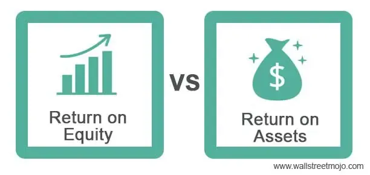

## Table of Contents

## What is Return on Assets (ROA)?

Return on Assets (ROA) is a financial ratio that shows how well a company is using its assets to make money. It tells you how much profit a company makes for each dollar of assets it has. To find ROA, you divide the company's net income by its total assets. This number is usually shown as a percentage.

ROA is important because it helps investors and managers see if a company is good at turning its investments into profits. A higher ROA means the company is using its assets more efficiently. For example, if a company has an ROA of 5%, it means it makes 5 cents of profit for every dollar of assets. Comparing the ROA of different companies can help you understand which ones are better at managing their resources.

## What is Return on Equity (ROE)?

Return on Equity (ROE) is a way to see how well a company is using the money that shareholders have invested to make a profit. It tells you how much profit a company makes for every dollar of shareholder equity. To calculate ROE, you take the company's net income and divide it by the shareholders' equity. The result is shown as a percentage. ROE is important because it shows how efficiently a company is using the money invested by its owners to grow the business and make more money.

ROE is a key number that investors look at when they want to know if a company is a good place to put their money. A higher ROE means the company is doing a better job of turning the money shareholders have given it into profits. For example, if a company has an ROE of 15%, it means it makes 15 cents of profit for every dollar of equity. By comparing the ROE of different companies, investors can see which ones are better at making money from the money they've been given.

## How are ROA and ROE calculated?

Return on Assets (ROA) is calculated by taking the company's net income and dividing it by its total assets. This gives you a percentage that shows how well the company is using its assets to make a profit. For example, if a company has a net income of $100,000 and total assets of $1,000,000, the ROA would be 10%. This means the company makes 10 cents of profit for every dollar of assets it has.

Return on Equity (ROE) is calculated by dividing the company's net income by its shareholders' equity. This percentage shows how well the company is using the money invested by its owners to make a profit. For instance, if a company has a net income of $100,000 and shareholders' equity of $500,000, the ROE would be 20%. This means the company makes 20 cents of profit for every dollar of equity.

## Why are ROA and ROE important for assessing corporate health?

ROA and ROE are important because they help us see how well a company is doing. ROA shows how good a company is at using its things, like buildings and machines, to make money. If a company has a high ROA, it means it's doing a great job of turning its stuff into profits. This is important for people who want to invest in the company because it tells them if the company is smart with its money and resources.

ROE is also key because it tells us how well a company is using the money that its owners have put in. A high ROE means the company is making a lot of money from the money its owners gave it. This is important for investors because it shows if the company is growing and making more money for them. By looking at both ROA and ROE, people can get a good idea of how healthy a company is and if it's a good place to put their money.

## How do ROA and ROE differ in what they measure?

ROA and ROE measure different things about a company. ROA looks at how well a company uses its assets to make money. It tells you how many cents of profit the company makes for every dollar of stuff it owns, like buildings, machines, and money in the bank. A high ROA means the company is good at turning its things into profits.

ROE, on the other hand, focuses on how well a company uses the money that its owners have put into it. It shows how many cents of profit the company makes for every dollar that shareholders have invested. A high ROE means the company is doing a great job of making money from the money its owners gave it. So, while ROA is about using all the company's resources well, ROE is about making the most out of the owners' investment.

## Can you provide examples of how ROA and ROE are used in real companies?

Let's look at how ROA and ROE are used in real companies. Imagine a big store like Walmart. In 2022, Walmart had a ROA of about 6%. This means for every dollar of stuff Walmart owns, like stores and trucks, it makes 6 cents of profit. This is important because it shows that Walmart is pretty good at using its things to make money. If Walmart's ROA was lower, it might mean they need to find better ways to use their stuff.

Now, let's talk about ROE with a company like Apple. In 2022, Apple had an ROE of around 175%. This means for every dollar that Apple's owners put into the company, Apple makes $1.75 in profit. This is a very high ROE, which shows that Apple is really good at using the money its owners gave it to make even more money. Investors love to see a high ROE because it means their money is working hard to grow the company and make more profits.

## What are considered good ROA and ROE values in different industries?

What's considered a good ROA or ROE can change a lot depending on the industry. For ROA, a good number is usually around 5% to 10%. But in some industries, like banks, a good ROA might be lower, around 1% to 2%, because they use a lot of money to make a little bit of profit. In other industries, like tech companies, a good ROA could be higher, maybe 15% or more, because they use their assets in a way that makes a lot of money.

For ROE, a good number can be different too. In general, a good ROE is often thought to be around 15% to 20%. But again, it depends on the industry. For example, in industries like utilities, a good ROE might be lower, around 10%, because they need a lot of money to build things like power plants. On the other hand, in tech or consumer goods companies, a good ROE could be much higher, maybe 25% or more, because they can make a lot of money from the money their owners put in.

## How do changes in ROA and ROE over time indicate a company's performance?

Changes in ROA and ROE over time can tell us a lot about how a company is doing. If a company's ROA is going up, it means they are getting better at using their things, like buildings and machines, to make money. This is a good sign because it shows the company is becoming more efficient. On the other hand, if the ROA is going down, it might mean the company is not using its stuff as well as before. This could be a warning sign for investors that the company needs to find better ways to use its resources.

ROE also tells us about a company's performance over time. If a company's ROE is increasing, it means they are making more money from the money their owners put in. This is great news because it shows the company is growing and making more profits for its investors. But if the ROE is going down, it might mean the company is not as good at turning the owners' money into profits as it used to be. This could make investors worried and think about pulling their money out. By looking at how ROA and ROE change over time, we can see if a company is getting better or worse at making money.

## What are the limitations of using ROA and ROE as financial metrics?

ROA and ROE are helpful, but they have some problems. One big problem is that they don't tell the whole story about a company. For example, ROA looks at how well a company uses its stuff to make money, but it doesn't say anything about how much debt the company has. A company might have a high ROA because it borrowed a lot of money, which can be risky. Also, different companies in different industries can have very different ROA and ROE numbers, so comparing them might not be fair. What's a good ROA or ROE in one industry might not be good in another.

Another issue is that ROA and ROE can be affected by things that don't really show how well a company is doing. For example, if a company sells off some of its assets, its ROA might go up, but that doesn't mean it's doing better. It just means it has less stuff now. Also, ROE can be high if a company buys back its own shares, which makes the shareholders' equity smaller. This can make the ROE look better, but it doesn't always mean the company is making more money. So, while ROA and ROE are useful, they need to be looked at along with other numbers to get a full picture of a company's health.

## How can ROA and ROE be manipulated by corporate management?

Corporate management can sometimes play tricks with ROA and ROE to make their company look better than it really is. For ROA, they might sell off some of the company's stuff, like buildings or machines. This makes the total assets smaller, so even if the profit stays the same, the ROA goes up. But this doesn't mean the company is doing better; it just has less stuff now. They could also change how they count their profits, like moving some expenses to a different time, to make the net income look bigger and the ROA look better.

For ROE, management might buy back the company's own shares. When they do this, the shareholders' equity goes down because there are fewer shares. If the net income stays the same, the ROE goes up because it's a bigger number divided by a smaller one. This can make it look like the company is making more money from the money its owners put in, but it's really just a trick. Both ROA and ROE can be manipulated, so it's important for investors to look at other numbers too to see if the company is really doing well.

## What advanced techniques can be used to analyze ROA and ROE more deeply?

To analyze ROA and ROE more deeply, you can use a method called DuPont analysis. This technique breaks down ROE into three parts: profit margin, asset turnover, and financial leverage. By looking at these parts, you can see where the company's strengths and weaknesses are. For example, if a company has a high ROE because of high financial leverage, it might be taking on a lot of debt, which can be risky. This way, you can understand if the high ROE is because the company is good at making money or just because it's using a lot of borrowed money.

Another advanced technique is trend analysis. This means looking at how ROA and ROE change over time. By doing this, you can see if the company is getting better or worse at using its stuff and the money from its owners. For example, if ROA is going up over several years, it means the company is getting better at turning its things into profits. But if ROE is going up because the company is buying back its own shares, it might not be a real improvement. Trend analysis helps you see the bigger picture and understand if the changes in ROA and ROE are good or bad for the company's future.

## How do ROA and ROE correlate with other financial ratios in comprehensive corporate analysis?

ROA and ROE are important numbers that can tell us a lot about a company, but they work even better when we look at them with other financial ratios. For example, ROA can be compared with the profit margin, which shows how much money a company makes from each dollar of sales. If a company has a high ROA but a low profit margin, it might mean they are selling a lot of stuff but not making much money from each sale. On the other hand, if they have a high ROA and a high profit margin, it means they are good at using their stuff and making money from sales. ROE can be looked at with the debt-to-equity ratio, which shows how much of the company's money comes from borrowing. A high ROE with a high debt-to-equity ratio might mean the company is using a lot of borrowed money to make profits, which can be risky.

Another important ratio to look at with ROA and ROE is the current ratio, which shows if a company can pay its short-term bills. If a company has a high ROA and ROE but a low current ratio, it might mean they are making money but not managing their cash well. This could be a problem if they need money quickly. Also, the price-to-earnings ratio, which shows how much investors are willing to pay for each dollar of the company's earnings, can be helpful. If a company has a high ROE and a high price-to-earnings ratio, it means investors think the company will keep making good profits in the future. By looking at ROA and ROE with these other ratios, we can get a fuller picture of how well a company is doing and where it might need to improve.

## What are ROE and ROA and how do we understand them?

Return on Equity (ROE) and Return on Assets (ROA) are essential financial metrics used to evaluate a company's efficiency in generating profits. Each provides a distinct, yet complementary view on a company's financial health and management effectiveness.

Return on Equity (ROE) is a measure of a company's profitability relative to shareholders’ equity. It is expressed as a percentage and calculated with the formula:

$$
\text{ROE} = \left( \frac{\text{Net Income}}{\text{Shareholders' Equity}} \right) \times 100
$$

This ratio reveals how well the company's management generates earnings as a percentage of the capital invested by its shareholders. A higher ROE indicates effective management and efficient utilization of equity, making it attractive to investors. However, it's important to consider the context and industry standards, as certain sectors naturally have higher or lower average ROEs.

Return on Assets (ROA), on the other hand, measures a company's capability to earn profits from its assets. It is defined by the following equation:

$$
\text{ROA} = \left( \frac{\text{Net Income}}{\text{Total Assets}} \right) \times 100
$$

This ratio assesses management's efficiency in using its assets to generate earnings. A higher ROA signifies that the company is making good use of its assets to drive profit, which is critical for asset-intensive sectors, such as manufacturing. Evaluating ROA helps understand how the company's operational efficiency and strategic initiatives translate into financial performance.

While ROE focuses on equity and shareholder value, ROA emphasizes asset utilization. These differences highlight why both metrics are crucial in financial analysis. A comprehensive assessment involves examining these ratios together, offering insights into whether a company's profitability is driven by true operational efficiency or merely financial leverage. Both metrics, when analyzed in tandem, provide a fuller picture of corporate health, supporting informed decision-making for investors and analysts.

## What is the significance of ROE and ROA in corporate health?

A high Return on Equity (ROE) is often seen as an indicator of a company’s robust profit-generating capability. It signifies how effectively a company is using the investment from its shareholders to generate earnings. Mathematically, ROE is expressed as:

$$
\text{ROE} = \frac{\text{Net Income}}{\text{Shareholders' Equity}}
$$

A high ROE can be interpreted as an indication that the company is efficiently converting equity financing into profitable outcomes, thereby providing satisfactory returns to its shareholders. This efficiency often enhances investor confidence, making the company an attractive option for investment.

In contrast, Return on Assets (ROA) offers a different dimension of the company's financial health by focusing on asset utilization. It is defined as:

$$
\text{ROA} = \frac{\text{Net Income}}{\text{Total Assets}}
$$

ROA assesses how effectively a company’s assets are being used to generate profit, which is particularly significant for industries that are heavily asset-dependent, like manufacturing and transportation. An elevated ROA signifies proficient management in terms of asset deployment, indicating that the company can successfully convert its asset base into earnings.

The combined analysis of ROE and ROA provides a comprehensive perspective of a company’s financial health. By examining both metrics, stakeholders can discern whether a firm's high profitability stems from true operational efficiency or is primarily driven by financial leverage. This distinction is critical because a company might exhibit a high ROE due to substantial financial leverage rather than genuine operational proficiency. 

Comparing the two ratios can reveal essential insights: for instance, a high ROE paired with a low ROA could suggest dependency on leverage, potentially increasing financial risk. Conversely, balanced ratios often indicate authentic operational efficiency, reducing risk postures and potentially enhancing long-term sustainability. By evaluating both ROE and ROA in concert, investors and analysts can make more informed decisions regarding the financial stability and operational effectiveness of a company.

## What are the insights from case studies on ROE, ROA, and Algo Trading in action?

Several leading firms have successfully integrated Return on Equity (ROE) and Return on Assets (ROA) evaluations into their algorithmic trading models, enhancing their ability to respond effectively to market fluctuations and maintaining competitiveness. These real-world implementations showcase how financial ratios can be leveraged within trading algorithms.

One example is Company X, an asset management firm that uses algorithmic trading to manage large investment portfolios. Company X's algorithms integrate ROE data by identifying stocks with ROE values significantly above industry averages, indicating superior management efficiency in using shareholders' equity. This approach enables the firm to prioritize high-ROE stocks in their trading strategies, anticipating higher potential returns. For example, if a company's ROE exceeds 20%, which is notably higher than the industry average of 15%, the algorithm prioritizes this stock in the firm's buy list.

Likewise, Company Y, specializing in global equities, employs ROA as a critical component of its algorithmic trading models. By evaluating a company's ability to generate profits from its total asset base, Company Y's algorithms can discern firms that maintain operational efficiency and effective asset utilization. This strategy proves especially effective in asset-intensive industries where asset turnover is vital. For instance, Company Y's algorithm flags companies where ROA surpasses a predefined threshold, such as 8%, indicating strong asset management relative to industry peers.

A notable case study involves Firm Z, which combines ROE and ROA metrics into a composite score that informs its trading decisions. The composite score, referred to as the Efficiency Ratio (ER), is calculated as follows:

$$
ER = \frac{ROE + ROA}{2}
$$

Firm Z's trading model focuses on stocks with an ER above a certain benchmark, reflecting superior financial management across both equity and assets. By continuously monitoring ER values, the firm's algorithmic system dynamically adjusts trading positions to align with optimal financial health indicators.

These firms illustrate the practical application of ROE and ROA in enhancing algorithmic trading models, achieving efficiencies in identifying and capitalizing on profitable trading opportunities. Employing these financial metrics allows firms to gain a strategic edge, particularly in volatile markets, by anchoring their trading strategies on fundamental financial health indicators.

## References & Further Reading

[1]: ["Financial Statement Analysis & Valuation"](https://mybusinesscourse.com/book/financial-statement-analysis-valuation-6e) by Peter Easton, Mary Lea McAnally, Patricia Fairfield, Xiao-Jun Zhang, and Robert Sommers

[2]: ["Valuation: Measuring and Managing the Value of Companies"](https://www.amazon.com/Valuation-Measuring-Managing-Companies-Finance/dp/1119610885) by McKinsey & Company Inc.

[3]: ["Financial Ratios for Executives: How to Assess Company Strength, Fix Problems, and Make Better Decisions"](https://link.springer.com/book/10.1007/978-1-4842-0731-4) by Michael Rist

[4]: ["Algorithmic Trading: Winning Strategies and Their Rationale"](https://www.amazon.com/Algorithmic-Trading-Winning-Strategies-Rationale-ebook/dp/B00CY5HC0U) by Ernest P. Chan

[5]: ["Investments"](https://www.nerdwallet.com/article/investing/the-best-investments-right-now) by Zvi Bodie, Alex Kane, and Alan J. Marcus