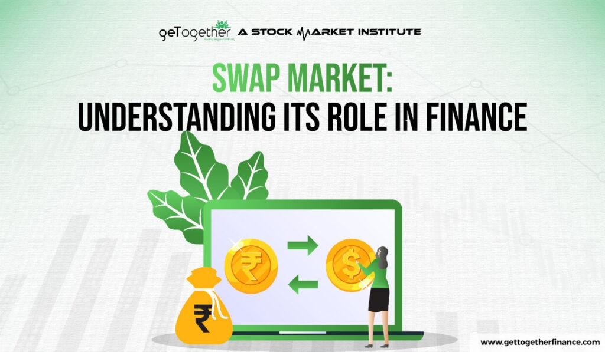

## Table of Contents

## What is a swap market in finance?

A swap market in finance is where people and businesses trade special agreements called swaps. Swaps are like contracts where two parties agree to exchange cash flows or other financial elements over time. For example, one common type of swap is an interest rate swap, where one party pays a fixed interest rate and the other pays a floating rate. This helps both parties manage their risks better, because they can predict their costs more easily or benefit from changes in interest rates.

The swap market is very important because it helps companies and investors manage different kinds of financial risks. These risks can include changes in interest rates, currency exchange rates, or even commodity prices. By using swaps, a company can protect itself from sudden changes that might hurt its business. The swap market makes it easier for everyone to find someone willing to take the other side of the swap, making it a vital part of modern finance.

## How do swap markets function?

Swap markets work by bringing together people or companies who want to trade different types of financial risks. Imagine you have a loan with a variable interest rate, but you'd feel safer with a fixed rate. You can go to the swap market and find someone who wants the opposite - they have a fixed rate but want to switch to a variable one. You both agree on terms, and then you swap your interest payments. This way, you get the fixed rate you want, and the other person gets the variable rate they prefer. It's like trading places on a financial seesaw.

The swap market is like a big meeting place where these trades happen. It's not a physical place but a network of banks, financial institutions, and sometimes even individual traders. They use special platforms or brokers to find each other and make deals. Once a swap is agreed upon, both parties keep track of their payments and make sure they follow the terms of the swap until it ends. This helps everyone manage their money better and feel more secure about their financial future.

## What are the most common types of swaps?

The most common types of swaps are interest rate swaps and currency swaps. Interest rate swaps are when two parties agree to exchange interest payments on a loan. One party pays a fixed rate, and the other pays a floating rate that can change over time. This helps both parties manage their interest rate risk. For example, a company with a variable rate loan might use an interest rate swap to switch to a fixed rate, making their future payments more predictable.

Currency swaps are another common type. These swaps involve exchanging principal and interest payments in different currencies. This is useful for companies that do business in multiple countries. For instance, a U.S. company might want to borrow money in euros, but it's easier for them to get a loan in dollars. They can use a currency swap to convert their dollar loan into a euro loan, and then convert the payments back to dollars when it's time to pay back the loan. This helps them manage their currency risk and do business more easily across borders.

## Why are swap markets important in financial systems?

Swap markets are important in financial systems because they help people and businesses manage their risks better. Imagine you're a company with a loan that has a variable interest rate, but you'd feel safer with a fixed rate. You can go to the swap market and find someone who wants the opposite - they have a fixed rate but want to switch to a variable one. By making this swap, you can make your future payments more predictable, which helps you plan your budget better. This is just one example, but swap markets help with all sorts of risks, like changes in currency values or commodity prices.

Another reason swap markets are important is that they make the financial system more flexible and efficient. Without swap markets, companies might struggle to find the right kind of loan or investment they need. But with swap markets, they can find someone willing to take the other side of their swap, which makes it easier to manage their finances. This flexibility helps the whole economy run smoother because companies can focus on their business instead of worrying about financial risks. So, swap markets play a big role in keeping the financial world stable and helping everyone manage their money better.

## How do interest rate swaps work?

Interest rate swaps are like special agreements where two people or companies trade their interest payments on loans. Imagine you have a loan with a variable interest rate that changes over time, but you'd feel safer with a fixed rate that stays the same. You can find someone who has a loan with a fixed rate but wants to switch to a variable rate. You both agree to swap your interest payments, so you start paying the fixed rate, and they start paying the variable rate. This helps you because now your payments are predictable, and it helps them because they might benefit if the variable rate goes down.

The process starts when both parties agree on the terms of the swap, like how much money is involved and for how long. They use a special contract that says how often they'll exchange payments, usually every few months. For example, if you have a $1 million loan, you might agree to swap the interest payments on that amount. Every time a payment is due, you pay the fixed rate to the other person, and they pay you the variable rate. This continues until the swap ends, which could be when the loan is paid off or at a set date in the future. Interest rate swaps help both parties manage their money better and feel more secure about their future payments.

## What is the role of currency swaps in international finance?

Currency swaps play a big role in international finance because they help companies and countries manage their money across different countries. Imagine a U.S. company wants to borrow money in euros to do business in Europe, but it's easier for them to get a loan in dollars. They can use a currency swap to change their dollar loan into a euro loan. This way, they can use the money they need in Europe without worrying about changing currencies all the time. It makes their business easier and helps them avoid losing money if the value of the euro changes compared to the dollar.

Another important thing about currency swaps is that they help countries manage their money better too. Sometimes, a country might need to borrow money in a different currency, but it's hard for them to do that directly. They can use a currency swap to borrow in their own currency and then swap it for the currency they need. This helps them keep their finances stable and avoid big problems if the exchange rates change suddenly. So, currency swaps are a key tool in making international finance work smoothly and helping everyone manage their money across borders.

## How do swaps help in managing financial risks?

Swaps are like special agreements that help people and companies handle their money worries better. Imagine you have a loan with an interest rate that keeps changing, but you'd feel safer if it stayed the same. You can find someone who wants the opposite - they have a fixed rate but want it to change. By making a swap, you can switch to a fixed rate, making your future payments easier to predict. This helps you plan your budget better and not worry so much about sudden changes in interest rates. Swaps work the same way for other risks, like changes in currency values or commodity prices, letting you trade your risks with someone else who is willing to take them on.

Another way swaps help is by making the financial world more flexible and easier to navigate. Without swaps, companies might struggle to find the right kind of loan or investment they need. But with swaps, they can find someone willing to trade their financial situation, which makes managing their money much simpler. This flexibility helps the whole economy run smoother because companies can focus on their business instead of worrying about financial risks. So, swaps are a big help in keeping the financial world stable and helping everyone manage their money better.

## What are the differences between OTC and exchange-traded swaps?

OTC swaps, or over-the-counter swaps, are like private deals between two people or companies. They don't happen on a big public market. Instead, they use special platforms or brokers to find each other and agree on the terms of the swap. This means they can customize the swap to fit their exact needs, like choosing the exact amount of money or the specific dates for payments. But because they're private, there's more risk that one side might not keep their promise, so they need to be careful and trust each other.

Exchange-traded swaps, on the other hand, happen on big public markets, like stock exchanges. These swaps are standardized, which means everyone uses the same terms and conditions. This makes them easier to buy and sell because they're more predictable. Also, because they're on a public market, there's less risk that someone won't keep their promise, since the exchange helps make sure everything goes smoothly. But the downside is that you can't customize them as much as OTC swaps.

## How do regulatory frameworks impact swap markets?

Regulatory frameworks are like rules that help keep the swap markets safe and fair. They make sure that people and companies who use swaps follow certain guidelines, like reporting their swaps to special organizations that keep track of them. This helps everyone know what's going on in the market and reduces the chance of big problems. For example, after the financial crisis in 2008, new rules were made to make sure swaps are more transparent and that there's less risk of one side not keeping their promise. These rules can make it harder for some people to use swaps, but they also make the market more stable and trustworthy.

Regulations also affect how swaps are traded. Some rules say that certain types of swaps have to be traded on public markets instead of privately. This is to make sure there's more competition and that prices are fair. But it can also make things more complicated for companies that used to do their swaps privately. They might need to change how they do business to follow the new rules. Overall, regulatory frameworks are important because they help keep the swap markets running smoothly and safely, even if they sometimes make things a bit more challenging for the people using them.

## What are the current trends in the swap markets?

Right now, one big trend in the swap markets is the move towards more electronic trading. Instead of making deals over the phone or in person, more and more swaps are being traded on special computer platforms. This makes things faster and easier for everyone. It also helps make the market more open and fair because everyone can see what's happening. But it can be a challenge for some people to learn how to use these new systems.

Another trend is the growing use of swaps to manage risks from climate change. Companies are using swaps to protect themselves from things like changes in the price of carbon credits or the cost of renewable energy. This helps them plan better for the future and make their businesses more sustainable. It's a new way for swaps to help companies deal with the challenges of a changing world.

## How do swaps affect the overall economy?

Swaps help the overall economy by letting companies manage their money risks better. Imagine a company that does business in different countries and needs to borrow money in different currencies. They can use swaps to switch their loans from one currency to another, which makes it easier for them to do business without worrying about sudden changes in currency values. This helps companies plan their budgets better and focus on growing their business instead of worrying about financial risks. When companies are more stable, it's good for the whole economy because they can keep people working and keep making things that people need.

Another way swaps affect the economy is by making the financial system more flexible and efficient. Without swaps, companies might have a hard time finding the right kind of loan or investment they need. But with swaps, they can find someone willing to trade their financial situation, which makes it easier to manage their money. This flexibility helps the economy run smoother because companies can focus on their business instead of worrying about financial risks. So, swaps play a big role in keeping the financial world stable and helping everyone manage their money better, which in turn helps the economy grow.

## What advanced strategies can be employed using swaps?

One advanced strategy using swaps is called basis trading. This is when someone uses swaps to take advantage of small differences in how interest rates are calculated. For example, if the interest rate for a loan is slightly different from the rate used in a swap, a person can make a profit by trading between the two. It's like finding a good deal by comparing prices at different stores. Basis trading can be tricky because the differences are small, but it can be a smart way to make money if you know what you're doing.

Another strategy is using swaps for hedging complex risks. Imagine a company that makes products using materials that can change in price, like oil or metals. They can use swaps to lock in the price of these materials for the future, so they don't have to worry if the prices go up suddenly. This helps them plan their costs better and keep their business running smoothly. It's like buying insurance for their business, making sure they can keep making their products no matter what happens to the prices of the materials they need.

## What are the types of swap financial instruments?

There are several varieties of swaps, each serving unique purposes:

1. **Interest Rate Swaps**: These swaps enable the exchange of fixed-rate obligations with floating-rate ones, assisting parties in managing interest rate exposure. The basic formula to calculate the net cash flow involved in an interest rate swap is:
$$
   \text{Net Cash Flow} = (\text{Notional Principal}) \times (\text{Floating Rate} - \text{Fixed Rate})

$$

   The floating rate is usually based on a reference rate such as the LIBOR or EURIBOR.

2. **Currency Swaps**: These involve the exchange of principal and interest payments in different currencies, addressing foreign exchange risk. The swap entails two legs, each in a different currency, where the parties exchange an equivalent amount at the current exchange rate, and agree to reverse the principal exchange at a future date. This instrument is particularly useful for companies operating in multiple countries.

    For example, in a USD/EUR currency swap, the formula for the exchanged payment can be calculated as:
$$
   \text{Payment in Currency A} = \text{Principal in Currency B} \times \text{Exchange Rate}

$$

3. **Equity Swaps**: These allow parties to exchange potential returns on equities, such as the return on an equity index. Typically, one party agrees to pay a fixed or floating interest rate, while the other pays the returns from an equity or equity index. This swap enables investors to gain exposure to equity markets without owning the underlying securities.

   An example return computation can be expressed as:
$$
   \text{Return} = \left( \text{Equity Index End Value} - \text{Equity Index Start Value} \right) / \text{Equity Index Start Value}

$$

4. **Credit Default Swaps (CDS)**: These function similarly to insurance and protect against credit risk. The buyer of a CDS pays a periodic fee to the seller in exchange for a payoff if a particular credit event, such as a default by the borrower, occurs. This instrument is crucial for managing credit exposure and transferring credit risk in financial markets.

Each swap type offers nuanced applications for risk management and speculative strategies. The strategic deployment of these instruments allows market participants to tailor their exposure to [interest rate](/wiki/interest-rate-trading-strategies) fluctuations, currency exchange movements, equities, and credit events to align with their financial goals and risk tolerance levels.

## References & Further Reading

[1]: Hull, J. C. (2017). ["Options, Futures, and Other Derivatives"](https://www.semanticscholar.org/paper/Options%2C-Futures%2C-and-Other-Derivatives-Hull/89bdee500c8623864fc9eb7a471546aa713acc44). Pearson Education.

[2]: Fabozzi, F. J., & Mann, S. V. (2010). ["Handbook of Fixed Income Securities"](https://www.mhebooklibrary.com/doi/book/10.1036/9781260473902?contentTab=true). McGraw-Hill Education.

[3]: Hull, J. C. (2017). ["Risk Management and Financial Institutions"](https://www.amazon.com/Management-Financial-Institutions-Wiley-Finance/dp/1119932483). Wiley.

[4]: Brigo, D., & Mercurio, F. (2007). ["Interest Rate Models - Theory and Practice: With Smile, Inflation and Credit"](https://link.springer.com/book/10.1007/978-3-540-34604-3). Springer.

[5]: Lopez de Prado, M. (2018). ["Advances in Financial Machine Learning"](https://www.amazon.com/Advances-Financial-Machine-Learning-Marcos/dp/1119482089). Wiley.