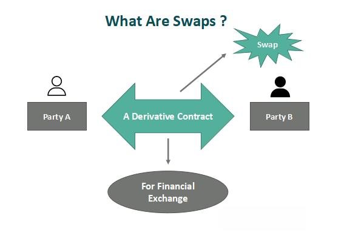

Understanding financial markets is essential for leveraging opportunities such as those presented by the swap market. As a prominent yet complex component of these markets, the swap market often eludes complete understanding by casual participants. Derivative in nature, swap agreements provide a platform for exchanging cash flows between parties based on specific financial parameters. 

Swaps are instrumental in managing a range of financial exposures and are indispensable for both hedging and speculative strategies. The mechanics of these instruments, coupled with their strategic importance, underscore their role in contemporary finance.

The integration of advanced technologies, particularly algorithmic trading, has revolutionized these markets. Algorithms, through their ability to execute trades based on predefined conditions, offer unmatched speed and efficiency. This has made them crucial in managing the complexity and scale of transactions in the swap market.

As we explore the intricacies of swap financial instruments and the growing indispensability of algorithm-driven trading strategies, it is important to recognize the symbiotic relationship between technological advancements and financial innovation. This introduction serves as a gateway to understanding the dynamics that interlink swaps, financial instruments, and strategy execution within a technology-driven financial environment.

## Table of Contents

## What is the Swap Market?

At its core, the swap market operates as a global over-the-counter (OTC) platform where financial contracts known as swaps are conducted. These derivative contracts facilitate the exchange of cash flows between two parties, typically used for risk management or speculative purposes. Swaps enable counterparties to hedge against financial risks or to speculate on variables such as interest rates, currency exchange rates, or equity returns. This is achieved through the exchange of cash flows based on underlying financial instruments or indices.

The swap market is extensive, with trillions of dollars in notional principal being exchanged. This vast scale underscores its vital role in corporate finance and risk management. Swaps allow companies to manage financial risks more effectively, such as stabilizing cash flows and reducing exposure to adverse market movements.

Swaps are generally customized agreements, which distinguishes them from contracts traded on traditional exchanges. This customization provides flexibility in terms and conditions, allowing parties to tailor the contract to their specific risk management needs. However, this also introduces additional complexity, primarily because of counterparty risk. Since swaps are OTC contracts, they are subject to the creditworthiness of the counterparties, making it crucial to assess and manage potential credit risk exposure.

Understanding the structure and functionality of the swap market is crucial for financial professionals who aim to leverage these instruments strategically. The market's non-standardized nature means that professionals must be adept at tailoring agreements to suit specific financial objectives and meticulously managing associated risks. As such, swaps represent a sophisticated and powerful tool in the financial landscape, offering the potential to significantly impact corporate strategy and financial outcomes.

## Types of Swap Financial Instruments

There are several varieties of swaps, each serving unique purposes:

1. **Interest Rate Swaps**: These swaps enable the exchange of fixed-rate obligations with floating-rate ones, assisting parties in managing interest rate exposure. The basic formula to calculate the net cash flow involved in an interest rate swap is:
$$
   \text{Net Cash Flow} = (\text{Notional Principal}) \times (\text{Floating Rate} - \text{Fixed Rate})

$$

   The floating rate is usually based on a reference rate such as the LIBOR or EURIBOR.

2. **Currency Swaps**: These involve the exchange of principal and interest payments in different currencies, addressing foreign exchange risk. The swap entails two legs, each in a different currency, where the parties exchange an equivalent amount at the current exchange rate, and agree to reverse the principal exchange at a future date. This instrument is particularly useful for companies operating in multiple countries.

    For example, in a USD/EUR currency swap, the formula for the exchanged payment can be calculated as:
$$
   \text{Payment in Currency A} = \text{Principal in Currency B} \times \text{Exchange Rate}

$$

3. **Equity Swaps**: These allow parties to exchange potential returns on equities, such as the return on an equity index. Typically, one party agrees to pay a fixed or floating interest rate, while the other pays the returns from an equity or equity index. This swap enables investors to gain exposure to equity markets without owning the underlying securities.

   An example return computation can be expressed as:
$$
   \text{Return} = \left( \text{Equity Index End Value} - \text{Equity Index Start Value} \right) / \text{Equity Index Start Value}

$$

4. **Credit Default Swaps (CDS)**: These function similarly to insurance and protect against credit risk. The buyer of a CDS pays a periodic fee to the seller in exchange for a payoff if a particular credit event, such as a default by the borrower, occurs. This instrument is crucial for managing credit exposure and transferring credit risk in financial markets.

Each swap type offers nuanced applications for risk management and speculative strategies. The strategic deployment of these instruments allows market participants to tailor their exposure to [interest rate](/wiki/interest-rate-trading-strategies) fluctuations, currency exchange movements, equities, and credit events to align with their financial goals and risk tolerance levels.

## Role of Algorithmic Trading in the Swap Market

Algorithmic trading, often referred to as algo trading, leverages computer systems to execute trades based on pre-programmed criteria, ensuring transactions are conducted with optimal speed and efficiency. In the swap market, these algorithms play a significant role in simplifying the management of intricate transactions and accommodating high volumes of trades. By utilizing algorithmic models, traders can enhance [liquidity](/wiki/liquidity-risk-premium), reduce transaction costs, and decrease market impact.

One of the primary functions of algorithms in the swap market is to assist traders in hedging their positions more effectively. Algorithms process real-time data to adjust positions dynamically, allowing traders to respond swiftly to changing market conditions. For example, algorithms can be used to monitor interest rate fluctuations and adjust interest rate swap portfolios accordingly, mitigating potential risks associated with rate changes.

Moreover, [algorithmic trading](/wiki/algorithmic-trading) enables speculation through the utilization of complex trading strategies that rely on historical data analysis and predictive models. These algorithms can execute trades at speeds far beyond human capabilities, which is particularly advantageous in volatile markets where rapid response can result in significant financial gains.

The integration of advanced algorithms promotes enhanced decision-making processes by providing traders with comprehensive insights into market trends and potential future movements. For instance, [machine learning](/wiki/machine-learning) algorithms can be trained to recognize patterns in swap market behavior, predicting price changes and allowing for more informed trading decisions. This aspect of algorithmic trading supports a more strategic approach to engaging with swap financial instruments, allowing for informed speculation and effective risk management.

As technology continues to evolve, the role of algorithmic trading in the swap market is expected to grow. Future advancements may introduce more sophisticated models capable of handling even greater levels of complexity and providing deeper insights into market dynamics. For traders, mastering these technologies and integrating them into their strategies will be crucial for maintaining a competitive edge in the swap market. 

Ultimately, algorithmic trading reshapes the landscape for financial instruments within swap markets by enhancing liquidity, reducing costs, and supporting advanced trading strategies, making it an indispensable tool for modern financial operations.

## Benefits and Risks of Swaps in Financial Strategies

Swaps, as versatile financial instruments, offer a range of strategic advantages for risk management and speculative endeavors. They stand out for their ability to provide enhanced flexibility in managing various financial exposures without necessitating significant upfront investments. One of the primary benefits swaps offer is their capacity to enable entities to adjust their exposure to specific risks, such as interest rate fluctuations, currency exchange movements, and potential credit events. For instance, a corporation with a floating-rate debt may engage in an interest rate swap to convert its payments to a fixed rate, thereby stabilizing cash flow against interest rate [volatility](/wiki/volatility-trading-strategies).

Swaps are particularly favored for cost-effective hedging strategies. Unlike direct investments in underlying assets, swaps can replicate cash flows and hedge risks at a fraction of the cost, offering a more economical approach to risk management. Furthermore, they provide opportunities for speculative positioning. Market participants can use swaps to gain exposure to desired financial variables, such as an equity index or currency rate, intending to profit from anticipated market movements without acquiring the assets directly.

Despite these benefits, swaps inherently [carry](/wiki/carry-trading) risks that must be meticulously managed. Chief among these is counterparty risk, which is the risk that one party in the swap agreement will default on their obligations, leading to potential financial losses for the other party. This risk is particularly pronounced in the over-the-counter (OTC) nature of swaps since they are bilaterally negotiated agreements and not standardized like exchange-traded contracts.

Regulatory developments, especially following the 2008 financial crisis, have aimed to mitigate these risks. For example, the Dodd-Frank Wall Street Reform and Consumer Protection Act in the United States introduced measures to increase transparency and reduce systemic risk in the swap market, such as mandatory reporting and clearing requirements for certain types of swaps. These regulations emphasize the need for robust compliance and documentation practices to navigate the regulatory landscape effectively.

Incorporating swaps into a financial portfolio necessitates a thorough understanding of their strategic utility and associated liabilities. Policymakers, investors, and financial professionals must weigh the advantages of swaps against their inherent risks, particularly focusing on counterparty exposures and the evolving regulatory requirements. A balanced approach ensures that swaps are employed to enhance a portfolio's risk-return profile without inadvertently amplifying risks.

## Conclusion

The swap market represents a key component of contemporary financial systems, enabling the intricate management of risk and strategically crafted trading maneuvers. These instruments provide flexibility to participants who navigate diverse risks—such as interest rate volatilities and currency exchange rate fluctuations—through tailored contracts. As global economic interconnections deepen, the indispensability of swaps continues to grow, highlighting their impact on financial stability and opportunity.

Algorithmic trading's growing footprint in these markets underscores its transformative power. By automating trades, algorithms elevate precision and expedite execution beyond the practical limits of manual processes. This enhances liquidity and reduces transaction costs, yielding competitive advantages to practitioners well-versed in these technologies. Mastering such algorithmic capabilities alongside a comprehensive understanding of swap mechanisms is essential for unlocking substantial strategic and financial gains.

However, the complexity of swaps is accompanied by inherent risks, particularly relating to counterparty reliability and compliance with evolving regulations. The 2008 financial crisis, for instance, catalyzed regulatory shifts aimed at mitigating these risks, evidenced by frameworks such as the Dodd-Frank Act in the United States. Investors and financial professionals must remain vigilant, ensuring both thorough due diligence and operational compliance.

As technological advancements and regulatory landscapes continue to evolve, ongoing analysis and adaptation remain crucial to sustaining engagement with the swap market. Successfully navigating these changes demands an agile approach and a forward-thinking mindset, essential for leveraging the market's full potential. By fostering these competencies, financial actors can secure pivotal advantages in a highly interconnected and dynamic economic environment.

## References & Further Reading

[1]: Hull, J. C. (2017). ["Options, Futures, and Other Derivatives"](https://www.semanticscholar.org/paper/Options%2C-Futures%2C-and-Other-Derivatives-Hull/89bdee500c8623864fc9eb7a471546aa713acc44). Pearson Education.

[2]: Fabozzi, F. J., & Mann, S. V. (2010). ["Handbook of Fixed Income Securities"](https://www.mhebooklibrary.com/doi/book/10.1036/9781260473902?contentTab=true). McGraw-Hill Education.

[3]: Hull, J. C. (2017). ["Risk Management and Financial Institutions"](https://www.amazon.com/Management-Financial-Institutions-Wiley-Finance/dp/1119932483). Wiley.

[4]: Brigo, D., & Mercurio, F. (2007). ["Interest Rate Models - Theory and Practice: With Smile, Inflation and Credit"](https://link.springer.com/book/10.1007/978-3-540-34604-3). Springer.

[5]: Lopez de Prado, M. (2018). ["Advances in Financial Machine Learning"](https://www.amazon.com/Advances-Financial-Machine-Learning-Marcos/dp/1119482089). Wiley.