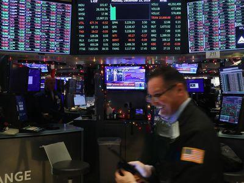

Financial markets have long formed the backbone of global economic systems, facilitating the exchange of assets, risk, and capital across both borders and sectors. Historically, trading practices within these markets have evolved alongside technological, regulatory, and institutional transformations. Understanding this progression is vital to appreciating the current state and future potential of financial markets.

Initially, financial markets heavily relied on the expertise and intuition of exchange floor traders. These individuals operated on physical trading floors, where open outcry systems were prevalent. This method involved traders shouting bids and offers to each other, a practice necessitating not only acute mathematical skills but also an ability to interpret market signals quickly. Exchange floor traders played a crucial interpersonal role, often forming networks and building reputations that were critical to their effectiveness and success. Their activities formed the essence of price discovery and liquidity provision, influencing market dynamics and efficiency.

However, with the advent of computing technology and advances in telecommunication networks, the landscape of trading began to shift dramatically. This paved the way for algorithmic trading, a method that utilizes complex algorithms to autonomously execute trades based on pre-defined criteria. Algorithmic trading represented a modern development in trading practices, characterized by speed, precision, and the elimination of many manual processes. This shift marks a significant departure from the traditional methods, as decisions that once required human intuition and expertise are now programmed into machines capable of processing vast amounts of data in milliseconds.

Understanding the transition from floor trading to algorithmic trading is essential not only for traders and financial professionals but also for regulators and policy-makers. This shift highlights broader economic and societal trends towards automation and technology-driven solutions. Recognizing the nuances of this evolution allows stakeholders to make informed decisions regarding regulation, risk management, and strategic planning.

The purpose of this article is to explore the intricate journey from the era of exchange floor trading to the contemporary world of algorithmic trading. By doing so, it aims to illuminate the significant changes in trading roles, methods, and impacts on financial markets. Furthermore, it provides insights into the challenges and controversies that accompany these advancements, offering a comprehensive understanding of the past developments and future possibilities in trading practices.

## Table of Contents

## The Era of Exchange Floor Traders

Exchange floor trading, a predominant method of executing trades in the financial markets for much of the 20th century, involved face-to-face interactions within designated exchange facilities. These facilities, often referred to as trading pits, facilitated the buying and selling of financial instruments through a system known as open outcry. In this system, traders used vocal bids and hand signals to convey trading intentions, permitting rapid transaction execution in a lively and often chaotic environment.

The operational mechanics of exchange floor trading relied heavily on real-time communication and the physical presence of traders on the exchange floor. Traders were responsible for physically executing trades on behalf of clients or firms. Their roles were categorized into various profiles, such as brokers, whose primary function was to buy and sell orders for clients, and market makers, who provided [liquidity](/wiki/liquidity-risk-premium) by standing ready to buy or sell at publicly quoted prices.

Human intuition, communication skills, and swift decision-making were vital components in the success of exchange floor traders. The ability to read the market context, distinguish genuine trading signals from noise, and gauge the immediate supply and demand dynamics required a high level of expertise and experience. Traders used their understanding of market psychology and nuanced judgment, often developed over years of trading, to make informed decisions in an environment where timing and accuracy were crucial.

Historically, floor trading had a profound impact on financial markets. It facilitated price discovery and liquidity, enabling efficient market operations, especially before the advent of electronic trading systems. The presence of skilled human traders ensured that complex orders could be efficiently managed and executed, contributing to market integrity and confidence. However, floor trading was not without its challenges and limitations. The system was inherently susceptible to human error and could be influenced by subjective biases and the physical intimidation present within trading pits. Additionally, the sheer [volume](/wiki/volume-trading-strategy) of trades and the speed at which they occurred made it difficult to maintain accuracy and transparency, particularly under volatile market conditions.

Over time, the limitations of floor trading became more pronounced. Issues such as the lack of scalability and constraints on trading hours limited its efficiency and potential for growth. These challenges set the stage for the progressive transition toward electronic, algorithm-based systems that would redefine trading practices in the subsequent decades.

## Rise of Algorithmic Trading

Algorithmic trading refers to the use of computer algorithms to manage trading orders in financial markets. These algorithms are designed to execute strategies based on pre-defined criteria, such as timing, price, or volume, thereby automating the trading process. The concept of [algorithmic trading](/wiki/algorithmic-trading) emerged as a result of the increasing complexity and speed required in modern financial markets, which human traders alone could not efficiently handle.

The rise of algorithmic trading has been facilitated by several technological advancements. Key among them is the development of high-speed communication networks that allow for rapid data transmission and execution of trades. Advanced computing technology enables the processing of large datasets and the execution of complex mathematical models that underpin algorithmic strategies. Furthermore, innovations in [machine learning](/wiki/machine-learning) and [artificial intelligence](/wiki/ai-artificial-intelligence) have enhanced the capability of algorithms to learn from historical data and adapt to changing market conditions.

Algorithmic trading offers several advantages over traditional floor trading. One significant benefit is the increased speed of execution. Algorithms can execute trades much faster than human traders, which is crucial in high-frequency trading environments where milliseconds can affect profitability. Additionally, algorithmic trading negates human emotional biases, ensuring trades are executed based on data-driven strategies. The scalability of algorithms allows for handling large volumes of trades across different markets simultaneously, which would be challenging for manual traders.

Despite these advantages, algorithmic trading is not without drawbacks and risks. One concern is the potential for technical failures, such as software bugs or connectivity issues, which can lead to significant financial losses. The reliance on complex algorithms can also introduce systemic risks, wherein a flaw in a widely used algorithm could impact multiple financial institutions simultaneously. Additionally, algorithmic trading strategies, particularly high-frequency trading, have been criticized for contributing to market [volatility](/wiki/volatility-trading-strategies) and flash crashes. 

An example of the risks involved is the May 6, 2010 Flash Crash, where the Dow Jones Industrial Average plunged almost 1,000 points within minutes, largely attributed to algorithmic trading strategies that reacted to market imbalances. Consequently, regulatory bodies have introduced rules to mitigate such risks, including circuit breakers and limits on order cancellations.

In summary, while algorithmic trading provides significant efficiencies and capabilities that surpass traditional floor trading, it introduces unique challenges. Stakeholders must weigh these advantages against the inherent risks, ensuring robust infrastructure, oversight, and ethical considerations in the deployment of trading algorithms.

## Impact on the Role of Traders

The advent of algorithmic trading has significantly transformed the roles and skill sets required of traders in financial markets. Unlike traditional floor trading, which relied heavily on human intuition and interpersonal skills, modern trading demands a deep understanding of algorithms, data analysis, and technology.

Algorithmic trading has redefined trader responsibilities, shifting the focus from manual order execution and negotiation to the development, monitoring, and refinement of trading strategies. Traders are now responsible for designing algorithms that can analyze market conditions, execute trades, and manage risk autonomously. This shift requires a strong foundation in programming languages such as Python or C++, as well as a good grasp of quantitative analysis and statistical models. For instance, traders might model price movements using statistical methods or employ machine learning techniques to identify patterns in large datasets.

In the modern trading environment, skills such as coding, data analysis, and proficiency in quantitative methods are crucial. Traders need to understand complex algorithms and be capable of modifying them to adapt to changing market conditions. Moreover, knowledge of financial instruments, market microstructures, and regulatory frameworks remains essential, albeit with a technological focus. 

Integration of technology into the trading process involves utilizing advanced trading platforms and tools. These systems enable real-time data analysis and visualization, helping traders make informed decisions swiftly. Algorithmic traders often work alongside software developers and data scientists to create robust trading systems that can handle vast amounts of data and execute trades with minimal latency.

As technology continues to evolve, the future role of human traders will likely involve more oversight and strategy development rather than execution. While algorithms can efficiently handle high-frequency trading and complex calculations, human judgment remains crucial in understanding macroeconomic factors and market sentiment, which are challenging to quantify. Human traders will likely focus on creating innovative strategies, optimizing algorithmic efficiency, and managing overall risk, ensuring that technology supplements rather than replaces human expertise.

In conclusion, the role of traders has fundamentally shifted due to algorithmic trading, necessitating a blend of traditional financial knowledge with advanced technological skills. The continued evolution of technology in trading will shape the future roles and responsibilities of traders, highlighting the importance of both human insight and algorithmic efficiency in market participation.

## Challenges and Controversies

Algorithmic trading has significantly transformed financial markets by introducing speed, efficiency, and complexity. However, it presents several challenges and controversies that warrant careful consideration.

One of the primary challenges posed by algorithmic trading is market volatility. The rapid execution of trades enabled by algorithms can lead to "flash crashes," where the market experiences sudden and severe price drops. For example, on May 6, 2010, the U.S. stock market suffered a flash crash resulting in the Dow Jones Industrial Average plunging nearly 1,000 points within minutes, only to recover most of the loss shortly after. This incident highlighted the potential systemic risks that algorithmic trading can introduce, exacerbating liquidity issues and increasing market instability (Kirilenko et al., 2017).

High-frequency trading ([HFT](/wiki/high-frequency-trading-strategies)), a subset of algorithmic trading, has attracted significant controversy. HFT firms use powerful algorithms to transact large numbers of orders at incredibly high speeds. Critics argue that HFT contributes to market manipulation and unfair advantages, as these traders can front-run orders and manipulate market prices. The ability of HFTs to profit from minimal price discrepancies raises ethical concerns about fairness in the market [Perez, 2012].

Regulatory bodies have responded to these challenges with various measures. In the U.S., the Securities and Exchange Commission (SEC) and Commodity Futures Trading Commission (CFTC) have implemented regulations such as the "Market Access Rule," which requires brokers to have risk controls in place for algorithmic trading. In Europe, the Markets in Financial Instruments Directive II (MiFID II) addresses algorithmic trading by requiring traders to have adequate risk management systems and mandating the disclosure of algorithmic trading activities.

Despite these regulations, incidents of trading algorithms malfunctioning continue to occur. In August 2012, Knight Capital Group suffered a loss of $440 million after a software error caused its trading algorithm to execute millions of faulty trades within 30 minutes. This incident underscored the potential for catastrophic consequences if algorithms are not rigorously tested and monitored.

Overall, while algorithmic trading enhances market liquidity and efficiency, it presents challenges that require ongoing scrutiny from regulators and market participants. Balancing technological advancement with market stability remains an essential endeavor for the financial industry.

**References**

- Kirilenko, A.A., Kyle, A.S., Samadi, M., & Tuzun, T. (2017). The Flash Crash: The Impact of High‐Frequency Trading on an Electronic Market. The Journal of Finance, 72(3), 967-998.

- Perez, V. (2012). High-Frequency Trading: Rinse or Repeat?, The Journal of Trading, 7(3), 24-34.

## Conclusion

The transition from exchange floor trading to algorithmic trading marks a significant evolution in financial markets. Historically, floor traders dominated trading, where human intuition, quick decision-making, and the ability to communicate effectively on the trading floor were vital. However, with technological advancements, particularly in computing power and data processing, algorithmic trading has emerged as a vital component in modern finance. Algorithmic trading utilizes complex mathematical models and high-speed data processing to execute trades at speeds and volumes unimaginable for humans.

This evolution highlights a shift in the balance between technology and traditional human input. While technology offers unparalleled speed, efficiency, and the ability to handle vast datasets, human traders still provide critical oversight, judgment, and the ability to adapt to unforeseen circumstances. The human element remains crucial, offering insights that algorithms, which rely heavily on historical data and pre-defined rules, may overlook.

Looking forward, the trading landscape continues to evolve with developments in artificial intelligence and machine learning, pushing the boundaries of what algorithmic trading can achieve. The integration of AI could enable more adaptive algorithms, capable of adjusting their strategies in real-time to market conditions. However, this raises concerns about the transparency and interpretability of such models, which could become increasingly complex.

The synergy between human and algorithmic elements remains essential. Human oversight ensures that ethical considerations and long-term strategic goals are respected, minimizing the risks posed by automated systems that could exacerbate market volatility. For market participants and stakeholders, this balance is crucial. They must adapt to a landscape where both technological prowess and human expertise converge to navigate the complexities of modern trading. This integration not only enhances the efficiency and effectiveness of market operations but also ensures that the financial ecosystem remains resilient, sustainable, and aligned with human interests.

## References & Further Reading

[1]: Kirilenko, A.A., Kyle, A.S., Samadi, M., & Tuzun, T. (2017). ["The Flash Crash: The Impact of High‐Frequency Trading on an Electronic Market."](https://onlinelibrary.wiley.com/doi/abs/10.1111/jofi.12498) The Journal of Finance, 72(3), 967-998.

[2]: Perez, V. (2012). ["High-Frequency Trading: Rinse or Repeat?"](https://www.cftc.gov/sites/default/files/idc/groups/public/@aboutcftc/documents/file/tacpresentation032912_hft.pdf) The Journal of Trading, 7(3), 24-34.

[3]: Bergstra, J., Bardenet, R., Bengio, Y., & Kégl, B. (2011). ["Algorithms for Hyper-Parameter Optimization."](https://dl.acm.org/doi/10.5555/2986459.2986743) Advances in Neural Information Processing Systems 24.

[4]: ["Advances in Financial Machine Learning"](https://www.wiley.com/en-us/Advances+in+Financial+Machine+Learning-p-9781119482086) by Marcos Lopez de Prado

[5]: ["Evidence-Based Technical Analysis: Applying the Scientific Method and Statistical Inference to Trading Signals"](https://www.wiley.com/en-us/Evidence+Based+Technical+Analysis%3A+Applying+the+Scientific+Method+and+Statistical+Inference+to+Trading+Signals-p-9780470008744) by David Aronson

[6]: ["Machine Learning for Algorithmic Trading"](https://github.com/PacktPublishing/Machine-Learning-for-Algorithmic-Trading-Second-Edition) by Stefan Jansen

[7]: ["Quantitative Trading: How to Build Your Own Algorithmic Trading Business"](https://books.google.com/books/about/Quantitative_Trading.html?id=j70yEAAAQBAJ) by Ernest P. Chan