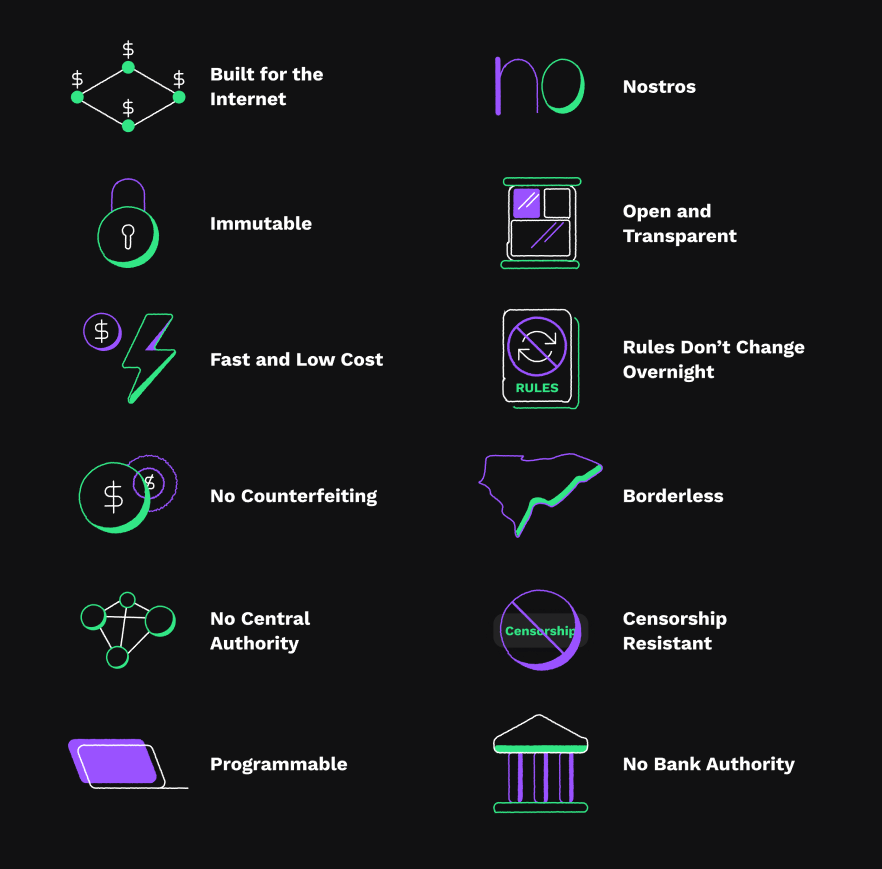

## Table of Contents

## What is XRP and how does it relate to Ripple?

XRP is a type of digital currency, similar to Bitcoin. It was created by a company called Ripple. People use XRP to quickly send money from one place to another, especially between different countries. It's designed to make international money transfers faster and cheaper than traditional methods like banks.

Ripple is the company behind XRP. They created a system that banks and other financial institutions can use to move money around the world. Ripple's system uses XRP to make these transfers happen quickly and at a lower cost. So, while XRP is the actual currency, Ripple is the company that developed it and helps it work within the financial world.

## How is XRP used within the Ripple ecosystem?

In the Ripple ecosystem, XRP is used as a bridge currency to help move money between different countries. Imagine you want to send dollars from the United States to someone in Europe who needs euros. Instead of going through a slow and expensive bank process, you can use XRP. You convert your dollars to XRP, send the XRP quickly across the Ripple network, and then the person in Europe converts the XRP back to euros. This makes the whole process faster and cheaper.

Ripple's system, called RippleNet, is used by banks and other financial companies. They use XRP to settle transactions instantly, which means the money gets where it needs to go without delays. This is especially helpful for businesses that need to pay suppliers in other countries quickly. By using XRP, these businesses can save money on fees and get their payments processed much faster than traditional methods.

## What are the main features of XRP that benefit users?

One main feature of XRP that benefits users is its speed. When you send XRP, it gets to the other person very fast, usually in just a few seconds. This is much quicker than sending money through banks, which can take days, especially if you're sending money to another country. Because it's so fast, people and businesses can use XRP to pay each other without waiting a long time.

Another feature is that using XRP is cheap. When you send money through banks, they often charge you a lot of fees, especially for international transfers. With XRP, the fees are very low, so you get to keep more of your money. This makes it easier for people to send money around the world without worrying about high costs.

## How does XRP facilitate cross-border payments?

XRP helps make sending money across borders easier and cheaper. When you want to send money from one country to another, like from the US to Europe, you can use XRP. Instead of using banks, which can take a long time and charge a lot of fees, you turn your dollars into XRP, send it quickly over the internet, and then the person in Europe turns the XRP back into euros. This way, the money gets there fast, usually in just a few seconds.

Using XRP for cross-border payments also saves you money. Banks often charge high fees for sending money to other countries, but with XRP, the fees are very low. This means you can send more money to the person you're paying without losing a big chunk to fees. So, XRP makes it easier and cheaper for people and businesses to pay each other, no matter where they are in the world.

## What is the role of XRP in Ripple's liquidity solutions?

XRP plays a big role in Ripple's way of helping banks and businesses with their money. When a bank or business needs to send money to another country, they can use XRP to make it happen quickly and cheaply. Instead of keeping a lot of different currencies ready to use, which is called [liquidity](/wiki/liquidity-risk-premium), they can just use XRP. This is because XRP can be turned into any other currency easily, so the bank doesn't need to have a lot of different money sitting around.

Using XRP for liquidity means that banks and businesses can send money across borders without waiting and without paying a lot of fees. XRP helps them to have the money they need, when they need it, without the hassle of traditional banking methods. This makes everything smoother and more efficient, helping businesses to pay their suppliers or customers in other countries faster and with less cost.

## How does XRP compare to other cryptocurrencies in terms of speed and cost?

XRP is known for being very fast and cheap compared to many other cryptocurrencies. When you send XRP, it usually takes just a few seconds to get to the other person. This is much faster than Bitcoin, which can take around 10 minutes or even longer for a transaction to go through. Other cryptocurrencies like Ethereum can also be slower, often taking minutes to complete a transaction. Because XRP is so quick, it's really helpful for people and businesses who need to send money fast, especially across different countries.

In terms of cost, XRP is also cheaper to use than many other cryptocurrencies. When you send XRP, the fee is very small, often just a tiny fraction of a cent. This is much less than what you might pay to send Bitcoin or Ethereum, where fees can be higher, sometimes even a few dollars per transaction. Because the fees are so low, people can send XRP without worrying about losing a lot of money to fees, making it a good choice for international payments where banks usually charge a lot.

## What are the security measures in place to protect XRP transactions?

XRP transactions are protected by a few important security measures. One of the main ones is the use of cryptography. This means that when you send XRP, the information about your transaction is turned into a secret code that only the right person can read. This makes it very hard for anyone else to steal or mess with your money. Another security feature is the Ripple network's consensus mechanism, which is a way of making sure everyone agrees on what transactions are happening. Instead of using a lot of computer power like Bitcoin does, Ripple's system checks with a group of trusted computers to make sure everything is correct.

There are also other ways to keep XRP safe. For example, you can use a secure wallet to store your XRP. These wallets use special keys that only you know, and you need these keys to move your XRP. It's like having a secret password that keeps your money safe. If you lose your keys or if someone else gets them, they can take your XRP, so it's very important to keep them secret and safe. By using these security measures, XRP transactions can be protected from fraud and theft, making it a reliable way to send money.

## How does the XRP Ledger work and what is its significance?

The XRP Ledger is a special kind of computer system where people can send and receive XRP. It works like a big notebook that keeps track of all the XRP transactions happening around the world. Instead of one person or company controlling it, the XRP Ledger is managed by a group of computers that all work together. They use something called a consensus process, which means they all agree on what transactions are happening. This makes the XRP Ledger very fast and reliable because it doesn't need to wait for everyone to agree like some other systems do.

The XRP Ledger is important because it makes sending money across the world fast and cheap. It helps banks and businesses move money from one country to another without the long waits and high fees that come with traditional banks. Because the XRP Ledger is open for anyone to use and check, it's also very transparent and secure. This means people can trust that their money is safe and that the system is working fairly. Overall, the XRP Ledger plays a big role in making international payments easier and more efficient for everyone.

## What are the regulatory considerations for XRP and how do they impact its use?

The way XRP is treated by laws and rules can change depending on where you are in the world. Some places see XRP as a type of money that you can use to buy things or send to others. Other places might think of it more like a special kind of investment, which means it has to follow different rules. For example, in the United States, there has been a big discussion about whether XRP should be seen as a security, which is a kind of investment that needs to be regulated by the government. This can affect how XRP is bought, sold, and used.

These rules can have a big impact on how people use XRP. If a country decides that XRP is a security, then companies that deal with XRP might need to follow strict rules about how they sell it and who they sell it to. This could make it harder for people to use XRP for everyday things like buying things online or sending money to family in other countries. On the other hand, if XRP is seen as just another type of money, it might be easier for people to use it freely. The way these rules are made and changed can influence how popular and useful XRP becomes around the world.

## How has XRP's market performance influenced its role in the Ripple ecosystem?

XRP's market performance has had a big impact on its role within the Ripple ecosystem. When XRP's price goes up, more people and businesses might want to use it because they see it as a good investment. This can make the Ripple ecosystem more popular and attract more banks and financial companies to use Ripple's services for sending money across borders. On the other hand, if XRP's price goes down, people might be less interested in using it, which could slow down the growth of the Ripple ecosystem.

The ups and downs of XRP's market performance also affect how much trust people have in Ripple's system. If XRP does well in the market, it can show that Ripple's technology is working and that people believe in it. This can help Ripple convince more banks to join their network and use XRP for their transactions. But if XRP's price is not stable or goes down a lot, it might make some banks and businesses think twice about using it, which could make it harder for Ripple to grow its ecosystem.

## What are the future developments planned for XRP and how might they enhance its role?

Ripple is always working on making XRP better and more useful. One of the big things they are doing is improving the XRP Ledger to make it even faster and cheaper to send money. They are also looking at new ways to use XRP, like making it easier for people to pay for things online or even use it in smart contracts, which are special agreements that can happen automatically on the internet. These improvements could help more people and businesses see the value in using XRP for their everyday money needs.

These future developments could make XRP a bigger part of the Ripple ecosystem. If XRP becomes faster and cheaper to use, more banks and financial companies might want to use it for sending money around the world. This could help Ripple grow its network and make it easier for people everywhere to send money to each other without high fees or long waits. By making XRP more useful and trusted, Ripple hopes to make it a key part of how money moves in the future.

## How can businesses integrate XRP into their operations to leverage the Ripple ecosystem?

Businesses can use XRP to make their international payments faster and cheaper. Instead of using banks, which can take days and charge a lot of fees, businesses can turn their money into XRP, send it quickly over the internet, and then turn it back into the money they need on the other side. This is really helpful for businesses that need to pay suppliers or customers in other countries. By using XRP, they can save money on fees and get their payments processed much faster, which can help them run their business more smoothly.

To start using XRP, businesses can join the Ripple ecosystem by working with Ripple or using services that support XRP. They can set up an account with a digital wallet that can hold XRP and connect it to their existing payment systems. Once they're set up, they can start sending and receiving XRP for their transactions. This can make their financial operations more efficient and help them stay ahead in the global market. By integrating XRP, businesses can take advantage of Ripple's fast and low-cost payment solutions, making it easier to do business around the world.

## References & Further Reading

[1]: Bergstra, J., Bardenet, R., Bengio, Y., & Kégl, B. (2011). ["Algorithms for Hyper-Parameter Optimization."](https://proceedings.neurips.cc/paper/2011/file/86e8f7ab32cfd12577bc2619bc635690-Paper.pdf) Advances in Neural Information Processing Systems 24.

[2]: ["Advances in Financial Machine Learning"](https://www.amazon.com/Advances-Financial-Machine-Learning-Marcos/dp/1119482089) by Marcos Lopez de Prado

[3]: ["Evidence-Based Technical Analysis: Applying the Scientific Method and Statistical Inference to Trading Signals"](https://www.amazon.com/Evidence-Based-Technical-Analysis-Scientific-Statistical/dp/0470008741) by David Aronson

[4]: ["Machine Learning for Algorithmic Trading"](https://github.com/stefan-jansen/machine-learning-for-trading) by Stefan Jansen

[5]: ["Quantitative Trading: How to Build Your Own Algorithmic Trading Business"](https://www.amazon.com/Quantitative-Trading-Build-Algorithmic-Business/dp/1119800064) by Ernest P. Chan