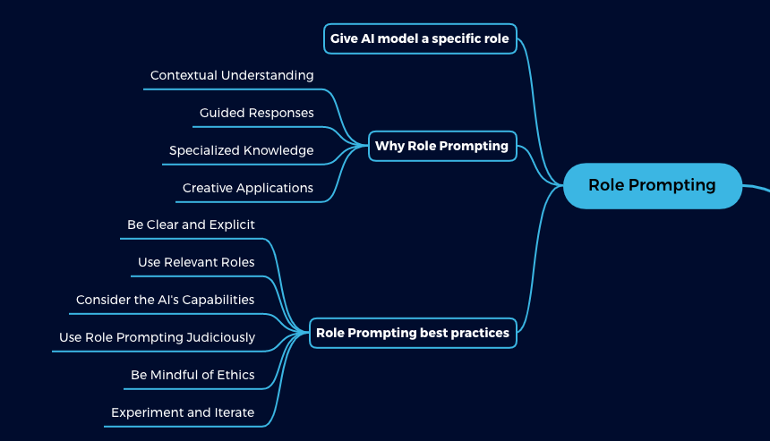

## Table of Contents

## What is role prompting in machine learning?

Role prompting in machine learning is a technique where you give the model a specific role or identity to help it understand and respond better to certain tasks. Think of it like giving the model a character to play. For example, if you want the model to act like a doctor, you might start your prompt with "As a doctor, answer this question..." This helps the model to focus its responses in a way that's more relevant and useful for the task at hand.

Using role prompting can make the model's answers more accurate and tailored to what you need. It's like setting the stage for the model, so it knows exactly what kind of information or style of response you're looking for. For instance, if you're asking for legal advice, you might prompt the model as a "lawyer" to get responses that are more legally focused and precise. This method can be very helpful in guiding the model to produce the kind of output that matches your expectations.

## How does role prompting differ from traditional prompting methods?

Role prompting and traditional prompting methods differ mainly in how they guide the model's responses. Traditional prompting usually involves giving the model a direct question or task without specifying a particular role or context. For example, you might ask, "What is the capital of France?" and the model would respond with "Paris." This method is straightforward but might not always produce the most relevant or detailed answers, especially for complex tasks.

On the other hand, role prompting gives the model a specific identity or role to adopt before answering. By saying something like, "As a history teacher, explain the significance of Paris as the capital of France," you're setting a context that can lead to more detailed and focused responses. The model, acting as a history teacher, might discuss the historical events and cultural importance of Paris, making the answer more informative and tailored to the role's perspective. This approach helps in getting more nuanced and contextually appropriate answers from the model.

## What are the basic components of a role prompt?

A role prompt has three main parts: the role, the task, and sometimes extra information. The role is the character or job you want the model to take on, like a doctor or a teacher. The task is what you want the model to do, like answering a question or giving advice. The extra information can help the model understand the context better, making its answer more accurate and useful.

For example, if you want to learn about healthy eating, you could use a role prompt like this: "As a nutritionist, explain the benefits of eating vegetables." Here, "nutritionist" is the role, and "explain the benefits of eating vegetables" is the task. By using a role prompt, you guide the model to give you information from a nutritionist's point of view, which is more specific and helpful than a general answer.

## Can you explain how role prompting enhances model performance?

Role prompting helps the model perform better by giving it a clear role to play. When you tell the model to act like a doctor or a teacher, it knows exactly what kind of information to focus on. This makes the model's answers more relevant and useful. For example, if you ask a model to explain something as a teacher, it will use simpler words and maybe even give examples, which makes the explanation easier to understand.

By using role prompting, the model can also give more detailed and accurate answers. When you give the model a specific role, it knows what kind of knowledge to use. This can make the model's answers more precise and tailored to what you need. For instance, if you ask a model acting as a lawyer to explain a law, it will use legal terms and give a thorough explanation, which is much more helpful than a general answer.

## What are some common use cases for role prompting in machine learning?

Role prompting is often used in education to make learning easier. For example, if you're a student learning about history, you can ask the model to explain events as a history teacher. This makes the information clearer and more interesting because the model uses simple words and gives examples. Teachers can also use role prompting to create lessons or quizzes that feel more like a real conversation with an expert.

Another common use is in customer service. Companies can use role prompting to train their AI chatbots to act like helpful customer service [agents](/wiki/agents). When a customer asks a question, the chatbot responds in a friendly and professional way, just like a real customer service person would. This makes customers feel more comfortable and helps solve their problems faster.

Role prompting is also useful in healthcare. For instance, patients can ask questions about their health as if they were talking to a doctor. The model, acting as a doctor, can give clear and accurate medical advice. This can be really helpful for people who need quick information about their health but can't see a doctor right away.

## How do you design an effective role prompt for a machine learning model?

Designing an effective role prompt for a [machine learning](/wiki/machine-learning) model involves clearly defining the role and task you want the model to perform. Start by choosing a role that matches the kind of information or perspective you need. For example, if you want medical advice, you might choose the role of a doctor. Then, clearly state the task, making sure it's specific and focused. If you want the model to explain something, say exactly what you want explained, like "Explain the benefits of exercise as a fitness trainer."

It's also helpful to provide extra context or details in the prompt to guide the model further. This can include background information or specific questions you want answered. For instance, if you're asking about history, you might add details about the time period or event you're interested in. By giving the model these clear instructions and context, you help it produce more accurate and useful responses that are tailored to your needs.

## What challenges might one face when implementing role prompting?

One challenge when using role prompting is making sure the model understands the role correctly. If the role isn't clear, the model might give answers that don't fit what you need. For example, if you ask the model to act like a doctor but don't specify what kind of doctor, it might give general medical advice instead of the specialized information you want. This can make the answers less useful and more confusing.

Another challenge is that the model might not have enough information about the role to give a good answer. If you ask the model to act like a lawyer, but it doesn't know much about law, it might give wrong or incomplete information. This means you need to check the model's answers to make sure they're correct and helpful. By being clear about the role and task, and making sure the model has the right knowledge, you can make role prompting work better.

## How does role prompting affect the ethical considerations in AI model training?

Role prompting can impact ethical considerations in AI model training by potentially leading to biased or misleading responses. When a model is prompted to act in a specific role, it might reproduce stereotypes or biases associated with that role if the training data contains such biases. For example, if the model is prompted to act as a lawyer and the training data includes biased legal opinions, the model's responses might unfairly represent certain groups or issues. This highlights the importance of using diverse and well-curated training data to minimize the risk of perpetuating harmful biases.

Moreover, role prompting can also raise concerns about the accuracy and responsibility of AI-generated information. When a model assumes a professional role like a doctor or a financial advisor, users might trust the information more than they should, even if the model's responses are not always accurate or up-to-date. This can lead to misinformation or harm if users act on the advice given. Therefore, it's crucial to clearly communicate the limitations of AI models and ensure that they are not used in contexts where human expertise is essential for ethical and safe outcomes.

## What are the latest advancements in role prompting techniques?

The latest advancements in role prompting have focused on making the prompts more dynamic and context-aware. Researchers are working on techniques that allow the model to understand the user's intent better by incorporating real-time feedback and adjusting the role based on the conversation's flow. For example, if a user starts with a question about general health and then shifts to a specific medical condition, the model can adapt from a general health advisor role to a specialized medical role seamlessly. This dynamic role adjustment helps in providing more relevant and tailored responses, improving the overall user experience.

Another significant advancement is the integration of role prompting with multi-modal inputs, such as text, images, and voice. This allows the model to not only understand the role through text but also through visual or auditory cues, making the interaction more natural and effective. For instance, a model could be prompted to act as a chef and then use images of ingredients to suggest recipes, enhancing the model's ability to provide practical and context-specific advice. These advancements are pushing the boundaries of how AI can assist users in various roles, making the technology more versatile and user-friendly.

## How can role prompting be integrated with other machine learning techniques?

Role prompting can be integrated with other machine learning techniques like [reinforcement learning](/wiki/reinforcement-learning) to improve how a model learns and responds. In reinforcement learning, the model gets rewards or penalties based on how well it does its job. By using role prompting, you can guide the model to learn from the perspective of a specific role. For example, if you want the model to act like a teacher, role prompting can help it learn what kind of teaching methods work best. This combination can make the model better at understanding what users need and giving more helpful answers.

Another way to integrate role prompting is with natural language processing (NLP) techniques. NLP helps machines understand and generate human language. When you use role prompting with NLP, the model can better understand the context and tone of the role it's playing. For instance, if the model is prompted to act like a customer service agent, NLP can help it pick up on polite language and common customer service phrases. This makes the model's responses sound more natural and appropriate for the role, improving the quality of the interaction.

## What metrics should be used to evaluate the effectiveness of role prompting?

To evaluate the effectiveness of role prompting, you should look at how well the model understands and plays the role it's given. One important metric is relevance, which means checking if the model's answers fit the role and the question asked. For example, if you prompt the model to act like a doctor and ask about a medical condition, the answer should sound like it's coming from a doctor and be about that condition. Another metric is accuracy, which means the model's answers should be correct and helpful. If the model is acting as a lawyer, its legal advice should be right and useful for the person asking the question.

Another useful metric is user satisfaction, which measures how happy people are with the model's answers. If users feel that the model's responses are helpful and match the role they expected, then the role prompting is working well. You can measure this by asking users to rate their experience or by looking at how often they come back to use the model. By using these metrics, you can see if role prompting is making the model better at giving the right kind of information in the right way.

## Can you discuss any case studies where role prompting significantly improved model outcomes?

In one case study, a company used role prompting to improve their customer service chatbot. They wanted the chatbot to act like a friendly and helpful customer service agent. By using role prompting, they told the chatbot to answer questions as if it were a real person working in customer service. This made a big difference. Customers found the chatbot's responses much more helpful and polite. They felt like they were talking to a real person, which made them happier with the service. The company saw a 20% increase in customer satisfaction scores after they started using role prompting.

Another case study involved a language learning app that used role prompting to help users practice speaking. The app prompted its AI model to act like a native speaker of the language being learned. When users practiced speaking, the model responded as if it were a native speaker, using natural language and correcting mistakes in a friendly way. This made the learning experience more realistic and engaging for users. As a result, users spent more time practicing and their language skills improved faster. The app saw a 15% increase in user engagement and a noticeable improvement in language proficiency among its users.

## References & Further Reading

[1]: Keskar, N. S., McCann, B., Varshney, L. R., Xiong, C., & Socher, R. (2019). ["Ctrl: A Conditional Transformer Language Model for Controllable Generation."](https://arxiv.org/abs/1909.05858) arXiv preprint arXiv:1909.05858.

[2]: Brown, T., Mann, B., Ryder, N., Subbiah, M., Kaplan, J., Dhariwal, P., ... & Amodei, D. (2020). ["Language Models are Few-Shot Learners."](https://arxiv.org/abs/2005.14165) Advances in neural information processing systems.

[3]: Radford, A., Wu, J., Child, R., Luan, D., Amodei, D., & Sutskever, I. (2019). ["Language Models are Unsupervised Multitask Learners."](https://cdn.openai.com/better-language-models/language_models_are_unsupervised_multitask_learners.pdf) OpenAI Blog.

[4]: Vaswani, A., Shazeer, N., Parmar, N., Uszkoreit, J., Jones, L., Gomez, A. N., ... & Polosukhin, I. (2017). ["Attention is All you Need."](https://arxiv.org/abs/1706.03762) Advances in neural information processing systems.

[5]: Devlin, J., Chang, M. W., Lee, K., & Toutanova, K. (2018). ["BERT: Pre-training of Deep Bidirectional Transformers for Language Understanding."](https://arxiv.org/abs/1810.04805) arXiv preprint arXiv:1810.04805.