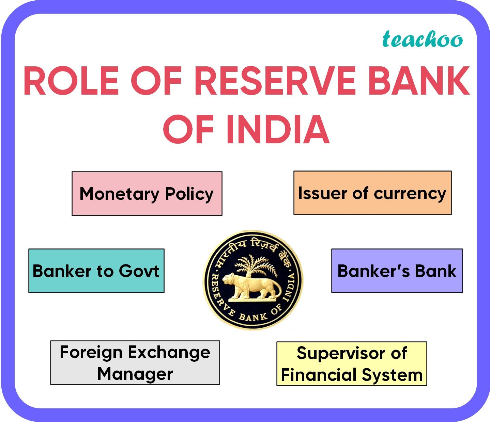

The Reserve Bank of India (RBI) plays a crucial role in shaping the country's economy, overseeing monetary policy, currency issuance, and ensuring financial stability. Founded in 1935, the RBI's influence extends across all facets of India's economic framework, making it a central authority in nurturing the nation’s financial system. With advancements in technology, new trends such as algorithmic trading, commonly known as algo trading, have begun to exert a significant impact on financial markets worldwide.

Algorithmic trading involves using computer programs to execute trades at high speeds based on pre-set algorithms, minimizing the need for human intervention. Its efficiency and precision have made it a prevalent method in global markets, including India's. By enhancing market liquidity and improving the speed of trade execution, algo trading presents considerable opportunities for market expansion and technological innovation.

However, the rapid integration of this technology into financial markets also introduces challenges. Ensuring market integrity, preventing manipulation, and managing operational risks associated with technical issues pose significant challenges to regulatory authorities like the RBI.

This article examines how the RBI navigates these complexities, balancing the potential benefits of algorithmic trading with the need to maintain a stable and transparent financial system. Understanding the RBI’s approach to regulating this technological advancement allows us to discern the future directions of financial market regulation and innovation in India. Through its strategic initiatives, the RBI aims to foster technological progress while safeguarding the core integrity and stability of India's financial markets.

## Table of Contents

## Understanding the Reserve Bank of India

The Reserve Bank of India (RBI), established in 1935 under the Reserve Bank of India Act, serves as the nation's central banking authority. It is primarily entrusted with the responsibility of regulating the monetary policy of India, a task crucial for maintaining economic stability and growth. Over the years, the RBI has experienced significant evolution, adapting its functions and approaches to meet the dynamic demands of the Indian and global economies.

The foundational objectives of the RBI are multifaceted. It manages the country's currency on behalf of the central government, handles the issuance and supply of the Indian rupee, and formulates strategies to ensure price stability through carefully devised monetary policies. Another critical function of the RBI is to maintain overall financial stability by supervising and regulating the banking sector.

As the global financial landscape advances, particularly with the rise of digital finance and trading, the RBI has consistently updated its frameworks to align with contemporary practices. The bank's adaptability is evident in its efforts to incorporate modern technological solutions to enhance the efficiency and robustness of India's financial infrastructure. The RBI's open approach to technological advancements, such as adopting digital payment systems, illustrates its commitment to fostering financial innovation while preserving the stability and security of the financial system.

In recent years, digital trading and finance have become increasingly significant. The RBI, recognizing this shift, has been actively engaged in developing policies that accommodate these trends. This involves both nurturing the growth of financial technology (fintech) and ensuring sufficient regulatory checks are in place to prevent potential financial disruptions.

Through strategic adjustments and foresight, the Reserve Bank of India continues to play a pivotal role in steering the nation's economy. Its evolutionary journey from a traditional central bank to a modern financial regulator embodies its dedication to sustaining economic vitality amidst ever-changing global economic environments.

## The Evolution of Algorithmic Trading

Algorithmic trading, also known as algo trading, involves the use of pre-defined complex mathematical models and algorithms to automate the process of trading financial instruments. This technology-driven approach allows for trading orders to be executed at speeds and frequencies that are beyond human capability, significantly minimizing human intervention and potential error. The execution precision of algo trading is achieved through the integration of historical market data and real-time analysis, which helps in making informed trading decisions.

Globally, [algorithmic trading](/wiki/algorithmic-trading) has become a fundamental component of the trading ecosystems, including India's financial markets. The adoption of this trading method in India has been driven by the need for enhanced market [liquidity](/wiki/liquidity-risk-premium) and improved trading efficiency. Market liquidity refers to the ease with which assets can be bought or sold in the market without causing a significant movement in the asset's price. By facilitating rapid and accurate order execution, algorithmic trading enhances liquidity, making markets more efficient and stable. Additionally, this method reduces transaction costs and the bid-ask spread, bringing about better price discovery.

However, the rise of algorithmic trading introduces significant risks that have necessitated the development of robust regulatory frameworks. These risks include the potential for market manipulation, such as spoofing or layering, where fake orders are placed to mislead market participants about the supply or demand of an asset. Moreover, the high-speed nature of algo trading can lead to market [volatility](/wiki/volatility-trading-strategies), especially during technical failures or erroneous trades that may result from flawed algorithms. Therefore, a solid regulatory framework is essential to monitor these activities, ensuring market integrity and protecting investors.

To mitigate these risks, regulatory bodies around the world have implemented measures such as imposing speed limits on trades, mandating market stabilization tools, and requiring traders to disclose detailed information about their algorithmic strategies. In India, the Securities and Exchange Board of India (SEBI) collaborates with the Reserve Bank of India (RBI) to regulate and oversee algo trading activities, ensuring that the benefits of this innovative trading approach are harnessed while safeguarding against its potential pitfalls.

As algorithmic trading continues to evolve, technological advancements and improved algorithm designs promise even greater efficiency and market access, albeit with the need for continuous regulatory oversight to keep pace with emerging challenges.

## RBI’s Approach to Algorithmic Trading

The Reserve Bank of India (RBI), in collaboration with the Securities and Exchange Board of India (SEBI), plays a key role in regulating algorithmic trading within the country's financial markets. This joint regulatory effort aims to ensure the implementation of fair trading practices and uphold market integrity.

Algorithmic trading, due to its reliance on complex algorithms and high-frequency techniques, brings with it specific challenges that the RBI must address. One significant challenge is the risk of market manipulation. The speed and complexity of algorithmic operations can sometimes be used to execute unfair practices like spoofing, where false orders are placed to mislead other traders about the demand or supply of an asset, effectively manipulating its price.

Transparency remains another challenge. The opacity of algorithmic strategies makes it difficult for regulators to monitor and understand trading activities fully. This lack of transparency can hinder the detection of manipulative tactics and other unethical practices. Consequently, the RBI emphasizes the need for detailed audit trails and real-time reporting to enhance the visibility of trading activities.

Operational disruptions present a notable risk due to the technical nature of algorithmic trading. Systems can fail, algorithms can react unexpectedly to market events, or technology can be exploited to create disruptions. These issues underscore the importance of having robust risk management systems and contingency plans in place to mitigate potential technical glitches.

To address these challenges, the RBI has rolled out several regulatory initiatives designed to balance the promotion of technological innovation with effective risk management. These initiatives include guidelines on the deployment of algorithmic trading systems, prescribed risk control measures, and requirements for real-time monitoring and reporting of trading activities.

Ultimately, the RBI’s regulatory framework seeks to support the advancement of algorithmic trading as a beneficial component of modern finance, while simultaneously safeguarding the market from potential abuses and ensuring its overall stability.

## Regulatory Measures and Challenges

SEBI's regulatory framework for algorithmic trading in India is designed to establish robust risk management protocols, enhance transparency, and ensure real-time monitoring of trading activities to prevent market manipulation and safeguard investor interests. Market participants employing algorithmic strategies are required to implement pre-trade risk controls, such as dynamic price bands and order quantity limits, ensuring that erroneous trades do not destabilize the market. Additionally, these participants must adhere to strict guidelines for systems testing and audit trails, which help maintain an accurate and verifiable record of automated trading activities.

The Reserve Bank of India (RBI), while not directly overseeing trading activities, plays a crucial role in maintaining overall financial stability and protecting the economy from systemic risks that may arise from algorithmic trading practices. Ensuring that market participants have contingency plans to address technological failures or disruptions is a primary focus, as system glitches can lead to significant market volatility and investor losses.

One of the critical challenges for both SEBI and the RBI is balancing the rapid execution and efficiency benefits offered by algorithmic trading with the need for comprehensive risk management. High-frequency trading ([HFT](/wiki/high-frequency-trading-strategies)), a subset of algorithmic trading, further exemplifies this tension due to its reliance on executing a large number of orders at incredibly high speeds. The challenge lies in preventing such trading from amplifying market volatility or facilitating manipulative strategies like spoofing, where false orders are placed to influence stock prices.

To address these challenges, SEBI mandates exchanges to incorporate risk control mechanisms like kill switches, which can halt trading in the event of irregular activities. Moreover, enhanced data analytics and surveillance systems are deployed to detect suspicious patterns that could indicate market abuse. The collaboration between SEBI and RBI is essential to formulate policies that not only accommodate the dynamism of algorithmic trading but also ensure that such advancements do not compromise market integrity.

As algorithmic trading continues to expand, maintaining a resilient regulatory environment demands continuous adaptation and technological advancements in monitoring capabilities. An effective regulatory approach must integrate innovative tools that leverage [machine learning](/wiki/machine-learning) and [artificial intelligence](/wiki/ai-artificial-intelligence) to detect and mitigate potential risks proactively.

## Opportunities for Innovation and Growth

Algorithmic trading has significantly transformed the financial sector in India, offering a wide array of opportunities for technological innovation and market expansion. As a sophisticated method of executing trades, it enhances trading capabilities through precision, speed, and cost-efficiency. This advancement allows for improved market access, providing traders with the tools to operate more effectively in the financial markets.

One major benefit of algorithmic trading is its ability to scale operations rapidly. By automating trading processes, firms can expand their market activities without proportionally increasing human resources, thereby achieving economies of scale. This scaling potential is crucial for firms looking to increase their market share and compete on a global level.

Moreover, algorithmic trading facilitates better price discovery and market liquidity. The continuous and automated interaction with the market helps in narrowing the bid-ask spreads, which benefits all market participants by lowering transaction costs. Enhanced liquidity and reduced costs can potentially attract more investors, both domestic and international, to the Indian financial markets.

To harness these opportunities, collaboration within the financial industry and between regulators is essential. Such cooperation can ensure that the benefits of algorithmic trading are fully realized, while effectively mitigating associated risks, such as market manipulation and systemic failures. Regulators and market participants must work together to develop robust frameworks and technologies that support secure algo trading environments.

In summary, the rise of algorithmic trading presents a promising avenue for growth within the Indian financial sector. By enhancing trading capabilities and improving market access, and through strategic partnerships and regulatory oversight, India can optimize the advantages of this technological advancement, ensuring sustainable market development.

## Future Directions

Continuous evolution of regulatory frameworks is essential to keep pace with the rapid technological advancements inherent to algorithmic trading. As technology evolves, the complexities of trading algorithms increase, necessitating that regulatory bodies like the Reserve Bank of India (RBI) and the Securities and Exchange Board of India (SEBI) adopt proactive and adaptive approaches to oversee these changes effectively.

A key component in future directions for managing algorithmic trading involves educational initiatives aimed at enhancing the understanding of this sophisticated trading methodology among market participants. By fostering comprehensive knowledge of algorithmic trading, including its benefits, risks, and operational mechanisms, these initiatives can promote responsible trading practices and informed decision-making within the financial community. Educational programs and workshops can serve to demystify algorithms and provide traders with the requisite skills to engage with algorithmic trading systems prudently.

Moreover, international collaboration plays a pivotal role in harmonizing standards and improving global market practices. As financial markets are no longer restricted by geographical boundaries, creating a unified regulatory framework that transcends national borders could enable more consistent and efficient regulation of algorithmic trading activities across the globe. By fostering partnerships with international regulatory counterparts and financial institutions, the RBI and SEBI can exchange best practices, technological insights, and regulatory strategies, facilitating a more standardized approach to algorithmic trading globally.

The integration of advanced technologies like artificial intelligence and machine learning into trading systems further complicates the regulatory landscape. Future regulatory frameworks should not only address current technological capabilities but also anticipate future technological trends and their implications for market stability and integrity. Developing dynamic and adaptable regulations that can evolve with new technological developments will be a crucial task for regulators.

Python code and mathematical models, often used in algorithmic trading strategies, can also be harnessed to support these regulatory efforts. For instance, machine learning algorithms can be used to analyze trading patterns and detect anomalies indicative of market manipulation, contributing to better monitoring and enforcement actions.

In conclusion, the ongoing adaptation and evolution of regulatory measures, enhanced educational programs, and international cooperation stand critical in steering India’s financial markets towards a more secure and innovative future, in which algorithmic trading becomes a tool for growth and stability rather than one of risk.

## Conclusion

The integration of algorithmic trading into India's banking system underscores the intricate relationship between emerging technologies and traditional financial practices. As a cornerstone of this evolution, the Reserve Bank of India (RBI) plays a critical role in navigating the complexities posed by such technological advancements. By implementing strategic regulations, the RBI ensures that innovation is balanced with the essential need for market integrity and financial stability.

Algorithmic trading, characterized by the use of sophisticated algorithms for executing trades at optimal speeds and precision, presents significant opportunities for growth and improved market efficiency. However, these advancements also come with inherent risks, such as market manipulation and the potential for system disruptions. In this dynamic environment, the RBI's regulatory frameworks are designed to mitigate these risks while embracing the benefits of technology. The central bank's commitment to maintaining a stable financial ecosystem is pivotal in fostering a conducive environment for innovative trading strategies without compromising the safety and transparency of the market.

As the financial landscape continues to evolve, the RBI remains at the forefront, guiding India through the challenges and opportunities presented by algorithmic trading. Its proactive approach in updating regulatory measures alongside technological progression ensures that India's financial markets remain robust and resilient. This strategic balance highlights the RBI's pivotal role in not only safeguarding the country's financial system but also in steering it towards a future where technology and traditional finance coexist harmoniously.

## References & Further Reading

[1]: ["Algorithmic Trading: A Practitioner's Guide"](https://www.amazon.com/Algorithmic-Trading-Practitioners-Jeffrey-Bacidore/dp/0578715236) by Irene Aldridge

[2]: Bank for International Settlements. (2011). ["High-frequency trading in the foreign exchange market."](https://www.bis.org/publ/mktc05.pdf)

[3]: Jain, P.K. (2005). ["Financial Market Design and the Equity Premium: Electronic versus Floor Trading."](https://onlinelibrary.wiley.com/doi/10.1111/j.1540-6261.2005.00822.x) Review of Financial Studies.

[4]: Securities and Exchange Board of India. (2013). ["Report of the Technical Advisory Committee on Algorithmic Trading."](https://www.sebi.gov.in/)

[5]: Narang, R. (2009). ["Inside the Black Box: The Simple Truth About Quantitative Trading"](https://onlinelibrary.wiley.com/doi/book/10.1002/9781118267738). Wiley Finance.

[6]: Securities and Exchange Board of India (SEBI). ["Discussion Paper on Algorithmic Trading."](https://www.sebi.gov.in/reports-and-statistics/reports/dec-2021/consultation-paper-on-algorithmic-trading-by-retail-investors_54515.html?s=09) (2016).

[7]: O'Hara, M. (2015). ["High Frequency Market Microstructure."](https://www.sciencedirect.com/science/article/pii/S0304405X15000045) Journal of Financial Economics.

[8]: ["Flash Boys: A Wall Street Revolt"](https://en.wikipedia.org/wiki/Flash_Boys) by Michael Lewis