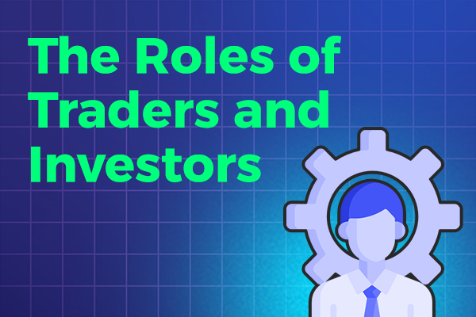

## Table of Contents

## What is the basic difference between a trader and an investor?

A trader and an investor both aim to make money from the financial markets, but they do so in different ways. A trader buys and sells stocks, commodities, or other financial instruments frequently, often within the same day or over a few days. Their goal is to make quick profits from short-term price changes. Traders need to be very active, always watching the market and making decisions quickly.

On the other hand, an investor takes a longer-term approach. They buy stocks, bonds, or other assets with the intention of holding onto them for months, years, or even decades. Investors are more focused on the overall growth of their investments over time, rather than short-term gains. They often do a lot of research before buying and are more patient, waiting for their investments to grow in value.

In summary, the main difference between a trader and an investor lies in their time horizon and approach. Traders seek to capitalize on short-term market movements, while investors aim for long-term growth and stability. Both strategies can be successful, but they require different skills and mindsets.

## What are the primary goals of traders versus investors?

Traders want to make money quickly. They look at small changes in prices and try to buy low and sell high in a short time. This could be within minutes, hours, or a few days. Their main goal is to make a profit from these quick trades. They need to watch the market closely and be ready to act fast.

Investors, on the other hand, aim to grow their money over a long time. They buy stocks or other things and keep them for months, years, or even longer. Their goal is to see their investments go up in value over time. They do a lot of research before buying and are patient, waiting for their investments to increase in worth.

## How do time horizons differ between trading and investing?

Traders have short time horizons. They buy and sell things quickly, often within the same day or over a few days. They want to make money fast from small changes in prices. Because of this, traders need to watch the market all the time and be ready to make quick decisions.

Investors have long time horizons. They buy things and hold onto them for a long time, like months, years, or even decades. They want their money to grow slowly over time. Investors do a lot of research before they buy and are patient, waiting for their investments to become more valuable.

## What are the common strategies used by traders?

Traders use different strategies to make money quickly. One common strategy is called [day trading](/wiki/day-trading-spy). Day traders buy and sell stocks within the same day, trying to make a profit from small price changes. They need to watch the market closely and make quick decisions. Another strategy is called swing trading. Swing traders hold onto their stocks for a few days or weeks, trying to make money from bigger price swings. They still need to keep an eye on the market, but they don't have to be as fast as day traders.

Another strategy traders use is called [scalping](/wiki/gamma-scalping). Scalpers make many trades in a day, each one for a very small profit. They aim to add up these small profits to make a good amount of money. Scalping requires a lot of focus and quick thinking. Lastly, some traders use technical analysis. They look at charts and patterns to decide when to buy and sell. They believe these patterns can help predict future price movements. Each of these strategies has its own risks and rewards, and traders choose the one that fits their style and goals.

## What are the common strategies used by investors?

Investors often use a strategy called buy-and-hold. This means they buy stocks or other investments and keep them for a long time, like years or even decades. They believe that over time, good companies will grow and their stocks will become more valuable. Investors who use this strategy do a lot of research to find strong companies with good future potential. They are patient and don't worry about short-term price changes. Instead, they focus on the long-term growth of their investments.

Another common strategy is called value investing. Value investors look for stocks that they think are priced lower than they should be. They believe that the market has undervalued these stocks and that their true value will be recognized over time. To find these undervalued stocks, value investors study a company's financials and look for signs that the company is doing well but its stock price is low. They buy these stocks and wait for the market to realize the true value, which can take years. Both buy-and-hold and value investing require patience and a long-term view, but they can lead to big rewards if the investor picks the right companies.

## How does risk management differ between traders and investors?

Traders need to be very careful about managing risk because they make many quick trades. They often use something called stop-loss orders to limit how much money they can lose on a trade. If the price of a stock goes down to a certain point, the stop-loss order will automatically sell the stock, so the trader doesn't lose too much money. Traders also spread out their money across different stocks or markets to reduce risk. This way, if one trade goes bad, it won't ruin all their money. Because traders make quick decisions, they need to be ready to change their plans if the market changes suddenly.

Investors manage risk in a different way because they hold onto their investments for a long time. They do a lot of research to pick good companies that they think will grow over many years. To manage risk, investors often spread their money across different types of investments, like stocks, bonds, and real estate. This is called diversification, and it helps protect their money if one type of investment does badly. Investors also keep an eye on their investments over time and might sell if a company starts to do poorly. But because they have a long-term view, they don't worry about short-term price changes as much as traders do.

## What psychological traits are beneficial for traders?

Traders need to be calm and able to handle stress well. The market can change quickly, and traders have to make fast decisions. If they get too worried or excited, they might make bad choices. Being calm helps them think clearly and stick to their trading plan, even when things get tough. They also need to be disciplined. This means following their rules and not letting feelings like greed or fear control their actions. Traders who can stay disciplined are more likely to make smart trades and not lose a lot of money.

Another important trait for traders is being able to take risks. Trading involves a lot of uncertainty, and traders need to be okay with not knowing what will happen next. They should be willing to try new things and learn from their mistakes. At the same time, they need to be good at managing these risks. This means knowing when to stop a trade that's going badly and not betting too much money on one trade. Traders who can balance risk-taking with good risk management often do better in the long run.

## What psychological traits are beneficial for investors?

Investors need to be patient. They buy things and hold them for a long time, so they must wait without getting too worried about short-term changes in prices. Patience helps them stick to their plan and not sell their investments too soon. They also need to be good at doing research. Investors look at a lot of information to pick the right companies to invest in. Being thorough and careful with their research helps them make smart choices and feel confident in their investments.

Another important trait for investors is being able to stay calm. The market can go up and down, but investors need to keep their cool and not make quick decisions based on fear or excitement. Staying calm helps them think clearly and stick to their long-term goals. They also need to be disciplined. This means following their investment plan and not letting emotions like greed or panic control what they do. Investors who can stay disciplined and calm are more likely to see their investments grow over time.

## How do market analysis techniques vary between traders and investors?

Traders use a lot of technical analysis to make their decisions. This means they look at charts and patterns to figure out when to buy and sell. They believe that these patterns can help predict what will happen next in the market. Traders might use things like moving averages, which show the average price of a stock over time, or the Relative Strength Index (RSI), which tells them if a stock is overbought or oversold. They need to watch the market closely and make quick decisions based on these patterns. Sometimes, traders also use [fundamental analysis](/wiki/fundamental-analysis), but it's not as important to them as technical analysis because they're more focused on short-term price changes.

Investors, on the other hand, rely more on fundamental analysis. They look at a company's financial health, like its earnings, debts, and growth potential. Investors want to know if a company is a good investment for the long term. They might look at things like the price-to-earnings (P/E) ratio, which shows if a stock is priced fairly based on the company's earnings. Investors also pay attention to news and events that could affect a company's future. While they might use some technical analysis to help with their timing, their main focus is on understanding the company's value and potential for growth over many years.

## What are the advanced tools and technologies used by professional traders?

Professional traders use many advanced tools and technologies to help them make quick and smart decisions. One of the main tools they use is called [algorithmic trading](/wiki/algorithmic-trading). This means they use computer programs to buy and sell stocks automatically based on certain rules. These programs can analyze a lot of data very fast and make trades in milliseconds. Traders also use high-frequency trading, which is a type of algorithmic trading that makes a lot of trades in a very short time to make small profits. Another important tool is trading platforms, like MetaTrader or Thinkorswim. These platforms give traders real-time data, charts, and the ability to make trades quickly.

Another set of tools that professional traders use is called charting software. This software helps them see patterns in stock prices and make predictions about what will happen next. Some popular charting tools include TradingView and NinjaTrader. Traders also use risk management software to help them keep track of their trades and make sure they don't lose too much money. This software can set stop-loss orders automatically, which helps traders limit their losses. Lastly, many professional traders use data feeds to get up-to-the-minute information about the market. This helps them stay on top of what's happening and make the best trading decisions possible.

## How do regulatory environments impact traders and investors differently?

Regulatory environments can affect traders and investors in different ways. For traders, regulations can change how they do their job. For example, rules about how much money they need to have in their account or limits on how many trades they can make in a day can impact their trading strategies. Also, rules about using certain trading tools or algorithms can make it harder for traders to do high-frequency trading or other advanced techniques. Traders need to keep up with these rules and adjust their plans to follow them, which can be a challenge.

For investors, regulations often focus on protecting them and making sure companies give honest information. For example, rules about what companies have to tell investors can help them make better decisions. Regulations about how much risk investors can take or what kinds of investments they can buy can also affect their choices. Investors usually have more time to adjust to these rules because they hold onto their investments for a long time. But they still need to know about these regulations to make sure they are following the law and making smart investment choices.

## What are the long-term career paths and development opportunities for traders and investors?

Traders can have many different career paths. They might start as a junior trader and work their way up to being a senior trader or even a head trader at a big firm. Some traders become portfolio managers, where they manage other people's money. Traders can also become trading educators or consultants, helping other traders learn and improve. To grow in their career, traders need to keep learning about the market and new trading tools. They might take courses or get certifications in areas like technical analysis or risk management. With hard work and experience, traders can make a good career out of trading.

Investors also have many career options. They might start as a financial analyst and then become a portfolio manager or investment advisor. Some investors start their own investment firms or become financial planners, helping people plan for their future. To advance in their career, investors need to keep learning about different companies and the economy. They might get an MBA or other degrees in finance. Investors who are good at [picking](/wiki/asset-class-picking) stocks and making long-term plans can build a successful career and help others grow their money over time.

## References & Further Reading

[1]: Bergstra, J., Bardenet, R., Bengio, Y., & Kégl, B. (2011). ["Algorithms for Hyper-Parameter Optimization."](https://papers.nips.cc/paper/4443-algorithms-for-hyper-parameter-optimization) Advances in Neural Information Processing Systems 24.

[2]: ["Advances in Financial Machine Learning"](https://www.amazon.com/Advances-Financial-Machine-Learning-Marcos/dp/1119482089) by Marcos Lopez de Prado

[3]: ["Evidence-Based Technical Analysis: Applying the Scientific Method and Statistical Inference to Trading Signals"](https://www.amazon.com/Evidence-Based-Technical-Analysis-Scientific-Statistical/dp/0470008741) by David Aronson

[4]: ["Machine Learning for Algorithmic Trading"](https://github.com/stefan-jansen/machine-learning-for-trading) by Stefan Jansen

[5]: ["Quantitative Trading: How to Build Your Own Algorithmic Trading Business"](https://www.amazon.com/Quantitative-Trading-Build-Algorithmic-Business/dp/1119800064) by Ernest P. Chan