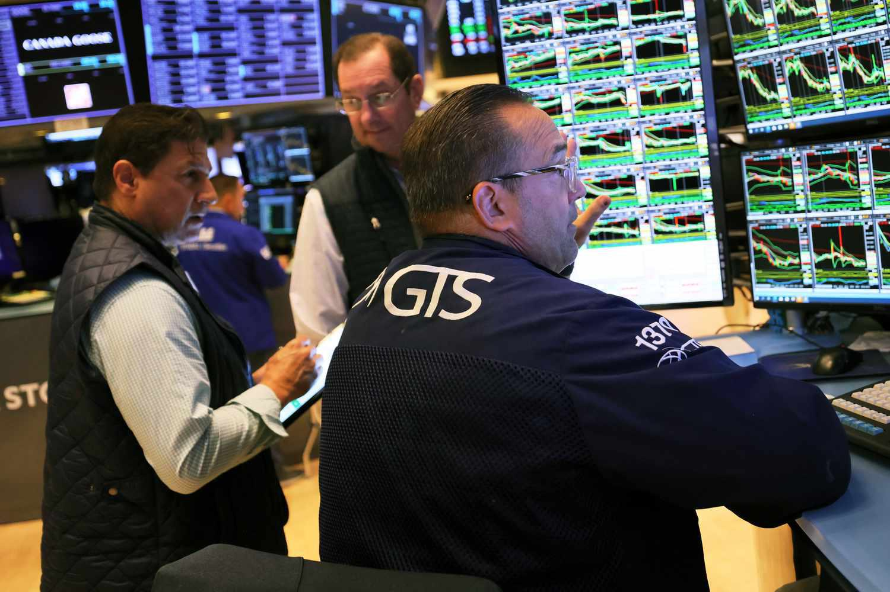

Financial markets represent a sophisticated network that draws the interest of diverse participants, encompassing investors, traders, and various institutions. These markets serve as foundational platforms where financial instruments such as stocks, bonds, and currencies are exchanged, playing a vital role in facilitating economic growth by offering businesses access to essential capital. Since the early 21st century, algorithmic trading has become increasingly prominent, radically altering the traditional methods of executing trades. Utilizing complex algorithms and high-speed computations, algorithmic trading enables market participants to make strategic decisions with improved efficiency and accuracy.

This article aims to analyze the intricate relationships between investors, financial markets, traders, and the advent of algorithmic trading. By providing a detailed narrative, the article will examine the advantages that algorithmic trading presents to investors, such as reduced transaction costs and enhanced decision-making processes through data-driven insights. Moreover, its impact on financial markets, including increased liquidity and potential volatility, will be discussed. Recognizing and comprehending these dynamics is indispensable for individuals engaged in or interested in contemporary trading paradigms. This understanding is crucial as it informs strategic decisions and influences the stability and integrity of financial markets in an increasingly digital era.



## Table of Contents

## Understanding Financial Markets

Financial markets serve as pivotal platforms where various financial instruments, such as stocks, bonds, and currencies, are actively traded. These venues are integral to economic growth, primarily because they furnish businesses with much-needed access to capital. By facilitating such access, financial markets enable companies to invest in new projects, expand operations, and foster innovation, which in turn drives economic development.

Investors, ranging from individual retail participants to large institutional entities like hedge funds and pension funds, partake in these markets with the primary objective of earning returns. However, engaging in financial markets also entails facing inherent risks, including market volatility and the potential for financial loss. Effective risk management forms an essential part of any investment strategy.

The efficiency and liquidity of financial markets are crucial factors that influence trading and investment activities. Market efficiency refers to the extent to which market prices reflect all available and relevant information. An efficient market is one where asset prices consistently incorporate news and data, allowing for fair valuations. Market liquidity, on the other hand, pertains to the ability to quickly buy or sell assets without causing significant price fluctuations. High liquidity is indicative of a healthy market, as it suggests that there are enough buyers and sellers to facilitate smooth transactions.

The dynamics of supply and demand drive the price discovery process in these markets. Participants analyze a plethora of factors, from macroeconomic indicators to company-specific news, to make informed decisions. Modern financial markets have also seen an increased reliance on technology and data analytics, enhancing the ability of investors to make data-driven decisions, efficiently analyze risk, and optimize portfolios.

In summary, financial markets play a critical role in the global economy by not only enabling capital formation and wealth creation but also by serving as a barometer for economic health. Their efficiency and [liquidity](/wiki/liquidity-risk-premium) are fundamental for the successful trading and investment that underpin economic stability and growth.

## The Role of Investors in Financial Markets

Investors play a crucial role in financial markets, acting as the primary force behind capital allocation, risk management, and market dynamics. These participants range from individual retail investors, who may be saving for retirement or other personal goals, to large institutional entities such as pension funds, mutual funds, and insurance companies. The primary aim of investors is to maximize returns while minimizing risk, a concept often encapsulated in modern portfolio theory. This involves diversifying investments across various financial instruments to optimize the risk-return tradeoff.

Investors significantly influence market trends and price movements. When large institutional investors execute trades, even minor portfolio adjustments can lead to substantial changes in asset prices due to the [volume](/wiki/volume-trading-strategy) of transactions. Individual investors, although smaller in scale, collectively contribute to market trends, particularly when reacting to economic news or changes in market sentiment. This dynamic behavior affects not only the financial markets but also broader economic conditions, as shifts in investment patterns can lead to variations in capital flow and financing costs for businesses.

The advent of technology in financial markets has empowered investors with enhanced tools and analytics for decision-making. Advanced software and platforms now offer real-time data analysis, predictive modeling, and [algorithmic trading](/wiki/algorithmic-trading) strategies. For example, Python has become a popular language for developing financial models due to its simplicity and robust libraries such as NumPy and Pandas. These technological advancements allow investors to make more informed decisions based on comprehensive data analysis, minimizing human biases and improving the efficiency of resource allocation.

```python
import numpy as np
import pandas as pd

# Example: Calculate the expected return of a portfolio
portfolio_weights = np.array([0.4, 0.3, 0.3])  # weights for 3 assets
asset_returns = np.array([0.05, 0.02, 0.08])   # expected returns for the assets

# Expected Portfolio Return
expected_return = np.dot(portfolio_weights, asset_returns)
print(f"Expected Portfolio Return: {expected_return:.2f}")
```

This script provides a basic illustration of how investors might calculate expected returns from a portfolio of diversified assets, showcasing the practical application of technology in investment strategies. The integration of technology has thus transformed how investors interact with financial markets, making it more accessible, efficient, and data-driven.

## Who are Traders and What Do They Do?

Traders are key participants in financial markets, engaging actively in buying and selling financial instruments such as stocks, bonds, commodities, and currencies. Their primary objective is to capitalize on price changes within the market to generate profits. Traders can be categorized into several types depending on their strategies, time horizons, and scale of operations.

Day traders actively buy and sell securities within the same trading day, often executing multiple transactions to exploit small price movements. Such traders typically avoid holding positions overnight to reduce exposure to market risks. Swing traders, on the other hand, hold positions for a few days to weeks, aiming to benefit from expected upward or downward market moves. These traders employ technical analysis tools to predict price trends and patterns.

Institutional traders operate on a larger scale, typically for financial institutions such as banks, hedge funds, and mutual funds. Their trades often involve substantial capital and can significantly influence market prices and volumes. Unlike individual or retail traders, institutional traders have access to advanced trading technologies and dedicated research teams, enabling more informed decision-making and strategic execution.

Traders distinguish themselves from long-term investors primarily through their approach and time frame. While investors focus on [fundamental analysis](/wiki/fundamental-analysis) and long-term value creation, traders are more concerned with short-term gains and often rely on technical analysis. Strategies employed by traders include [arbitrage](/wiki/arbitrage), [trend following](/wiki/trend-following), and [scalping](/wiki/gamma-scalping), each requiring a different skill set and risk tolerance.

The activities of traders play a vital role in financial markets by providing liquidity. Liquidity refers to how easily an asset can be bought or sold in the market without affecting its price. High liquidity markets ease the buying and selling process, resulting in more efficient markets. Traders also aid in price discovery, the process of determining the value of a security through interactions between buyers and sellers. This mechanism helps reflect real-time market conditions, ensuring prices remain fair and transparent.

Overall, traders serve as a crucial component of the financial markets' ecosystem, contributing to their efficiency and dynamism. Their ability to adapt quickly to market changes and employ sophisticated strategies often determines their success and impact on market behavior.

## What is Algorithmic Trading?

Algorithmic trading is a method of executing trades using computer algorithms that make decisions based on pre-defined criteria. These criteria can range from simple instructions like "buy when the price drops below a certain level" to complex calculations involving multiple data points and conditions. By automating the trading process, algorithmic trading allows for quicker and more efficient execution compared to traditional manual methods.

One of the primary advantages of algorithmic trading is its ability to process and analyze vast amounts of data in real-time. This capability enables algorithms to swiftly identify patterns and profitable opportunities that may be inaccessible to human traders due to the speed and complexity involved. For instance, algorithms can be programmed to recognize trends, perform statistical analyses, and execute trades within milliseconds, something challenging for human traders to achieve consistently.

Common strategies employed in algorithmic trading include trend following, arbitrage, and [market making](/wiki/market-making). Trend following strategies focus on capturing gains through persistent market movements in a particular direction. Arbitrage strategies exploit price differences of the same asset across different markets or instruments, aiming to profit from temporary discrepancies. Market making involves quoting both buy and sell prices to provide liquidity and capture the spread between them.

Here is a simplified example of an algorithmic trading strategy implemented in Python, focusing on moving average crossover, a common trend-following strategy:

```python
import pandas as pd

# Load historical market data
data = pd.read_csv('market_data.csv')
data['SMA_50'] = data['Close'].rolling(window=50).mean()
data['SMA_200'] = data['Close'].rolling(window=200).mean()

# Generating trade signals
data['Signal'] = 0
data['Signal'][50:] = np.where(data['SMA_50'][50:] > data['SMA_200'][50:], 1, -1)

# Calculate positions based on signals
data['Position'] = data['Signal'].shift()

# Backtesting the strategy
data['Strategy_Returns'] = data['Position'] * data['Close'].pct_change()
cumulative_strategy_return = (1 + data['Strategy_Returns']).cumprod() - 1

print("Cumulative Strategy Return:", cumulative_strategy_return[-1])
```

This script calculates the 50-day and 200-day moving averages of historical closing prices and generates buy signals when the short-term moving average crosses above the long-term moving average, signifying an upward trend. Conversely, sell signals are generated when the short-term moving average crosses below the long-term moving average, indicating a potential downtrend.

Algorithmic trading's adoption by traders of varying scales—from individual retail traders to large institutional firms—has significantly transformed financial markets. While it offers numerous benefits, careful consideration and risk management are critical to leveraging its full potential effectively.

## The Benefits of Algorithmic Trading for Investors

Algorithmic trading has revolutionized the way investors engage with financial markets by offering enhanced speed and precision. The use of algorithms allows for the rapid execution of trades, which is essential in markets where price movements can occur in fractions of a second. This speed not only optimizes investment strategies but also provides a competitive edge over traditional trading methods. 

One major benefit for investors employing algorithmic trading is the potential for lower transaction costs. Algorithms can efficiently scan multiple markets and exchanges, identifying the best prices and opportunities for trades. By systematically executing trades at the most opportune moments, algorithms minimize the market impact, which can often inflate costs in manual trading scenarios.

Moreover, algorithmic trading significantly mitigates the emotional biases that can influence human trading decisions. Utilizing data-driven insights, algorithms operate based on pre-defined criteria, eliminating the uncertainty and emotion-linked errors that investors may otherwise introduce. This systematic approach ensures that trades are executed consistently, adhering to the strategies that have been statistically validated through historical data analysis.

In recent years, the democratization of sophisticated trading systems has become apparent. Previously, access to advanced algorithmic trading platforms was predominantly the privilege of large financial institutions. However, technological advancements have made these systems accessible to retail investors as well. These investors can now leverage powerful tools and platforms, leveling the playing field and enabling participation in markets with lower barriers.

In summary, algorithmic trading enhances investment strategies by bringing speed and efficiency, reducing transaction costs, preventing emotional biases in decision-making, and extending access to sophisticated trading tools to a broader audience. As a consequence, both institutional and retail investors can enjoy improved market participation and potentially better returns.

## Impact of Algorithmic Trading on Financial Markets

Algorithmic trading has significantly transformed financial markets by enhancing liquidity and narrowing bid-ask spreads. It achieves high liquidity levels by enabling fast and efficient execution of trades, which is crucial for maintaining market fluidity and for traders seeking to enter or [exit](/wiki/exit-strategy) positions quickly. Tighter spreads, the difference between the bid and ask price, result from increased trade volume and improved price efficiency, reducing transaction costs for market participants. 

Despite these advantages, algorithmic trading also presents notable challenges. One of the primary concerns is the potential for increased market [volatility](/wiki/volatility-trading-strategies). Rapid algorithmic-driven trades can lead to swift market movements, occasionally triggering erratic price swings or flash crashes, where stock prices plummet and recover in a very short frame. The 2010 Flash Crash is a notable example, where the Dow Jones Industrial Average dropped about 1000 points in minutes, only to recover shortly after.

Another challenge arises from the systemic risks associated with algorithmic trading. The reliance on complex algorithms and technology introduces vulnerabilities, such as software bugs or unintended algorithmic behavior, which can lead to cascading market effects. High-frequency trading ([HFT](/wiki/high-frequency-trading-strategies)), a subset of algorithmic trading executed at exceptionally high speeds, is often scrutinized for its potential to manipulate markets. HFT firms leverage speed to profit from minute price discrepancies, sometimes gaining unfair advantages over slower traders and impacting market fairness.

In response to these challenges, regulatory bodies across the globe have been vigilant in monitoring algorithmic trading activities. They continuously adapt and enforce policies aimed at mitigating risks, such as implementing circuit breakers to pause trading under extreme volatility, mandating stringent risk management practices for firms deploying trading algorithms, and requiring greater transparency and auditability in algorithmic trading activities. These measures aim to safeguard market integrity and ensure a level playing field for all participants.

## Challenges and Risks Associated with Algorithmic Trading

Algorithmic trading, while offering numerous efficiencies, also brings a range of challenges and risks that must be carefully managed to ensure sustainable trading practices. One of the primary concerns is the reliance on technology, which renders financial markets vulnerable to technical glitches and disruptions. These can include software bugs, hardware failures, network issues, and unexpected interactions among different algorithms, each of which can lead to significant financial losses and market instability. For instance, the infamous Flash Crash of May 6, 2010, demonstrated how unanticipated anomalies in algorithmic trading can lead to drastic market movements, temporarily erasing nearly a trillion dollars of market value.

Another critical issue is the lack of transparency that algorithmic trading can engender in financial markets. Algorithms operate based on complex mathematical models and trading strategies that are not visible to other market participants, regulators, or even the algorithm creators in some cases. This opacity can make it difficult for market participants to understand price movements and market dynamics, potentially leading to mistrust and a reduction in market confidence.

Moreover, traders and investors must be cautious of the risks associated with the over-optimization of algorithms. Over-optimized algorithms are often tailored to perform exceedingly well under historical market conditions but may fail in new or unforeseen circumstances. This overfitting can lead to substantial losses once market conditions change, as the algorithm may not adapt rapidly enough to new data or parameters. To mitigate this, it is vital to incorporate robust risk management strategies and perform thorough [backtesting](/wiki/backtesting) across varied market scenarios.

Understanding and managing these challenges requires a multi-faceted approach, which includes maintaining a balance between algorithmic and human oversight. Regular audits, real-time monitoring, and incorporating fail-safes such as circuit breakers are essential steps. Furthermore, traders and investors should ensure constant model updates and validation against a broad set of data to maintain the relevance and robustness of algorithms. Developing expertise in both trading and technology, alongside a comprehensive understanding of market dynamics, is essential for leveraging the advantages of algorithmic trading while mitigating its risks.

## Conclusion

Algorithmic trading is significantly transforming financial markets, presenting both opportunities and challenges. Its ability to execute trades with speed and precision allows investors and traders to capitalize on market opportunities that were previously inaccessible. This swift execution is enabled by algorithms that process vast datasets and identify patterns much faster than human capabilities.

For investors and traders to fully leverage the advantages of algorithmic trading, it is important for them to remain informed and adaptable. This involves understanding the latest trading strategies, continually updating skills, and keeping abreast of technological progress. The dynamic nature of financial markets necessitates a proactive approach to adaptation, as static methodologies can quickly become obsolete.

Balanced regulation and ethical practices are fundamental to ensuring market integrity and stability. Regulatory bodies face the challenge of crafting policies that mitigate risks without stifling innovation. Effective oversight can deter practices such as market manipulation and ensure a level playing field for all market participants. Ethical trading practices further foster trust and transparency in financial markets.

Technological advancements continue to shape the evolution of trading, enhancing the capabilities of algorithmic trading systems. Innovations such as [machine learning](/wiki/machine-learning) and [artificial intelligence](/wiki/ai-artificial-intelligence) promise even greater analytical power and decision-making capabilities. As these technologies mature, they will likely further increase the efficacy of trading algorithms and open new pathways for trading strategies.

Overall, while algorithmic trading offers substantial benefits, it is accompanied by a set of challenges that must be managed carefully. The future of trading will be characterized by a blend of innovation, regulation, and ethical stewardship, ensuring that financial markets remain fair and efficient for all participants.

## FAQs

What are the different types of algorithmic trading strategies?
Algorithmic trading strategies are diverse and can be tailored to meet specific trading objectives. Common types include:

1. **Trend Following Strategies**: These strategies involve buying securities that have performed well in the past and selling those that have performed poorly. Traders often employ technical indicators like moving averages to identify potential trends. 

2. **Arbitrage Strategies**: These take advantage of price discrepancies between markets or identical financial instruments. For instance, if a stock is priced lower on one exchange than another, traders can buy on the cheaper exchange and sell on the more expensive one.

3. **Market Making Strategies**: Market makers provide liquidity by simultaneously quoting buy and sell prices in a given financial instrument, thereby facilitating trading and profiting from the bid-ask spread.

4. **Mean Reversion Strategies**: These are based on the idea that asset prices will revert to their historical averages. Traders identify overbought or oversold conditions and execute trades anticipating a return to average levels.

5. **Statistical Arbitrage**: This involves trading a portfolio of stocks against another portfolio, often using statistical models to identify pairs showing mean-reverting behavior.

6. **High-Frequency Trading**: This subset of trading executes a large number of orders at extremely high speeds, typically capitalizing on very small price discrepancies.

How does algorithmic trading differ from manual trading?
Algorithmic trading leverages computer programs to execute trades following pre-established criteria, enabling faster and more accurate trading compared to manual methods. While manual trading relies on human intuition and analysis, algorithmic trading analyzes vast datasets in real-time, reducing the influence of human emotions and errors. Additionally, algorithmic trading can execute complex strategies unavailable to manual traders due to the rapid decision-making and precision required.

What tools do I need to start algorithmic trading?
To engage in algorithmic trading, one typically requires the following tools:

1. **Trading Platform**: A robust platform that supports algorithmic trading, such as MetaTrader, NinjaTrader, or Thinkorswim.

2. **Programming Skills**: Proficiency in programming languages like Python, C++, or Java is essential for developing and implementing trading algorithms.

3. **Data Feeds**: Access to reliable real-time and historical market data feeds to backtest and execute strategies.

4. **Brokerage Account with API Access**: A brokerage account that offers API access is crucial for programmatically executing trades in the market.

5. **Backtesting Software**: Tools that allow traders to test their strategies against historical data to assess potential effectiveness before live trading.

Are there regulations governing algorithmic trading?
Yes, algorithmic trading is subject to regulatory oversight to ensure fair and transparent markets. Regulations vary by jurisdiction but commonly include:

- **Registration Requirements**: Traders may need to register with financial regulatory bodies, such as the Securities and Exchange Commission (SEC) in the US or the Financial Conduct Authority (FCA) in the UK.

- **Market Surveillance**: Constant monitoring to spot manipulation, inefficiencies, and anomalies linked to algorithmic trading.

- **Risk Management Standards**: Implementing risk controls and system safeguards to avoid errant trades that could destabilize the markets.

- **Transparency and Reporting**: Ensuring traders and firms provide adequate reporting to demonstrate compliance and operational transparency.

What skills are required to become successful in algorithmic trading?
Successful algorithmic trading necessitates a blend of skills, including:

1. **Quantitative Analysis**: Strong analytical skills to develop and refine trading models based on statistical and mathematical techniques.

2. **Programming Proficiency**: The ability to code algorithms and manipulate large datasets using programming languages like Python or R.

3. **Financial Knowledge**: A deep understanding of financial markets, trading mechanics, and economic indicators.

4. **Risk Management Acumen**: The ability to manage and mitigate risks associated with trading strategies.

5. **Continuous Learning**: Staying updated on technological advancements, regulatory changes, and market dynamics is crucial in the fast-evolving landscape of algorithmic trading.

## References & Further Reading

[1]: Bergstra, J., Bardenet, R., Bengio, Y., & Kégl, B. (2011). ["Algorithms for Hyper-Parameter Optimization."](https://papers.nips.cc/paper/4443-algorithms-for-hyper-parameter-optimization) Advances in Neural Information Processing Systems 24.

[2]: ["Advances in Financial Machine Learning"](https://www.amazon.com/Advances-Financial-Machine-Learning-Marcos/dp/1119482089) by Marcos Lopez de Prado

[3]: ["Evidence-Based Technical Analysis: Applying the Scientific Method and Statistical Inference to Trading Signals"](https://www.amazon.com/Evidence-Based-Technical-Analysis-Scientific-Statistical/dp/0470008741) by David Aronson

[4]: ["Machine Learning for Algorithmic Trading"](https://github.com/stefan-jansen/machine-learning-for-trading) by Stefan Jansen

[5]: ["Quantitative Trading: How to Build Your Own Algorithmic Trading Business"](https://www.amazon.com/Quantitative-Trading-Build-Algorithmic-Business/dp/1119800064) by Ernest P. Chan