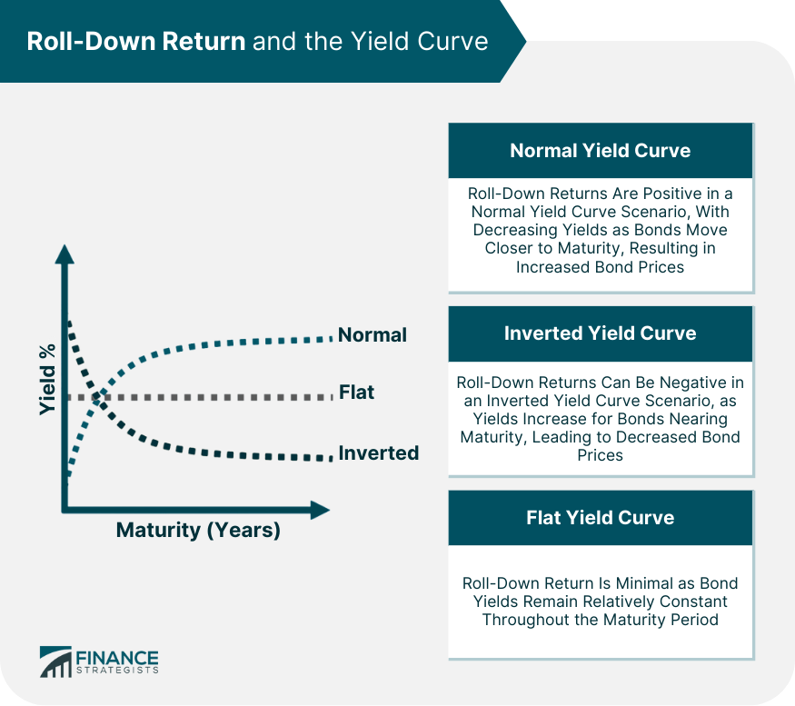

## Table of Contents

## What is a roll down?

A roll down is a way to move money from one investment to another without paying taxes right away. It is often used when someone wants to change their investments but keep their money growing without losing any to taxes.

People might use a roll down when they switch jobs and want to move their retirement savings from an old job's plan to a new one, or into an individual retirement account (IRA). This helps them keep their retirement savings together and working for them, instead of having to start over or pay taxes on the money they've already saved.

## How does a roll down work?

A roll down happens when you move money from one type of retirement account to another without paying taxes right away. For example, if you leave a job, you might want to take the money you saved in your old job's retirement plan and put it into a new job's plan or into an IRA. This is called a roll down because you're rolling the money down from one account to another.

To do a roll down, you usually need to ask your old plan's administrator to send the money directly to your new plan or IRA. This is called a direct rollover. If they send the money to you instead, you have to put it into the new account within 60 days, or you might have to pay taxes on it. By doing a roll down, you keep your retirement savings growing without losing any money to taxes until you take it out later in life.

## What are the basic components of a roll down?

A roll down involves moving money from one retirement account to another without paying taxes right away. The main part of a roll down is the transfer of money. This can happen when you leave a job and want to move your savings from your old job's retirement plan to a new job's plan or to an individual retirement account (IRA).

The process usually involves asking your old plan's administrator to send the money directly to your new plan or IRA. This is called a direct rollover. If the money is sent to you instead, you must put it into the new account within 60 days to avoid paying taxes on it. By doing a roll down, you keep your retirement savings growing and avoid losing money to taxes until you take it out later in life.

## What are the common uses of roll downs?

People often use roll downs when they change jobs. If someone leaves a job, they might have money saved in their old job's retirement plan. Instead of leaving the money there or taking it out and paying taxes, they can use a roll down to move the money to their new job's retirement plan or to an individual retirement account (IRA). This way, they keep all their retirement savings together and can keep saving for the future without losing money to taxes right away.

Another common use of roll downs is for managing retirement savings better. Sometimes, people want to change their investment choices or consolidate their accounts. They might have several old retirement accounts from different jobs, and it can be hard to keep track of them all. By using a roll down, they can move all their money into one account, like an IRA, which makes it easier to manage their savings and plan for retirement.

## What are the different types of roll downs?

There are two main types of roll downs: direct rollovers and indirect rollovers. A direct rollover is when the money goes straight from your old retirement plan to your new plan or IRA without you touching it. This is the easiest way to do a roll down because you don't have to worry about taxes or deadlines. You just tell your old plan's administrator where to send the money, and they take care of the rest.

An indirect rollover is when the money from your old retirement plan is sent to you first. You then have to put the money into your new plan or IRA within 60 days. If you don't do this in time, you might have to pay taxes on the money and even a penalty. Indirect rollovers can be a bit trickier because you have to keep track of the deadline and make sure you follow the rules to avoid any tax problems.

## What are the advantages of using a roll down?

Using a roll down helps you keep your retirement savings together and growing without losing any money to taxes right away. When you change jobs, you can move your savings from your old job's retirement plan to your new job's plan or an IRA. This way, you don't have to start over with your retirement savings, and you can keep all your money in one place. It makes it easier to keep track of your savings and plan for the future.

Another advantage of using a roll down is that it gives you more control over your investments. If you have several old retirement accounts from different jobs, it can be hard to manage them all. By using a roll down, you can move all your money into one account, like an IRA. This makes it simpler to manage your savings and choose the investments that are right for you. Plus, you avoid the hassle of keeping track of multiple accounts and can focus on building your retirement savings.

## What are the potential drawbacks or limitations of roll downs?

One potential drawback of roll downs is that they can be a bit tricky to do right. If you choose an indirect rollover and the money comes to you first, you have to put it into your new account within 60 days. If you miss this deadline, you might have to pay taxes on the money and even a penalty. This can be stressful, especially if you forget or get busy and don't move the money in time.

Another limitation is that not all retirement plans allow roll downs. Some plans have rules that make it hard or impossible to move your money to another account. This can be frustrating if you want to consolidate your savings or change your investments but can't because of the plan's rules. It's important to check with your plan's administrator to see if a roll down is possible before you try to do one.

## How can roll downs be customized for specific applications?

Roll downs can be customized depending on what you need. If you're changing jobs and want to move your old retirement savings to a new job's plan, you can choose between a direct or indirect rollover. A direct rollover is easier because the money goes straight from your old plan to your new one without you touching it. But if you want more control or need the money for a short time, you might choose an indirect rollover, where the money comes to you first. You just have to remember to put it into your new account within 60 days to avoid taxes and penalties.

If you have several old retirement accounts from different jobs, you can use roll downs to put all your savings into one account, like an IRA. This makes it easier to manage your money and choose the investments that are right for you. You can also decide which type of IRA to use, like a traditional IRA or a Roth IRA, depending on your tax situation and retirement goals. By customizing your roll down, you can make sure your retirement savings work best for you.

## What are the key factors to consider when selecting a roll down?

When [picking](/wiki/asset-class-picking) a roll down, you need to think about whether you want a direct or indirect rollover. A direct rollover is easier and safer because the money goes straight from your old retirement plan to your new one without you touching it. This way, you don't have to worry about taxes or deadlines. But if you need the money for a short time or want more control, you might choose an indirect rollover. Just remember, with an indirect rollover, you have to put the money into your new account within 60 days, or you might have to pay taxes and a penalty.

Another thing to consider is what you want to do with your retirement savings. If you have several old retirement accounts from different jobs, you might want to use a roll down to put all your savings into one account, like an IRA. This makes it easier to manage your money and choose the right investments for you. You can also decide which type of IRA to use, like a traditional IRA or a Roth IRA, based on your tax situation and retirement goals. By thinking about these things, you can make sure your roll down works best for your needs.

## How do roll downs compare to other similar mechanisms?

Roll downs are a lot like rollovers and transfers, but they each work a bit differently. A roll down is when you move money from one retirement account to another without paying taxes right away. It's often used when you change jobs and want to move your old job's retirement savings to a new job's plan or an IRA. A rollover is similar, but it's more about moving money between different types of retirement accounts, like from a 401(k) to an IRA. A transfer is when you move money between accounts of the same type, like from one IRA to another IRA, and it's usually done directly by the financial institutions.

The main difference between these mechanisms is how they handle taxes and where the money goes. With a roll down or a rollover, you might get the money sent to you first, and you have to put it into the new account within 60 days to avoid taxes and penalties. This is called an indirect rollover. But with a direct rollover or a transfer, the money goes straight from one account to another, so you don't have to worry about taxes or deadlines. Each method has its own rules and benefits, so it's important to pick the one that fits your needs and helps you keep your retirement savings growing.

## What are the latest innovations or trends in roll down technology?

The latest trends in roll down technology focus on making the process easier and safer for people. One big change is that more retirement plans now offer automatic roll downs. This means that when you leave a job, your old plan can automatically move your savings to your new plan or an IRA without you having to do anything. This makes it simpler for you and helps you keep your retirement savings growing without losing any money to taxes.

Another trend is the use of digital platforms and apps to manage roll downs. These tools help you keep track of your retirement accounts and make it easier to move money between them. You can see all your accounts in one place, get reminders about deadlines, and even do the roll down with just a few clicks. This makes the whole process less stressful and more convenient, so you can focus on planning for your future.

## How can one maintain and troubleshoot issues with roll downs?

To maintain roll downs, it's important to keep good records of all your retirement accounts and the roll downs you do. This means writing down the dates when you moved money, how much you moved, and where the money went. It's also a good idea to check your accounts regularly to make sure everything is where it should be and that your savings are growing. If you use a digital platform or app to manage your roll downs, make sure to update it with any changes to your accounts or contact information.

If you run into problems with a roll down, the first thing to do is to contact the plan administrators for both your old and new accounts. They can help you figure out what went wrong and how to fix it. If you did an indirect rollover and missed the 60-day deadline, you might need to talk to a tax professional to see if you can fix the problem without paying taxes and penalties. Keeping good records and staying in touch with your plan administrators can help you solve any issues quickly and keep your retirement savings on track.

## References & Further Reading

[1]: ["Advances in Financial Machine Learning"](https://www.amazon.com/Advances-Financial-Machine-Learning-Marcos/dp/1119482089) by Marcos Lopez de Prado

[2]: ["Evidence-Based Technical Analysis: Applying the Scientific Method and Statistical Inference to Trading Signals"](https://www.amazon.com/Evidence-Based-Technical-Analysis-Scientific-Statistical/dp/0470008741) by David Aronson

[3]: ["Machine Learning for Algorithmic Trading"](https://github.com/stefan-jansen/machine-learning-for-trading) by Stefan Jansen

[4]: ["Quantitative Trading: How to Build Your Own Algorithmic Trading Business"](https://www.amazon.com/Quantitative-Trading-Build-Algorithmic-Business/dp/1119800064) by Ernest P. Chan

[5]: Bermingham, A., & Grover, A. (2019). ["Algorithmic Trading and DMA: An Introduction to Direct Access Trading Strategies."](https://www.amazon.com/Algorithmic-Trading-DMA-introduction-strategies/dp/0956399207) 4Myeloma Press.