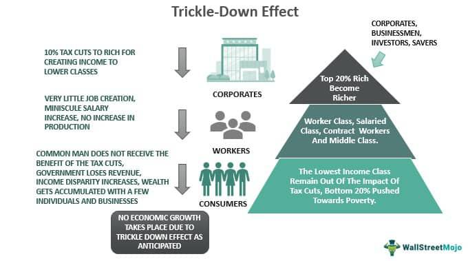

Algorithmic trading has significantly transformed the landscape of financial markets by leveraging complex algorithms to execute trades at optimal prices and unprecedented speeds. This type of trading uses computer algorithms to determine the timing, price, and quantity of orders, thereby reducing the influence of human emotion on trading decisions and enhancing execution efficiency. It employs a range of sophisticated strategies to capitalize on market opportunities, and among these, mechanism roll down variations have attracted considerable attention.

Mechanism roll down variations are strategies that adjust positions in response to changes in market conditions, particularly in options trading. They involve altering the strike price of an existing position, usually by closing a higher strike option and simultaneously opening a new option at a lower strike price. This adjustment can enhance potential profitability as the market shifts, allowing traders to align their positions more effectively with ongoing trends.



These variations are valuable tools for traders and investors seeking to optimize trading outcomes and manage risks effectively. By refining positions based on predictive models and real-time market data, traders can better adapt to volatility and rapid market shifts. This strategy reduces exposure to adverse market movements and can secure profits in declining market conditions. Understanding roll down strategies in the context of algorithmic trading equips financial market participants with an advanced set of tools to navigate the complexities of modern trading environments.

In this article, we will explore the essential elements of roll down strategies and examine how they were adapted and enhanced within the framework of algorithmic trading. We will assess their applications, benefits, and potential risks, providing a comprehensive understanding of these powerful trading mechanisms.

## Table of Contents

## Understanding Roll Down in Trading

Roll down is an adjustment strategy commonly employed in options trading, designed to modify the strike price of an existing position. This strategy involves closing a current option with a higher strike price and simultaneously opening a new option at a lower strike price. The primary goal is to capitalize on evolving market conditions that might not favor the original position.

The roll down strategy provides traders with the flexibility to adjust their positions as market trends shift, potentially enhancing profitability. For instance, if a trader holds a call option and anticipates a decline in the underlying asset's volatility or price, they may choose to roll down. By lowering the strike price, the trader aligns the position more closely with market dynamics, thus increasing the prospect of securing a profit or reducing potential losses.

Typically, trades within roll down strategies are executed through spread orders. This approach is crucial in effectively managing transaction costs and ensuring that trades align with broader market expectations. By executing roll downs as spreads, traders can simultaneously sell the current option and purchase the new one, providing a streamlined process that reduces slippage and enhances execution efficiency.

Scenarios where roll down strategies are predominantly applied include bearish market environments or when traders seek to manage options nearing expiration. In bearish markets, traders often roll down to reposition for potential declines, ensuring their options remain in-the-money or close to it. Additionally, as options near expiration, traders might roll down to strike prices that offer greater sensitivity to movements in the underlying asset, thereby preserving the option's time value and mitigating the impact of an unfavorable expiry.

The benefits of roll down strategies are manifold. They enable traders to maintain a flexible approach, adapting to market changes without needing to [exit](/wiki/exit-strategy) positions entirely. This adaptability can be particularly advantageous in volatile markets, allowing for proactive rather than reactive management of options portfolios. Moreover, by utilizing roll downs, traders can optimize the delta and gamma profiles of their options, ensuring they maintain beneficial market exposure while controlling risk.

In summary, roll down strategies serve as an effective tool in option trading, allowing modifications to strike prices in response to changing market conditions. Through efficient execution mechanisms like spread orders, traders can manage costs and enhance profitability, offering a dynamic approach to navigating financial markets.

## Mechanism Roll Down Variations in Algorithmic Trading

Integrating roll down strategies with [algorithmic trading](/wiki/algorithmic-trading) involves utilizing sophisticated algorithms to automate the execution of trades, effectively combining quantitative analysis with speed and efficiency. Traders can augment these algorithms with predictive elements geared towards market shifts, which allow for agile and timely adaptations in response to real-time financial data. By embedding these predictive capabilities, traders can execute roll down strategies with minimal delay, thereby capitalizing on shifting market conditions more effectively.

### Variations of Roll Down Strategies

#### Timing Adjustments 

A crucial [factor](/wiki/factor-investing) in roll down strategies is timing, which dictates when to execute trades to optimize positions. Algorithms can be designed to monitor market indicators continuously, executing trades only when certain conditions are met, such as crossing a moving average threshold or a [volatility](/wiki/volatility-trading-strategies) [breakout](/wiki/breakout-trading). For example, Python libraries like `pandas` and `numpy` can be employed to set precise conditions for rolling down options when technical indicators show favorable trends.

```python
import pandas as pd
import numpy as np

def should_roll_down(market_data, threshold):
    moving_average = market_data['price'].rolling(window=5).mean()
    signal = market_data['signal']
    return moving_average < threshold and signal == 'sell'

# Usage example
should_roll_down(market_data, threshold=100.0)
```

#### Asset-Specific Approaches 

Different asset classes may require tailored roll down strategies. For instance, volatility in equities may necessitate more conservative strategies compared to commodities. Algorithmic platforms can be adjusted to handle a variety of assets by incorporating asset-specific volatility metrics, [liquidity](/wiki/liquidity-risk-premium) conditions, and historical performance data. This allows traders to roll down options specific to the characteristics of the asset, enhancing the likelihood of favorable outcomes.

#### Risk Assessments

Risk management is integral to successful algorithmic roll down strategies. Algorithms can be programmed to incorporate risk factors such as Value at Risk (VaR), ensuring that trades remain within pre-defined risk limits. For instance, using Python's `SciPy` library, traders can simulate different market scenarios to evaluate the potential impact on portfolios before executing a roll down.

### Case Studies of Successful Implementations

To illustrate the effectiveness of these strategies, we look at case studies where roll down strategies were successfully implemented through algorithmic trading. A notable instance is the use of roll down strategies during periods of anticipated economic announcements. Traders programmed algorithms to monitor and predict economic indicators, quickly adjusting their options positions as the data were released. These preemptive adjustments, combined with high-frequency data analysis, allowed traders to capture profits from the resulting price movements with high efficiency and precision.

Another example involves asset-specific strategies where algorithms were tailored for commodities trading. The systems were adjusted to account for seasonal fluctuations and geopolitical risks affecting commodity prices. By rolling down options in response to detected shifts in market sentiment, traders could cushion their portfolios against adverse price swings.

Overall, these algorithmic roll down applications have shown that combining predictive analytics, precise execution, and adaptive risk management strategies can significantly enhance trading performance, underscoring the potential and flexibility of algorithmic trading in modern markets.

## Benefits and Risks of Roll Down Strategies

Roll down strategies in trading offer distinct advantages by allowing traders to adjust their positions to more favorable strike prices as markets fluctuate. This adaptability can significantly enhance profitability, especially for traders anticipating continued declines in asset prices. By rolling down to lower strike prices, traders can strategically position themselves to capitalize on declining market trends, thus mitigating risks and securing profits.

These strategies are particularly beneficial for traders operating in volatile markets, as they enable a dynamic approach to position management. When market conditions suggest a downward trend, executing a roll down allows traders to maintain their engagement with the asset while potentially increasing the likelihood of profitable outcomes.

However, roll down strategies are not without risks. One primary concern is the potential for adverse market movements. If the market does not move as anticipated, traders may face losses rather than the expected profits. Additionally, execution errors can occur, particularly when strategies are automated. Such errors might include incorrect order placement or timing issues that can detract from the strategy's effectiveness.

To effectively implement roll down strategies, an understanding of risk management techniques is crucial. Traders can employ various methods to mitigate risks, such as setting stop-loss limits to protect against significant losses. Additionally, continuously monitoring market conditions and adjusting algorithms as necessary can help manage risks associated with execution errors.

Regulatory considerations also play a role when employing roll down strategies. Traders must adhere to financial market regulations to ensure compliance. This includes understanding the rules governing derivative trading and ensuring that all automated systems used for executing roll down strategies are properly validated and monitored. Compliance with these regulations not only helps avoid legal issues but also fosters trust in the stability and integrity of algorithmic trading practices.

Overall, while roll down strategies offer considerable benefits by adapting to market changes, they require careful management of risks and compliance with applicable regulations to maximize their potential success.

## Conclusion and Future Outlook

Mechanism roll down variations in algorithmic trading represent a powerful toolset for modern market participants. These strategies allow traders to adjust their positions with greater precision and adapt to fluctuating market conditions swiftly, enhancing profitability prospects and managing risks more effectively. By utilizing sophisticated algorithms, traders can make data-driven decisions to refine trading outcomes, leading to improved execution quality and cost efficiency.

The integration of [artificial intelligence](/wiki/ai-artificial-intelligence) (AI) and [machine learning](/wiki/machine-learning) (ML) into algorithmic trading is expected to significantly elevate the potential of roll down strategies. AI and ML tools can analyze vast datasets to identify patterns and predict market trends with greater accuracy. This capability will enable traders to anticipate market shifts and execute roll downs at optimal moments, thereby maximizing returns and minimizing losses.

The future of algorithmic trading is poised to witness the development of more advanced variations of roll down strategies. These strategies will likely incorporate real-time analytics and predictive modeling, offering better insights and opportunities for traders. However, with these benefits come challenges such as maintaining computational efficiency, ensuring data security, and navigating continuous regulatory changes.

Investors and traders must remain vigilant and adaptable to leverage these emerging opportunities in algorithmic trading. Continuous monitoring of technological advancements and market trends is vital to refine strategies and ensure compliance with regulatory requirements. By staying informed and agile, market participants can harness innovative roll down variations to achieve superior trading outcomes in an ever-evolving financial landscape.

## References & Further Reading

[1]: ["Advances in Financial Machine Learning"](https://www.amazon.com/Advances-Financial-Machine-Learning-Marcos/dp/1119482089) by Marcos Lopez de Prado

[2]: ["Evidence-Based Technical Analysis: Applying the Scientific Method and Statistical Inference to Trading Signals"](https://www.amazon.com/Evidence-Based-Technical-Analysis-Scientific-Statistical/dp/0470008741) by David Aronson

[3]: ["Machine Learning for Algorithmic Trading"](https://github.com/stefan-jansen/machine-learning-for-trading) by Stefan Jansen

[4]: ["Quantitative Trading: How to Build Your Own Algorithmic Trading Business"](https://www.amazon.com/Quantitative-Trading-Build-Algorithmic-Business/dp/1119800064) by Ernest P. Chan

[5]: Bermingham, A., & Grover, A. (2019). ["Algorithmic Trading and DMA: An Introduction to Direct Access Trading Strategies."](https://www.amazon.com/Algorithmic-Trading-DMA-introduction-strategies/dp/0956399207) 4Myeloma Press.