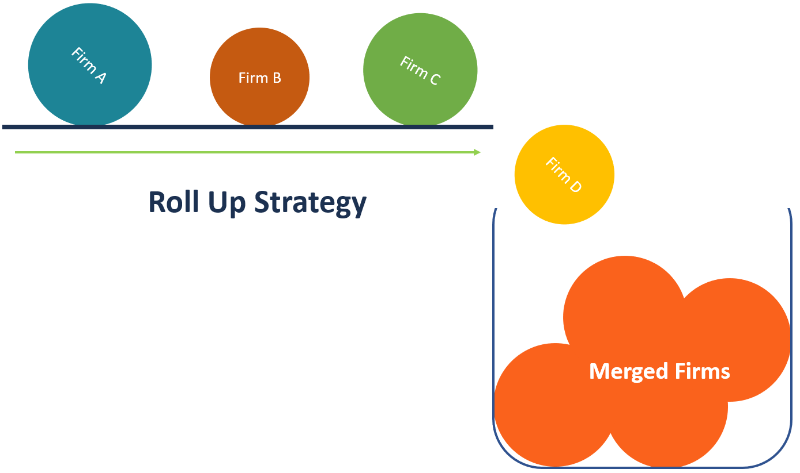

## Table of Contents

## What is a roll-up merger?

A roll-up merger is when a company buys many smaller companies in the same industry to become bigger and more powerful. This is often done to increase the size of the business quickly and to take advantage of economies of scale, which means it becomes cheaper to produce things as the company gets bigger.

These mergers can help the bigger company to have more control over the market and to offer a wider range of products or services. However, roll-up mergers can also be risky because it can be hard to manage so many different companies at once, and there might be problems with integrating them smoothly.

## How does a roll-up merger differ from other types of mergers?

A roll-up merger is different from other mergers because it focuses on buying many smaller companies in the same industry to create a bigger company. This is different from a horizontal merger, where two companies of similar size in the same industry join together. It's also different from a vertical merger, where a company buys another company that is in a different stage of the same industry, like a car maker buying a tire company. Roll-up mergers are all about getting bigger quickly by buying up lots of smaller businesses.

Another way roll-up mergers are different is in their goal. While many mergers aim to combine the strengths of two companies, roll-ups often aim to gain market power and achieve economies of scale. This means that the bigger the company gets, the cheaper it can be to make things. Other mergers might focus more on combining technologies, expanding into new markets, or cutting costs by reducing competition. Roll-up mergers can be riskier because managing many small companies can be hard, and there can be problems with making them work well together.

## What are the primary goals of a roll-up merger?

The main goal of a roll-up merger is to get bigger fast. When a company does a roll-up merger, it buys many smaller companies in the same business. This helps the company grow quickly and become a big player in the market. By getting bigger, the company can have more control over the industry and can offer more products or services to customers.

Another big goal of a roll-up merger is to save money by using economies of scale. This means that as the company gets bigger, it can make things cheaper. For example, buying materials in large amounts can cost less per item. This can help the company make more profit. But, roll-up mergers can be tricky because it's hard to manage a lot of different companies at the same time, and there can be problems with making them all work well together.

## Can you explain the process of executing a roll-up merger?

When a company decides to do a roll-up merger, it starts by looking for smaller companies in the same business to buy. The company will do research to find out which smaller companies are good targets. They look at things like how much money these companies make, how well they are doing, and if they fit well with the bigger company's plans. Once they find the right companies, the bigger company will talk to the owners of the smaller companies to see if they want to sell. If they agree, they will make a deal on the price and other details.

After the deals are made, the bigger company starts to bring all the smaller companies together. This can be a big job because each small company might do things differently. The bigger company needs to make sure everyone is working in the same way and following the same rules. They also have to make sure that the computers and other systems work together. It's important to keep the customers happy during this time, so the company might need to talk to them and make sure they know what is happening. If everything goes well, the bigger company will be able to grow fast and save money by doing things on a larger scale.

## What industries commonly use roll-up mergers?

Roll-up mergers are often used in industries where there are lots of small businesses doing similar things. For example, in the home services industry, like plumbing or pest control, a big company might buy many small local companies to grow quickly. This helps them cover more areas and offer their services to more people. Another industry where roll-up mergers are common is healthcare, especially with small clinics or dental practices. By buying these smaller businesses, a larger company can offer more services in different places and get more patients.

In the technology industry, roll-up mergers are also popular. Tech companies might buy smaller software or app development firms to expand their product line and reach more customers. This can help them grow fast and stay ahead of the competition. The waste management industry is another area where roll-up mergers are used. A big company might buy smaller waste collection or recycling businesses to cover more areas and handle more waste. This can help them save money and become the main provider in the market.

## What are the financial benefits of a roll-up merger for the acquiring company?

A roll-up merger can help the acquiring company save money and make more profit. When a company buys many smaller businesses, it can do things on a bigger scale, which often means buying materials or services cheaper. For example, if a company buys a lot of supplies at once, they can get a better price than if they bought a little bit at a time. This is called economies of scale. Also, by getting bigger, the company can spread out its costs like advertising or office expenses over more businesses, which can lower the cost per business.

Another financial benefit is that the acquiring company can have more control over the market. When a company gets bigger, it can set prices or offer services in a way that smaller companies can't. This can lead to more customers and more sales. Plus, by owning many smaller companies, the bigger company can get more money from different places, which can make their income more stable. This can help them plan better for the future and invest in new projects or improvements.

## How do roll-up mergers affect the market position of the merged entity?

When a company does a roll-up merger, it buys many smaller companies in the same business. This makes the big company much larger and stronger in the market. By getting bigger, the company can have more control over what happens in the industry. It can set prices, decide where to offer services, and have a bigger say in how things are done. This can make it harder for other companies to compete because the big company can do things that smaller companies can't, like offering lower prices because they buy things in bulk.

Also, being bigger means the company can reach more customers and offer more products or services. This can help the company become the main player in the market. People might start thinking of the big company as the go-to place for what they need. But, being big also means the company has to be careful. If it grows too fast or doesn't manage the smaller companies well, it could have problems. Still, if everything goes well, a roll-up merger can make the company a lot stronger and more important in the market.

## What are the potential risks and challenges associated with roll-up mergers?

Roll-up mergers can be tricky because they involve buying many smaller companies, which means a lot of work to make them all work together smoothly. One big challenge is managing all these different businesses at once. Each small company might do things in its own way, so the big company has to figure out how to make everyone follow the same rules and use the same systems. This can take a lot of time and money. If the big company doesn't do this well, the smaller companies might not work as well as they did before, which can hurt the overall business.

Another risk is that the big company might pay too much for the smaller companies. If the price is too high, it might take a long time to make back the money spent on buying them. Also, if the market changes or if customers don't like the changes, the big company could lose money. Sometimes, the smaller companies might not be as good as they seemed when the big company bought them. This can lead to problems and disappointments. So, while roll-up mergers can help a company grow fast, they come with a lot of risks and challenges that need careful handling.

## How can a company evaluate the success of a roll-up merger?

A company can evaluate the success of a roll-up merger by looking at how much money it is making after the merger. If the company is making more money than before and is saving money by buying things in bulk, that's a good sign. The company should also check if it has more customers and if it can offer more products or services. If the bigger company is doing better in the market and has more control over what happens in the industry, that means the roll-up merger was a success.

Another way to evaluate the success is by looking at how well the smaller companies are working together. If the big company managed to make all the smaller companies follow the same rules and use the same systems without too many problems, that's a good thing. The company should also see if the customers are happy and if the employees are working well together. If everything is running smoothly and the big company is stronger in the market, then the roll-up merger was successful.

## What role does due diligence play in a roll-up merger?

Due diligence is really important when a company wants to do a roll-up merger. It's like doing homework to make sure the smaller companies they want to buy are good choices. The big company looks at the smaller companies' money, how well they are doing, and if they fit well with the big company's plans. This helps the big company know if the smaller companies are worth buying and if they can help the big company grow and save money.

If the big company doesn't do a good job with due diligence, they might end up buying companies that aren't as good as they thought. This can lead to problems and losing money. So, due diligence helps the big company make smart choices and avoid surprises. By checking everything carefully, the big company can make sure the roll-up merger will help them get bigger and stronger in the market.

## How do roll-up mergers impact stakeholders, including employees and shareholders?

Roll-up mergers can have a big impact on employees. When a big company buys many smaller ones, it often tries to make everyone work in the same way. This can be hard for employees because they might have to learn new rules and use new systems. Some employees might worry about losing their jobs if the big company decides to cut costs. But, if the merger goes well, employees might also have more chances to move up in the company or work in different areas. It's important for the big company to talk to employees and help them feel okay about the changes.

Shareholders are also affected by roll-up mergers. If the merger helps the company grow and make more money, shareholders can be happy because their shares might be worth more. But, if the big company pays too much for the smaller companies or if the merger doesn't go well, shareholders might lose money. They will be watching closely to see if the company is making smart choices and if the merger is helping the company do better in the market. Shareholders want the company to be successful so their investments grow.

## What are some advanced strategies for optimizing the outcomes of roll-up mergers?

To make a roll-up merger work better, a company can focus on choosing the right smaller businesses to buy. They should do a lot of homework, called due diligence, to make sure the smaller companies fit well with their plans and can help them grow. It's also smart to have a good plan for bringing all the smaller companies together. This means making sure everyone uses the same systems and follows the same rules. The big company should also talk to employees and customers during the merger to keep them happy and make sure they know what's going on.

Another important strategy is to keep an eye on costs and savings. The big company should look for ways to save money by buying things in bulk and doing things on a bigger scale. They should also check if they are making more money after the merger and if they are doing better in the market. If the big company sees any problems or things that aren't working well, they should fix them quickly. By doing these things, the company can make sure the roll-up merger helps them get bigger and stronger in the market.

## References & Further Reading

[1]: Andrade, G., Mitchell, M., & Stafford, E. (2001). ["New Evidence and Perspectives on Mergers."](https://www.jstor.org/stable/2696594) Journal of Economic Perspectives, 15(2), 103-120.

[2]: Marks, M. L., & Mirvis, P. H. (2001). ["Making Mergers and Acquisitions Work: Strategic and Psychological Preparation."](https://www.jstor.org/stable/4165737) Harvard Business Review.

[3]: ["Economics of Scale."](https://en.wikipedia.org/wiki/Economies_of_scale) Investopedia.

[4]: Gaughan, P. A. (2017). ["Mergers, Acquisitions, and Corporate Restructurings."](https://onlinelibrary.wiley.com/doi/book/10.1002/9781119380771) Wiley.

[5]: Eliott, D. J., & Stephenson, E. (2014). ["The Future of Algorithmic Trading."](https://psycnet.apa.org/record/2014-11802-000) Brookings Institution.