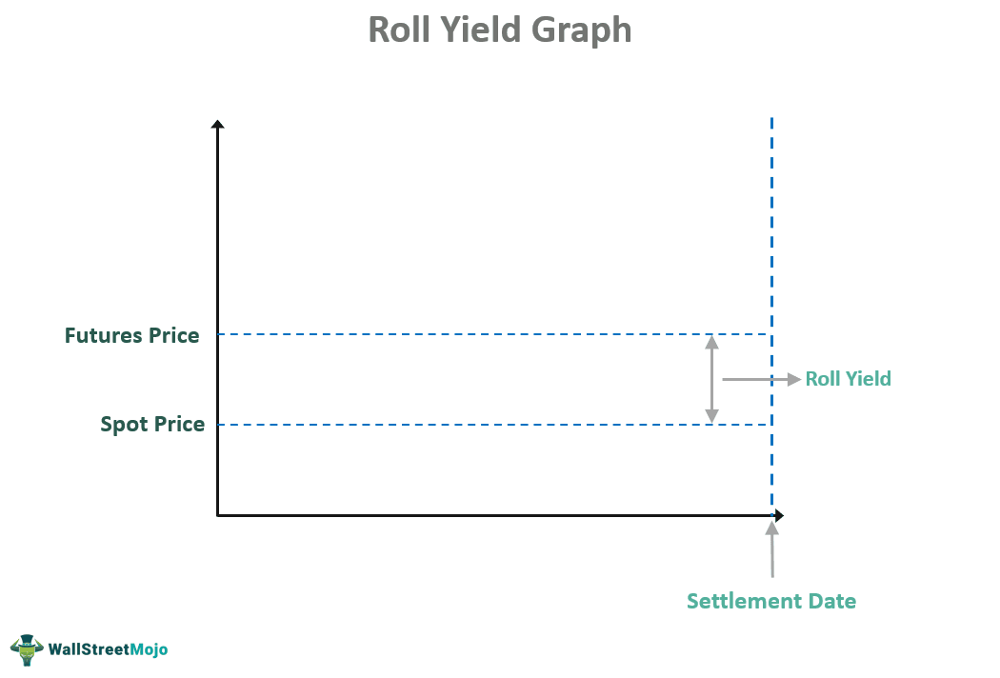

## Table of Contents

## What is roll yield?

Roll yield is the gain or loss that happens when you move from one futures contract to another. This happens because futures contracts have expiration dates. When a contract is about to expire, you need to sell it and buy a new one that expires later. The difference between the price of the old contract and the new one is the roll yield.

If the futures market is in contango, the prices of future contracts are higher than the current ones. When you roll over, you sell low and buy high, which means you lose money. This is a negative roll yield. On the other hand, if the market is in backwardation, future prices are lower than current ones. When you roll over, you sell high and buy low, which means you make money. This is a positive roll yield.

## How does roll yield affect futures contracts?

Roll yield is important for people who invest in futures contracts. It happens when you switch from an old futures contract to a new one because the old one is about to expire. The price difference between the old and new contract is the roll yield. If the price of the new contract is higher than the old one, you lose money when you switch. This is called a negative roll yield. If the price of the new contract is lower than the old one, you make money when you switch. This is called a positive roll yield.

The effect of roll yield depends on whether the futures market is in contango or backwardation. In contango, the prices of future contracts are higher than the current ones. So, when you roll over, you have to buy the new contract at a higher price, which means you lose money. This is a negative roll yield. In backwardation, the prices of future contracts are lower than the current ones. So, when you roll over, you can buy the new contract at a lower price, which means you make money. This is a positive roll yield. Understanding roll yield helps investors know if they will gain or lose money when they switch contracts.

## What is the difference between positive and negative roll yield?

Positive and negative roll yield are terms used when you switch from one futures contract to another because the old one is about to expire. Positive roll yield happens when the price of the new contract is lower than the price of the old one. This means you make money when you switch because you sell the old contract at a higher price and buy the new one at a lower price. This situation is called backwardation, where future prices are lower than current ones.

Negative roll yield is the opposite. It happens when the price of the new contract is higher than the price of the old one. This means you lose money when you switch because you have to sell the old contract at a lower price and buy the new one at a higher price. This situation is called contango, where future prices are higher than current ones. Knowing whether you will get a positive or negative roll yield helps you understand if you will gain or lose money when you switch contracts.

## Can you explain backwardation and contango in relation to roll yield?

Backwardation and contango are terms that describe the shape of the futures market and they have a big impact on roll yield. Backwardation happens when the price of a futures contract that will expire soon is higher than the price of a contract that will expire later. When you switch from the old contract to the new one in a backwardation market, you sell the old contract at a high price and buy the new one at a lower price. This means you make money, which is called a positive roll yield.

Contango is the opposite of backwardation. It happens when the price of a futures contract that will expire soon is lower than the price of a contract that will expire later. When you switch from the old contract to the new one in a contango market, you sell the old contract at a low price and buy the new one at a higher price. This means you lose money, which is called a negative roll yield. Understanding whether the market is in backwardation or contango helps you know if you will gain or lose money when you switch contracts.

## How can investors identify whether a market is in backwardation or contango?

Investors can figure out if a market is in backwardation or contango by looking at the prices of futures contracts. If the price of a futures contract that will expire soon is higher than the price of a contract that will expire later, the market is in backwardation. For example, if the price of a contract expiring next month is $100 and the price of a contract expiring in six months is $95, the market is in backwardation.

On the other hand, if the price of a futures contract that will expire soon is lower than the price of a contract that will expire later, the market is in contango. For example, if the price of a contract expiring next month is $100 and the price of a contract expiring in six months is $105, the market is in contango. By comparing these prices, investors can easily tell which situation the market is in and how it might affect their roll yield when they switch contracts.

## What are the potential impacts of roll yield on an investment portfolio?

Roll yield can have a big impact on an investment portfolio, especially if the portfolio includes futures contracts. When you own futures, you have to switch from one contract to another as they expire. This switch can either make you money or cost you money, depending on whether the market is in backwardation or contango. If the market is in backwardation, you get a positive roll yield, which means you make money when you switch contracts. This can boost your portfolio's returns. But if the market is in contango, you get a negative roll yield, which means you lose money when you switch contracts. This can hurt your portfolio's returns.

Understanding roll yield is important for managing a portfolio with futures. If you know the market is in contango, you might want to be careful about how much you invest in futures because the negative roll yield could eat into your returns over time. On the other hand, if you know the market is in backwardation, you might want to invest more in futures to take advantage of the positive roll yield. By keeping an eye on whether the market is in backwardation or contango, you can make smarter choices about your investments and potentially improve your portfolio's performance.

## How does roll yield influence the returns of commodity ETFs?

Roll yield can really affect the returns of commodity ETFs, which are funds that invest in commodities like oil or gold through futures contracts. When these ETFs need to switch from an old futures contract to a new one because the old one is expiring, they either gain or lose money depending on the market's state. If the market is in backwardation, where the price of the old contract is higher than the new one, the [ETF](/wiki/etf-trading-strategies) makes money on the switch. This is called a positive roll yield, and it can help boost the ETF's returns.

But if the market is in contango, where the price of the old contract is lower than the new one, the ETF loses money on the switch. This is called a negative roll yield, and it can drag down the ETF's returns over time. Knowing whether the market is in backwardation or contango is important for investors in commodity ETFs because it can help them understand and predict how roll yield might affect their investment's performance.

## What strategies can traders use to mitigate negative roll yield?

Traders can use a few smart strategies to lessen the impact of negative roll yield. One way is to carefully choose when to roll over their futures contracts. Instead of rolling over right before the old contract expires, they might wait for a time when the price difference between the old and new contracts is smaller. This way, they can reduce the amount of money they lose due to negative roll yield. Another strategy is to use options along with futures. By buying options that let them sell or buy futures at a certain price, traders can protect themselves from big price changes when they roll over.

Another approach is to diversify their investments. Instead of putting all their money into one type of futures contract, traders can spread their investments across different commodities or financial instruments. This way, if one market is in contango and causing negative roll yield, the gains from other investments might help balance out the losses. Lastly, traders can look for ETFs or other investment vehicles that are designed to minimize the effects of negative roll yield. These products often use different strategies, like holding a mix of futures with different expiration dates, to reduce the impact of contango on their returns.

## How do changes in supply and demand affect roll yield?

Changes in supply and demand can really change whether the market is in contango or backwardation, which affects roll yield. When there's more demand for a commodity than there is supply, the price of futures contracts that will expire soon can go up a lot. This makes the market go into backwardation. In this case, when traders switch from the old contract to the new one, they sell the old contract at a high price and buy the new one at a lower price, which gives them a positive roll yield. So, if demand is high and supply is low, roll yield can be good for traders.

On the other hand, if there's more supply of a commodity than there is demand, the price of futures contracts that will expire soon can be lower than the price of contracts that will expire later. This makes the market go into contango. When traders switch from the old contract to the new one in this situation, they sell the old contract at a low price and buy the new one at a higher price, which gives them a negative roll yield. So, if supply is high and demand is low, roll yield can be bad for traders. Understanding how supply and demand can shift the market helps traders know what to expect when they need to switch their futures contracts.

## Can you discuss historical examples where roll yield significantly impacted market performance?

One big example of roll yield affecting market performance was during the oil price crisis in 2008 and 2009. Back then, oil prices were really high and the market was in backwardation. This meant that the price of oil futures that were expiring soon was higher than the price of futures expiring later. People who were investing in oil through futures made money when they switched from the old contract to the new one because they got a positive roll yield. But when the financial crisis hit and oil demand dropped, the market switched to contango. Now, the price of oil futures expiring soon was lower than the ones expiring later. Investors started losing money on their roll yield because they had to buy the new contracts at a higher price, which hurt the returns of many commodity ETFs and funds.

Another example happened in the natural gas market around 2010 and 2011. During this time, natural gas was in a strong contango because there was a lot of supply and not enough demand. This meant that the price of futures expiring soon was lower than the price of futures expiring later. Investors in natural gas ETFs and funds were hit hard by negative roll yield. Every time they had to switch from an old contract to a new one, they were losing money because they had to buy the new contract at a higher price. This negative roll yield dragged down the performance of many natural gas investment vehicles during that period.

## What are the advanced mathematical models used to predict roll yield?

Advanced mathematical models to predict roll yield often use time series analysis and regression models. These models look at past data to find patterns in how the prices of futures contracts change over time. They might use something called an autoregressive integrated moving average (ARIMA) model, which is good at predicting future values based on past ones. Another common approach is using regression models to see how different factors, like changes in supply and demand, affect the price difference between old and new futures contracts. By putting all this data into the model, it can give a good guess about whether the market will be in backwardation or contango, and what the roll yield might be.

Some more complex models also use [machine learning](/wiki/machine-learning) techniques. These models can learn from a lot of data to find hidden patterns that simpler models might miss. For example, a [neural network](/wiki/neural-network) can be trained to predict roll yield by looking at many different pieces of information, like economic indicators, past price movements, and even things like weather forecasts that might affect commodity prices. These machine learning models can be really good at making predictions, but they need a lot of data and computing power. By using these advanced models, traders and investors can get a better idea of what to expect from roll yield and plan their strategies accordingly.

## How do macroeconomic factors influence roll yield in different asset classes?

Macroeconomic factors like interest rates, inflation, and economic growth can really change how much money you make or lose from roll yield in different asset classes. For example, when interest rates go up, it can make the cost of holding futures contracts more expensive. This might push the market into contango because people want more money to hold onto contracts that will expire later. On the other hand, if inflation is high and people think prices will keep going up, the market might go into backwardation because they want to get the commodity now before it gets even more expensive. These big economic changes can make a big difference in whether you get a positive or negative roll yield.

Different asset classes also react differently to macroeconomic factors. In commodities like oil or gold, changes in global demand and supply can push the market into backwardation or contango. For example, if there's a big drop in oil demand because of an economic slowdown, the market might go into contango, and investors might lose money on roll yield. In financial futures like stock index futures, economic growth and [interest rate](/wiki/interest-rate-trading-strategies) changes can be more important. If the economy is doing well and interest rates are low, the market might be in backwardation, and investors could make money on roll yield. Understanding how these big economic factors affect different asset classes helps investors predict and manage roll yield better.

## What is Roll Yield and How Can It Be Understood?

Roll yield arises from the price differential between futures contracts with varying expiration dates. In futures markets, investors manage positions by either rolling over contracts nearing expiration or exiting them to avoid the physical delivery of the underlying asset. This process is a fundamental aspect of futures trading, enabling investors to maintain a continuous exposure to a commodity, financial instrument, or index without the necessity of taking possession of the physical asset.

Rolling a futures contract essentially involves selling a contract that is close to its expiration and simultaneously buying a contract with a later expiration date. The financial outcome of this strategy is contingent upon the relationship between current and future expected prices of the contracts. This transaction can result in either a profit or a loss, which constitutes the roll yield.

To illustrate this, consider a scenario where an investor holds a futures contract that is set to expire soon. As the expiration date approaches, the investor sells this contract and purchases a contract with a further expiration. The roll yield can be expressed mathematically as:

$$
\text{Roll Yield} = \frac{\text{Price of further-out contract} - \text{Price of near-month contract}}{\text{Price of near-month contract}}
$$

This formula signifies that the roll yield is essentially the percentage difference between the prices of the two contracts. A positive roll yield occurs when the price of the further-out contract is higher than that of the near-month contract, indicating a profit from the rollover. Conversely, a negative roll yield arises when the near-month contract is more expensive, leading to a loss upon rolling.

Understanding and anticipating roll yield is crucial for traders, particularly those engaged in strategic approaches such as [algorithmic trading](/wiki/algorithmic-trading), where real-time data and rapid decision-making are key to capitalizing on profitable opportunities and mitigating risks. By effectively managing roll yield, investors can optimize their strategies in futures markets, aligning their positions to expected price movements and market conditions.

## How do you calculate roll yield?

Calculating roll yield is a critical task for traders aiming to comprehend the profitability and potential risks associated with futures market positions. The roll yield calculation focuses on the price difference between a near-month futures contract and a further-out contract. This difference emerges as a result of shifting a position from an expiring contract to a longer-term one.

The formula for calculating roll yield is straightforward:

$$
\text{Roll Yield} = \frac{\text{Price of further-out contract} - \text{Price of near-month contract}}{\text{Price of near-month contract}}
$$

This calculation helps traders discern whether the process of rolling contracts generates a profit or incurs a loss. A positive roll yield indicates that rolling into a more distant contract provides a financial gain, whereas a negative roll yield denotes a financial loss.

Precise computation of roll yield is vital in strategizing within the futures markets. It informs traders about the cost or gain of maintaining futures positions over time, incorporating market characteristics such as contango or backwardation. Traders incorporate this calculation routinely to assess their strategies' viability and adjust positions in response to market conditions.

To automate roll yield calculations, traders often use programming languages like Python. Here is a simple Python function to calculate roll yield:

```python
def calculate_roll_yield(near_month_price, further_out_price):
    if near_month_price == 0:
        raise ValueError("Near-month contract price cannot be zero.")
    roll_yield = (further_out_price - near_month_price) / near_month_price
    return roll_yield

# Example usage:
near_month_price = 100
further_out_price = 105
roll_yield = calculate_roll_yield(near_month_price, further_out_price)
print(f"Roll Yield: {roll_yield:.2%}")
```

This code snippet demonstrates the practical implementation of roll yield calculation, offering traders a tool to rapidly evaluate and respond to changing futures market conditions.

## References & Further Reading

[1]: Hull, J. C. (2017). ["Options, Futures, and Other Derivatives."](https://www.semanticscholar.org/paper/Options%2C-Futures%2C-and-Other-Derivatives-Hull/89bdee500c8623864fc9eb7a471546aa713acc44) Pearson Education.

[2]: Kolb, R. W., & Overdahl, J. A. (2007). ["Futures, Options, and Swaps."](https://www.blackwellpublishing.com/KOLB/) Wiley.

[3]: Gorton, G. B., Hayashi, F., & Rouwenhorst, K. G. (2013). ["The Fundamentals of Commodity Futures Returns."](https://www.nber.org/papers/w13249) Financial Analysts Journal, 69(2), 47-68.

[4]: Chance, D. M., & Brooks, R. (2015). ["An Introduction to Derivatives and Risk Management."](https://archive.org/details/introductiontode0000chan_m1l1) Cengage Learning.

[5]: Jarrow, R. A. (2011). ["Contango."](https://paradigmfutures.net/a/education/contango/) The Journal of Futures Markets, 31(3), 209-214.