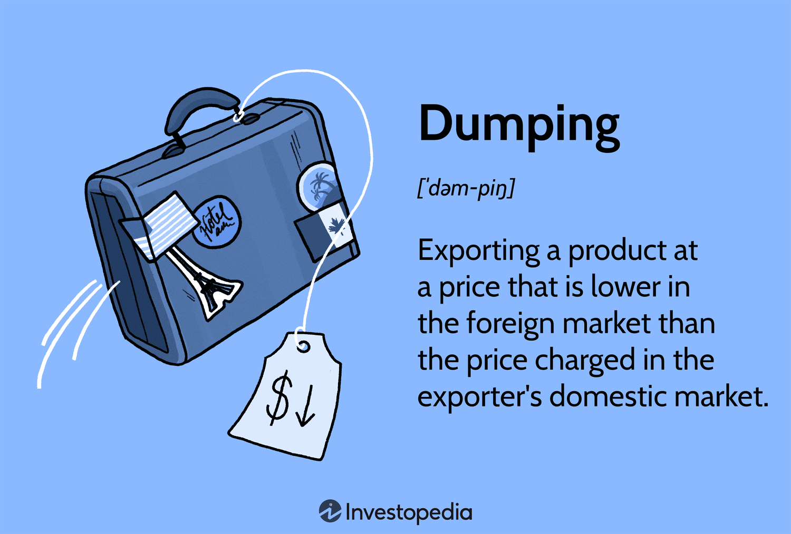

Algorithmic trading, or algo trading, refers to using computer-generated algorithms to automate trading decisions. This method leverages advanced mathematical models and data analysis to execute trades at speeds and frequencies that outpace human abilities. It has become increasingly popular in financial markets due to its capacity to reduce human error, increase execution speed, and optimize trading strategies.

Algo trading offers numerous opportunities by enabling traders to exploit market inefficiencies and take advantage of arbitrage possibilities that may exist for only fractions of a second. However, it also presents challenges, such as the risk of system failures and the need for robust algorithmic systems that can adapt to rapidly changing market conditions.



This article examines the pros and cons of algorithmic trading, focusing specifically on rollback strategies and other related methods used in options trading. Rollback strategies involve replacing an existing position with another having a nearer expiration, helping manage risk and volatility. These strategies are crucial for traders looking to optimize their portfolios and mitigate risks effectively.

Understanding the complexities of rollback strategies is essential for traders who aim to fine-tune their approaches for better performance. We will explore how these strategies are employed in practical scenarios, providing examples to illustrate their impact on trading effectiveness. As markets continue to evolve, staying informed about the latest algo trading techniques is vital for those seeking to enhance their trading performance in highly dynamic financial environments.

## Table of Contents

## Understanding Rollback Strategies in Algo Trading

A rollback strategy in algorithmic trading involves the substitution of an existing options position with a new one that has a closer expiration date. This approach is employed primarily to manage risk and mitigate volatility, offering traders the ability to adjust their options positions in response to evolving market conditions. By doing so, traders can potentially enhance their portfolio's performance while reducing potential losses.

Rollbacks represent one critical subset within the broader category of 'roll' strategies, which also include roll forward, roll up, and roll down strategies. These strategies allow traders to modify various elements of their options positions, such as expiration dates and strike prices, in accordance with their market outlook and risk management goals.

When implementing a rollback, a trader essentially restructures their portfolio by closing out an existing options position and simultaneously opening a new one with a nearer maturity date. This technique helps traders align their positions with short-term market expectations, thus providing the flexibility needed to navigate uncertain financial landscapes. For instance, if a trader anticipates heightened [volatility](/wiki/volatility-trading-strategies) in the near future, they might replace a longer-term option with a short-term one to better capture potential advantages or avoid significant losses arising from the expected market shifts.

The primary advantage of using rollback strategies, alongside other roll methods, lies in their potential to improve the agility and responsiveness of trading strategies. By adjusting the expiry dates of options, traders can fine-tune their portfolios to better align with prevailing market dynamics. This agility is crucial in fast-paced trading environments, where the ability to react promptly to new information can be the difference between securing a profit or incurring a loss.

Overall, rollback strategies offer traders a tactical means to refine their portfolios and respond to rapidly changing market conditions, thereby enhancing their capacity to manage risks and capitalize on emerging opportunities.

## Pros of Using Rollback Strategies in Algo Trading

Algorithmic trading has transformed the landscape of financial markets, allowing traders to execute complex strategies with precision and speed. Among these, rollback strategies have emerged as valuable tools for optimizing option position management. Rollbacks primarily serve the purpose of mitigating market risk by aligning trading positions with evolving market conditions—a crucial advantage in today's volatile markets.

One of the primary benefits of rollback strategies is their ability to lock in profits and limit losses. By adjusting expiration dates and strike prices, traders can better match their positions with their expectations of future market movements. For example, a trader holding an options position that is approaching expiration might opt to roll back to an earlier expiration date, possibly securing gains while reducing exposure to adverse price movements. This adaptability enables traders to dynamically manage portfolios, optimizing the risk-reward ratio.

Moreover, rollback strategies can lead to reduced transaction costs. Unlike strategies that require extensive buying or selling, rollbacks entail modifying existing positions, which usually involves fewer transactions. This efficiency in portfolio adjustment helps in cutting down on trading fees and spreads, which can accumulate rapidly, especially in high-frequency trading environments. These cost savings can significantly enhance the net returns of a trading strategy over time.

In essence, when properly implemented, rollback strategies in [algorithmic trading](/wiki/algorithmic-trading) provide an effective mechanism for navigating market uncertainties. They allow traders to refine their trading positions to be more reflective of current market realities, thereby enhancing the overall stability and profitability of their trading activities.

## Cons of Using Rollback Strategies in Algo Trading

Algorithmic trading and rollback strategies provide opportunities for optimizing trading positions, but they come with several challenges that must be addressed for effective implementation. One of the primary difficulties is the requirement for substantial expertise to implement rollback strategies successfully. The complexity of these strategies necessitates a deep understanding of financial markets, options trading, and the ability to anticipate market movements accurately. Without this knowledge, traders might be unable to execute rollbacks that align with market conditions, potentially resulting in suboptimal outcomes.

A major risk associated with rollback strategies is the potential for increased losses due to speculation and the misjudgment of market conditions. Traders relying on predictions may find their expectations unmet, leading to unfavorable adjustments. For instance, if a trader prematurely rolls back an option expecting short-term volatility, but the market stabilizes instead, the decision could result in amplified losses instead of securing profits.

Moreover, the setup and operational costs associated with rollback strategies present another obstacle, particularly for traders with limited capital. Implementing these strategies often requires a margin account, which necessitates maintaining a minimum balance as stipulated by brokerage firms. The requirement for a detailed framework to monitor and adjust options positions periodically can also inflate operational costs, posing a barrier to entry for smaller investors.

These challenges underscore the necessity for informed decision-making and robust infrastructure when employing rollback strategies in algorithmic trading. While the potential benefits of reducing risk and improving portfolio performance are attractive, traders must navigate the complexities and inherent costs to leverage these strategies effectively.

## Examples of Rollback Strategies in Action

In practice, rollback strategies in trading involve several tactical adjustments aimed at managing volatility and optimizing positions. Consider a trader who holds a call option expiring in September. Due to unforeseen market fluctuations, they assess that short-term volatility could negatively impact their position. As a risk management tactic, they decide to roll back to a June call option with the same strike price. This adjustment allows them to mitigate potential losses by capitalizing on nearer-term market moves, potentially stabilizing their portfolio during turbulent periods.

Similarly, another trader might employ a rollback strategy in the context of put options. Suppose they originally hold a put option expiring in October, but market indicators suggest an impending downturn sooner than anticipated. To capitalize on this forecast and manage exposure, the trader executes a rollback by moving to an August put option, maintaining the same strike price. This strategic move positions the trader to benefit from declining market conditions sooner, thereby optimizing their return potential while aligning their position with current market expectations.

In both scenarios, these traders utilize rollback strategies to effectively navigate market volatility. By adjusting expiration dates, they recalibrate their exposure and enhance the flexibility of their trading strategies, allowing for more precise alignment with anticipated market movements. These examples underscore the practical application of rollbacks in managing options portfolios amidst fluctuating financial environments.

## Comparing Rollback with Other Roll Strategies

Roll strategies are essential components in options trading, allowing traders to adjust their positions based on changing market conditions. Among these strategies, rollback, roll forward, roll up, and roll down each serve unique purposes and cater to different market scenarios.

Roll forward strategies are primarily utilized in bullish market conditions. They involve extending the expiration dates of options positions to maintain the same directional stance for a longer period. By rolling forward, traders can continue to benefit from an ongoing favorable trend without executing an outright purchase of new options. For instance, if a trader holds a call option that is profitable due to an anticipated rise in the underlying asset price, they might roll forward to extend the position’s timeframe and capitalize on the upward [momentum](/wiki/momentum) without closing and reopening the position.

Roll up and roll down are strategies focused on altering the strike prices of options to align with the trader's revised market outlook and to manage volatility. A roll-up strategy involves increasing the strike price of a call option or decreasing the strike price of a put option, typically used when the underlying asset's price is expected to continue moving in a favorable direction. Conversely, roll down strategies imply decreasing the strike price of a call option or increasing the strike price of a put option, often employed in bearish conditions or when the asset's price is anticipated to decline.

Choosing between rollback, roll forward, roll up, or roll down depends significantly on market forecasts and the trader's individual risk tolerance. If a trader anticipates short-term volatility but expects longer-term stability or growth, a rollback might be appropriate, allowing them to reduce immediate risk while maintaining a favorable position. On the other hand, roll forward positions might be more suitable in scenarios where the trader is confident in the continuation of current trends over a more extended period.

Both roll up and roll down strategies necessitate a recalibration of strike prices in response to shifts in market conditions. A trader engaged in a roll-up strategy perceives an opportunity to secure profits by adjusting the option’s strike price higher, indicative of a bullish outlook. Conversely, a roll-down strategy suggests a bearish sentiment, anticipating downward movement of the asset price.

Ultimately, the decision to employ a specific roll strategy should be based on a careful analysis of market conditions, forecasted trends, and the trader's risk profile. These strategies can enhance portfolio performance when applied correctly but require a deep understanding and strategic foresight to be effective.

## Conclusion

Rollback and other roll strategies, when executed with precision and insight, can significantly enhance a trader's arsenal. These strategies offer substantial benefits through risk mitigation and cost efficiency. By realigning expiration dates and recalibrating positions to better suit evolving market conditions, traders can navigate the complexities of volatile markets with increased confidence. Nonetheless, these strategies demand considerable expertise to ensure effective implementation. A deep understanding of market dynamics and rigorous analysis is crucial to minimize the risks associated with speculative positions and misjudged conditions.

Additionally, the potential for reduced transaction costs must be carefully balanced against initial setup expenses, including the need for margin accounts and sophisticated computational resources. For traders equipped with the requisite knowledge and tools, implementing rollback strategies can lead to more responsive and adaptive trading approaches. These strategies are particularly effective in managing short-term volatility while aiming to safeguard portfolio integrity and optimize returns. By strategically incorporating rollbacks into their trading plans, traders can enhance performance, demonstrating the significance of these strategies in navigating modern financial markets.

## FAQs

**What is a rollback in trading?**  
A rollback in trading is a strategic maneuver involving the exchange of an existing options position for a similar one with a closer expiration date. This tactic is primarily employed to manage risk and address volatility in changing market environments. By transitioning to a nearer expiry, traders can adjust their exposure to market conditions which might have shifted since the original position was established.

**Do rollbacks count as day trades?**  
No, rollbacks generally do not qualify as day trades. Day trading typically involves the buying and selling of a security within the same trading day to capitalize on short-term market movements. Rollbacks, on the other hand, involve maintaining positions within the same class of securities, as the primary intent is to adjust the expiration date rather than executing a buy-and-sell transaction within the same day. Therefore, they do not fall under the typical definition of [day trading](/wiki/day-trading-spy).

**Can rollbacks be automated?**  
Yes, rollbacks can indeed be automated. The automation of such strategies requires sophisticated algorithms that can determine the optimal timing and conditions for initiating a rollback. These algorithms must continuously monitor market conditions, including volatility, option premiums, and overall market trends. Automating rollbacks can enhance efficiency, but it requires robust algorithmic systems capable of managing complex financial computations and executing trades promptly based on predefined criteria. Python, with its extensive libraries and frameworks for financial data analysis, is frequently used for developing such trading algorithms. Here’s a simple conceptual Python snippet that outlines the basic logic for automating a rollback decision:

```python
def should_roll_back(current_expiry, new_expiry, market_conditions):
    if market_conditions['volatility'] > threshold_volatility:
        # Assess whether the new expiry improves risk exposure
        if new_expiry < current_expiry:
            return True
    return False

# Usage example
market_conditions = {'volatility': 0.3}  # Example condition with high volatility
current_expiry = '2023-09'
new_expiry = '2023-06'
threshold_volatility = 0.25

if should_roll_back(current_expiry, new_expiry, market_conditions):
    print("Perform rollback")
else:
    print("Hold the current position")
```
This code demonstrates a conditional check to evaluate whether a rollback is beneficial based on current market volatility and expiry dates.

## References & Further Reading

[1]: ["Advances in Financial Machine Learning"](https://www.amazon.com/Advances-Financial-Machine-Learning-Marcos/dp/1119482089) by Marcos Lopez de Prado

[2]: ["Evidence-Based Technical Analysis: Applying the Scientific Method and Statistical Inference to Trading Signals"](https://www.amazon.com/Evidence-Based-Technical-Analysis-Scientific-Statistical/dp/0470008741) by David Aronson

[3]: ["Machine Learning for Algorithmic Trading"](https://github.com/stefan-jansen/machine-learning-for-trading) by Stefan Jansen

[4]: ["Quantitative Trading: How to Build Your Own Algorithmic Trading Business"](https://www.amazon.com/Quantitative-Trading-Build-Algorithmic-Business/dp/1119800064) by Ernest P. Chan