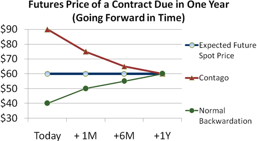

Understanding the nuances of rolling prices is crucial for both strategists and traders engaged in algorithmic trading. This article explores the concept of rolled prices within algo trading, aiming to provide insights into their significance and application. Algorithmic trading is notable for its speed and precision, allowing traders to engage with markets in a highly automated fashion. By examining the mechanics of rolled prices, traders can improve trading efficiency and enhance the development of their strategies.

In algorithmic trading, rolled prices relate to the adjustment or synthesis of prices in futures contracts where expiring contracts are rolled over into new ones. This process is essential to maintaining continuity in trading strategies, particularly given that futures contracts are a commonly traded asset class. As traders aim for seamless transitions from old to new contracts, understanding and effectively utilizing rolled prices can contribute significantly to the maintenance of strategic alignment and market participation.

With the increasing sophistication of algorithmic systems, these strategies leverage the dynamics of rolled prices to make impactful trading decisions. Automated trading systems can swiftly adapt to changes in rolled prices across different contracts, minimizing costs and improving decision-making processes. Such advancements highlight the critical role of rolled prices in algorithmic trading, providing traders with tools for optimizing their participation in the financial markets.

## Table of Contents

## Understanding Rolled Prices

Rolled prices play a critical role in futures markets, particularly concerning [algorithmic trading](/wiki/algorithmic-trading) strategies. Futures contracts are agreements to buy or sell an asset at a predetermined future date and price. However, these contracts have expiry dates, necessitating a strategy for maintaining a position beyond the expiration of the current contract. This is where the concept of rolled prices comes into play.

Rolled prices are essentially adjusted or synthesized prices that result when a position in an expiring futures contract is transitioned, or "rolled over," into a new contract. The objective is to ensure a seamless continuation of the trading strategy without the interruption of closing one contract and opening another. This is key in algorithmic trading, where futures contracts are extensively used as they allow for automated and high-speed trading, leveraging small price movements.

The rolling process involves closing a position in a futures contract that is near expiration and simultaneously opening a position in a futures contract with a later expiration date. By doing this, traders can maintain their market exposure without experiencing the disruptions associated with contract expirations. This continuous adjustment of positions is critical for the consistency of an algorithmic trading strategy.

In algorithmic trading, rolling strategies can be executed meticulously through predetermined algorithms, which can track and execute the roll based on market conditions, the pricing of futures contracts, and other variables that might affect the timing and cost of the roll. This process mitigates the potential impacts of rolling costs or price distortions that could arise due to shifts in market conditions around the expiration period.

By using rolled prices, algorithmic traders can effectively maintain continuity in trading strategies, allowing for uninterrupted strategy implementation and efficiency in market participation. This adaptation is particularly pertinent in volatile markets where futures contracts serve as pivotal instruments in hedging risks or speculate on price changes.

## The Role of Algorithmic Trading

Algorithmic trading employs advanced computer algorithms to execute large volumes of trades quickly and with precision. These algorithms are designed to make trading decisions at speeds and frequencies that are impossible for a human trader, facilitating the efficient management of complex trading strategies. Central to this efficiency is the capability to effectively leverage rolled prices within futures contracts, which helps in optimizing decision-making and reducing transaction costs.

Rolled prices are used to transition expiring futures contracts seamlessly into new ones, a process critical in maintaining strategy continuity without the associated delivery costs. Algorithmic systems are particularly adept at managing these transitions because they can automatically and instantaneously adjust trading strategies based on the updated information presented by rolled prices.

The use of rolling prices in algorithmic trading minimizes the transaction costs involved with contract expiration and renewal. For instance, using dynamic algorithms allows traders to adjust their positions in anticipation of a roll, thereby optimizing entry and [exit](/wiki/exit-strategy) points around contract expirations. These strategies are crucial for traders who need to manage large portfolios or execute numerous transactions across different markets and asset classes.

An additional advantage of algorithmic trading in the context of rolled prices is the ability to swiftly adapt to market changes. The algorithms can be programmed to automatically respond to different market conditions by recalibrating strategies as rolled prices change. This adaptability is critical for maintaining an edge in the competitive trading landscape and ensures that trading decisions are made with the most current and accurate data.

In conclusion, algorithmic trading capitalizes on the use of rolling prices to maintain strategic consistency and reduce expenses. Automated systems enhance the ability of traders to manage these rolled price adjustments effectively, ensuring that strategies are executed with the greatest efficiency and minimal market impact.

## Strategies Involving Rolled Prices

In algorithmic trading, rolled prices offer significant value, particularly in the way they support futures-based strategies by smoothing transitions through contract expirations. A common practice involves rolling forward with futures contracts to prevent the obligation of physical delivery. This strategic move ensures the continuation of a trader's position, allowing for the maintenance of exposure to a particular asset without disruption due to contract expiration. This process typically involves closing an expiring futures position and entering a new position in a later-dated contract, thus sustaining the trading strategy's longevity.

Trend-following algorithms harness rolled prices to effectively maintain strategy consistency when futures contracts expire. Such algorithms are designed to capitalize on market trends by entering positions following established price movements. Rolled prices enable these strategies to operate seamlessly beyond the limitations of individual contract lifecycles. By integrating rolled price data, trend-following algorithms can sustain their strategy without the need to recalibrate or renegotiate the parameters of the trade at every contract expiration, which can be mathematically expressed as:

$$
P_{\text{rolled}}(t) = \alpha P_{\text{old}}(t) + (1 - \alpha) P_{\text{new}}(t)
$$

where $P_{\text{rolled}}(t)$ represents the rolled price at time $t$, $P_{\text{old}}(t)$ is the price of the expiring contract, $P_{\text{new}}(t)$ is the price of the new contract, and $\alpha$ is a weighting factor that reflects the transition strategy.

For statistical [arbitrage](/wiki/arbitrage) strategies, rolled prices are pivotal in identifying and exploiting price discrepancies across correlated assets or between current and future contracts. These strategies take advantage of temporary inefficiencies or mispricings in the market, aiming for profit as the market corrects itself. By analyzing rolled prices across different contracts, [statistical arbitrage](/wiki/statistical-arbitrage) models can identify undervalued or overvalued positions, executing trades that benefit from anticipated price corrections. These discrepancies could arise from slight mismatches in pricing due to the contract rollover process.

Overall, by effectively incorporating rolled prices into their strategies, traders can reduce transaction costs related to the physical delivery of assets, optimize strategy execution during contract rollovers, and enhance the robustness of statistical arbitrage operations.

## Technical Requirements for Utilizing Rolled Prices

To effectively utilize rolled prices in algorithmic trading, a sophisticated technical infrastructure is required. This infrastructure must be capable of delivering robust data feeds that provide real-time updates on rolled prices. These data feeds are vital because they ensure that trading algorithms have immediate access to the most current market information, allowing for timely and informed decision-making.

Additionally, integrating rolled price data into trading strategies necessitates the use of sophisticated algorithms and comprehensive [backtesting](/wiki/backtesting) capabilities. Algorithms must be equipped to interpret and respond to the dynamic nature of rolled prices, which involves calculating adjusted positions as contracts near expiration and are rolled over into new contracts. Backtesting tools allow traders to simulate the performance of their strategies under historical market conditions, incorporating rolled price adjustments to refine and optimize their approaches.

Moreover, access to advanced trading platforms is crucial. These platforms provide the necessary infrastructure for the seamless and automatic placement of orders, ensuring that trades are executed efficiently and accurately according to the pre-defined strategies integrating rolled prices. Advanced trading platforms typically offer customizable interfaces and the ability to implement complex algorithms, facilitating a streamlined trading process that can capitalize on the nuances of rolled prices.

In summary, the effective utilization of rolled prices in algorithmic trading requires a combination of real-time data feeds, sophisticated algorithmic capabilities, and advanced trading platforms. Together, these elements provide the foundation for leveraging rolled prices to enhance trading performance.

## Challenges and Considerations

In algorithmic trading, dealing with rolled prices presents several challenges and considerations that traders must address to ensure optimal performance. One of the primary challenges is latency in accessing rolled prices. This latency can significantly affect the speed at which trading decisions are made. In a field where milliseconds can determine the difference between profit and loss, any delay in acquiring the most recent rolled prices can hinder the execution of trades. To mitigate this, traders must employ high-frequency data feeds and ensure that their infrastructure minimizes delays in processing and responding to price changes.

Moreover, ensuring accuracy in the composite of rolled prices is crucial. Inaccurate rolled price data can lead to execution errors, potentially resulting in significant financial losses. For example, discrepancies in rolled prices may arise due to variations in how prices are aggregated or discrepancies between different data feeds. To address this, traders should implement robust data validation processes to detect anomalies and synchronize data from multiple sources to verify its accuracy.

An additional consideration is the need to understand prevailing market conditions and adjust algorithm parameters accordingly. Market dynamics are ever-changing, and this variability affects how rolled prices should be interpreted and acted upon. For example, during periods of high [volatility](/wiki/volatility-trading-strategies), the movement of rolled prices might be more pronounced, requiring different algorithmic strategies compared to stable market conditions. Traders need to calibrate their algorithms to account for these variations, which may involve adjusting thresholds for triggering trades or altering the inputs used for predictive models.

Overall, when dealing with rolled prices, traders must focus on minimizing latency, ensuring data accuracy, and adapting to market conditions to maintain a competitive edge in algorithmic trading. These measures are integral to leveraging rolled prices effectively and aligning trading strategies with real-time market dynamics.

## The Future of Rolled Prices in Algo Trading

As technology continues to advance, the efficiency of accessing and processing rolled prices in algorithmic trading is expected to improve significantly. The integration of [machine learning](/wiki/machine-learning) techniques holds great promise in this domain, particularly because of their ability to predict and react to price rolls automatically. Machine learning models can be designed to analyze vast amounts of historical and real-time data to forecast market moves and adjust trading strategies accordingly. For instance, predictive algorithms can be trained to recognize patterns and signals that indicate optimal moments to roll futures contracts, potentially maximizing returns and minimizing risks.

Moreover, developments in data infrastructure and computational power will likely enhance the granularity and speed at which rolled price data can be accessed and processed. This will empower traders to make more informed decisions in a timely manner, reducing latency issues that have been a challenge in the past. The implementation of high-frequency trading ([HFT](/wiki/high-frequency-trading-strategies)) strategies that leverage rapid access to rolled price information could further escalate the competitiveness in the trading environment, demanding sophisticated real-time analytics.

On the regulatory front, changes are inevitable and will influence how rolled prices are utilized in algorithmic trading strategies. Regulatory bodies across the globe are increasingly focusing on market transparency and systemic risk mitigation, which could lead to new rules governing the reporting and use of rolled prices. Traders and firms will need to stay agile to comply with such regulations, possibly requiring adjustments to existing algorithms and strategies. For example, regulations might necessitate enhanced reporting standards or impose limits on the frequency and [volume](/wiki/volume-trading-strategy) of contract rolls, impacting the way traders execute their strategies.  

Overall, staying abreast of technological and regulatory trends will be crucial for traders and firms aiming to leverage rolled prices effectively in the future. The potential for innovation in this area is vast, with the likelihood of increasingly sophisticated tools and techniques becoming available to support strategic decision-making in a rapidly evolving market landscape.

## Conclusion

Rolled prices are a vital component for algorithmic traders, facilitating consistent strategy execution across varying market conditions. By adjusting positions to reflect new future contracts as older ones expire, traders maintain continuity in their strategies. This approach prevents disruptions in trading patterns and helps to avoid the risks associated with contract expiration, such as forced delivery or sudden position closures.

Understanding and effectively utilizing rolled prices can greatly enhance trading performance. By leveraging these prices, traders can align their strategies more closely with their overall objectives, ensuring that they are not caught off guard by unexpected market shifts. This strategic alignment supports robust decision-making and can lead to improved resilience against market volatility.

Given the competitive nature of algorithmic trading, staying informed about the latest developments in rolled price tools and strategies is essential. Advances in technology, such as enhanced data analytics and machine learning algorithms, offer new ways to process and interpret rolled prices. By integrating these tools, traders can gain a competitive edge, optimizing their strategies and increasing their chances of success in the fast-paced trading environment.

## References & Further Reading

[1]: ["An Introduction to High-Frequency Finance"](https://www.sciencedirect.com/book/9780122796715/an-introduction-to-high-frequency-finance) by Ramazan Gençay, Michel Dacorogna, Ulrich A. Müller, Richard B. Olsen, and Olivier V. Pictet

[2]: ["Algorithmic Trading: Winning Strategies and Their Rationale"](https://www.wiley.com/en-us/Algorithmic+Trading%3A+Winning+Strategies+and+Their+Rationale-p-9781118460146) by Ernie Chan

[3]: ["High-Frequency Trading: A Practical Guide to Algorithmic Strategies and Trading Systems"](https://www.wiley.com/en-us/High+Frequency+Trading%3A+A+Practical+Guide+to+Algorithmic+Strategies+and+Trading+Systems-p-9780470579770) by Irene Aldridge

[4]: Aldridge, I., & Krawciw, S. (2017). ["Real-Time Risk: What Investors Should Know About Fintech, High-Frequency Trading, and Flash Crashes"](https://seekingalpha.com/article/4058785-aldridge-and-krawciw-real-time-risk). Wiley.

[5]: Narang, R. K. (2009). ["Inside the Black Box: The Simple Truth About Quantitative Trading"](https://onlinelibrary.wiley.com/doi/book/10.1002/9781118267738). Wiley.