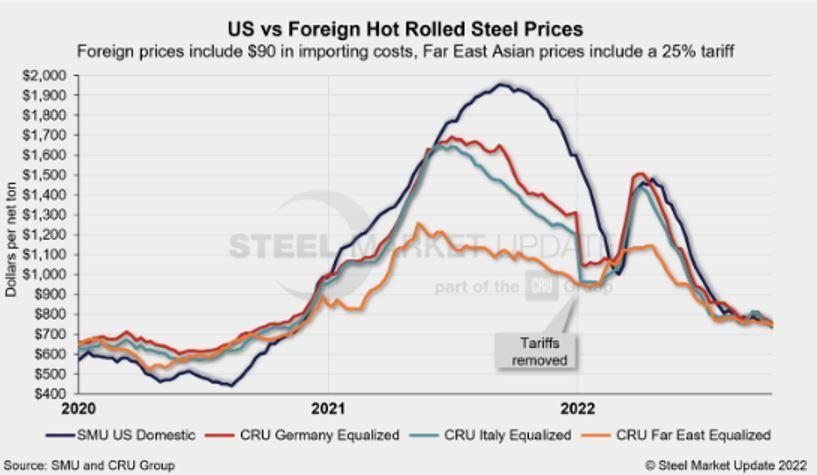

## Table of Contents

## What are rolled prices?

Rolled prices are a way for businesses to set prices for their products or services over a period of time. Instead of changing prices every day or every week, a business might decide to keep the same price for a longer time, like a month or a year. This helps the business plan better because they know how much money they will make during that time.

Customers also like rolled prices because they know what to expect when they buy something. If the price stays the same for a while, people can plan their spending better. It's easier for everyone when prices don't change all the time.

## How do rolled prices differ from fixed prices?

Rolled prices and fixed prices are similar because they both stay the same for a while. A fixed price means the price of something does not change at all until the business decides to change it. For example, if a toy costs $10, it will stay $10 until the store decides to make it more or less.

Rolled prices are a bit different. They are set for a certain time, like a month or a year, but they might change after that time is up. So, if a toy costs $10 for a month, it might go up or down to a new price after that month. This helps businesses plan for the future because they know what they will earn during that time.

Both rolled and fixed prices help customers know what to expect when they want to buy something. They can plan their spending better because the prices don't change all the time. But with rolled prices, customers need to remember that the price might change after the set time is over.

## What industries commonly use rolled prices?

Many industries use rolled prices because they help with planning and keeping customers happy. One common industry is the subscription services industry. Companies like Netflix or Spotify use rolled prices to keep their monthly fees the same for a set time, like a year. This way, customers know exactly how much they will pay each month and can plan their budget without surprises.

Another industry that often uses rolled prices is the utilities industry, like electricity or water companies. These companies might set the price for a season or a year. This helps them manage their costs and plan for how much energy they need to provide. It also helps customers know what their bills will be, making it easier for them to budget their money.

Some businesses in the food and beverage industry, like restaurants or cafes, also use rolled prices. They might keep the prices on their menu the same for a few months or a season. This helps them keep regular customers happy because they know the price of their favorite meals won't change suddenly. It also helps the business plan their costs and profits for that time.

## What are the advantages of using rolled prices for a business?

Using rolled prices can help a business in many ways. One big advantage is that it makes planning easier. When a business knows that the prices will stay the same for a while, like a month or a year, they can predict how much money they will make during that time. This helps them plan their costs and profits better. It also helps them buy the right amount of supplies or hire the right number of workers without worrying about sudden changes in income.

Another advantage is that rolled prices can keep customers happy. When prices stay the same for a set time, customers know exactly what they will pay for a product or service. This makes it easier for them to plan their spending and budget their money. Happy customers are more likely to keep coming back, which is good for the business. Plus, when customers know the prices won't change suddenly, they trust the business more and feel more comfortable buying from them.

## How can rolled prices affect consumer behavior?

Rolled prices can make customers feel more secure and happy. When the price of something stays the same for a while, people know exactly what they will pay. This helps them plan their spending and budget their money better. If people know the price of their favorite things won't change suddenly, they feel more comfortable buying them. This can make them more loyal to the business and more likely to keep coming back.

On the other hand, rolled prices can also change how much people buy. If the price stays the same for a long time, some people might wait to buy something until the price goes down. But if they know the price will stay the same for a while, they might buy it sooner because they don't want to miss out. This can help businesses sell more during the time the price is rolled. Overall, rolled prices can help businesses and customers plan better and build trust.

## What are the potential risks or disadvantages of rolled prices for businesses?

One risk of using rolled prices is that businesses might lose money if costs go up but the price stays the same. For example, if a business sets a rolled price for a year and then the cost of making their product goes up, they might not make as much profit as they planned. They can't change the price right away to cover the higher costs, which can hurt their business.

Another disadvantage is that rolled prices might make it hard for a business to compete with others. If other businesses can change their prices more often, they might be able to offer lower prices to attract more customers. This can make it harder for the business using rolled prices to keep up, especially if they can't adjust their prices to match the competition until the rolled price period is over.

## How are rolled prices typically calculated?

Rolled prices are usually set by looking at different things like how much it costs to make the product or offer the service, what customers are willing to pay, and what other businesses are charging. A business will add up all their costs, like materials, labor, and other expenses, and then decide how much profit they want to make. They might also look at what similar products or services cost from other businesses to make sure their price is competitive.

Once they have all this information, they choose a price that will stay the same for a set time, like a month or a year. This helps them plan their business better because they know how much money they will make during that time. They might also think about what customers expect and how they can keep them happy by keeping prices steady. This way, everyone knows what to expect, and the business can plan for the future.

## Can rolled prices be adjusted, and if so, how?

Rolled prices can be adjusted, but it depends on the rules the business sets when they first decide on the rolled price. Usually, a rolled price stays the same for a set time, like a month or a year. If a business wants to change the price during that time, they might need to tell customers ahead of time or follow certain rules they set at the start.

If the rolled price period is over, the business can then set a new price for the next period. They might look at their costs, what customers are willing to pay, and what other businesses are doing to decide on the new price. This way, they can make sure the new rolled price helps them make money and keep customers happy.

## What legal considerations should businesses be aware of when implementing rolled prices?

When businesses decide to use rolled prices, they need to think about the laws that protect customers. One important thing is being honest and clear with customers. Businesses must tell customers how long the price will stay the same and if there are any rules about changing it. If a business doesn't do this, they might get in trouble with the law. Also, some places have rules about how much prices can go up or down in a certain time, so businesses need to check these rules before setting their rolled prices.

Another thing businesses need to think about is competition laws. These laws make sure businesses don't work together to set prices in a way that's not fair to customers. If a business sets rolled prices that are too high or too low compared to others, it might look like they're trying to control the market. This can be a problem, especially if other businesses start to do the same thing. So, businesses need to make sure their rolled prices follow all the competition laws in their area.

## How do rolled prices impact long-term financial planning for a company?

Rolled prices help a company plan its money for a long time. When a company knows that the prices will stay the same for a while, they can guess how much money they will make during that time. This helps them plan what they will spend on things like buying materials, paying workers, and other costs. It also helps them think about how much profit they want to make and how they can save money for the future. Knowing their money will come in steadily makes it easier for them to make big plans, like growing their business or starting new projects.

But rolled prices can also make things harder if costs go up but the price stays the same. If a company can't change the price right away to cover higher costs, they might not make as much profit as they planned. This can make it tough for them to save money or invest in new things. Also, if other businesses can change their prices more often, they might be able to offer lower prices and take away customers. So, while rolled prices help with planning, companies need to be careful and think about all the possible problems that could come up.

## What are some case studies or examples of successful implementation of rolled prices?

One example of a company that successfully used rolled prices is Netflix. They set their subscription prices for a year at a time. This helps them because they know how much money they will make every month. It also helps their customers plan their budgets because the price stays the same. Netflix can plan to spend money on making new shows and movies because they know their income will be steady. This has helped them grow their business and keep their customers happy.

Another example is a utility company like an electricity provider. They might set the price for a season or a year. This helps them plan how much energy they need to buy and how much they will spend on keeping their services running. It also helps their customers because they know what their bills will be, which makes it easier for them to budget. By using rolled prices, the utility company can make sure they have enough money to keep the lights on and still make a profit.

## What advanced strategies can businesses employ to optimize rolled pricing models?

Businesses can use data to make their rolled prices work better. They can look at information about what customers buy, how much they are willing to pay, and what other businesses are doing. By using this data, businesses can set prices that help them make more money and keep customers happy. For example, if they see that people are willing to pay more for a product at certain times of the year, they can set the rolled price higher during those times. This way, they can make the most money while still keeping the price the same for a while.

Another strategy is to use different rolled prices for different groups of customers. Some customers might be willing to pay more for a product, so businesses can set a higher rolled price for them. Other customers might need a lower price to keep buying, so the business can set a lower rolled price for them. This is called price segmentation. By doing this, businesses can make more money from customers who can pay more and still keep other customers happy with lower prices. This helps the business make the most of their rolled pricing model.

## What are the strategies involving rolled prices?

In algorithmic trading, rolled prices offer significant value, particularly in the way they support futures-based strategies by smoothing transitions through contract expirations. A common practice involves rolling forward with futures contracts to prevent the obligation of physical delivery. This strategic move ensures the continuation of a trader's position, allowing for the maintenance of exposure to a particular asset without disruption due to contract expiration. This process typically involves closing an expiring futures position and entering a new position in a later-dated contract, thus sustaining the trading strategy's longevity.

Trend-following algorithms harness rolled prices to effectively maintain strategy consistency when futures contracts expire. Such algorithms are designed to capitalize on market trends by entering positions following established price movements. Rolled prices enable these strategies to operate seamlessly beyond the limitations of individual contract lifecycles. By integrating rolled price data, trend-following algorithms can sustain their strategy without the need to recalibrate or renegotiate the parameters of the trade at every contract expiration, which can be mathematically expressed as:

$$
P_{\text{rolled}}(t) = \alpha P_{\text{old}}(t) + (1 - \alpha) P_{\text{new}}(t)
$$

where $P_{\text{rolled}}(t)$ represents the rolled price at time $t$, $P_{\text{old}}(t)$ is the price of the expiring contract, $P_{\text{new}}(t)$ is the price of the new contract, and $\alpha$ is a weighting factor that reflects the transition strategy.

For statistical [arbitrage](/wiki/arbitrage) strategies, rolled prices are pivotal in identifying and exploiting price discrepancies across correlated assets or between current and future contracts. These strategies take advantage of temporary inefficiencies or mispricings in the market, aiming for profit as the market corrects itself. By analyzing rolled prices across different contracts, [statistical arbitrage](/wiki/statistical-arbitrage) models can identify undervalued or overvalued positions, executing trades that benefit from anticipated price corrections. These discrepancies could arise from slight mismatches in pricing due to the contract rollover process.

Overall, by effectively incorporating rolled prices into their strategies, traders can reduce transaction costs related to the physical delivery of assets, optimize strategy execution during contract rollovers, and enhance the robustness of statistical arbitrage operations.

## References & Further Reading

[1]: ["An Introduction to High-Frequency Finance"](https://www.sciencedirect.com/book/9780122796715/an-introduction-to-high-frequency-finance) by Ramazan Gençay, Michel Dacorogna, Ulrich A. Müller, Richard B. Olsen, and Olivier V. Pictet

[2]: ["Algorithmic Trading: Winning Strategies and Their Rationale"](https://www.wiley.com/en-us/Algorithmic+Trading%3A+Winning+Strategies+and+Their+Rationale-p-9781118460146) by Ernie Chan

[3]: ["High-Frequency Trading: A Practical Guide to Algorithmic Strategies and Trading Systems"](https://www.wiley.com/en-us/High+Frequency+Trading%3A+A+Practical+Guide+to+Algorithmic+Strategies+and+Trading+Systems-p-9780470579770) by Irene Aldridge

[4]: Aldridge, I., & Krawciw, S. (2017). ["Real-Time Risk: What Investors Should Know About Fintech, High-Frequency Trading, and Flash Crashes"](https://seekingalpha.com/article/4058785-aldridge-and-krawciw-real-time-risk). Wiley.

[5]: Narang, R. K. (2009). ["Inside the Black Box: The Simple Truth About Quantitative Trading"](https://onlinelibrary.wiley.com/doi/book/10.1002/9781118267738). Wiley.