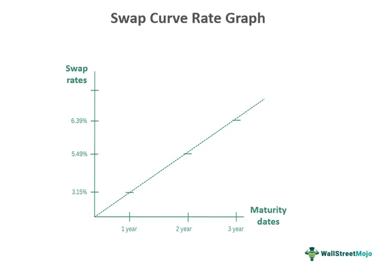

In the dynamic world of finance, derivatives have emerged as powerful tools to manage risk and leverage opportunities. These financial contracts derive their value from underlying assets, offering unique mechanisms for risk management, speculation, and arbitrage. Among the various types of derivatives, interest rate swaps hold a prominent place due to their ability to allow entities to exchange cash flows, thereby managing interest rate exposure effectively.

Particularly noteworthy within this category is the rollercoaster swap, a specialized form of interest rate swap, distinguished by its flexibility and adaptability to varying financial scenarios. The versatility of rollercoaster swaps lies in their capacity to adjust payment schedules according to the cyclical financing needs of businesses, particularly beneficial for industries with seasonal revenue patterns.



This article offers a comprehensive exploration of rollercoaster swaps, detailing how they are structured and utilized in the intricate landscape of algorithmic trading. By adjusting tenors and notional amounts in response to market shifts, these swaps equip companies with strategic advantages in financial risk management. Moreover, we will showcase real-world applications and examples illustrating how rollercoaster swaps can be employed to maintain financial stability and exploit market opportunities.

Join us on this journey through the financial rollercoaster swap landscape, where traditional financial instruments converge with modern technological solutions to empower entities to navigate complex market environments effectively.

## Table of Contents

## Understanding Financial Derivatives

Financial derivatives are specialized contracts that derive their value from one or more underlying assets. These assets can encompass a range of financial instruments, including stocks, bonds, commodities, currencies, interest rates, and market indexes. Derivatives are integral to modern financial markets, serving multiple functions such as risk management, speculation, and arbitrage.

Hedging is among the most critical uses of derivatives. By using derivatives, companies can protect themselves against price [volatility](/wiki/volatility-trading-strategies) in underlying assets. For example, a company exposed to fluctuating currency exchange rates might use currency futures to lock in a specific exchange rate, thereby securing its costs or revenues from future foreign operations.

Speculation is another primary function of derivatives, where traders aim to profit from changes in the market value of the underlying asset. For instance, by purchasing options, a trader can gain exposure to the price movements of an asset without having to own the asset itself. In this context, the limited initial investment and potential high returns make derivatives attractive to speculative investors.

Arbitrage involves the simultaneous purchase and sale of an asset or its derivatives in different markets to exploit price discrepancies. Well-executed [arbitrage](/wiki/arbitrage) strategies ensure that prices converge across markets, contributing to market efficiency.

Several types of derivatives, including futures, options, swaps, and forwards, cater to these distinct purposes:

- **Futures** are standardized contracts obligating the buyer to purchase, or the seller to sell, a specific quantity of an asset at a predetermined price on a future date. These contracts are traded on exchanges, providing transparency and liquidity.

- **Options** offer the buyer the right, but not the obligation, to buy or sell an underlying asset at a pre-agreed price before a specific expiration date. This flexibility makes options vital tools for both risk management and speculative strategies.

- **Swaps** are private agreements to exchange cash flows between parties. Interest rate swaps, a common type, allow entities to exchange fixed-rate payments for floating-rate payments, or vice versa, to manage interest rate exposure. For instance, a company paying a floating interest rate to a lender might enter into a swap to fix its interest payments, protecting against future interest rate increases.

- **Forwards** are customized contracts to buy or sell an asset at a set price on a future date. Unlike futures, forwards are not traded on exchanges but are over-the-counter (OTC) agreements, offering flexibility in terms.

By leveraging financial derivatives, organizations can effectively traverse the complexities of financial markets. These instruments enable firms to manage risks, optimize capital allocation, and enhance financial performance. Understanding the nuances of derivatives is essential for companies aiming to implement robust financial and risk management strategies.

## What is a Rollercoaster Swap?

A rollercoaster swap is a variant of [interest rate](/wiki/interest-rate-trading-strategies) swap specifically structured to address cyclical financing requirements. It offers the ability to modify payment schedules, thereby providing increased flexibility in managing cash flows. This is particularly beneficial for companies experiencing seasonal fluctuations in revenue, such as those in agriculture or tourism. Unlike conventional swaps, which lock in fixed terms for the duration of the swap, rollercoaster swaps enable adjustments to both the tenor and the notional principal amount. This adaptability allows businesses to align their financial commitments with periods of higher or lower revenue, minimizing the mismatch between outflows and inflows.

The ability to adjust the tenor and notional amounts sets rollercoaster swaps apart, making them invaluable for firms with fluctuating cash flow needs. For example, the notional amount of the swap can be increased during peak seasons when cash inflows are high and decreased during off-peak times. This results in a more efficient cash flow management strategy. Additionally, the tenor—or duration—of the swap can be modified, which allows businesses to shorten or lengthen their exposure to interest rate movements based on anticipated market conditions or strategic planning needs.

Additionally, rollercoaster swaps are often termed 'accordion' or 'concertina' swaps, illustrating their expandability and contraction capabilities, akin to the musical instruments they are named after. Such swaps leverage these flexible structures to offer strategic advantages in risk management, enabling firms to better anticipate and respond to changes in interest rate environments or internal cash flow cycles.

Overall, rollercoaster swaps serve as a sophisticated financial tool, providing an optimal balance between flexibility and financial certainty in dynamic market conditions. This type of swap aligns financial commitments with income variability, thus enhancing the firm's ability to manage financial risks effectively.

## Example of a Rollercoaster Swap

Consider a company entering into a $100 million interest rate swap where it pays a fixed rate of 8.00% over a seven-year horizon. In financial terms, this arrangement requires the company to make fixed payments based on the notional principal of $100 million at the agreed-upon rate for the duration of the swap. However, suppose market conditions shift, and the prevailing interest rate rises to 8.75%. Under these circumstances, the original swap becomes favorable—or "in-the-money"—for the company, leading them to consider strategic modifications.

One possibility the company might explore is to shorten the maturity of the swap to three years. Doing so would involve increasing the notional amount of the swap to maintain a fixed interest rate below the current market level, thereby optimizing cash flow benefits. This tactic may help the company align its financial commitments with shorter-term cash flow demands.

Conversely, the company could decide to extend the maturity of the swap to ten years while reducing the interest rate. This strategy may be suitable for businesses wishing to lock in current rates for an extended period, securing more predictable financial obligations over a longer term. 

The central financial principle guiding such modifications is ensuring the net present value (NPV) of the swap remains constant before and after any adjustments. This is essential to preserve the economic value embedded in the original agreement. The NPV, representing the sum of the present values of incoming and outgoing cash flows over time, must be calculated to reflect this consistency:

$$
\text{NPV} = \sum_{t=1}^{T} \frac{C_t}{(1+r)^t} - \sum_{t=1}^{T} \frac{C'_t}{(1+r)^t} = 0
$$

Where $C_t$ and $C'_t$ are the cash flows before and after the swap adjustment, respectively, $r$ is the discount rate, and $T$ is the total time period. By ensuring the NPV remains unchanged, companies effectively retain the financial advantage of the initial swap terms, adapting only to meet the strategic needs prompted by evolving market rates.

## The Role of Rollercoaster Swaps in Algorithmic Trading

Algorithmic trading utilizes sophisticated algorithms to automate and enhance the efficiency of trading activities, thereby optimizing trade execution. In this context, rollercoaster swaps, a specialized form of interest rate swaps, play a critical role in managing interest rate exposure within trading systems.

Interest rate swaps, including rollercoaster swaps, are integrated into [algorithmic trading](/wiki/algorithmic-trading) systems to regulate interest exposure. These financial instruments allow businesses to exchange fixed interest payments for floating rates or vice versa, adapting to changes in interest rates. The flexibility inherent in rollercoaster swaps, which permits the adjustment of payment schedules and notional amounts, becomes particularly advantageous in algorithmic trading. This adaptability ensures that the cashflow management aligns with the dynamic market conditions algorithmic trading often encounters.

Algorithmic trading benefits significantly from the use of real-time data and predictive analytics. The advanced algorithms employed can dynamically adjust trading strategies based on current market data, forecasts, and trends. This adaptability allows traders to execute strategies that are not only responsive to market changes but also aligned with financial instruments like rollercoaster swaps. By incorporating predictive analytics, trading systems can assess potential market directions and make informed decisions concerning interest rate exposure, optimizing financial performance.

Programming languages, particularly Python, offer robust frameworks for developing and testing such trading algorithms. Using Python, traders can leverage libraries and tools to implement algorithmic strategies that incorporate rollercoaster swaps. Below is a simple illustration of how Python can be used to model a swap adjustment within an algorithmic trading strategy:

```python
import numpy as np

# Define initial swap terms
notional_amount = 100e6  # $100 million
fixed_rate = 0.08  # 8.00%
current_market_rate = 0.0875  # 8.75%
swap_tenor = 7  # 7 years

# Function to calculate present value difference
def calculate_present_value_difference(new_tenor, new_rate):
    discount_factor = 1 / (1 + new_rate)
    old_value = notional_amount * fixed_rate * discount_factor ** swap_tenor
    new_value = notional_amount * new_rate * discount_factor ** new_tenor
    return old_value - new_value

# Example scenario: Shorten tenor and assess rate
new_tenor = 3  # New tenor in years
new_rate = 0.075  # Proposed new rate (7.5%)
npv_difference = calculate_present_value_difference(new_tenor, new_rate)

if npv_difference > 0:
    print("Strategic adjustment feasible. NPV remains positive.")
else:
    print("Re-evaluate adjustment strategy. NPV decreases.")

```

Integrating rollercoaster swaps into algorithmic trading not only improves risk management but also enhances profitability by offering strategic flexibility. By maintaining the net present value of swaps while responding to market conditions, traders can mitigate risks effectively and exploit opportunities. Thus, rollercoaster swaps serve as a pivotal tool in merging traditional finance mechanisms with cutting-edge technological advancements in algorithmic trading.

## Conclusion

Rollercoaster swaps offer remarkable flexibility, enabling businesses to tailor their financial structures to align with cash flow requirements. This adaptability is particularly critical in maintaining stability amidst fluctuating market conditions. By allowing the modification of payment schedules and notional amounts in response to seasonal revenue patterns, these swaps provide a strategic mechanism for effective financial planning.

The integration of rollercoaster swaps into algorithmic trading frameworks highlights a significant intersection of traditional financial instruments with cutting-edge technology. Algorithmic trading, characterized by its use of advanced algorithms to automate and optimize trading execution, benefits from this integration by enhancing risk management and profitability. By utilizing real-time data and predictive analytics, trading algorithms can dynamically adjust strategies in response to market changes, thereby leveraging the strategic advantages of rollercoaster swaps.

Adopting rollercoaster swaps can significantly boost a company's financial performance, offering tools to mitigate risks while seizing market opportunities. For modern financial market participants, a thorough understanding and utilization of these swaps are crucial in formulating comprehensive risk management strategies. This ensures that businesses can not only protect against adverse market movements but also optimize their financial outcomes in line with strategic objectives.

## References & Further Reading

Neftci, S.N. (2008). *Principles of Financial Engineering*. This book provides a comprehensive introduction to the theoretical frameworks and practical aspects of financial engineering, including swaps and risk management strategies.

Corb, H. (2012). *Interest Rate Swaps and Other Derivatives*. Corb's work specifically focuses on interest rate swaps, detailing their structure, function, and the strategic benefits they offer to manage interest rate exposure.

Lopez de Prado, M. (2018). *Advances in Financial Machine Learning*. This publication explores the integration of [machine learning](/wiki/machine-learning) into financial markets and trading, offering insights on how algorithmic trading systems, including those dealing with derivatives like rollercoaster swaps, can be enhanced by advanced data analytics.

Fabozzi, F.J. (2016). *The Handbook of Fixed Income Securities*. A vital resource on fixed income securities, Fabozzi's handbook covers a range of topics including interest rate derivatives, providing extensive knowledge on managing fixed income portfolios and implementing strategic swaps.

Hull, J.C. (2018). *Options, Futures, and Other Derivatives*. Hull's text is a staple in understanding derivative markets. It covers the foundational concepts of derivatives, offering explanations and mathematical formulations for various instruments, including interest rate swaps.

Jansen, S. (2020). *Machine Learning for Algorithmic Trading*. Jansen examines the application of machine learning in developing trading algorithms, which can incorporate derivatives like rollercoaster swaps to optimize trading strategies. The book provides practical examples and Python code for implementing machine learning models in trading.

