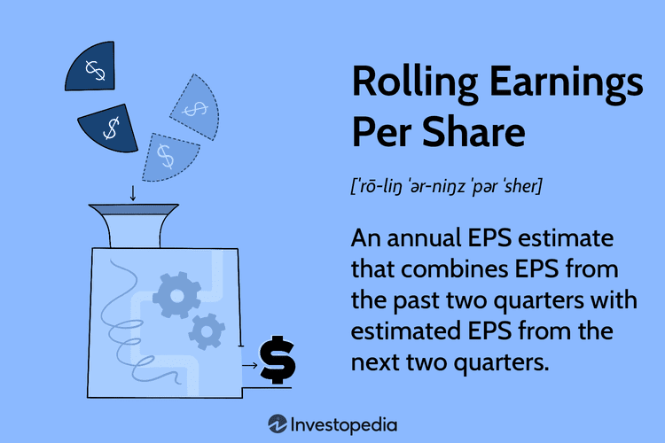

Earnings per share (EPS) is a fundamental metric employed in financial analysis to measure a company’s profitability on a per-share basis. It serves as a key indicator of a company's financial health, which investors and analysts frequently use to assess potential investment opportunities. EPS is calculated by dividing a company's net income by the number of outstanding shares. This simple yet powerful ratio provides insights into how effectively a company is generating profit for its shareholders.

Rolling EPS is an advanced variation of the traditional EPS metric. Unlike conventional EPS, which typically represents results over a fixed period, such as a quarter or year, rolling EPS uses a moving reference period. This approach involves continuously updating the EPS calculation over a set period, such as the past four quarters, thereby offering a more dynamic view of a company's earnings performance. The advantage of rolling EPS lies in its ability to capture the latest changes in earnings, facilitating timely and informed decision-making for investors and analysts.



In recent years, financial analysis has become an indispensable component of algorithmic trading. Algorithmic trading employs computers to execute trading orders based on a predetermined set of rules and analytical models. Integrating comprehensive financial metrics like EPS into these models enhances the predictive power and efficacy of trading algorithms. The goal of this article is to examine how the rolling EPS metric can refine financial analysis and potentially elevate algorithmic trading strategies by providing an up-to-date and continuous assessment of a company's earnings performance.

The integration of financial metrics and advanced technology is pivotal in crafting sophisticated investment strategies. Combining rolling EPS with algorithmic trading techniques holds transformative potential for developing agile and responsive trading solutions. This synergy between traditional financial analysis and cutting-edge technology exemplifies the evolving landscape of modern investment strategies. Understanding and leveraging these developments can significantly influence investment outcomes, positioning investors and traders to better navigate the complexities of financial markets.

## Table of Contents

## Understanding Earnings Per Share (EPS)

Earnings Per Share (EPS) stands as a key indicator of a company's profitability, calculated by dividing the net income by the number of outstanding shares. In mathematical terms, EPS can be expressed as:

$$
\text{EPS} = \frac{\text{Net Income} - \text{Preferred Dividends}}{\text{Weighted Average Shares Outstanding}}
$$

where net income represents the total profit of a company after taxes and expenses, and outstanding shares reflect the shares currently held by all shareholders, including restricted shares.

EPS serves as a crucial metric not only for assessing a company's financial health but also for guiding investor decisions. It provides insight into the company's earnings power relative to each shareholder's stake, aiding in the comparison between companies of varying sizes. A higher EPS indicates greater profitability and is often a sought-after characteristic for investors seeking robust returns.

There are primarily two types of EPS: Basic EPS and Diluted EPS. Basic EPS offers a straightforward calculation derived from the net income and outstanding shares, excluding the impacts of potential dilutive securities such as stock options and convertible bonds. It is expressed as:

$$
\text{Basic EPS} = \frac{\text{Net Income} - \text{Preferred Dividends}}{\text{Weighted Average Shares Outstanding}}
$$

In contrast, Diluted EPS accounts for all potential conversions of dilutive securities into common stock, providing a more conservative and comprehensive measure of EPS. This ensures investors understand the full extent of earnings allotted to each share if all convertible securities were exercised. The formula for Diluted EPS incorporates additional shares from potential conversions, expressed as:

$$
\text{Diluted EPS} = \frac{\text{Net Income} - \text{Preferred Dividends}}{\text{Weighted Average Shares Outstanding + Convertible Securities}}
$$

EPS plays a pivotal role in stock market valuation. Analysts and investors use EPS in conjunction with other financial metrics to evaluate stock price and market value. The Price-to-Earnings (P/E) ratio, for instance, is a common valuation measure that uses EPS to determine whether a stock is over or undervalued, calculated by dividing the market price per share by the EPS. 

In conclusion, EPS serves as a vital tool for evaluating corporate profitability and influencing stock price movements. By interpreting EPS, investors gain a clearer picture of a company's current financial performance and future potential, thereby supporting informed investment decisions.

## The Concept of Rolling EPS

Rolling EPS, or rolling earnings per share, is a financial metric used to offer a more comprehensive and dynamic analysis of a company's earnings by considering a continuous or overlapping period rather than a static one. Traditional EPS is typically calculated on a quarterly or annual basis, dividing the net income by the number of outstanding shares for a specific period. In contrast, rolling EPS updates more frequently, using data from the most recent 12-month period. This approach provides investors and analysts with a more nuanced view of a company's profitability by smoothing out short-term fluctuations and incorporating the latest earnings data. 

The benefits of using rolling EPS are significant. By continually updating the earnings data, rolling EPS offers a more timely reflection of a company's current performance. This dynamic approach can capture recent changes in earnings more effectively than traditional, static EPS calculations, which may be skewed by seasonal variations or one-off events within a fixed reporting period. Rolling EPS hence provides a clearer insight into the financial trend and operational performance of a company, aiding more accurate and timely investment decisions.

Incorporating rolling periods in financial analysis means adjusting the EPS calculation method to reflect the most recent 12-month data at any given time. For example, at the end of June, rolling EPS might consider income from July of the previous year to June of the current year. As each month progresses, the oldest data point is replaced by the most recent, allowing for a continuous update over a sliding 12-month window. This mechanism can be described with the following pseudo-algorithm:

```python
def calculate_rolling_eps(net_income, shares_outstanding):
    rolling_period = 12  # months
    rolling_eps_values = []

    for i in range(len(net_income) - rolling_period + 1):
        rolling_eps = sum(net_income[i:i + rolling_period]) / sum(shares_outstanding[i:i + rolling_period])
        rolling_eps_values.append(rolling_eps)

    return rolling_eps_values
```

Here, `net_income` and `shares_outstanding` are arrays containing the monthly data for multiple periods, allowing calculation of the rolling EPS over each rolling period.

The impact of rolling EPS on long-term investment analysis and decision-making is profound. Investors utilizing rolling EPS are better positioned to assess a company's earnings trajectory and adjust their strategies in response to emerging trends. This approach reduces the noise in earnings data, leading to more informed forecasting and planning. Investors may be able to identify patterns of consistent growth or detect early warning signs of potential earnings declines, enhancing their ability to make proactive, rather than reactive, investment choices.

Overall, rolling EPS provides a framework for analyzing a company's financial performance over time, allowing a longer and more fluid view of earnings that enhances decision-making and strategic development in the context of long-term investments.

## Importance of Financial Analysis in Algorithmic Trading

Algorithmic trading has transformed financial markets by employing complex mathematical models and high-speed computing to automate trading decisions and executions. This surge in [algorithmic trading](/wiki/algorithmic-trading) has underscored the importance of financial analysis. Incorporating financial analysis is crucial for developing effective trading algorithms. This process involves using a variety of financial data to inform and refine trading strategies.

Quantitative traders leverage extensive financial data to develop strategies that can predict market movements and optimize trading outcomes. Financial analysis provides the foundation for this data utilization. Analysts assess historical data, market trends, and economic indicators to generate insights that quantitative models can exploit. As a result, quantitative traders can design algorithms capable of making informed decisions based on patterns and historical precedents within the market.

A pivotal aspect of this financial analysis is the use of indicators like Earnings Per Share (EPS). These indicators are integral in constructing predictive models for trading algorithms. EPS, a measure of a company's profitability, helps investors assess the financial health of a firm. For algorithmic trading, EPS can signal potential investment opportunities if a company's profitability is projected to rise or fall based on the latest earnings reports. Algorithms can be programmed to react to these changes, buying or selling stocks automatically as EPS data is released or updated.

The successful integration of EPS into algorithmic trading highlights the balance required between technical and [fundamental analysis](/wiki/fundamental-analysis). Technical analysis involves the evaluation of statistical trends gathered from trading activity, such as price movement and [volume](/wiki/volume-trading-strategy), without considering financial reports or statements. On the other hand, fundamental analysis entails appraising a company based on detailed financial information, such as balance sheets, income statements, and EPS. 

While technical analysis may be more prevalent in algorithmic trading due to its reliance on historical price patterns and volume, the inclusion of fundamental analysis enhances the robustness of trading strategies. By combining both approaches, traders can develop algorithms that not only respond to market trends but also consider the underlying financial health and future performance of companies. This hybrid strategy can lead to more informed trading decisions, reducing risks while enhancing returns.

In conclusion, the integration of financial analysis, including indicators like EPS, is essential in algorithmic trading. It empowers traders to harness a mix of quantitative data and fundamental insights, fostering the development of sophisticated trading models that adapt to diverse market conditions. As algorithmic trading continues to evolve, the role of comprehensive financial analysis will remain a cornerstone in crafting durable and successful trading strategies.

## Integrating Rolling EPS in Algorithmic Trading Strategies

Integrating rolling earnings per share (EPS) into algorithmic trading strategies can significantly enhance the predictive accuracy of trading algorithms. One of the primary advantages of rolling EPS is its ability to provide a more dynamic and responsive measure of a company's financial health compared to static EPS figures. Traditional EPS is often calculated quarterly or annually, failing to capture the nuances of recent earnings trends that can influence stock prices. In contrast, rolling EPS continually updates EPS figures over a specific period, such as a 12-month or 6-month period, offering a real-time assessment of earnings performance.

**Enhancement of Predictive Accuracy**

The continuous updating feature of rolling EPS allows algorithms to more accurately predict price movements by incorporating the most recent earnings data. This approach is particularly beneficial in volatile market conditions where timely information is crucial. Algorithms that utilize rolling EPS can adjust trading signals based on the latest earnings reports, thus aligning trades closer with underlying financial performance.

**Incorporating Rolling EPS into Quantitative Models**

To effectively incorporate rolling EPS into quantitative models, traders and analysts can use the following approach:

1. **Data Collection and Processing**: Gather earnings data for the desired time frame and calculate the rolling EPS using a moving average approach. This involves updating the EPS figure regularly based on the specified period and new earnings reports.

2. **Algorithm Design**: Integrate rolling EPS as a financial indicator in the trading algorithm. This could involve setting thresholds or conditions where significant changes in rolling EPS trigger buy or sell signals.

3. **Backtesting and Optimization**: Test the algorithm's performance using historical data to refine parameters and ensure robustness. Optimize the model by adjusting the rolling period length and other factors to achieve desired results.

Example Python implementation for calculating rolling EPS:
```python
import pandas as pd

# Sample earnings data (net_income, shares_outstanding)
data = {'net_income': [100, 120, 110, 130, 140],
        'shares_outstanding': [10, 12, 11, 10, 13]}

df = pd.DataFrame(data)
df['eps'] = df['net_income'] / df['shares_outstanding']

# Calculate rolling EPS with a window size of 2
df['rolling_eps'] = df['eps'].rolling(window=2).mean()

print(df)
```

**Case Studies and Successful Implementations**

Several algorithmic trading firms have successfully integrated rolling EPS into their strategies, resulting in improved performance metrics. These implementations often involve concurrent use of rolling EPS and other indicators to exploit market inefficiencies. By leveraging rolling EPS, firms can align their trading strategies more closely with fundamental factors, thereby reducing reliance on purely technical signals.

**Challenges and Solutions**

Integrating fundamental metrics like rolling EPS into primarily technical models poses several challenges. One major issue is the potential increase in model complexity, which can affect execution speed. Solutions include optimizing data processing algorithms and leveraging high-performance computing resources. Another challenge is ensuring data accuracy and timeliness, as poor data quality can lead to incorrect trading signals. Employing robust data validation and cleaning processes can mitigate this risk.

Overall, the integration of rolling EPS into algorithmic trading strategies presents an opportunity to enhance trading decisions by incorporating up-to-date fundamental analysis. This blend of metrics and technology enables traders to make more informed and timely investment choices, ultimately influencing their success in the financial markets.

## Tools and Software for Analyzing Rolling EPS

Financial analysis tools and software are critical in scrutinizing metrics like rolling EPS, enabling both individual investors and institutional traders to make informed decisions. Rolling EPS, a more dynamic version of the traditional earnings per share, requires robust computational support to be effectively integrated into trading strategies. This section explores popular tools and software that facilitate rolling EPS analysis, discusses their features, compares various options, and outlines criteria for selecting the right platform.

### Overview of Tools Supporting Rolling EPS

Several financial analysis platforms are equipped to handle the complexities of rolling EPS calculations, offering real-time data analysis and integration with [quantitative trading](/wiki/quantitative-trading) strategies. These platforms generally provide functionalities including data aggregation, calculation modules, and visualization tools.

1. **Bloomberg Terminal**: Known for its extensive financial data and analytics, Bloomberg Terminal supports rolling EPS calculations by providing continuous data feeds. Its robust analytics suite allows users to model rolling EPS efficiently and use the results in trading algorithms by providing APIs for integration.

2. **FactSet**: This tool offers comprehensive market data and powerful analytical capabilities. FactSet's ability to model economic scenarios makes it a suitable tool for calculating and analyzing rolling EPS, alongside offering portfolio management functionalities.

3. **Thomson Reuters Eikon**: Eikon provides qualitative analysis tools alongside financial data feeds, which include rolling EPS. Its functionality extends to integrating these calculations into algorithmic scenarios, helping in risk assessment and trading strategy formulation.

### Software Features and Functionalities

Effective tools for rolling EPS analysis integrate features that cater to various aspects of financial analysis, which are crucial for algorithmic trading:

- **Data Integration and Processing**: The ability to import data from multiple sources and process it to calculate rolling EPS. This often includes modules for statistical analyses and forecasting models.

- **Visualization and Reporting**: Advanced charting tools to visualize rolling EPS over time can help traders detect trends and anomalies, aiding decision-making.

- **API and Automation**: An essential feature for algorithmic trading, enabling seamless integration of rolling EPS metrics into larger trading systems, allowing for automated decision processes.

- **Backtesting and Scenario Analysis**: Critical for understanding how rolling EPS would have performed historically, these features help refine trading models by simulating various market conditions.

### Comparative Analysis of Platforms

When comparing platforms, several factors can delineate their strengths and weaknesses:

- **Data Breadth and Depth**: Bloomberg Terminal offers unmatched data coverage, but it comes at a high cost, which might not be feasible for all traders. In contrast, open-source analytics tools might offer limited data but are cost-effective.

- **User Interface and Experience**: FactSet provides an intuitive interface with customizable dashboards, whereas platforms like Eikon are often favored for their easy integration into existing workflows.

- **Support and Learning**: Platforms such as Bloomberg and Thomson Reuters offer extensive support and training resources, which are crucial for mastering complex tools.

### Criteria for Selecting the Right Tool

Choosing the appropriate tool depends on various factors that align with specific trading needs:

- **Cost vs. Benefit**: Institutional investors may go for premium tools with extensive functionalities despite higher costs, while individual traders might prefer more cost-effective solutions.

- **Customization and Flexibility**: Tools that allow for significant customization and are flexible enough to adapt to changing trading strategies are generally preferred.

- **Integration Capabilities**: For algorithmic trading, the ability to integrate rolling EPS calculations with existing systems and databases is crucial, ensuring seamless data flow and decision-making processes.

- **Scalability**: For growing trading operations, scalable software is essential. The ability to handle large data sets and complex calculations without sacrificing performance is a critical criterion.

In summary, the choice of a financial analysis tool for rolling EPS calculations should be guided by specific needs related to data handling, cost-effectiveness, integration capabilities, and the scale of trading operations. As technology advances, these tools will likely evolve further, enhancing their capacity to process and derive actionable insights from financial metrics like rolling EPS.

## Future Trends: The Evolution of EPS in Financial Analysis

Earnings Per Share (EPS) has long been a cornerstone metric in assessing a company's financial health. As technology continues to advance, EPS metrics, particularly rolling EPS, are expected to evolve significantly. The integration of big data and [artificial intelligence](/wiki/ai-artificial-intelligence) (AI) in financial analysis is anticipated to enhance the accuracy and depth of fundamental analysis, including EPS evaluation.

### Evolution of EPS Metrics

EPS calculation traditionally compiles data over fixed periods, such as quarterly or annually, providing snapshots of profitability. However, as technology progresses, these static calculations are being transformed into more dynamic metrics. Rolling EPS, which calculates EPS over a continuously updated period, is poised to become more prevalent, offering investors a real-time view of a company’s financial health.

Advancements in technology will enable the seamless collection and processing of financial data, making rolling EPS an indispensable tool for more responsive and flexible earnings assessments. For instance, automated data feeds can continuously update EPS calculations, enhancing their accuracy and relevance.

### Impact of Big Data and AI

Big data provides vast amounts of information that can be harnessed to refine EPS assessments. By analyzing complex datasets, AI can identify trends and patterns that are not immediately apparent in traditional EPS metrics. Machine learning algorithms, a subset of AI, can enhance the predictive power of rolling EPS by factoring in variables such as market conditions, economic indicators, and industry-specific trends.

Python, a popular programming language in financial analysis, can be used to create models that integrate rolling EPS with big data. Here is a simple example of how this might be implemented:

```python
import pandas as pd

# Read earnings data from a CSV file
data = pd.read_csv('earnings_data.csv')

# Calculate rolling EPS over a 12-month window
data['Rolling_EPS'] = data['Earnings'].rolling(window=12).mean() / data['Shares_Outstanding']

# Display the updated data
print(data[['Date', 'Rolling_EPS']])
```

This integration can provide traders with actionable insights, helping them make informed decisions based on the most up-to-date financial information.

### Trends in Algorithmic Trading

Algorithmic trading is increasingly incorporating fundamental metrics such as rolling EPS into its strategies. This trend is driven by the ability of rolling EPS to offer a comprehensive view of a company's earnings trajectory over time, helping in the creation of more accurate predictive models.

As algorithms become more sophisticated, the fusion of technical analysis with data-enriched fundamental metrics like rolling EPS can enhance trading strategies. The capacity to process rolling EPS alongside technical indicators can lead to improved algorithmic trading outcomes, as it marries the best of both analytical approaches.

### Ongoing Significance of EPS

Despite rapid technological changes, EPS remains a vital indicator of a company’s profitability. Its established significance in investment decisions ensures that it will continue to be a critical measure, even as more dynamic metrics emerge. The ability of rolling EPS to provide an ongoing update of financial performance ensures that it will play a crucial role in future financial analysis frameworks.

While the traditional role of EPS as a static indicator is evolving, its core value as a measure of profitability remains unchanged. The shift towards more dynamic calculations like rolling EPS is enhancing its relevance in modern financial analysis, underscoring its enduring importance in investment strategies.

## Conclusion

Earnings Per Share (EPS) remains a crucial financial metric that investors and traders rely on for evaluating a company's profitability and potential for growth. The concept of rolling EPS introduces a dynamic approach by continuously updating the EPS calculation over a specific timeframe, capturing the most recent financial performance of a company. This adaptability proves advantageous, especially in the fast-paced world of financial markets where timely and accurate decision-making is paramount.

Rolling EPS offers significant benefits in algorithmic trading by enhancing the predictive accuracy of trading algorithms. It provides a more nuanced understanding of a company’s financial health, thus aiding in the formulation of robust trading strategies. Incorporating rolling EPS into quantitative models allows traders to better anticipate market trends and adjust their portfolios accordingly.

As technology continues to advance, traders and investors must remain vigilant in staying informed about emerging financial metrics and tools. The integration of rolling EPS with sophisticated trading algorithms exemplifies how combining fundamental analysis with technological innovation can optimize investment strategies. Such integration ensures a balanced approach, leveraging both financial insights and computational models for superior decision-making. As the financial landscape evolves, the role of EPS, both traditional and rolling, will undoubtedly persist in guiding investment decisions, underscoring the importance of continuous learning and adaptation in financial analysis.

## References & Further Reading

[1]: ["The Intelligent Investor: The Definitive Book on Value Investing."](https://www.amazon.com/Intelligent-Investor-Definitive-Investing-Essentials/dp/0060555661) by Benjamin Graham

[2]: ["Advances in Financial Machine Learning"](https://www.amazon.com/Advances-Financial-Machine-Learning-Marcos/dp/1119482089) by Marcos Lopez de Prado

[3]: DeFusco, Richard A., et al. (2015). ["Quantitative Investment Analysis"](https://books.google.com/books/about/Quantitative_Investment_Analysis.html?id=0S_dCQAAQBAJ). CFA Institute Investment Series.

[4]: Bertsimas, Dimitris, and John Tsitsiklis. (1997). ["Introduction to Linear Optimization"](https://www.semanticscholar.org/paper/Introduction-to-linear-optimization-Bertsimas-Tsitsiklis/c8557a70ecdeec83f70954c5f169393c7f04fc9e). Athena Scientific.

[5]: ["The Little Book That Still Beats the Market"](https://www.amazon.com/Little-Book-Still-Beats-Market/dp/0470624159) by Joel Greenblatt