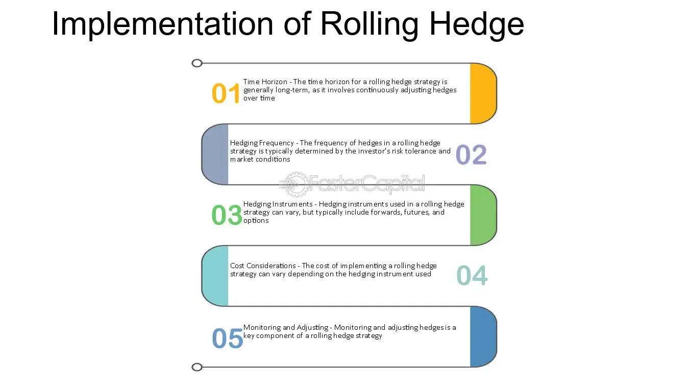

## Table of Contents

## What is a rolling hedge?

A rolling hedge is a strategy used in finance to manage risk over time. Instead of setting a hedge for a long period, you keep adjusting it as time goes on. This means you might set up a hedge for a short time, and when that time is up, you set up a new hedge. This way, you can respond to changes in the market or your situation.

For example, if you are worried about the price of oil going up, you might buy a futures contract that locks in today's price for a month. When that month is over, you can buy another futures contract at the new price. This rolling approach helps you manage costs and risks without being stuck with one decision for too long. It's like constantly updating your plan to fit the current situation.

## Why is a rolling hedge used in financial markets?

A rolling hedge is used in financial markets because it helps people and companies manage risk over time without locking into one decision for too long. Instead of setting a hedge for a long period, which might not work well if the market changes a lot, a rolling hedge lets you adjust your strategy as things change. This can be really helpful if you're trying to protect against price changes in things like oil, currencies, or interest rates.

For example, if a company needs to buy oil regularly and is worried about price increases, they might use a rolling hedge to buy futures contracts every few months. This way, they can lock in prices for short periods and then adjust based on new market conditions. It's like always having a fresh plan that fits what's happening right now, instead of sticking with an old plan that might not work anymore.

## How does a rolling hedge differ from a static hedge?

A rolling hedge and a static hedge are two different ways to manage risk, but they work differently. A static hedge is set up once and stays the same for a long time. For example, if you're worried about the price of oil going up, you might buy a futures contract that locks in the price for a whole year. Once you set it, you don't change it until the year is over. This can be good if you want a simple plan and the market stays the same, but it can be bad if the market changes a lot.

On the other hand, a rolling hedge is more flexible. Instead of setting a hedge for a long time, you set it for short periods and keep updating it. Using the oil example again, you might buy a futures contract that locks in the price for just a month. When that month is over, you look at the market again and buy another contract at the new price. This way, you can adjust your plan as things change, which can be really helpful if the market is unpredictable. It's like always having a fresh strategy that fits what's happening right now.

## What are the basic principles of implementing a rolling hedge?

Implementing a rolling hedge involves setting up short-term hedges that you keep updating as time goes on. Instead of locking in a price or rate for a long time, you choose a shorter period, like a month or a quarter. When that time is up, you look at the market again and set up a new hedge based on the current situation. This way, you can adjust your plan to fit what's happening right now, which can be really helpful if the market keeps changing.

The key to a rolling hedge is being flexible and ready to make changes. You need to keep an eye on the market and be willing to update your hedge regularly. This might mean buying new futures contracts or options every few months. It can take more work than a static hedge, but it lets you respond to new information and manage your risk better over time. By always having a fresh plan, you can protect yourself from big price swings and make sure your strategy stays up to date.

## What types of financial instruments are commonly used in a rolling hedge?

In a rolling hedge, people often use futures contracts. These are agreements to buy or sell something at a set price in the future. For example, if you're worried about the price of oil going up, you might buy a futures contract that locks in today's price for a few months. When those months are over, you can buy another contract at the new price. This way, you can keep adjusting your hedge to fit the current market.

Another common tool is options. Options give you the right, but not the obligation, to buy or sell something at a set price. They can be a bit more flexible than futures because you don't have to go through with the deal if you don't want to. For example, if you're worried about currency rates changing, you might buy options that let you exchange money at a good rate for a short time. When that time is up, you can buy new options at the current rates. This lets you keep your hedge up to date without being stuck with one decision for too long.

Sometimes, people also use forward contracts in a rolling hedge. These are similar to futures but are usually made directly between two parties instead of on an exchange. They can be useful for things like managing interest rate risk or currency risk. For instance, if you're a company that needs to borrow money in the future, you might set up a forward contract to lock in today's interest rate for a short time. When that time is over, you can set up a new contract at the new rate. This way, you can keep your costs under control and adjust your plan as the market changes.

## How do you determine the appropriate timing for contract rollover in a rolling hedge?

Determining the right time to roll over a contract in a rolling hedge depends on several things. One big thing is how long you want your hedge to last. If you're using a rolling hedge, you might choose to roll over your contract every month or every three months. This timing should fit with your overall plan and how often you want to check and update your hedge. Another thing to think about is what's happening in the market. If prices are changing a lot, you might want to roll over your contract more often so you can adjust to the new prices.

Another important thing to consider is when the contracts you're using expire. Futures contracts, for example, have set expiration dates. You'll need to roll over your contract before it expires, or you'll lose the protection it gives you. Also, think about any big events or news that might affect the market. If there's a big report coming out or a change in government policy, you might want to roll over your contract right before or after these events to make sure your hedge is still working well. By keeping an eye on these things, you can pick the best time to roll over your contract and keep your rolling hedge working smoothly.

## What are the key considerations when choosing the duration of each contract in a rolling hedge?

When choosing how long each contract should last in a rolling hedge, you need to think about how often you want to update your plan. Shorter contracts, like ones that last a month, let you change your hedge more often. This can be good if the market is changing a lot, because you can keep adjusting to the new prices. But shorter contracts mean more work, because you'll have to keep buying new ones. On the other hand, longer contracts, like ones that last three months or more, mean less work, but they might not be as good if the market changes a lot during that time.

Another thing to consider is what you're trying to protect against. If you're worried about the price of something like oil, and you know you'll need to buy it every month, then monthly contracts might make sense. But if you're trying to protect against something that doesn't change as often, like interest rates, you might choose longer contracts. You also need to think about when the contracts expire. You don't want to miss the chance to roll over your hedge because a contract ran out. By thinking about these things, you can pick the right length for your contracts and make sure your rolling hedge works well for you.

## How does market volatility affect the strategy of a rolling hedge?

Market volatility, or how much prices go up and down, can really change how you use a rolling hedge. If the market is bouncing around a lot, you might want to use shorter contracts. This way, you can keep updating your hedge to fit the new prices. It's like always having a fresh plan that can handle the ups and downs. But, it also means more work because you'll need to keep buying new contracts more often.

On the other hand, if the market is pretty calm and prices aren't changing much, you might choose longer contracts. This can be easier because you won't need to update your hedge as often. But if the market suddenly starts to move a lot, a longer contract might not be as good. So, when the market is volatile, a rolling hedge lets you stay flexible and adjust your plan to whatever is happening right now.

## What are the potential risks associated with rolling hedges?

Rolling hedges can be a good way to manage risk, but they come with their own set of problems. One big risk is that you might not time your contract rollovers right. If you wait too long to roll over your hedge, you could miss out on good prices or end up with no protection at all. Also, rolling hedges can be more work because you have to keep buying new contracts. If you're not careful, you might make a mistake and end up with a hedge that doesn't work the way you want it to.

Another risk is that the costs can add up. Every time you roll over a contract, you might have to pay fees or other costs. These can start to add up, especially if you're rolling over your hedge a lot because the market is changing. Plus, if the market is really volatile, you might find yourself always chasing the right price, which can be stressful and hard to manage. So, while rolling hedges can help you stay flexible, they also need a lot of attention and can be risky if you're not careful.

## How can one optimize the cost-effectiveness of a rolling hedge strategy?

To make a rolling hedge strategy more cost-effective, you need to think about how often you roll over your contracts. If you roll over too often, you might end up paying a lot in fees and other costs. So, try to find a good balance. Look at how the market is moving and choose a time that works well for you. If the market is pretty calm, you might not need to roll over as often, which can save you money. But if the market is bouncing around a lot, you might need to roll over more often to keep your hedge working well.

Another way to save money is to be smart about the contracts you choose. Some contracts might have lower fees or be easier to roll over. Also, think about using options instead of futures sometimes. Options can give you more flexibility and might be cheaper if you don't end up using them. Keep an eye on the costs of rolling over and try to find ways to keep them down. By being careful and making smart choices, you can make your rolling hedge strategy more cost-effective.

## What advanced techniques can be used to enhance the performance of a rolling hedge?

One advanced technique to make a rolling hedge work better is to use a mix of different financial tools. Instead of just using futures contracts, you can also use options. Options give you the right, but not the obligation, to buy or sell something at a set price. This can be really helpful because you can choose to use them if the price goes the wrong way, but you don't have to if the price goes the right way. By mixing futures and options, you can make your hedge more flexible and protect yourself better against big price swings.

Another technique is to use data and computer models to help you decide when to roll over your contracts. These models can look at past market data and try to guess what might happen next. This can help you pick the best times to roll over your hedge and make sure you're always getting the best prices. By using these smart tools, you can make your rolling hedge strategy more accurate and effective, which can save you money and help you manage risk better.

## How do regulatory changes impact the management of rolling hedges?

Regulatory changes can have a big effect on how you manage rolling hedges. When the rules change, it can change what kinds of contracts you can use or how often you need to report what you're doing. For example, if new rules make it harder to use certain futures contracts, you might have to switch to different tools like options. This can mean more work and might make your hedge less effective if you're not careful.

Also, regulatory changes can change the costs of rolling hedges. If new rules add more fees or make it more expensive to roll over contracts, you'll need to think about how to keep your strategy cost-effective. You might need to roll over your contracts less often or find new ways to manage your risk. By keeping an eye on the rules and being ready to adjust your plan, you can make sure your rolling hedge keeps working well even when things change.

## References & Further Reading

[1]: Bergstra, J., Bardenet, R., Bengio, Y., & Kégl, B. (2011). ["Algorithms for Hyper-Parameter Optimization."](https://dl.acm.org/doi/10.5555/2986459.2986743) Advances in Neural Information Processing Systems 24.

[2]: ["Advances in Financial Machine Learning"](https://www.amazon.com/Advances-Financial-Machine-Learning-Marcos/dp/1119482089) by Marcos Lopez de Prado

[3]: ["Evidence-Based Technical Analysis: Applying the Scientific Method and Statistical Inference to Trading Signals"](https://www.amazon.com/Evidence-Based-Technical-Analysis-Scientific-Statistical/dp/0470008741) by David Aronson

[4]: ["Machine Learning for Algorithmic Trading"](https://github.com/stefan-jansen/machine-learning-for-trading) by Stefan Jansen

[5]: ["Quantitative Trading: How to Build Your Own Algorithmic Trading Business"](https://github.com/LucindaYa/quant-resources/blob/master/Quantitative%20Trading%20How%20to%20Build%20Your%20Own%20Algorithmic%20Trading%20Business.pdf) by Ernest P. Chan