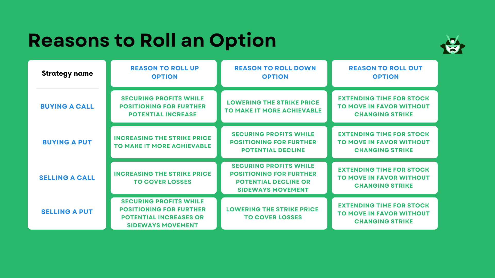

## Table of Contents

## What are rolling options and why are they used?

Rolling options are a strategy used in trading where an investor changes the expiration date or strike price of an existing option contract. This is done by closing the current option and opening a new one with different terms. Traders use rolling options to manage their investments better, especially when they think the market will move in a way that benefits them more with the new option.

People use rolling options for a few main reasons. One reason is to extend the time they have to be right about the market's direction. If an option is about to expire and the market hasn't moved as expected, rolling it to a later date gives more time for the market to move favorably. Another reason is to adjust the strike price. If the market moves but not enough to make the current option profitable, rolling to a different strike price can help capture more of the market's movement. This strategy helps traders stay flexible and adapt to changing market conditions.

## How does the process of rolling options work?

Rolling options means changing your current option contract to a new one. You do this by closing your old option and opening a new one with a different expiration date or strike price. For example, if you have an option that is about to expire but you still think the market will move in your favor, you can close that option and buy a new one that expires later. Or, if the market has moved but not enough to make your option profitable, you can close it and buy a new one with a different strike price that might be better.

The process involves a few steps. First, you need to decide if you want to roll the option to a different expiration date or change the strike price. Then, you close your current option by selling it. After that, you buy the new option with the terms you want. This can be done through your trading platform, where you'll enter the details of the new option you want to buy. Rolling options can help you stay in the game longer or adjust to market changes, but remember, it costs money to close the old option and open a new one, so you need to think carefully about whether it's worth it.

## What are the key factors to consider before rolling an option?

Before you decide to roll an option, think about how much time is left until your current option expires. If it's close to expiring and the market hasn't moved the way you expected, rolling it to a later date might give you more time for the market to move in your favor. But remember, rolling an option costs money because you have to close the old one and open a new one. So, make sure the extra time will be worth the cost.

Also, consider how the market has moved and if changing the strike price could help. If the market has moved but not enough to make your current option profitable, rolling to a different strike price might capture more of that movement. But again, think about the cost of rolling and if the new strike price gives you a good chance to make a profit. It's all about balancing the potential benefits against the costs and risks.

Lastly, look at the overall market conditions and your investment goals. Rolling an option can be a good way to stay flexible and adapt to changes, but it's not always the best choice. Make sure rolling fits with your strategy and that you're not just doing it because you're nervous about losing money. Take your time to think it through and make a decision that makes sense for your situation.

## Can you explain the difference between rolling up, down, out, and in?

Rolling up means you're changing your option to a higher strike price. You do this if you think the stock price will go up more than you first thought. For example, if you have an option to buy a stock at $50 but now you think it will go to $60, you might roll up to a $60 strike price. Rolling down is the opposite; you change to a lower strike price. You might do this if you think the stock won't go as high as you first expected. If you had a $50 strike and now think the stock will only go to $40, you might roll down to a $40 strike price.

Rolling out means you're changing your option to a later expiration date. You do this if you need more time for your prediction about the stock to come true. If your option is about to expire but you still think the stock will move in your favor, you might roll out to a later date to give yourself more time. Rolling in is less common, but it means you're changing to an earlier expiration date. You might do this if you think the stock will move quickly and you want to take advantage of that sooner. For example, if you have an option expiring in two months but you think the stock will move in the next month, you might roll in to take advantage of that sooner.

## What are the potential benefits of rolling options?

Rolling options can give you more time to be right about the market. If you think the stock will go up but it hasn't moved yet, you can roll your option to a later date. This way, you don't have to give up on your prediction just because time is running out. Rolling options can also help you adjust to changes in the market. If the stock moves a bit but not enough to make your option profitable, you can roll to a different strike price that might be better. This flexibility can help you make the most of your investment.

Another benefit is that rolling options can help you manage risk. If the market is moving against you, rolling can give you a chance to cut your losses or change your strategy. By rolling to a different strike price or expiration date, you can adapt to new information and make smarter decisions. While rolling options does cost money, the potential to improve your position and increase your chances of making a profit can make it worth it.

## What are the risks associated with rolling options?

Rolling options can be risky because it costs money to close your old option and open a new one. Every time you roll, you pay fees and commissions, which can add up quickly. If the market doesn't move in your favor after you roll, you could lose more money than if you had just let the original option expire. Also, rolling doesn't guarantee success; it's just another chance to be right about the market, but there's no promise that it will work out.

Another risk is that rolling options can make you hold onto a losing position for too long. It's easy to keep rolling in the hope that the market will eventually move your way, but this can lead to bigger losses if it doesn't. You might end up spending more on rolling than you would have lost by just accepting the loss on the original option. It's important to think carefully about whether rolling is really the best choice or if you're just delaying the inevitable.

## How does rolling options affect the cost basis and breakeven point?

When you roll an option, you change the cost basis of your investment. The cost basis is the total amount you've spent on the option. When you roll, you have to close your old option and buy a new one. This means you're adding the cost of the new option to what you've already spent. So, your new cost basis will be higher because you're paying more to keep your position open. This higher cost basis can make it harder to make a profit because you need the stock to move more in your favor to cover the extra costs.

Rolling options also changes your breakeven point. The breakeven point is the price the stock needs to reach for you to break even on your investment. When you roll to a new option with a different strike price or expiration date, the breakeven point changes. If you roll up to a higher strike price, the stock needs to go up more for you to break even. If you roll out to a later expiration date, you might need the stock to move more over a longer period to cover the extra costs of rolling. So, rolling can make your breakeven point harder to reach, which means you need to be more right about the market to make money.

## What are some common strategies for rolling options?

One common strategy for rolling options is to roll out to a later expiration date when your current option is about to expire but the stock hasn't moved as much as you expected. By doing this, you give yourself more time for the stock to go up or down in the direction you predicted. This can be helpful if you still believe in your original prediction but just need more time for it to happen. However, remember that rolling out costs money because you have to close your old option and buy a new one, so make sure the extra time is worth the extra cost.

Another strategy is to roll up or down to a different strike price when the stock has moved but not enough to make your current option profitable. If the stock has gone up more than you thought, you might roll up to a higher strike price to capture more of that upward movement. On the other hand, if the stock hasn't moved as much as you hoped, you might roll down to a lower strike price to give yourself a better chance of making a profit. Again, rolling to a different strike price costs money, so you need to think about whether the new strike price gives you a good chance to make up for the extra costs.

A third strategy involves a combination of rolling out and rolling up or down. For example, if your option is about to expire and the stock has moved a bit but not enough, you might roll out to a later date and also roll up or down to a new strike price. This can give you both more time and a better chance to profit from the stock's movement. But remember, this strategy can be more expensive because you're making two changes at once, so it's important to weigh the potential benefits against the costs.

## How can rolling options be used to manage an existing position?

Rolling options can help you manage an existing position by giving you more time if the stock hasn't moved the way you expected. If your option is about to expire and you still think the stock will go up or down, you can roll it out to a later date. This means you close your old option and buy a new one that expires later. This gives you more time for your prediction to come true without having to start over with a new option. But remember, rolling out costs money because you have to pay to close the old option and buy the new one, so make sure the extra time is worth it.

Another way to manage your position is by rolling up or down to a different strike price. If the stock has moved a bit but not enough to make your current option profitable, you can roll up to a higher strike price if you think it will keep going up, or roll down to a lower strike price if you think it won't go as high as you first thought. This can help you adjust to the stock's movement and give you a better chance to make a profit. Rolling to a different strike price also costs money, so you need to think about whether the new strike price gives you a good chance to cover the extra costs and still make money.

## What are the tax implications of rolling options?

When you roll options, it can affect your taxes. Rolling an option means you close your old option and open a new one. When you close the old option, it can create a taxable event. If you made money on the old option, you might have to pay taxes on that profit. If you lost money, you might be able to use that loss to reduce your taxes. The tax rules can be complicated, so it's a good idea to talk to a tax professional to understand how rolling options will affect your taxes.

The new option you open when you roll also has tax implications. The cost of the new option adds to your cost basis, which is the total amount you've spent on the option. This can affect how much profit or loss you have when you eventually close the new option. If you hold the new option for less than a year, any profit you make when you close it will be taxed as short-term capital gains, which are usually taxed at a higher rate than long-term capital gains. If you hold it for more than a year, it could be taxed as long-term capital gains, which might be at a lower rate. Again, it's smart to get advice from a tax professional to make sure you understand all the tax implications of rolling options.

## How do market conditions influence the decision to roll options?

Market conditions play a big role in deciding whether to roll options. If the market is moving in the direction you predicted but not fast enough, you might want to roll your option to a later date. This gives you more time for the stock to move in your favor. On the other hand, if the market is moving against you, rolling can be a way to cut your losses or adjust your strategy. For example, if the stock is going down instead of up, you might roll down to a lower strike price to give yourself a better chance to make money.

It's also important to think about how volatile the market is. If the market is very up and down, rolling options can be riskier because it's harder to predict where the stock will go. In a stable market, rolling might be a safer bet because you have a better idea of what will happen. Always consider the costs of rolling, like fees and commissions, and make sure the potential benefits outweigh those costs. Market conditions can change quickly, so stay flexible and be ready to adjust your strategy as needed.

## Can you provide advanced examples of rolling options in different market scenarios?

In a bullish market where the stock is going up slowly, you might have bought a call option expecting the stock to hit a certain price by the expiration date. If the stock is moving up but not as fast as you thought, you could roll out to a later expiration date to give yourself more time. For example, if you bought a call option with a $50 strike price expiring in one month and the stock is now at $48, you might roll it out to three months from now. This gives the stock more time to reach $50 or higher. However, if the stock keeps going up and you think it will go even higher, you might also roll up to a $55 strike price. This way, you can capture more of the upward movement, but you'll need to pay more for the new option.

In a bearish market where the stock is going down, you might have bought a put option expecting the stock to drop to a certain price. If the stock is falling but not as fast as you hoped, you could roll out to a later date to give yourself more time for the stock to reach your target price. For instance, if you bought a put option with a $50 strike price expiring in one month and the stock is now at $52, you might roll it out to two months from now. If the stock keeps falling and you think it will go lower than you first thought, you might roll down to a $45 strike price. This can help you make more money from the downward movement, but remember, rolling down will cost you more money for the new option.

In a volatile market where the stock price is swinging a lot, rolling options can be trickier. You might have bought a call option hoping the stock would go up, but it's been going up and down a lot. If the stock is currently above your strike price but you're worried it might drop before expiration, you could roll out to a later date to give yourself more time. For example, if you bought a call option with a $50 strike price expiring in one month and the stock is now at $53 but very volatile, you might roll it out to three months from now. This way, you can ride out the ups and downs and still have a chance for the stock to go higher. But if the stock keeps swinging and you're unsure about its direction, you might decide to roll to a different strike price that gives you a better chance to make money no matter which way the stock moves.

## References & Further Reading

[1]: Hull, J. C. (2017). ["Options, Futures, and Other Derivatives."](https://www.semanticscholar.org/paper/Options%2C-Futures%2C-and-Other-Derivatives-Hull/89bdee500c8623864fc9eb7a471546aa713acc44) Pearson Education.

[2]: Black, F., & Scholes, M. (1973). ["The Pricing of Options and Corporate Liabilities."](https://www.cs.princeton.edu/courses/archive/fall09/cos323/papers/black_scholes73.pdf) Journal of Political Economy, 81(3), 637-654.

[3]: Gatheral, J. (2006). ["The Volatility Surface: A Practitioner's Guide."](https://onlinelibrary.wiley.com/doi/book/10.1002/9781119202073) Wiley Finance.

[4]: Lopez de Prado, M. (2018). ["Advances in Financial Machine Learning."](https://www.amazon.com/Advances-Financial-Machine-Learning-Marcos/dp/1119482089) Wiley.

[5]: Chan, E. P. (2009). ["Quantitative Trading: How to Build Your Own Algorithmic Trading Business."](https://github.com/ftvision/quant_trading_echan_book) Wiley Trading.

[6]: Jansen, S. (2020). ["Machine Learning for Algorithmic Trading."](https://github.com/stefan-jansen/machine-learning-for-trading) Packt Publishing.