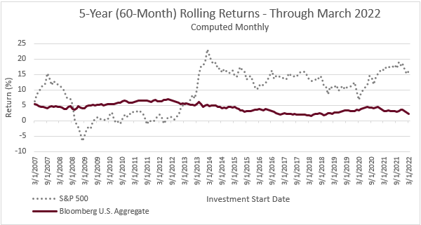

## Table of Contents

## What are rolling returns in financial analysis?

Rolling returns are a way to measure how an investment performs over different periods of time. Instead of looking at the return from start to finish, rolling returns break the investment period into smaller, overlapping segments. For example, if you want to see the 3-year rolling returns of a fund over 10 years, you would look at the returns for the first 3 years, then the next 3 years starting from the second year, and so on. This gives you a clearer picture of how the investment has done over time, rather than just looking at one long period.

Using rolling returns can help investors understand the consistency and volatility of an investment. If the rolling returns are stable and show good performance across many periods, it suggests the investment is reliable. On the other hand, if the returns vary a lot, it might mean the investment is riskier. This information is useful for making better decisions about whether to keep or change an investment, and it helps in comparing different investments more accurately.

## How do rolling returns differ from average annual returns?

Rolling returns and average annual returns both measure how well an investment does over time, but they do it in different ways. Average annual return, or compound annual growth rate (CAGR), gives you one number that shows the average yearly growth of your investment from the start to the end. It's like looking at the whole journey from point A to point B and figuring out the average speed. This can be useful for a quick overview, but it doesn't tell you about the ups and downs along the way.

Rolling returns, on the other hand, break down the journey into smaller parts. They look at the return over shorter, overlapping time periods, like 3-year segments in a 10-year investment. This method shows you how the investment performed in different slices of time, giving you a better sense of its consistency and volatility. By seeing how the returns change from one period to the next, you can understand if the investment was steady or if it had big swings. This can help you make more informed decisions about whether to stick with the investment or look for something else.

## Why are rolling returns important for investors?

Rolling returns are important for investors because they show how an investment does over time in smaller pieces. Instead of just looking at the total return from the start to the end, rolling returns break it down into shorter periods. This helps investors see if the investment is doing well consistently or if it's up and down a lot. If the rolling returns are steady and good, it means the investment is reliable. But if they change a lot, it might be riskier.

By using rolling returns, investors can make better choices about their money. They can see if an investment keeps doing well or if it's only good sometimes. This helps them decide if they should keep the investment or look for a better one. Rolling returns also make it easier to compare different investments. Instead of just looking at one big number, investors can see how each investment does over time and pick the one that fits their goals and how much risk they're okay with.

## How can rolling returns be calculated?

To calculate rolling returns, you need to pick a time period like 3 years or 5 years. Then, you look at the return for that period starting from the first day of your data. For example, if you have 10 years of data and you want 3-year rolling returns, you calculate the return from year 1 to year 3. Next, you move the starting point one year forward and calculate the return from year 2 to year 4. You keep doing this, moving the starting point forward by one year each time, until you reach the end of your data.

This method gives you a series of returns that overlap. Each return shows how the investment did over the chosen period, but starting at different times. By looking at all these returns, you can see if the investment is doing well consistently or if it goes up and down a lot. This helps you understand the investment better and make smarter choices about whether to keep it or look for something else.

## What time periods are typically used for rolling returns?

Rolling returns are often calculated using different time periods, but some are more common than others. The most typical time periods used are 1 year, 3 years, and 5 years. These periods help investors see how an investment does over short, medium, and longer times.

Using different time periods can show different things about an investment. A 1-year rolling return can tell you how the investment did over the last year, which is good for seeing recent changes. A 3-year or 5-year rolling return gives you a better idea of how the investment has been doing over a longer time, which can help you understand if it's been steady or if it's had big ups and downs.

## Can rolling returns be used to compare different investment strategies?

Rolling returns can be really helpful for comparing different investment strategies. When you look at the rolling returns of different strategies, you can see how each one did over the same time periods. This helps you figure out which strategy was more consistent or had better returns over time. For example, if you compare the 3-year rolling returns of a stock strategy and a bond strategy, you can see which one did better in different market conditions.

By using rolling returns, you get a clearer picture of how each strategy performs over time. This is better than just looking at the total return from start to finish, which might hide how the strategy did in different years. Rolling returns show you if a strategy was steady or if it had big swings, which can help you decide which one fits your goals and how much risk you're okay with.

## How do rolling returns help in assessing the consistency of investment performance?

Rolling returns help investors see how consistent an investment's performance is by breaking down the overall return into smaller, overlapping time periods. Instead of just looking at the total return from the start to the end, rolling returns show how the investment did over shorter spans like 1, 3, or 5 years. This way, you can see if the investment keeps doing well or if it goes up and down a lot. If the rolling returns are pretty much the same across many periods, it means the investment is steady and reliable. But if the returns change a lot from one period to the next, it might mean the investment is riskier and less consistent.

By looking at rolling returns, investors get a better sense of how an investment performs over time. It's like watching a movie in short clips instead of just seeing the ending. This helps you understand if the investment's good performance is a one-time thing or if it's something you can count on. If the rolling returns are stable and good, it suggests the investment is a solid choice for the long run. But if they're all over the place, you might want to think about finding a more consistent investment that fits your goals and how much risk you're okay with.

## What are the limitations of using rolling returns in financial analysis?

Rolling returns can help investors see how an investment does over time, but they have some problems too. One big problem is that rolling returns can make an investment look better or worse than it really is. This happens because rolling returns look at overlapping time periods. If you pick a time period that happens to be good or bad, it can change how the whole investment looks. So, rolling returns might not always show the true picture of how an investment does over the long run.

Another problem with rolling returns is that they can be hard to understand and use. You need to know a lot about numbers and how to read them right. If you don't, you might get confused or make the wrong choices about your money. Also, rolling returns don't tell you everything about an investment. They don't show things like how much risk you're taking or other costs that can affect how much money you make. So, while rolling returns can be helpful, they're not the only thing you should look at when deciding about your investments.

## How can rolling returns be visualized effectively?

Rolling returns can be shown well using a line graph. Each line on the graph shows the returns over the chosen time period, like 3 years or 5 years. The x-axis is the time, and the y-axis is the return. By looking at the lines, you can see if the returns go up and down a lot or if they stay pretty steady. This helps you understand how the investment does over time and if it's reliable or risky.

Another good way to show rolling returns is with a bar chart. Each bar shows the return for a different time period. If you use different colors for each period, it's easier to see how the returns change. This can help you spot patterns and see if the investment is doing well consistently or if it has big changes. Both line graphs and bar charts make it easier to understand rolling returns and make better choices about your investments.

## What advanced statistical methods can be applied to rolling returns data?

Advanced statistical methods can help investors learn more from rolling returns data. One method is called standard deviation. It measures how much the returns go up and down. If the standard deviation is big, it means the returns change a lot, which can show that the investment is riskier. Another method is called correlation analysis. It looks at how the rolling returns of different investments move together. If they move in the same way, they are correlated, which can help investors see if their investments are too similar or if they balance each other out.

Another useful method is regression analysis. It helps investors see how different things, like the economy or interest rates, affect the rolling returns of an investment. By using regression, investors can predict how the investment might do in the future based on what's happening now. Also, time series analysis can be used to look at trends and patterns in the rolling returns over time. This can help investors understand if the returns are going up, down, or staying the same, and make better choices about their money.

## How do rolling returns influence investment decision-making processes?

Rolling returns help investors make better choices by showing how an investment does over time in smaller pieces. Instead of just looking at the total return from start to finish, rolling returns break it down into shorter periods like 1, 3, or 5 years. This way, investors can see if the investment keeps doing well or if it has big ups and downs. If the rolling returns are steady and good, it means the investment is reliable and might be a good choice for the long run. But if the returns change a lot, it might mean the investment is riskier, and investors might want to think about finding a more consistent option.

By looking at rolling returns, investors can compare different investments more easily. They can see how each investment did over the same time periods, which helps them decide which one fits their goals and how much risk they're okay with. For example, if one investment has better and more consistent rolling returns than another, it might be a better choice. Rolling returns also help investors understand how an investment might do in different market conditions, which is important for making smart decisions about where to put their money.

## What are the best practices for interpreting rolling returns in a portfolio context?

When looking at rolling returns in a portfolio, it's important to see how each investment does over time in smaller pieces. Instead of just looking at the total return from start to finish, rolling returns break it down into shorter periods like 1, 3, or 5 years. This helps you see if the investments in your portfolio are doing well consistently or if they go up and down a lot. If the rolling returns are steady and good, it means the investments are reliable and might be good choices for the long run. But if the returns change a lot, it might mean the investments are riskier, and you might want to think about finding more consistent options.

It's also helpful to compare the rolling returns of different investments in your portfolio. By looking at how each investment did over the same time periods, you can decide which ones fit your goals and how much risk you're okay with. For example, if one investment has better and more consistent rolling returns than another, it might be a better choice to keep in your portfolio. Rolling returns can also show you how your investments might do in different market conditions, which is important for making smart decisions about where to put your money. By understanding the rolling returns, you can make better choices about your portfolio and keep it balanced to meet your financial goals.

## What is the Concept of Rolling Returns?

Rolling returns, also known as rolling period returns, are a financial metric that measures a portfolio's average annual return over a specified rolling time frame. Unlike traditional single-period assessments, rolling returns provide a more nuanced view of investment performance by incorporating overlapping periods. This method helps investors gain insights into performance fluctuations and the potential for long-term growth, which are vital for effective investment strategies.

The concept of rolling returns involves calculating the return for a series of consecutive periods of equal length, where each new period rolls forward by one unit (e.g., a month or a quarter). This rolling nature smooths the return data, thereby mitigating short-term volatility and revealing more consistent patterns. By evaluating returns across overlapping periods, investors can better understand the persistence of performance trends, which may be obscured by short-term market fluctuations.

Mathematically, rolling returns can be represented as follows: let $R_t$ denote the return at time $t$, and $n$ be the length of the rolling window. The rolling return at time $t$ over a window of length $n$ is calculated as:

$$

RR_t = \left( \prod_{i=t-n+1}^{t} (1 + R_i) \right)^{\frac{1}{n}} - 1 
$$

This formula computes the compounded return over $n$ periods, annualized by dividing by $n$. The use of compounded returns allows investors to see how their invested amount would grow over the specified time frame, assuming the returns are reinvested.

Understanding rolling returns aids investors by highlighting periods of consistent performance or identifying long-term trends. This analysis enables adjustments to investment strategies and risk management practices, ensuring they align with broader market conditions rather than being skewed by short-term anomalies. As a result, rolling returns are an invaluable tool in financial analysis, offering a comprehensive perspective on the potential and risks of investment portfolios.

## How do you calculate rolling returns?

Calculating rolling returns involves evaluating the average annual return of an investment over a specific period while continuously updating the frame by shifting it through time. By analyzing overlapping periods, investors can achieve a comprehensive understanding of growth and [volatility](/wiki/volatility-trading-strategies) patterns, beyond what is available in static period analysis.

One common metric in rolling returns is the Trailing 12 Months (TTM), which calculates the cumulative return over the past year. This involves adding the monthly returns over the last 12 months and adjusting for compounding effects. The Compound Annual Growth Rate (CAGR) is another frequently used metric. It represents a smoothed annual rate of return, calculated by determining the nth root of the total percentage return over the period, where n is the number of years:

$$
\text{CAGR} = \left( \frac{\text{Ending Value}}{\text{Beginning Value}} \right)^{\frac{1}{n}} - 1
$$

To calculate rolling returns, you should collect historical financial data, such as daily, monthly, or yearly asset prices or values. You then determine returns over chosen intervals—like 1-year, 3-year, 5-year periods—by sliding the window one unit at a time (e.g., one month or one year) and recalculating each period's returns, which smooths variability to better reveal trends. 

Tools such as Python and Excel are instrumental in automating and managing these calculations. For instance, using Python, the pandas library can facilitate the computation of rolling returns due to its powerful data manipulation capabilities. Here is an example script in Python using pandas to compute rolling returns:

```python
import pandas as pd

# Sample data: a DataFrame 'df' with a DateTime index and a column 'Price'
df = pd.DataFrame({'Price': [100, 105, 110, 120, 115, 125]}, 
                  index=pd.date_range(start='1/1/2020', periods=6, freq='M'))

# Calculate daily percentage change and then rolling return
df['Daily Return'] = df['Price'].pct_change()
df['Rolling Return'] = df['Daily Return'].rolling(window=12).apply(lambda x: (x + 1).prod() - 1)

print(df)
```

This code block calculates the trailing 12-month return based on the available data. For larger-scale investments, integrating such calculations into sophisticated financial models helps investors draw insights into patterns that guide investment decisions.

## References & Further Reading

[1]: **"Advances in Financial Machine Learning" by Marcos Lopez de Prado**  
This book is a significant resource for understanding the integration of [machine learning](/wiki/machine-learning) in financial markets. It covers advanced techniques in financial data analysis and provides insights into the tools used to develop robust [algorithmic trading](/wiki/algorithmic-trading) strategies. Lopez de Prado offers methodologies that improve the research and financial applications of machine learning models, which are crucial for analyzing rolling returns and adapting trading strategies.

[2]: **"Machine Learning for Algorithmic Trading" by Stefan Jansen**  
Jansen's book provides a comprehensive guide to applying machine learning to develop predictive models for financial trading. Covering a wide range of algorithms and techniques, it emphasizes the use of rolling returns to better handle market volatility and enhance predictive analytics. This book supports readers in building algorithmic systems that can adapt to dynamic market conditions by implementing rolling returns analysis.

[3]: **"Quantitative Trading: How to Build Your Own Algorithmic Trading Business" by Ernest P. Chan**  
Chan offers a practical approach to algorithmic trading, focusing on the quantitative methods essential for successful trading systems. He highlights the importance of data-driven decision-making and performance evaluation, underscoring how rolling returns help assess the stability and reliability of trading strategies. This reference is key for those aiming to construct and refine their trading models.

[4]: **"Evidence-Based Technical Analysis: Applying the Scientific Method and Statistical Inference to Trading Signals" by David Aronson**  
Aronson advocates for a scientific and statistical approach to trading, which aligns well with the analysis of rolling returns. This book discusses the foundation of technical analysis using statistical methodologies, providing techniques to evaluate and confirm the efficacy of trading strategies. The scientific approach presented aids in understanding the nuances of financial data, such as patterns revealed through rolling returns.

[5]: **"Common Stocks and Uncommon Profits and Other Writings" by Philip A. Fisher**  
Fisher's writings, though primarily focused on investment philosophies, provide valuable insights into long-term value and growth prospects. While not exclusively focused on algorithmic trading or rolling returns, the book offers timeless principles that can inform the understanding of market cycles and the broader economic context in which rolling returns operate. Fisher’s emphasis on thorough analysis parallels the detailed scrutiny required in evaluating rolling returns.

These references constitute a fertile ground for further exploration and understanding of key concepts related to rolling returns and their application in financial analysis and algorithmic trading.

