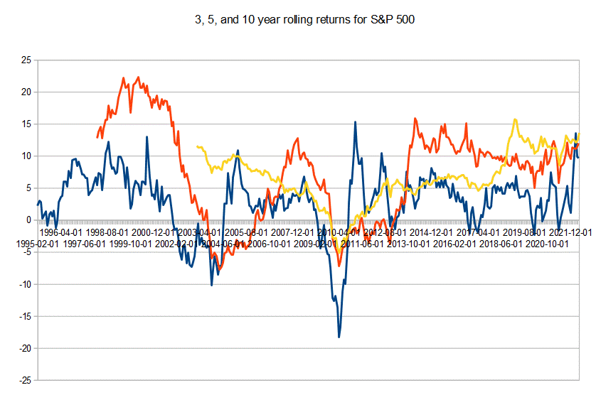

Rolling returns are a crucial metric in financial analysis, particularly when assessing investment performance over time. Unlike single period returns, which can be distorted by short-term volatility, rolling returns provide a comprehensive view by taking into account overlapping time periods. This approach helps to smooth out fluctuations and uncover long-term trends essential for crafting effective investment strategies.

The integration of rolling returns into financial analysis extends beyond mere trend identification. It becomes exceedingly valuable in algorithmic trading, where systems must adapt to market dynamics swiftly. By analyzing performance trends over specified periods, traders and algorithms can better respond to market changes, reducing risks and seizing opportunities.



Understanding rolling returns is vital for investors and traders aiming to enhance decision-making efficiency. These returns offer insights that are instrumental in strategic planning. By translating complex financial data into actionable intelligence, rolling returns aid in crafting robust trading strategies. This analytical tool is indispensable for professionals seeking to navigate the complexities of financial markets with precision and foresight.

## Table of Contents

## The Concept of Rolling Returns

Rolling returns, also known as rolling period returns, are a financial metric that measures a portfolio's average annual return over a specified rolling time frame. Unlike traditional single-period assessments, rolling returns provide a more nuanced view of investment performance by incorporating overlapping periods. This method helps investors gain insights into performance fluctuations and the potential for long-term growth, which are vital for effective investment strategies.

The concept of rolling returns involves calculating the return for a series of consecutive periods of equal length, where each new period rolls forward by one unit (e.g., a month or a quarter). This rolling nature smooths the return data, thereby mitigating short-term volatility and revealing more consistent patterns. By evaluating returns across overlapping periods, investors can better understand the persistence of performance trends, which may be obscured by short-term market fluctuations.

Mathematically, rolling returns can be represented as follows: let $R_t$ denote the return at time $t$, and $n$ be the length of the rolling window. The rolling return at time $t$ over a window of length $n$ is calculated as:

$$

RR_t = \left( \prod_{i=t-n+1}^{t} (1 + R_i) \right)^{\frac{1}{n}} - 1 
$$

This formula computes the compounded return over $n$ periods, annualized by dividing by $n$. The use of compounded returns allows investors to see how their invested amount would grow over the specified time frame, assuming the returns are reinvested.

Understanding rolling returns aids investors by highlighting periods of consistent performance or identifying long-term trends. This analysis enables adjustments to investment strategies and risk management practices, ensuring they align with broader market conditions rather than being skewed by short-term anomalies. As a result, rolling returns are an invaluable tool in financial analysis, offering a comprehensive perspective on the potential and risks of investment portfolios.

## Importance in Financial Analysis

Rolling returns are an invaluable tool for investors aiming to evaluate the stability and predictability of an investment portfolio. In financial analysis, these returns offer insights by considering the performance of overlapping periods rather than relying on a single point in time. This technique is particularly beneficial for mutual funds and index tracking where consistency in returns is a key [factor](/wiki/factor-investing) for investors.

The principal advantage of using rolling returns lies in their ability to filter out short-term market noise and reveal sustained performance trends. This characteristic helps investors distinguish between temporary fluctuations, which might be due to seasonal effects or market anomalies, and actual changes in a portfolio's performance over time. By consistently evaluating rolling returns, investors can better understand the underlying factors driving returns, providing a clearer picture of financial health.

Rolling returns analysis is particularly effective in identifying economic growth or downturn periods. This identification is achieved by examining the returns over different economic cycles, allowing investors to adjust their strategies in response to market movements. For instance, if rolling returns indicate a sustained upward trend, investors might consider increasing exposure to riskier assets. Conversely, a consistent downward trend might signal a need to shift to more conservative investment strategies.

To illustrate, consider a mutual fund with annual returns evaluated over a rolling five-year period. By examining how the average return changes each year, investors can identify patterns that single-year returns might not showcase. This continuous analysis ensures that investment decisions are based on a comprehensive understanding of historical performance rather than isolated instances. Therefore, the application of rolling returns serves as a powerful mechanism for strategic adjustments, leading to more informed financial decision-making.

## Calculating Rolling Returns

Calculating rolling returns involves evaluating the average annual return of an investment over a specific period while continuously updating the frame by shifting it through time. By analyzing overlapping periods, investors can achieve a comprehensive understanding of growth and [volatility](/wiki/volatility-trading-strategies) patterns, beyond what is available in static period analysis.

One common metric in rolling returns is the Trailing 12 Months (TTM), which calculates the cumulative return over the past year. This involves adding the monthly returns over the last 12 months and adjusting for compounding effects. The Compound Annual Growth Rate (CAGR) is another frequently used metric. It represents a smoothed annual rate of return, calculated by determining the nth root of the total percentage return over the period, where n is the number of years:

$$
\text{CAGR} = \left( \frac{\text{Ending Value}}{\text{Beginning Value}} \right)^{\frac{1}{n}} - 1
$$

To calculate rolling returns, you should collect historical financial data, such as daily, monthly, or yearly asset prices or values. You then determine returns over chosen intervals—like 1-year, 3-year, 5-year periods—by sliding the window one unit at a time (e.g., one month or one year) and recalculating each period's returns, which smooths variability to better reveal trends. 

Tools such as Python and Excel are instrumental in automating and managing these calculations. For instance, using Python, the pandas library can facilitate the computation of rolling returns due to its powerful data manipulation capabilities. Here is an example script in Python using pandas to compute rolling returns:

```python
import pandas as pd

# Sample data: a DataFrame 'df' with a DateTime index and a column 'Price'
df = pd.DataFrame({'Price': [100, 105, 110, 120, 115, 125]}, 
                  index=pd.date_range(start='1/1/2020', periods=6, freq='M'))

# Calculate daily percentage change and then rolling return
df['Daily Return'] = df['Price'].pct_change()
df['Rolling Return'] = df['Daily Return'].rolling(window=12).apply(lambda x: (x + 1).prod() - 1)

print(df)
```

This code block calculates the trailing 12-month return based on the available data. For larger-scale investments, integrating such calculations into sophisticated financial models helps investors draw insights into patterns that guide investment decisions.

## Application in Algorithmic Trading

Rolling returns serve as a fundamental tool in [algorithmic trading](/wiki/algorithmic-trading) strategies by providing a dynamic perspective on investment performance over time. These periodic metrics are essential as they reflect ongoing trends, thereby allowing trading algorithms to make informed decisions in real-time market conditions. 

Algorithms often leverage rolling returns to fine-tune trading parameters. By continuously monitoring rolling returns, these systems can automatically adjust their strategies to suit evolving market trends. This responsiveness is crucial for maintaining a competitive edge and optimizing returns. Rolling returns assist in mitigating risks associated with market volatility by smoothing out short-term fluctuations. As a result, they enable algorithms to focus on long-term market opportunities rather than reacting to short-lived market anomalies. 

A practical implementation includes the [backtesting](/wiki/backtesting) of trading strategies over historical data, where rolling returns play a vital role. By analyzing periodic returns over different rolling windows, traders can assess the robustness and adaptability of their strategies. This process ensures that the strategies are well-equipped to handle diverse market conditions and have the flexibility to adapt to unforeseen changes.

To illustrate, a Python script for calculating rolling returns might look like this:

```python
import pandas as pd

# Sample portfolio returns data
data = {'Date': pd.date_range(start='1/1/2020', periods=100, freq='D'),
        'Portfolio Value': 1000 + pd.Series(range(100)).apply(lambda x: x**1.5)}

df = pd.DataFrame(data)
df.set_index('Date', inplace=True)

# Define a window size, e.g., 20 days
window_size = 20

# Calculate rolling returns
df['Rolling Return'] = df['Portfolio Value'].pct_change(periods=window_size)

# View the result
print(df['Rolling Return'])
```

This code snippet establishes a foundation for calculating rolling returns using a specified window size, which is a key step in algorithmic trading. These calculations allow traders to backtest algorithms, ensuring that they maintain performance consistency across various market scenarios. Through the integration of rolling returns, traders can devise strategies that not only perform well historically but also exhibit resilience in live trading conditions, thereby achieving a balance between risk and reward.

In conclusion, rolling returns are indispensable in algorithmic trading applications, offering insights into market dynamics and facilitating strategic adjustments that translate into successful trading outcomes.

## Case Study: S&P 500 Rolling Returns

The S&P 500 index, a benchmark for U.S. equities, serves as a valuable gauge for analyzing market dynamics through its rolling 5-year returns. Rolling returns offer distinct insights into the behavior of the stock market, smoothing out short-term volatility and revealing longer-term trends. By examining rolling returns, investors can identify periods of economic resilience or instability.

For instance, during economic expansions, the S&P 500 often delivers strong positive returns over 5-year rolling periods. Conversely, during recessions or market downturns, these returns may reflect negative trends. Such historical analyses of rolling returns provide investors and analysts with valuable information for strategic investment planning and risk management.

Analyzing rolling returns involves calculating the average annual return for overlapping 5-year periods. This can be achieved using Python with libraries like pandas to process historical S&P 500 data and compute these returns efficiently. For example, consider the following Python code to calculate rolling 5-year CAGR (Compound Annual Growth Rate) for the S&P 500:

```python
import pandas as pd
import numpy as np

# Assume df is a DataFrame with 'Date' and 'Close' columns for S&P 500 data
df['Date'] = pd.to_datetime(df['Date'])
df.set_index('Date', inplace=True)

df['5yr_cagr'] = df['Close'].pct_change(5*252).apply(lambda x: (1 + x)**(1/5) - 1)

# Drop NaN values generated by pct_change
df.dropna(inplace=True)

print(df[['Close', '5yr_cagr']])
```

This code snippet calculates the 5-year CAGR, providing a smoother perspective of the S&P 500's performance over time. By visualizing this data, traders can identify persistent upward trends or periods of downturn in market performance.

Case studies demonstrate that traders apply rolling return analyses to optimize algorithmic trading strategies. By understanding how the S&P 500 has historically performed, algorithms can adjust trading parameters accordingly. For example, during periods of high rolling returns, a strategy might increase exposure to equities, whereas during low or negative rolling returns, it might reduce equity holdings or shift to safer assets.

In summary, the S&P 500's rolling 5-year returns not only reflect historical market conditions but also empower investors and traders with the foresight needed for strategic decision-making and effective risk management in algorithmic trading. These insights transform historical data into actionable strategies, enhancing financial planning and portfolio management practices.

## Challenges and Considerations

Calculating rolling returns presents several challenges and considerations essential for precise financial analysis. A key requirement is the availability of accurate and comprehensive financial data. High-quality data is crucial, as any inconsistencies or inaccuracies can significantly affect rolling return calculations and subsequent analyses.

One critical decision is determining the appropriate rolling window size. The choice of window size impacts the balance between detail and overarching trends. A smaller window might capture short-term fluctuations effectively but can be more susceptible to noise and less reliable in indicating long-term trends. In contrast, a larger window smooths out short-term variations but might miss sudden changes in market conditions. Striking a balance between these factors is pivotal for meaningful insights.

Market seasonality and unexpected shocks must also be considered when interpreting rolling returns. Seasonality can introduce periodic patterns in data, such as increased consumer spending during holiday seasons, which might not reflect the underlying economic conditions. Unexpected events such as geopolitical issues, economic crises, or natural disasters can temporarily distort rolling return calculations, potentially leading to misleading conclusions if not adequately accounted for.

Moreover, algorithmic strategies need to be adjusted based on data derived from rolling returns to enhance investment outcomes. Traders and investors can use insights from rolling returns to tailor algorithmic trading parameters, aligning them with observed market patterns and potential market shifts. This adaptability is particularly important in dynamic markets, where conditions can change rapidly.

For practical implementation, Python offers tools for calculating rolling returns. Using pandas library, one can efficiently compute these metrics:

```python
import pandas as pd

# Assuming df is a DataFrame with a 'returns' column
window_size = 12  # Example: 12-month rolling window
df['rolling_return'] = df['returns'].rolling(window=window_size).mean()

```

This code snippet calculates a rolling mean over a specified period, providing a smoothed view of returns. By adjusting the window size and function (e.g., sum, median), investors can extract the information most relevant to their analysis, allowing for tailored and responsive strategy development.

## Conclusion

Rolling returns play a critical role in evaluating investment performance, offering a nuanced view that aids in the refinement of trading strategies. By considering rolling returns in financial analysis, investors gain a comprehensive understanding of performance trends over time, which is invaluable for both short-term adjustments and long-term strategic planning. 

Incorporating rolling returns analysis allows traders and investors to adapt more effectively to market dynamics. The continuous nature of rolling returns provides a dynamic insight into portfolio performance, helping to distinguish between temporary fluctuations and sustained trends. This distinction is particularly beneficial in algorithmic trading, where adaptability and timely decision-making are paramount. Utilizing rolling returns can fine-tune algorithms, making them more responsive to changing market conditions and thereby enhancing trading efficacy.

Integrating rolling returns into analytical frameworks not only refines traditional financial metrics but also transforms raw data into actionable insights. These insights are essential for constructing robust trading strategies that can withstand market volatility and capitalize on emerging opportunities. For instance, traders might employ Python to automate the calculation of rolling returns, allowing for real-time adjustments in algorithmic models based on updated performance assessments.

Ultimately, the strategic use of rolling returns equips investors with the information needed to make more informed financial decisions. Whether through manual analysis or automated systems, leveraging rolling returns ensures a more accurate assessment of risk and performance potential, leading to more robust investment strategies. As a result, investors and traders are better positioned to achieve their financial goals in an ever-evolving market landscape.

## References & Further Reading

[1]: **"Advances in Financial Machine Learning" by Marcos Lopez de Prado**  
This book is a significant resource for understanding the integration of [machine learning](/wiki/machine-learning) in financial markets. It covers advanced techniques in financial data analysis and provides insights into the tools used to develop robust algorithmic trading strategies. Lopez de Prado offers methodologies that improve the research and financial applications of machine learning models, which are crucial for analyzing rolling returns and adapting trading strategies.

[2]: **"Machine Learning for Algorithmic Trading" by Stefan Jansen**  
Jansen's book provides a comprehensive guide to applying machine learning to develop predictive models for financial trading. Covering a wide range of algorithms and techniques, it emphasizes the use of rolling returns to better handle market volatility and enhance predictive analytics. This book supports readers in building algorithmic systems that can adapt to dynamic market conditions by implementing rolling returns analysis.

[3]: **"Quantitative Trading: How to Build Your Own Algorithmic Trading Business" by Ernest P. Chan**  
Chan offers a practical approach to algorithmic trading, focusing on the quantitative methods essential for successful trading systems. He highlights the importance of data-driven decision-making and performance evaluation, underscoring how rolling returns help assess the stability and reliability of trading strategies. This reference is key for those aiming to construct and refine their trading models.

[4]: **"Evidence-Based Technical Analysis: Applying the Scientific Method and Statistical Inference to Trading Signals" by David Aronson**  
Aronson advocates for a scientific and statistical approach to trading, which aligns well with the analysis of rolling returns. This book discusses the foundation of technical analysis using statistical methodologies, providing techniques to evaluate and confirm the efficacy of trading strategies. The scientific approach presented aids in understanding the nuances of financial data, such as patterns revealed through rolling returns.

[5]: **"Common Stocks and Uncommon Profits and Other Writings" by Philip A. Fisher**  
Fisher's writings, though primarily focused on investment philosophies, provide valuable insights into long-term value and growth prospects. While not exclusively focused on algorithmic trading or rolling returns, the book offers timeless principles that can inform the understanding of market cycles and the broader economic context in which rolling returns operate. Fisher’s emphasis on thorough analysis parallels the detailed scrutiny required in evaluating rolling returns.

These references constitute a fertile ground for further exploration and understanding of key concepts related to rolling returns and their application in financial analysis and algorithmic trading.

