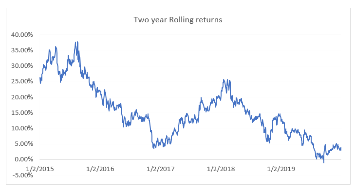

## Table of Contents

## What are rolling returns?

Rolling returns are a way to measure how an investment performs over different periods of time. Instead of just looking at the return from start to finish, rolling returns break the investment period into smaller, overlapping segments. For example, if you want to see the 3-year rolling returns of a 10-year investment, you would look at the returns for years 1-3, then years 2-4, then years 3-5, and so on, until you reach the end of the 10 years.

This method helps investors understand how consistent an investment's performance is over time. It can show if an investment does well in some periods but not in others. By looking at rolling returns, investors can get a better sense of the ups and downs of an investment, which can help them make more informed decisions about whether to invest in it.

## How do rolling returns differ from average annual returns?

Rolling returns and average annual returns are two different ways to look at how well an investment is doing. Average annual returns give you one number that shows the investment's performance over a whole period, like a year or several years. It's like taking the total growth of your investment and spreading it evenly across each year. This can be useful for a quick overview, but it doesn't show you how the investment might have gone up and down during that time.

Rolling returns, on the other hand, break down the investment period into smaller parts that overlap. For example, if you're looking at 3-year rolling returns over 10 years, you'd see the returns for years 1-3, then 2-4, and so on. This method helps you see how the investment performed in different time slices. It can show you if the investment was steady or if it had big swings in performance. By looking at rolling returns, you get a better picture of the investment's consistency and risk over time.

## Why are rolling returns important for investors?

Rolling returns are important for investors because they give a clearer picture of how an investment performs over time. Instead of just seeing one number for the whole period, rolling returns show how the investment does in different smaller periods. This helps investors see if the investment is steady or if it has big ups and downs. Knowing this can help investors decide if an investment matches their comfort with risk.

Also, rolling returns can show how an investment might do in different market conditions. For example, an investment might do well in good times but not so well in bad times. By looking at rolling returns, investors can see these patterns and decide if the investment fits their long-term goals. This way, they can make smarter choices about where to put their money.

## How can rolling returns be calculated?

To calculate rolling returns, you first need to pick a period of time you want to look at, like 3 years or 5 years. Then, you take the total return of your investment for that period. For example, if you're looking at 3-year rolling returns over 10 years, you start by calculating the return from year 1 to year 3. Then, you move one year forward and calculate the return from year 2 to year 4, and keep doing this until you reach the end of the 10 years.

Each of these smaller periods gives you a rolling return. By looking at all these rolling returns, you can see how your investment did in different parts of the whole time. This helps you understand if the investment was consistent or if it had big changes in performance. It's a good way to see how well your investment might do in the future, based on how it did in the past.

## What time periods are commonly used for rolling returns?

Rolling returns are often calculated using different time periods depending on what the investor wants to know. Common time periods include 1 year, 3 years, and 5 years. These periods help investors see how an investment performs over short, medium, and longer times. For example, 1-year rolling returns can show how an investment does year by year, while 3-year rolling returns can show how it does over three-year periods.

Choosing the right time period for rolling returns depends on what the investor is looking for. If someone wants to see how an investment does over a longer time, they might use 5-year rolling returns. This can help them see if the investment is steady over several years. Shorter periods like 1-year rolling returns can be useful for seeing how an investment reacts to yearly changes in the market. By looking at different time periods, investors can get a better understanding of how their investment might perform in the future.

## Can rolling returns be used to compare different investment options?

Rolling returns can be used to compare different investment options because they show how each investment performs over time. By looking at rolling returns, you can see if one investment does better than another in different time periods. For example, if you are comparing two mutual funds, you can look at their 3-year rolling returns over the last 10 years. This helps you see which fund was more consistent or had better performance in different market conditions.

Using rolling returns to compare investments can give you a clearer picture than just looking at average returns. Average returns can hide how an investment might go up and down over time. Rolling returns show these ups and downs, so you can see if one investment is more stable or risky than another. This can help you decide which investment fits your goals and how much risk you are willing to take.

## How do rolling returns help in understanding investment volatility?

Rolling returns help investors understand how much an investment goes up and down, which is called volatility. Instead of looking at one big number for the whole time, rolling returns break it into smaller parts. By doing this, you can see if an investment has big swings or if it stays pretty steady. If the rolling returns show big changes from one period to the next, it means the investment is more volatile. If the returns are more the same from one period to another, the investment is less volatile.

This way of looking at returns can show you how an investment might act in different times, like when the market is doing well or not so well. If you see that an investment has big ups and downs in its rolling returns, you know it might be riskier. But if the rolling returns are more steady, it might be a safer choice. Knowing this helps you pick investments that match how much risk you want to take and how steady you want your money to grow.

## What are the limitations of using rolling returns in investment analysis?

Rolling returns can be really helpful, but they do have some limits. One big thing is that they use past data to show how an investment did. This means they can't tell you exactly what will happen in the future. Just because an investment did well in the past doesn't mean it will keep doing well. Also, rolling returns might not show you everything about an investment. They look at how an investment does over time, but they don't tell you about other important stuff like fees, taxes, or how easy it is to buy or sell the investment.

Another thing to think about is that rolling returns can be tricky to understand if you're not used to them. They give you a lot of numbers because they break down the investment into smaller parts. This can be confusing, especially if you're new to investing. Plus, if you pick different time periods for rolling returns, you might get different results. So, it's important to be careful and know what you're looking at when you use rolling returns to decide about investments.

## How can rolling returns be visualized effectively?

Rolling returns can be shown well using a line chart. Imagine a graph where the x-axis shows time, and the y-axis shows the returns. Each line on the graph would show the rolling returns for different periods, like 3 years or 5 years. If you want to compare two investments, you can use different colors for each line. This way, you can easily see if one investment goes up and down more than the other, which helps you understand how steady or risky it is.

Another good way to show rolling returns is with a histogram. This type of chart uses bars to show how often the returns fall into different ranges. For example, you might see how many times the rolling returns were between 0% and 5%, or between 5% and 10%. This can help you see if the returns are usually high or low, and how much they change. By looking at the shape of the bars, you can get a quick idea of the investment's ups and downs over time.

## What advanced statistical methods can be applied to analyze rolling returns?

One advanced way to look at rolling returns is by using something called standard deviation. This helps you see how much the returns go up and down. If the standard deviation is big, it means the returns change a lot and the investment might be riskier. If it's small, the returns are more steady. By calculating the standard deviation of rolling returns, you can understand how risky an investment is over different times. This can help you decide if an investment fits with how much risk you want to take.

Another method is called regression analysis. This helps you see if there's a pattern in how the rolling returns change. For example, you might want to know if the returns go up when the market does well, or if they go down when the market does poorly. By using regression, you can see how closely the returns follow these patterns. This can tell you how much the investment depends on what's happening in the market, which is important for figuring out how it might do in the future.

## How do rolling returns influence long-term investment strategies?

Rolling returns can help shape long-term investment strategies by showing how an investment performs over time. When you look at rolling returns, you see how steady or up-and-down an investment is. If the rolling returns are pretty much the same from one period to the next, it means the investment is stable. This can be good for people who want their money to grow slowly but surely. But if the rolling returns jump around a lot, it might be riskier. People who are okay with more risk might pick these investments hoping for bigger gains, but they need to be ready for bigger losses too.

Using rolling returns can also help investors pick the right mix of investments for the long run. By comparing the rolling returns of different investments, you can see which ones do well in different market conditions. For example, some investments might do better when the market is going up, while others might be safer when the market is going down. By understanding these patterns, investors can build a portfolio that balances risk and reward over many years. This way, they can feel more confident that their investments will help them reach their long-term goals, like saving for retirement or buying a house.

## What are the best practices for interpreting rolling returns data?

When looking at rolling returns data, it's important to pay attention to how the returns change over time. Rolling returns show you how an investment did in different smaller periods, like 3 years or 5 years. If the returns are pretty much the same from one period to the next, it means the investment is steady. But if the returns go up and down a lot, it might be riskier. You should look at these changes to see if the investment matches how much risk you're okay with. Also, don't just focus on the good times; see how the investment did in bad times too. This gives you a fuller picture of how it might do in the future.

Another thing to keep in mind is to compare rolling returns of different investments. This can help you see which ones do better in different market conditions. For example, one investment might do well when the market is up, while another might be safer when the market is down. By looking at these patterns, you can pick investments that fit your long-term goals. Remember, rolling returns use past data, so they can't tell you exactly what will happen next. But they can give you a good idea of how an investment might behave over time, helping you make smarter choices about where to put your money.

## What is Understanding Rolling Returns?

Rolling returns serve as an insightful tool for evaluating an investment's performance over a fixed time period, such as five years. Unlike point-to-point returns, which measure the performance from a fixed start date to an end date, rolling returns shift this window forward incrementally, calculating the return for overlapping periods. This approach allows investors to observe how the returns evolve over time, thus providing a comprehensive view of historical asset performance.

To derive rolling returns, one typically calculates the annualized return from each period to the next throughout the chosen time horizon. This is often done by using the Compound Annual Growth Rate (CAGR), which normalizes the effect of volatility by smoothing out the returns over the specified duration. The formula for CAGR is:

$$

\text{CAGR} = \left( \frac{V_f}{V_i} \right)^{\frac{1}{n}} - 1 
$$

where $V_f$ is the final value, $V_i$ is the initial value, and $n$ is the number of years.

By calculating rolling returns, investors gain valuable insight into long-term trends, which is particularly useful for long-term investors and those employing algorithmic strategies. For example, a five-year rolling return on a dataset with monthly granularity might involve calculating the CAGR for each five-year span, then advancing one month and repeating the calculation until the end of the dataset is reached. This method significantly helps in mitigating the noise created by short-term [volatility](/wiki/volatility-trading-strategies), thereby highlighting the more sustainable performance trends.

For investors utilizing [algorithmic trading](/wiki/algorithmic-trading) strategies, rolling returns provide a robust mechanism to manage portfolios by informing decisions with a more stable and reliable dataset. In the context of algorithmic trading, integrating rolling returns can refine the trading algorithms, enabling a more nuanced interpretation of historical performance trends and facilitating improved decision-making processes. This technique strengthens the ability to anticipate market behavior, thus optimizing entry and [exit](/wiki/exit-strategy) strategies.

Rolling returns' ability to illustrate ongoing performance changes makes them indispensable for assessing the consistency and reliability of investments over extended periods. This analysis becomes instrumental in constructing portfolios that can withstand market fluctuations while capitalizing on long-term growth opportunities.

## What is the importance of rolling returns in S&P 500 performance analysis?

Rolling returns play a crucial role in analyzing the performance of the S&P 500 by providing a smoothed perspective of the index's historical performance over extended periods. Unlike single-period returns, rolling returns assess a series of sequential overlapping time frames, such as continuous 5-year durations. This methodology ensures that transient market volatility, which can obscure underlying trends, is balanced out.

One of the main advantages of rolling 5-year returns is their ability to offer investors a clearer picture of potential gains or losses. By calculating returns across multiple time frames, investors can identify patterns of consistency or variability, assisting in the detection of long-term trends. Consider the formula for calculating the rolling return for a given period:

$$
\text{Rolling Return} = \left( \frac{\text{Ending Value}}{\text{Beginning Value}} \right)^{\frac{1}{n}} - 1
$$

where $n$ represents the number of years, typically set to 5 for this analysis.

Examining the rolling returns of the S&P 500 provides insight into the index's historical performance stability. Patterns observed in these calculations can underscore periods of growth resilience or forewarn of potential periods of economic instability. For long-term investors, understanding these patterns is indispensable for formulating robust strategies.

Moreover, the use of rolling returns helps mitigate behavioral biases prevalent among investors, particularly during volatile market conditions. When markets dip, investors might react impulsively by changing their investment strategies without a solid rationale. Rolling returns offer a stabilizing framework by emphasizing longer-term perspectives, which can anchor decision-making processes.

In summary, by smoothing out return variances and emphasizing trends over substantial time frames, rolling 5-year returns allow for a more objective analysis of the S&P 500's performance. This approach empowers investors and traders with valuable insights, enhancing decision-making and supporting the development of effective long-term investment strategies.

## How do you calculate rolling 5-year returns?

To compute rolling 5-year returns, one begins with a series of historical price data. This process involves a structured method to calculate compounded returns for each 5-year period, consistently updated for subsequent intervals. Such an approach provides a clearer long-term view while minimizing the noise from short-term price movements.

### Data Utilization

Monthly data serves as a robust basis for this analysis. By aggregating daily information into a monthly format, one maintains a detailed yet manageable dataset that provides a comprehensive depiction of price movements while filtering out daily market fluctuations.

### Calculation Process

1. **Data Preparation**: Assemble a time series of prices, typically in monthly increments. For accurate rolling return computation, the time span should prevail over five years plus any additional periods necessary to capture the desired end dates.

2. **Compounded Return Calculation**: For each 5-year window within your dataset:
   - Identify the starting price ($P_0$) and the ending price ($P_1$) for the 5-year period.
   - Use the formula for the Compound Annual Growth Rate (CAGR):
$$
     \text{CAGR} = \left(\frac{P_1}{P_0}\right)^{\frac{1}{n}} - 1

$$
     where $n$ is the number of years (5 in this case).

3. **Rolling Window Iteration**: Shift the starting point by one month to calculate the next rolling return, continuing this process throughout your dataset. This yields a series of 5-year returns corresponding to the rolling periods.

### Implementation Tools

Spreadsheets offer basic functionality for performing these calculations. However, using programming languages like Python can enhance efficiency and precision, especially for extensive datasets.

**Python Example**:
```python
import pandas as pd

def rolling_5yr_cagr(prices):
    returns = []
    for start in range(len(prices) - 60):
        end = start + 60  # 60 months = 5 years
        P0 = prices[start]
        P1 = prices[end]
        cagr = (P1 / P0) ** (1/5) - 1
        returns.append(cagr)
    return returns

# Example usage with a DataFrame of monthly prices
# df['5yr_CAGR'] = rolling_5yr_cagr(df['monthly_close_prices'])
```

### Understanding Geometric vs. Arithmetic Averages

Understanding the distinction between geometric and arithmetic averages is crucial. Arithmetic averages, which simply sum the returns over periods and divide by the count, can misrepresent actual growth over several periods due to the effects of volatility. In contrast, the geometric average, which CAGR effectively represents, captures true compounded growth, reflecting the investment's actual value increase over time.

By employing this systematic computation of rolling 5-year returns, investors and analysts can derive more nuanced insights into an asset's performance over time, allowing for informed decision-making based on clearer understanding of historical trends.

## How can one implement rolling returns in algorithmic trading?

Algorithmic traders can effectively integrate rolling returns into their strategies to enhance the analysis of historical performance trends. This approach provides a systematic method for evaluating the potential profitability and risk associated with different investment strategies. By focusing on rolling returns, traders can gain a nuanced understanding of market behavior over extended periods, enabling more informed decision-making regarding entry and exit points in trading algorithms.

Incorporating rolling returns into trading algorithms involves the use of historical data to calculate rolling return metrics, which assist in identifying patterns and predicting future price movements. This method allows traders to refine their strategies dynamically. For example, if a rolling return analysis indicates a period of strong performance in a particular sector, algorithms can be adjusted to increase exposure to that sector, or vice versa if returns are declining.

Backtesting is a critical component in the adoption of rolling return analytics within algorithmic trading. By simulating trading strategies on historical data, traders can evaluate how different algorithms perform under various market conditions. This testing process reveals potential strengths and weaknesses in trading strategies, allowing for adjustments that align risk and return more closely with investment objectives.

Programming languages like R and Python are particularly beneficial for implementing rolling return analyses. These languages offer robust libraries and tools that facilitate complex data manipulation and analysis. For instance, Python’s `pandas` library can be used to compute rolling returns efficiently. The formula for computing a rolling return $R_t$ over a period $n$ is given by:

$$
R_t = \left(\frac{{P_t}}{{P_{t-n}}}\right)^{\frac{1}{n}} - 1
$$

where $P_t$ is the price at time $t$ and $P_{t-n}$ is the price $n$ periods before time $t$.

Moreover, the implementation of advanced statistical models like Autoregressive Integrated Moving Average (ARIMA) and Generalized Autoregressive Conditional Heteroskedasticity (GARCH) further enhances forecast precision. These models are capable of accounting for volatility clustering and trends in financial time series data, making them particularly useful in rolling returns analysis. For example, using Python's `statsmodels` library, a GARCH model can be implemented to predict future volatility based on past rolling returns, thus aiding in risk management and decision-making processes.

In summary, the integration of rolling returns into algorithmic trading empowers traders to leverage historical performance data effectively, ensuring strategies are adaptable and robust against market fluctuations. By utilizing programming tools and statistical models, traders can enhance the precision of their forecasts and optimize their trading strategies accordingly.

## References & Further Reading

[1]: ["Advances in Financial Machine Learning"](https://www.amazon.com/Advances-Financial-Machine-Learning-Marcos/dp/1119482089) by Marcos Lopez de Prado

[2]: ["Machine Learning for Algorithmic Trading"](https://github.com/stefan-jansen/machine-learning-for-trading) by Stefan Jansen

[3]: ["Quantitative Trading: How to Build Your Own Algorithmic Trading Business"](https://books.google.com/books/about/Quantitative_Trading.html?id=j70yEAAAQBAJ) by Ernest P. Chan

[4]: ["Evidence-Based Technical Analysis: Applying the Scientific Method and Statistical Inference to Trading Signals"](https://www.amazon.com/Evidence-Based-Technical-Analysis-Scientific-Statistical/dp/0470008741) by David Aronson

[5]: ["Common Stocks and Uncommon Profits and Other Writings"](https://www.amazon.com/Common-Stocks-Uncommon-Profits-Writings/dp/0471445509) by Philip A. Fisher