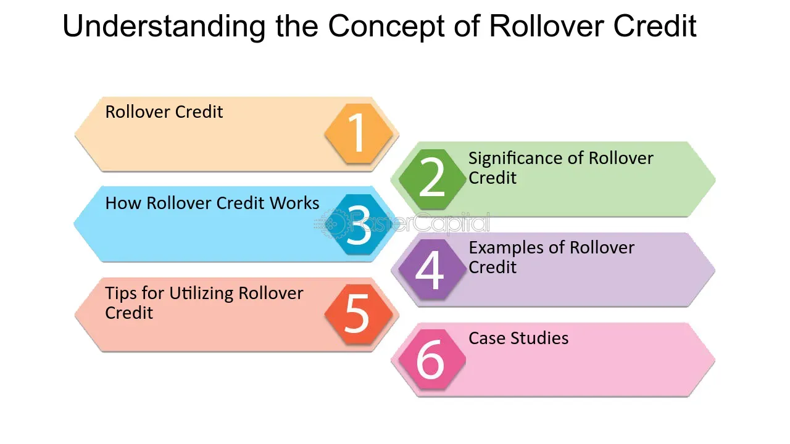

## Table of Contents

## What is the basic definition of rollover credit?

Rollover credit is a type of loan where you can borrow money and then extend the time you have to pay it back. Instead of paying the full amount at the end of the loan term, you can roll over the loan into a new term. This means you start a new loan period, but you usually have to pay a fee for doing this.

This can be helpful if you need more time to pay back the loan. But, it can also lead to more costs because of the fees and interest that add up each time you roll over the loan. It's important to think carefully about whether rolling over a loan is the best choice for your financial situation.

## How does rollover credit differ from traditional credit?

Rollover credit and traditional credit are different in how they work and how they can affect your money. With traditional credit, like a personal loan or a credit card, you borrow money and then pay it back over time with interest. The key thing is that you have a set time to pay it all back. If you don't pay on time, you might face penalties or a higher interest rate.

Rollover credit, on the other hand, lets you extend the time you have to pay back the loan. If you can't pay the full amount when it's due, you can roll over the loan into a new term. This means you get more time, but you usually have to pay a fee for this. It can be helpful if you need more time, but it can also cost you more in the long run because of the extra fees and interest that add up each time you roll over the loan.

## What are the common uses of rollover credit for individuals and businesses?

For individuals, rollover credit is often used when they need more time to pay back a loan. This might happen if someone has an unexpected expense or if their income changes and they can't pay the full amount on time. For example, someone might use rollover credit on a payday loan if they can't pay it back by their next paycheck. While it gives them more time, they need to be careful because the fees and extra interest can make the loan more expensive.

Businesses might use rollover credit to manage their cash flow. If a business has money coming in at different times than their bills are due, they might use rollover credit to keep things running smoothly. For example, a small business might roll over a short-term loan to make sure they can pay their employees or buy supplies until they get paid by their customers. Like with individuals, businesses need to watch out for the extra costs that come with rolling over the loan.

## What are the key benefits of using rollover credit?

Rollover credit can be a big help when you need more time to pay back a loan. If you're an individual who suddenly has less money coming in or an unexpected bill, rollover credit can give you the breathing room you need. You don't have to worry about paying everything back right away, which can reduce stress and help you manage your finances better.

For businesses, rollover credit can be a way to keep things running smoothly. If money from customers is coming in at different times than when bills are due, rollover credit can help bridge that gap. It lets a business keep paying employees, buying supplies, and staying operational until the money comes in. This flexibility can be crucial for maintaining steady operations.

## What are the potential risks associated with rollover credit?

Using rollover credit can be risky because it can cost you more money over time. Every time you roll over a loan, you usually have to pay a fee. These fees can add up quickly, making the total amount you owe much bigger than the original loan. Plus, you'll keep paying interest on the loan, which can also increase the total cost. If you keep rolling over the loan without paying it down, you might end up in a cycle of debt that's hard to get out of.

Another risk is that rollover credit can hurt your credit score. If you're not careful and keep rolling over the loan, it might look like you're not managing your money well. Lenders might see this as a sign that you're a risky borrower, which can make it harder for you to get other types of credit in the future. It's important to think about these risks and make sure you have a plan to pay back the loan before you decide to use rollover credit.

## How does the rollover process work step-by-step?

When you take out a loan that allows rollover credit, you borrow money and agree to pay it back by a certain date. If you can't pay back the full amount by that date, you can ask to roll over the loan. To do this, you usually need to contact your lender before the due date and ask for a rollover. The lender will then check if you can roll over the loan. If they say yes, you'll need to pay a fee for the rollover. This fee is added to the amount you already owe, and you get a new due date for the loan.

After you roll over the loan, you start a new loan term. This means you have more time to pay back the money, but you'll also have to pay interest on the new term. The interest and the rollover fee make the total amount you owe bigger than before. If you still can't pay back the full amount by the new due date, you might be able to roll over the loan again. Each time you do this, you'll pay another fee and more interest, which can make the loan very expensive over time.

## What are the eligibility criteria for obtaining rollover credit?

To get rollover credit, you usually need to meet some basic requirements set by the lender. First, you need to have an existing loan that allows for rollovers. This means the loan you took out must have terms that let you extend the repayment period. Second, you need to be in good standing with your lender. This means you haven't missed any payments and you've followed the rules of your loan so far. Lenders might also check your credit history to see if you've managed other loans well in the past.

When you ask for a rollover, the lender will look at your situation to decide if they will let you extend the loan. They might ask for proof that you can pay back the loan eventually, like showing your income or other financial details. If you meet all these requirements and the lender agrees, you can roll over your loan. But remember, each time you roll over, you'll have to pay a fee, which can make the loan more expensive.

## What documentation is required to apply for rollover credit?

When you want to roll over your loan, you need to show some papers to the lender. They might ask for things like your ID to make sure it's really you. They could also want to see your pay stubs or bank statements to check if you can pay back the loan. Sometimes, they might need to see your credit report to see how you've handled money before.

The exact papers you need can change depending on who you're borrowing from and what kind of loan you have. It's a good idea to ask your lender what they need before you apply for a rollover. This way, you can get everything ready and make the process smoother.

## How do interest rates and fees typically work with rollover credit?

When you roll over a loan, you usually have to pay a fee. This fee is like a charge for getting more time to pay back the money. The fee gets added to the total amount you owe. So, if you had a loan for $100 and the rollover fee is $20, now you owe $120. Every time you roll over the loan, you'll have to pay another fee, which can make the total amount you owe grow bigger and bigger.

On top of the fee, you also have to pay interest on the new loan term. Interest is the cost of borrowing money, and it's usually a percentage of the amount you owe. So, if you roll over a $120 loan and the interest rate is 10% for the new term, you'll owe an extra $12 in interest. The interest and the rollover fees can add up quickly, making the loan much more expensive than it was at the start. It's important to think about these costs before deciding to roll over your loan.

## What strategies can be used to manage rollover credit effectively?

To manage rollover credit well, you need to have a good plan for paying it back. Before you roll over your loan, think about your money situation. Make sure you know how much you can pay back and when. Try to save some money each month to pay off the loan faster. If you can, pay more than the minimum amount each time to cut down on how much you owe. This can help you avoid rolling over the loan too many times and save you from paying lots of extra fees and interest.

Another good strategy is to talk to your lender. If you're having trouble paying back the loan, let them know. They might be able to change your payment plan or give you other options that can help. It's also a good idea to keep an eye on your budget and cut down on spending if you can. By being careful with your money and planning ahead, you can use rollover credit without getting stuck in a cycle of debt.

## How does rollover credit impact credit scores and financial health?

Using rollover credit can affect your credit score and overall financial health. If you roll over a loan a lot, it might look like you're having trouble paying back what you owe. This can make your credit score go down. Lenders look at your credit score to decide if they want to give you more money. If your score goes down because of rollover credit, it might be harder to get other loans or credit cards in the future. 

Also, rollover credit can make your financial situation worse if you're not careful. Every time you roll over a loan, you have to pay a fee and more interest. This can make the total amount you owe a lot bigger than the original loan. If you keep rolling over the loan without paying it down, you might end up in a cycle of debt. This can be stressful and can make it hard to save money or pay for other important things. It's important to think about these risks and have a plan to pay back the loan before you decide to use rollover credit.

## What are the advanced financial considerations and tax implications of rollover credit?

When you use rollover credit, you need to think about how it can affect your money in more ways than just the fees and interest. If you keep rolling over your loan, it might make your credit score go down. This can make it harder to get other types of loans or credit in the future. Lenders might see you as a risky borrower if you use rollover credit a lot. Also, if you're not careful, you could end up in a cycle of debt where you're always paying fees and interest without paying down what you owe. This can make it hard to save money or pay for other important things.

There can also be tax implications with rollover credit. If you use the loan for business purposes, you might be able to deduct the interest you pay on your taxes. But, you need to keep good records and know the rules about what you can and can't deduct. If you use the loan for personal reasons, the interest you pay usually isn't tax-deductible. It's a good idea to talk to a tax professional to understand how rollover credit can affect your taxes and make sure you're following the right rules.

## What is the credit process in financial trading?

Credit plays an essential role in financial markets by providing liquidity and enabling leverage. The credit process refers to how credit is evaluated, issued, and managed by financial institutions, which is pivotal in facilitating trading activities. 

Understanding the credit process begins with credit evaluation. Financial institutions assess the creditworthiness of a trading entity by examining its financial statements, credit history, and existing debt obligations. This evaluation often involves calculating metrics such as the debt-to-equity ratio, interest coverage ratio, and the credit score. For example, a commonly used mathematical formula for determining the debt-to-equity ratio is:

$$
\text{Debt-to-Equity Ratio} = \frac{\text{Total Liabilities}}{\text{Shareholders' Equity}}
$$

The process of issuing credit involves extending a line of credit or loan to a trading entity based on this assessment. This line of credit can be crucial for traders wishing to engage in margin trading. Margin trading allows traders to borrow funds to increase their position size, thus amplifying potential returns while also increasing risk exposure.

Credit management is the ongoing monitoring and adjusting of credit terms to reflect changes in the borrower's financial status or market conditions. Effective credit management ensures that credit remains a tool for enhancing [liquidity](/wiki/liquidity-risk-premium) without compromising the financial stability of the borrowing entity or the lending institution.

In trading, credit processes significantly influence transaction sizes. A higher credit rating can enable a trading firm to secure better terms on margin trading with brokers, allowing it to undertake larger trades. This credit facility can help trading firms to take advantage of market opportunities more swiftly and efficiently, contributing to enhanced liquidity in the marketplace.

Risk management strategies are also impacted by credit processes. Trading firms need to assess the risk associated with their credit exposure and may employ various hedging strategies to mitigate such risks. These strategies could include using derivatives or other financial instruments to offset potential losses.

Overall liquidity in financial markets is closely tied to the credit process. When credit is readily available and efficiently managed, it can facilitate smooth and continuous trading activities, ensuring that market participants can meet their funding needs in a timely manner.

An example of a credit application in trading is a firm leveraging its high credit rating to negotiate more favorable margin requirements with brokers. This enhanced access to credit allows the trading firm to engage in larger transactions without needing to hold equivalent cash reserves, thus optimizing its capital use.

In conclusion, understanding the credit process is crucial for traders and financial institutions alike, as it underpins significant aspects of modern trading activities, from determining transaction sizes to developing sophisticated risk management frameworks.

## What is Understanding Rollover Credit?

Rollover credit is a fundamental concept in [forex](/wiki/forex-system) trading that involves either the payment or receipt of interest when an open position is held overnight. The essence of rollover credit lies in the fact that forex trading always involves currency pairs, highlighting the [interest rate](/wiki/interest-rate-trading-strategies) differential between the two currencies in the pair. This interest rate differential reflects the differences in the central banks' interest rates of the respective countries.

When a trader holds a position overnight, they essentially borrow one currency to buy another. If the currency being purchased has a higher interest rate than the currency being sold, the trader may receive a credit. Conversely, if the interest rate on the currency being borrowed is higher, a debit is charged.

For example, consider a trader holding a long position in USD/JPY overnight. If the interest rate in the United States is higher than in Japan, the trader will receive a rollover credit. The fundamental equation for calculating the rollover interest can be expressed as:

$$
\text{Rollover Amount} = \left( \text{Interest Rate of Bought Currency} - \text{Interest Rate of Sold Currency} \right) \times \text{Position Size} \times \frac{1}{\text{Day Count}}
$$

Where:
- $\text{Position Size}$ is the nominal amount of currency being traded.
- $\text{Day Count}$ refers to the basis used by the interest rate markets (usually 360 or 365 days).

Forex traders need to manage rollover credits effectively as they directly impact the returns on their strategies. Neglecting to consider rollover can lead to unexpected costs or missed opportunities for additional income. Moreover, the rates can change daily, influenced by economic announcements or policy changes, requiring traders to remain vigilant.

Understanding and optimizing rollover credit is crucial for long-term profitability in forex trading, particularly for strategies intending to hold positions over several days. Proper management of rollover impacts can be a significant [factor](/wiki/factor-investing) in the overall performance of a trading strategy.

## What is a Practical Example of an Algo Trading Strategy that Incorporates Rollover Credit?

In the consistently dynamic forex market, traders frequently employ [carry](/wiki/carry-trading) trade strategies to leverage interest rate differentials between two currencies. The essence of these strategies lies in borrowing a currency with a low interest rate and using the funds to invest in a currency offering a higher return. The resultant interest rate differential, known as rollover credit, becomes a central component of traders' profits.

Algorithmic trading systems can significantly enhance the efficiency of carry trade strategies by automating the process of assessing interest rate shifts and adjusting positions accordingly. These systems operate based on predefined criteria and rules, using data-driven insights to optimize trade decisions. By integrating comprehensive market data and predictive analytics, algorithms can continuously evaluate interest rate fluctuations, enabling traders to capitalize on favorable rollover credits while minimizing exposure to adverse market conditions.

An illustrative example of such a strategy could involve developing an algorithm to automate carry trades by monitoring interest rate changes and executing trades based on potential rollover benefits. Consider a scenario where a trader wants to exploit the interest rate differential between the United States Dollar (USD) and the Japanese Yen (JPY):

1. **Interest Rate Data Acquisition**: The algorithm continuously pulls real-time interest rate data for USD and JPY from financial databases.

2. **Rollover Credit Calculation**: The algorithm calculates the expected rollover credit based on the current rates. For instance, if the interest rate for USD is 1.5% and for JPY is 0.1%, the rollover credit for holding a long USD/JPY position can be approximated as:
$$
   \text{Rollover Credit} = \left(\frac{\text{USD interest rate} - \text{JPY interest rate}}{365}\right) \times \text{trade volume}

$$

3. **Decision Making**: Using historical patterns and predictive modeling, the algorithm decides whether to open, hold, or close a position based on prospective rollover benefits and associated risks.

4. **Execution**: Upon identifying a favorable scenario, the algorithm executes the trade, positioning the trader to earn the maximum rollover credit while managing risks like potential exchange rate fluctuations.

5. **Iteration and Optimization**: The system persistently refines its strategies through machine learning techniques, learning from past performance metrics to enhance future decision-making.

For implementation, below is a simplified Python snippet illustrating rollover credit calculation within an algorithmic framework:

```python
def calculate_rollover_credit(usd_rate, jpy_rate, trade_volume):
    return ((usd_rate - jpy_rate) / 365) * trade_volume

# Example parameters
usd_rate = 1.5  # USD interest rate
jpy_rate = 0.1  # JPY interest rate
trade_volume = 100000

rollover_credit = calculate_rollover_credit(usd_rate, jpy_rate, trade_volume)
print(f"Expected Rollover Credit: ${rollover_credit:.2f}")
```

By automating carry trade strategies and focusing on rollover credit opportunities, traders can enhance profitability while maintaining a robust risk management structure. This alignment of technology and financial strategy exemplifies the potential of algorithmic solutions to redefine forex trading practices.

## References & Further Reading

[1]: ["Algorithmic Trading: Winning Strategies and Their Rationale"](https://books.google.com/books/about/Algorithmic_Trading.html?id=WAlFDwAAQBAJ) by Ernest P. Chan

[2]: ["Building Winning Algorithmic Trading Systems"](https://www.amazon.com/Building-Winning-Algorithmic-Trading-Systems/dp/1118778987) by Kevin J. Davey

[3]: ["Advances in Financial Machine Learning"](https://www.amazon.com/Advances-Financial-Machine-Learning-Marcos/dp/1119482089) by Marcos Lopez de Prado

[4]: ["Currency Trading for Dummies"](https://www.amazon.com/Currency-Trading-Dummies-4th/dp/B0B75RCY7Z) by Brian Dolan

[5]: ["Quantitative Trading: How to Build Your Own Algorithmic Trading Business"](https://www.amazon.com/Quantitative-Trading-Build-Algorithmic-Business/dp/1119800064) by Ernest P. Chan

[6]: ["Forex Trading A-Z™ - With LIVE Examples of Forex Trading"](https://www.udemy.com/course/forex-trading/) by Udemy

[7]: ["Financial Markets" by Yale University on Coursera](https://www.coursera.org/learn/financial-markets-global) led by Robert Shiller

[8]: ["Algorithmic Trading with Python" by DataCamp](https://www.datacamp.com/tutorial/finance-python-trading)