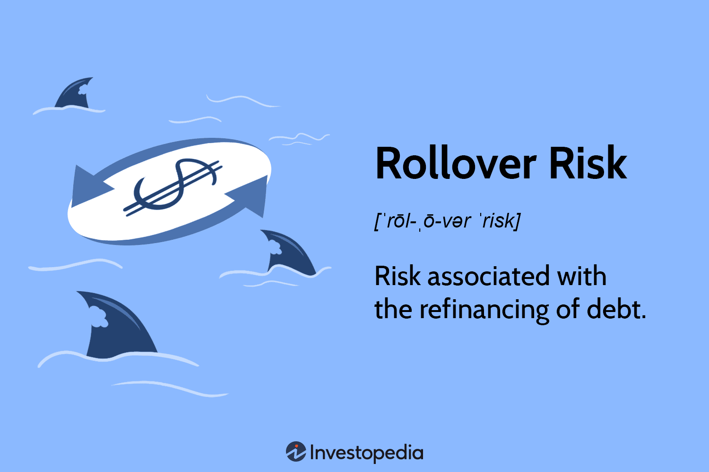

## Table of Contents

## What is a rollover in finance?

A rollover in finance is when you move money from one investment or account to another. This is often done to keep the money growing without paying taxes on it right away. For example, if you have a retirement account and you want to switch to a different type of retirement account, you might do a rollover.

Rollovers can happen with different types of accounts, like 401(k)s or IRAs. It's important to follow the rules when doing a rollover, because if you don't, you might have to pay taxes or penalties. Usually, you have 60 days to complete a rollover, but it's best to check with a financial advisor to make sure you're doing it correctly.

## How does a rollover work in a savings account?

In a savings account, a rollover usually means moving money from one savings account to another. This can happen when you want to switch banks or move your money into a different type of savings account that might offer better interest rates or other benefits. When you do a rollover, you take the money out of your old savings account and put it into a new one. It's important to make sure the transfer is done correctly so you don't lose any money or face any fees.

For example, if you have a savings account at Bank A and you find that Bank B offers a higher [interest rate](/wiki/interest-rate-trading-strategies), you might decide to do a rollover. You would withdraw the money from your account at Bank A and deposit it into a new savings account at Bank B. It's a good idea to check with both banks about any fees or rules for transferring money, and to make sure the transfer happens quickly so your money doesn't sit idle.

## What are the benefits of rolling over a 401(k) to an IRA?

Rolling over a 401(k) to an IRA can give you more control over your money. With an IRA, you can choose from a wider range of investments like stocks, bonds, and mutual funds. This means you can pick investments that match your goals and how much risk you're willing to take. Also, you might find that the fees for an IRA are lower than those for a 401(k), which can help your savings grow faster over time.

Another benefit is that an IRA can offer more flexibility when it comes to withdrawing money. For example, if you need money before you retire, an IRA might have fewer penalties or rules than a 401(k). Plus, if you leave your job, keeping your retirement savings in a 401(k) might mean you can't add more money to it. But with an IRA, you can keep contributing no matter where you work. This can be really helpful for planning your future.

## Can you explain the process of rolling over a retirement account?

Rolling over a retirement account means moving your money from one type of retirement account to another. For example, you might want to move money from a 401(k) at your old job to an IRA. The first step is to decide where you want to move your money. You can choose a new IRA or a 401(k) at your new job. Once you've picked the new account, you'll need to contact the company that manages your old account and tell them you want to do a rollover. They'll give you the paperwork you need to fill out.

After you've filled out the paperwork, you have two ways to do the rollover. The first way is a direct rollover, where the money goes straight from your old account to your new account without you touching it. This is the easiest way and you don't have to worry about taxes or penalties. The second way is an indirect rollover, where the money is sent to you first. You then have 60 days to put the money into your new account. If you don't do this in time, you might have to pay taxes and penalties. It's a good idea to talk to a financial advisor to make sure you do everything right and don't lose any money.

## What are the tax implications of a rollover?

When you do a rollover, the tax rules depend on how you do it. If you do a direct rollover, where the money goes straight from your old account to your new one, you don't have to worry about taxes right away. The money stays in a retirement account, so you don't have to pay taxes on it until you take it out later. This is the easiest way to do a rollover because it keeps your money safe from taxes and penalties.

If you do an indirect rollover, where the money comes to you first, you have to be careful. You have 60 days to put the money into your new account. If you don't do this in time, the money you took out will be treated as income, and you'll have to pay taxes on it. Plus, if you're under 59½ years old, you might also have to pay a 10% penalty for taking the money out early. So, it's really important to follow the rules and put the money into your new account within 60 days to avoid any tax problems.

## What is the difference between a direct and indirect rollover?

A direct rollover is when you move money from one retirement account to another without touching it. The money goes straight from your old account to your new one. This is the easiest way because you don't have to worry about taxes or penalties right away. The money stays in a retirement account, so you don't have to pay taxes on it until you take it out later.

An indirect rollover is different. With an indirect rollover, the money comes to you first before you put it into your new account. You have 60 days to move the money into your new account. If you don't do this in time, the money you took out will be treated as income, and you'll have to pay taxes on it. Plus, if you're under 59½ years old, you might also have to pay a 10% penalty for taking the money out early. So, it's really important to follow the rules and put the money into your new account within 60 days to avoid any tax problems.

## How often can you perform a rollover?

You can do a rollover from one IRA to another IRA only once every 12 months. This rule is set by the IRS to stop people from moving money around too much and trying to avoid taxes. If you do more than one rollover in a year, you might have to pay taxes and penalties on the money you moved.

For 401(k) rollovers, the rules are a bit different. You can do as many direct rollovers as you want from a 401(k) to an IRA or another 401(k) without worrying about the once-per-year rule. But if you do an indirect rollover from a 401(k), you still have to follow the 60-day rule to avoid taxes and penalties.

## What are the potential fees associated with a rollover?

When you do a rollover, you might have to pay some fees. These fees can come from both your old account and your new account. For example, your old account might charge you for closing it or for moving the money out. Your new account might also have fees for setting up the account or for the investments you choose. It's a good idea to check with both your old and new account providers to find out about any fees before you do the rollover.

Some common fees you might see are transfer fees, which are charged when you move money from one account to another, and account maintenance fees, which are charged just for having the account. There might also be fees for the investments you choose in your new account, like management fees or trading fees. Knowing about these fees can help you decide if a rollover is worth it for you.

## What should you consider before deciding to roll over your retirement funds?

Before you decide to roll over your retirement funds, think about why you want to do it. Are you looking for more investment choices, lower fees, or more control over your money? If you're moving from a 401(k) to an IRA, an IRA might give you more options for where to put your money. But if you like the investments in your 401(k) and the fees are low, you might want to keep your money where it is. Also, think about any fees you might have to pay for the rollover. Some accounts charge for moving money out or setting up a new account, so make sure you know what those costs are.

Another thing to consider is how the rollover might affect your taxes. If you do a direct rollover, you won't have to worry about taxes right away. But if you do an indirect rollover, you need to put the money into your new account within 60 days, or you might have to pay taxes and penalties. Also, remember that you can only do one IRA-to-IRA rollover per year. If you're rolling over a 401(k), you can do as many direct rollovers as you want, but indirect rollovers still have to follow the 60-day rule. Talking to a financial advisor can help you understand all these rules and make the best choice for your retirement savings.

## How does a rollover affect the investment options available to you?

When you roll over your retirement funds, like from a 401(k) to an IRA, you might get more choices for where to put your money. A 401(k) usually has a list of investments picked by your employer, and you can only choose from those. But with an IRA, you can pick from a lot more options, like different stocks, bonds, and mutual funds. This can be good if you want to build a plan that fits your goals and how much risk you're okay with.

On the other hand, if you like the investments in your 401(k) and they're doing well, you might not want to roll over your money. Some 401(k) plans have low fees and good investment choices. If you move your money to an IRA, you might end up paying more in fees or [picking](/wiki/asset-class-picking) investments that don't do as well. So, think about what you have now and what you might get with a rollover before you decide.

## What are the risks of not completing a rollover within the required timeframe?

If you don't finish a rollover within the 60 days you're supposed to, you could end up owing taxes on the money you took out. The IRS will see the money as income, and you'll have to pay taxes on it for that year. This can be a big problem because it might mean you owe a lot of money in taxes that you weren't planning for.

Also, if you're younger than 59½ years old, you might have to pay an extra 10% penalty on top of the taxes. This penalty is for taking money out of your retirement account early. So, not only do you have to pay taxes, but you also have to pay more money as a penalty. It's really important to follow the rules and get the money into your new account within 60 days to avoid these problems.

## How can a financial advisor help with the rollover process?

A financial advisor can help a lot when you're thinking about doing a rollover. They can explain the rules and help you understand what you need to do. For example, they can tell you about the difference between a direct and indirect rollover, and which one might be better for you. They can also help you figure out if moving your money to a new account is a good idea by looking at the fees and the investment options.

Another way a financial advisor can help is by making sure you do everything right so you don't have to pay taxes or penalties. They can help you fill out the paperwork and make sure you get the money into your new account on time. Plus, they can help you pick the best investments for your new account based on what you want for your future. Talking to a financial advisor can make the whole process easier and help you make smart choices about your retirement savings.

## References & Further Reading

[1]: Bergstra, J., Bardenet, R., Bengio, Y., & Kégl, B. (2011). ["Algorithms for Hyper-Parameter Optimization."](https://papers.nips.cc/paper/4443-algorithms-for-hyper-parameter-optimization) Advances in Neural Information Processing Systems 24.

[2]: ["Advances in Financial Machine Learning"](https://www.amazon.com/Advances-Financial-Machine-Learning-Marcos/dp/1119482089) by Marcos Lopez de Prado

[3]: ["Evidence-Based Technical Analysis: Applying the Scientific Method and Statistical Inference to Trading Signals"](https://www.amazon.com/Evidence-Based-Technical-Analysis-Scientific-Statistical/dp/0470008741) by David Aronson

[4]: ["Machine Learning for Algorithmic Trading"](https://github.com/PacktPublishing/Machine-Learning-for-Algorithmic-Trading-Second-Edition) by Stefan Jansen

[5]: ["Quantitative Trading: How to Build Your Own Algorithmic Trading Business"](https://books.google.com/books/about/Quantitative_Trading.html?id=j70yEAAAQBAJ) by Ernest P. Chan