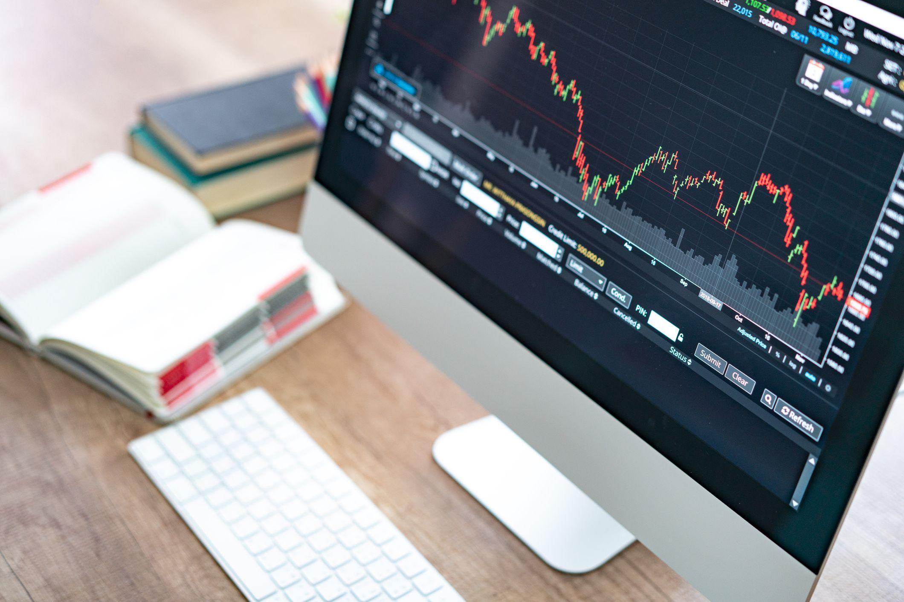

The financial landscape has transformed remarkably with the introduction of technology, leading to the emergence of advanced trading techniques such as algorithmic trading. Commonly referred to as 'algo-trading', this method utilizes computer programs to execute trades according to predetermined criteria, thereby enhancing trading efficiency and accuracy. This article will focus on the convergence of investment finance, rollover strategies, and algorithmic trading. By examining how these components interact, we aim to highlight the opportunities they present for traders and investors alike.

Algorithmic trading has moved beyond mere automated buying and selling to encompass sophisticated strategies that adapt to market conditions in real-time. This shift is indicative of broader trends in investment finance where traditional practices are increasingly being augmented by technological innovations. Rollover strategies, on the other hand, provide mechanisms to extend positions beyond their expiration dates, crucial for certain financial instruments like futures and options.



The integration of rollover strategies in algorithmic trading reflects a growing trend toward automating complex trading decisions. By doing so, traders can potentially optimize portfolio returns while mitigating the risks associated with manual oversight. Furthermore, the interplay between algorithmic trading and rollover strategies underscores the importance of understanding both the technological and financial elements involved in modern trading practices.

Through this exploration, we aspire to deliver insights that are beneficial for both novice traders and seasoned market participants. Whether one is beginning their journey in algorithmic trading or seeking to enhance existing strategies, understanding the role of technology in financial markets is essential for achieving success.

## Table of Contents

## Understanding Algorithmic Trading

Algorithmic trading, commonly referred to as "algo-trading," involves the use of computer algorithms to scrutinize market conditions and execute trades. These algorithms are structured to capitalize on market opportunities more efficiently than traditional trading methods. By analyzing numerous market variables, such as timing, price, and quantity, algorithms can make swift decisions based on sophisticated mathematical models.

The primary advantage of algorithmic trading lies in its ability to operate free from human emotional biases. Human emotions, such as fear and greed, can often lead to irrational trading decisions. Algorithms, in contrast, execute trades based strictly on predefined criteria, which helps in maintaining consistency and discipline in trading strategies.

In practice, an algorithm functions by following a specific set of instructions or rules, which can include mathematical models. These models often employ statistical methods or [machine learning](/wiki/machine-learning) techniques for decision-making. For example, algorithms may use moving averages to determine buy or sell signals. A simple moving average (SMA) crossover strategy could be programmed as follows in Python:

```python
def simple_moving_average(prices, window):
    return sum(prices[-window:]) / window

def sma_crossover(prices, short_window, long_window):
    short_sma = simple_moving_average(prices, short_window)
    long_sma = simple_moving_average(prices, long_window)

    if short_sma > long_sma:
        return "Buy"
    elif short_sma < long_sma:
        return "Sell"
    else:
        return "Hold"

# Example usage
prices = [100, 102, 104, 101, 105, 107]
signal = sma_crossover(prices, 3, 5)
print(signal)
```

This script computes the simple moving average of a given set of prices over specified short and long windows, issuing a "Buy", "Sell", or "Hold" signal based on the crossover strategy.

Algorithmic trading is extensively applied across various financial markets, including stocks, foreign exchange ([forex](/wiki/forex-system)), and commodities. Its utilization allows for the rapid execution of orders and the handling of hundreds of markets simultaneously—an ability that is impractical for human traders. This high-frequency trading capability can significantly enhance the efficiency and profitability of trading strategies.

In conclusion, [algorithmic trading](/wiki/algorithmic-trading) offers a technologically advanced approach to modern trading, where speed and precision are paramount. As such, it represents an indispensable tool for traders looking to operate in today's fast-paced financial markets.

## The Concept of Rollover in Finance

In finance, a rollover refers to the process of extending the settlement date of an open position. This is commonly seen in forex trading, where positions can be rolled over to avoid settling a transaction within the traditional timeframes. Instead, the two parties agree to extend the terms of the transaction to a future date. Forex rollovers specifically involve costs or earnings resulting from [interest rate](/wiki/interest-rate-trading-strategies) differentials of the currencies involved in the position held overnight. 

When a trader holds a currency position overnight, they either pay or earn interest based on the interest rate differential between the two currencies in the pair. For instance, if a trader is long on a currency with a higher interest rate against another with a lower interest rate, they may earn interest. Conversely, if the scenario is reversed, the trader may end up paying interest. This interest is commonly referred to as the "swap rate" and can be a significant [factor](/wiki/factor-investing) in determining the cost or profitability of holding a position over time.

Similarly, in futures markets, rollovers are crucial for managing the delivery of underlying assets. Futures contracts have predefined expiration dates. If a trader intends to maintain a position beyond the expiry of a particular contract, they must roll over their position to a contract with a later expiration date. This process involves selling the current contract and purchasing a new one with a later expiration, helping traders avoid the costs or obligations associated with the physical delivery of the underlying asset.

Rollover strategies play a substantial role in shaping the profitability of long-term investment approaches and trading strategies. For instance, in trading, the cost of rollovers can erode profit margins over time, necessitating traders to carefully consider the impact of rollover rates on their returns. This consideration is particularly critical for traders engaging in [carry](/wiki/carry-trading) trades, where they borrow in low-interest currencies and invest in higher-yielding currencies, as the differential between interest rates directly affects their potential gains or losses.

To effectively manage and optimize the implications of rollovers on investment returns, traders must be attuned to rollover fees and how they integrate with their trading strategies. By doing so, they can mitigate potential expenses and capitalize on opportunities presented by differing interest rates or contract expirations across different trading instruments.

## Integration of Rollover in Algorithmic Trading

Algorithmic systems can be configured to automatically implement rollover strategies, which are crucial in maintaining trading positions beyond their initial expiration dates. This automated approach is particularly beneficial for managing rollover costs, thereby enhancing the overall efficiency of trading operations. In the context of foreign exchange (forex) trading, the algorithmic handling of rollover can further optimize the financial returns by calculating the potential rollover interest influenced by the interest rate differentials of currency pairs.

Efficient algorithm development for automated rollover necessitates a comprehensive understanding of current market conditions and the associated trading costs. Market conditions can significantly affect interest rate differentials, and thus, algorithms must be dynamic enough to adapt to these changes. Furthermore, trading costs such as transaction fees and spread variations must be factored into the algorithms to ensure accurate financial forecasting and optimization.

Backtesting tools are indispensable in validating the effectiveness of rollover strategies within algorithmic trading systems. These tools allow traders to simulate various market scenarios using historical data, providing insights into potential performance outcomes. By adjusting the parameters within these simulations, traders can identify the most effective strategies for automated rollover, ensuring that the system executes trades with precision and minimal risk.

For instance, a basic Python code snippet for implementing a rollover strategy might involve calculations based on interest differentials:

```python
def calculate_rollover_interest(pair, position_size, interest_rate_long, interest_rate_short):
    interest_spread = interest_rate_long - interest_rate_short
    rollover_interest = position_size * interest_spread / 360  # Assuming a daily interest calculation
    return rollover_interest

# Example usage
currency_pair = 'EUR/USD'
position_size = 100000  # Example position size
interest_rate_EUR = 0.5  # Hypothetical interest rate for Euro
interest_rate_USD = 1.0  # Hypothetical interest rate for USD

rollover_profit_or_loss = calculate_rollover_interest(currency_pair, position_size, interest_rate_EUR, interest_rate_USD)
print(f'Rollover Interest: {rollover_profit_or_loss}')
```

This code demonstrates the basic rollover interest calculation based on a position in a currency pair, highlighting the foundations upon which more complex algorithmic rollover strategies can be built. By integrating such calculations into broader trading algorithms, traders can enhance their strategy's reliability and responsiveness to market changes.

## Advantages and Risks of Algo Trading with Rollover

Algorithmic trading, integrated with rollover strategies, offers numerous advantages, primarily through its speed and accuracy in executing trades. By utilizing pre-programmed criteria, algo-trading can efficiently manage rollover scenarios, thereby reducing the possibility of human error that often accompanies manual trading interventions. For example, in forex trading, algorithms can calculate and optimize rollover interest fees based on the interest rate differentials between currency pairs, which can lead to more profitable long-term trading outcomes. The ability of these systems to quickly respond to market changes allows traders to maintain their positions efficiently and handle complex rollover strategies with precision.

However, these advantages come alongside significant risks. The reliance on technology means that system failures or bugs can occur, potentially exacerbating issues during periods of market [volatility](/wiki/volatility-trading-strategies). Such events can lead to substantial financial losses if not properly managed. An example of this risk is the potential for algorithms to malfunction during sudden market shifts, causing unexpected trades or failing to execute intended transactions. This highlights the necessity of robust risk management strategies to monitor and mitigate these technological vulnerabilities.

To effectively manage these risks, traders need to ensure their algorithmic platforms are equipped with reliable support systems and tools for handling rollover processes seamlessly. This includes selecting platforms with strong technical support and the capability to perform continuous updates and provide real-time monitoring and alerts. Moreover, regular audits and [backtesting](/wiki/backtesting) of algorithms should be conducted to verify their performance under various market conditions. By balancing the advantages of speed and precision with sound risk management practices, traders can leverage algorithmic trading with rollover strategies to enhance their investment returns while minimizing their exposure to potential pitfalls.

## Getting Started with Investment Finance and Algo Trading

Understanding key financial concepts and market dynamics is crucial before venturing into algorithmic trading. This foundational knowledge enables aspiring traders to grasp how financial markets operate and how algorithmic strategies can be used effectively. Fundamental concepts such as supply and demand dynamics, price action, and financial instruments are essential starting points.

For beginners, gaining a foundational knowledge in both coding and financial markets is essential. Algorithmic trading largely relies on programming skills to develop, test, and deploy trading strategies. Python is a favored language due to its simplicity and the availability of extensive libraries tailored for data analysis and algorithmic trading, such as NumPy, pandas, and the TA-Lib for technical analysis. A basic understanding of Python programming enables traders to manipulate data, create trading simulations, and backtest strategies. Here's a simple Python example of how one might use pandas to calculate a moving average, a common technical indicator:

```python
import pandas as pd

# Sample data for illustration
data = {'Date': ['2023-01-01', '2023-01-02', '2023-01-03', '2023-01-04'],
        'Price': [100, 102, 101, 105]}
df = pd.DataFrame(data)

# Calculate moving average
df['Moving Average'] = df['Price'].rolling(window=2).mean()
print(df)
```

Many platforms offer demo accounts to practice algorithmic trading without financial risk. These accounts simulate real market conditions, allowing traders to execute trades faux currency. Practicing with demo accounts helps newcomers familiarize themselves with trading platforms, order types, and the general mechanics of trade execution without the pressure of real financial loss. This hands-on experience is invaluable in building confidence and honing one's skills in a risk-free environment.

Leveraging educational resources and staying updated on market trends enhances trading effectiveness. Online courses, webinars, and financial news outlets serve as rich information sources for learning and staying current. Resources like Coursera, edX, and Udemy offer courses on both programming and finance. Additionally, staying abreast of market trends through platforms like Bloomberg or Reuters helps traders make informed decisions based on current market conditions and economic indicators.

Active participation in trading communities can provide support and insights from experienced traders. Engaging with communities on platforms such as TradingView, Reddit's r/algotrading, or specialized forums allows for the exchange of ideas, strategies, and troubleshooting. These interactions can significantly shorten the learning curve, offering beginner traders opportunities to learn from seasoned professionals and peers alike. Websites like QuantConnect and Algorithmic Traders Association also provide resources and forums dedicated to algorithmic trading, enabling traders to interact and refine their strategies collaboratively.

Implementing algorithmic trading strategies requires a continuous learning mindset, adaptability to ever-changing market conditions, and a commitment to improving one's technical and analytical capabilities. Combining this approach with robust risk management ensures a strong foundation as one embarks on trading in the financial markets.

## Conclusion

The fusion of rollover strategies in algorithmic trading presents both sophisticated opportunities and challenges for traders. This integration has enabled market participants to leverage advanced technologies to enhance their trading strategies, potentially resulting in improved market efficiency and maximized profitability. However, to harness these opportunities, continuous learning and adaptation are crucial. The financial markets are dynamic, characterized by rapid technological advancements and evolving trading environments which demand that traders remain agile and informed.

Embracing technology within financial strategies offers significant competitive advantages. Algorithmic trading combined with effective rollover strategies helps in executing trades with precision, speed, and minimal human intervention. By innovatively applying technology, traders can efficiently manage positions and optimize returns, all while mitigating potential risks associated with manual trading processes. 

Furthermore, the importance of responsible trading and risk management cannot be overstated in advancing trading success. While algorithmic systems provide robust tools for executing complex strategies, they also introduce new risk dimensions, such as technical failures and market volatility susceptibility. Hence, implementing appropriate risk management strategies and rigorous monitoring mechanisms are indispensable for sustainable success.

As financial technologies continue to evolve, they will undoubtedly shape the future of investment finance. The ongoing development of algorithms, coupled with increased computational capabilities, signals a transformative period in trading and investment landscapes. This evolution challenges traditional paradigms and drives innovation as traders and investors strive to adapt to and capitalize on emerging opportunities. The trajectory of such advancements portends a future where technology-centered approaches will dominate, paving the way for a more efficient and sophisticated financial ecosystem.

## References & Further Reading

[1]: Bergstra, J., Bardenet, R., Bengio, Y., & Kégl, B. (2011). ["Algorithms for Hyper-Parameter Optimization."](https://papers.nips.cc/paper/4443-algorithms-for-hyper-parameter-optimization) Advances in Neural Information Processing Systems 24.

[2]: ["Advances in Financial Machine Learning"](https://www.amazon.com/Advances-Financial-Machine-Learning-Marcos/dp/1119482089) by Marcos Lopez de Prado

[3]: ["Evidence-Based Technical Analysis: Applying the Scientific Method and Statistical Inference to Trading Signals"](https://www.amazon.com/Evidence-Based-Technical-Analysis-Scientific-Statistical/dp/0470008741) by David Aronson

[4]: ["Machine Learning for Algorithmic Trading"](https://github.com/PacktPublishing/Machine-Learning-for-Algorithmic-Trading-Second-Edition) by Stefan Jansen

[5]: ["Quantitative Trading: How to Build Your Own Algorithmic Trading Business"](https://books.google.com/books/about/Quantitative_Trading.html?id=j70yEAAAQBAJ) by Ernest P. Chan