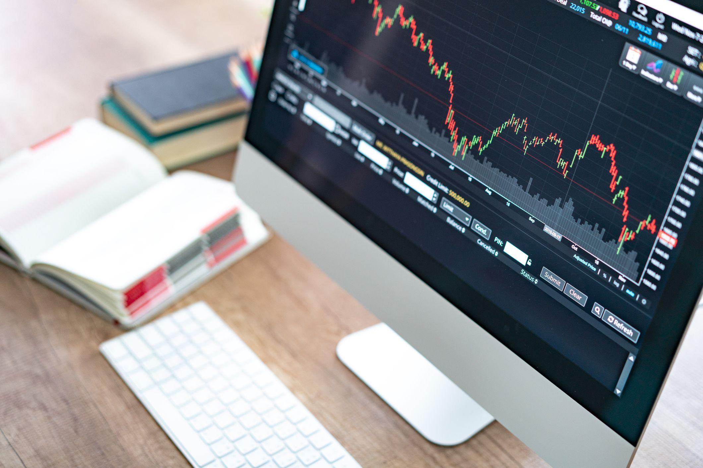

The global foreign exchange (forex) market serves as the backbone of international trade and investment, with trillions of dollars exchanged daily. It operates as a decentralized network where currencies are traded in global financial hubs, enabling businesses and individuals to convert one currency into another. This market is vital as it facilitates international trade and investment, supports global economic stability, and provides opportunities for speculation and profit.

Currency trading, often termed as forex trading, involves buying and selling currency pairs with the aim of profiting from fluctuations in exchange rates. The major currency pairs, like EUR/USD, USD/JPY, and GBP/USD, play a significant role due to their high liquidity and tight spreads. Traders need to comprehend various terms to navigate the market effectively. Forex rollover refers to the interest paid or received for holding currency positions overnight, contingent on the interest rate differential between the currencies involved. Additionally, algorithmic (algo) trading employs computer programs to execute trades based on predefined strategies, enhancing speed, precision, and efficiency in trading operations.



In recent years, forex trading has gained immense popularity among both individual and institutional investors. The accessibility of online trading platforms and improved technology have significantly lowered entry barriers, allowing more participants to engage in currency trading. Meanwhile, institutional investors leverage advanced algorithmic systems to optimize trading performance and manage risks effectively.

The aim of this article is to furnish readers with a comprehensive understanding of currency trading, elucidate the nuances of the forex rollover, and highlight the transformative impact of algorithmic trading on the forex market. It will begin by exploring the fundamentals of currency trading, progress to dissecting the concept of forex rollover, and move towards the integration and implications of algorithmic systems in trading activities. The article will also delve into practical strategies and future trends, equipping traders with essential insights to navigate the dynamic forex landscape efficiently.

## Table of Contents

## Understanding Currency Trading in the Forex Market

Currency trading, also known as foreign exchange trading or forex trading, involves the buying and selling of currencies on the global foreign exchange market. This market is the largest and most liquid financial market in the world, with an average daily trading volume exceeding $6 trillion as of recent estimates. Unlike other financial markets, the forex market operates 24 hours a day, five days a week, across various financial centers globally, allowing continuous trading as the sun moves across different time zones.

The forex market functions through a network of banks, dealers, and financial institutions, enabling direct currency trading without a centralized exchange. This decentralized nature allows forex traders to participate in trading through platforms often provided by brokers, which aggregate market data and provide a medium for executing trades.

A crucial element of [forex](/wiki/forex-system) trading is the role of major currency pairs, which are paired currencies that traders exchange. The most commonly traded pairs include the EUR/USD (Euro/US dollar), USD/JPY (US dollar/Japanese yen), GBP/USD (British pound/US dollar), and USD/CHF (US dollar/Swiss franc). These pairs are considered highly liquid, allowing traders to enter and [exit](/wiki/exit-strategy) positions with ease.

Several factors influence currency values and exchange rates, creating fluctuations that traders seek to profit from. Key factors include:

1. **Interest Rates:** Central banks influence exchange rates by altering national interest rates. Higher rates provide lenders with a higher return relative to other countries, often causing an increase in the currency’s value.

2. **Economic Indicators:** Indicators such as GDP growth, employment rates, and trade balances can impact currency strength. Positive economic performance can boost investor confidence, leading to currency appreciation.

3. **Political Stability:** Countries with stable political environments tend to attract greater foreign investment, increasing currency demand and value.

4. **Market Sentiment:** Speculative activities and trader perceptions can drive demand, affecting exchange rates independently of tangible economic indicators.

For both new and seasoned traders, understanding currency trading is crucial for navigating the forex market effectively. New traders must grasp fundamental concepts and market dynamics to mitigate risks and enhance profitability. Similarly, experienced traders continually refine their strategies to adapt to ever-changing market conditions. Comprehensive knowledge of currency trading not only aids in making informed decisions but also in capitalizing on opportunities presented by this dynamic and expansive market.

## The Concept of Forex Rollover

Forex rollover is a fundamental concept in the currency trading landscape, referring to the process by which the settlement of a forex trade is extended at the end of the trading day without actual delivery. This extension is essential as forex trading does not occur in a centralized exchange and is typically leveraged, necessitating a continuous rolling over of positions to avoid settlement. The rollover process involves incurring either a debit or credit in the form of interest, depending on the [interest rate](/wiki/interest-rate-trading-strategies) differentials between the two currencies involved in a pair.

Rollover interest, also known as the swap rate, is calculated based on the difference between the interest rates of the two currencies in a pair. For instance, in a standard forex transaction, traders borrow one currency to buy another. The rollover interest is determined by subtracting the interest rate of the currency being bought from the interest rate of the currency being sold. The formula is commonly represented as:

$$
\text{Rollover Interest} = (i_\text{borrowed} - i_\text{owned}) \times \text{Position Size}
$$

Here, $i_\text{borrowed}$ is the annual interest rate of the currency borrowed, whereas $i_\text{owned}$ is the annual interest rate of the currency owned. If the interest rate of the currency you hold is higher than that of the currency borrowed, you earn rollover interest; otherwise, it results in a cost.

Interest rate differentials play a crucial role in rollover calculations. For example, if a trader holds a position in a currency pair with a high-interest rate currency against a low interest rate currency, they can potentially earn a positive rollover. Conversely, a negative interest rate differential means the trader will incur a cost, underscoring the importance of considering rollover implications when holding positions overnight.

Understanding forex rollover is vital for effectively managing and closing open positions. It allows traders to evaluate the cost implications of maintaining positions beyond the trading day. Additionally, considerations related to rollover can significantly influence strategic decisions, such as choosing pairs with favorable interest rate differentials or closing positions before rollover times to avoid costs.

To minimize rollover costs and potentially maximize profits, traders can adopt several strategies. These include focusing on currency pairs with positive interest rate differentials or utilizing swap-free accounts offered by many forex brokers, which eliminate rollover fees altogether. Additionally, some experienced traders meticulously time their trades to close positions before the rollover period, thereby avoiding associated costs.

Recognizing the dynamics of forex rollover enables traders to incorporate interest rate considerations into their overall trading strategy, balancing potential costs with profit opportunities in a continuously fluctuating forex market.

 to Algo Trading in Forex

Algorithmic trading, often referred to as algo trading, involves the use of computer programs to execute trades in financial markets according to predefined criteria. In the forex market, this approach is particularly significant due to the market's vast size, high [liquidity](/wiki/liquidity-risk-premium), and 24-hour operation. Algorithmic trading allows traders to achieve efficiency, speed, and precision that would be impossible manually.

One of the key advantages of algo trading systems is their ability to perform rapid and accurate trading operations. These systems can process market data, generate orders, and execute trades within milliseconds. This speed enables traders to exploit even the smallest price discrepancies within currency pairs, turning potential pennies into substantial profits over numerous transactions.

The advancement of technology plays a crucial role in enhancing algo trading capabilities. Developments in programming languages, statistical models, and high-speed internet connections have facilitated the design and deployment of complex trading algorithms. As a result, traders can now utilize sophisticated algorithms capable of large-scale data analysis and decision-making in real time.

Various types of algorithms are employed in forex trading, each with its unique approach to market analysis and trade execution. Trend following algorithms are designed to identify and capitalize on sustained movements in currency prices, adjusting positions in the direction of the emerging trend. Arbitrage algorithms, on the other hand, seek to exploit price differentials between related currency pairs or markets, ensuring risk-free profits by simultaneously buying and selling equivalent quantities. Execution algorithms focus on the optimal execution of large orders by breaking them into smaller pieces to minimize market impact and cost.

Despite the many benefits, [algorithmic trading](/wiki/algorithmic-trading) also presents challenges and risks. One potential risk is the reliance on historical data, which may not always predict future market conditions accurately. Moreover, the complexity of algo systems can lead to unforeseen outcomes, particularly during periods of high market [volatility](/wiki/volatility-trading-strategies). There is also the risk of overfitting, where a model is optimized to perform exceptionally well on past data but fails in live trading. Furthermore, technical failures, such as hardware malfunctions or software bugs, can lead to significant financial losses.

In conclusion, algorithmic trading in the forex market offers remarkable advantages in terms of efficiency, speed, and complex data processing. However, it requires a deep understanding of both market dynamics and technological infrastructure. As traders continue to adopt algorithmic methods, awareness of the associated risks and the implementation of robust risk management strategies become increasingly important.

## Integrating Forex Rollover and Algorithmic Trading

Algorithmic trading has revolutionized the forex market by introducing automation and precision in trade executions. When it comes to managing rollover interest, algorithmic systems can optimize profits and mitigate costs through strategic calculations and timely actions. Rollover interest, arising from holding positions overnight, varies with the interest rates of the currency pairs involved, making it crucial for traders to incorporate efficient management strategies.

### Managing Rollover Interest with Algorithmic Systems

Algorithmic systems enable traders to manage rollover interest efficiently by leveraging data analysis and automated decision-making processes. These systems can accurately calculate potential rollover costs and benefits, incorporating them into the overall trading strategy. For example, algorithms can assess the interest rate differentials between currency pairs and predict the optimal rollover configurations to minimize costs and enhance profits.

Consider the following Python snippet as a simple illustration of how an algorithmic system might estimate potential rollover costs:

```python
def calculate_rollover_cost(pip_value, interest_rate_diff, trade_volume, days_held):
    return pip_value * interest_rate_diff * trade_volume * days_held

pip_value = 10  # example value per pip
interest_rate_diff = 0.02  # example interest rate differential
trade_volume = 100000  # volume of the trade
days_held = 5  # number of days the position is held

rollover_cost = calculate_rollover_cost(pip_value, interest_rate_diff, trade_volume, days_held)
print(f"Estimated Rollover Cost: ${rollover_cost}")
```

### Case Studies: Successful Integration

Numerous case studies demonstrate the effective integration of rollover strategies within algorithmic trading. One example involves a [hedge fund](/wiki/hedge-fund-trading-strategies) employing algorithms to automatically adjust position sizes based on expected rollover outcomes and real-time interest rate updates. This integration allowed the fund to optimize its trade duration and enhance its net interest revenue, contributing to an overall improved performance.

### Impact on Trading Performance

Incorporating rollover considerations into algorithmic strategies can significantly impact trading performance. Efficient management of rollover interest allows traders to maintain positions longer when beneficial, leverage [carry](/wiki/carry-trading) trade opportunities, and reduce unnecessary costs. This holistic approach often leads to improved risk-adjusted returns and consistency in achieving trading objectives.

### Tools and Software

The development of sophisticated trading platforms and analytical tools has facilitated the integration of rollover strategies within algorithmic trading systems. Software like MetaTrader, NinjaTrader, and customized Python libraries provide features for analyzing interest rate differentials, optimizing rollover strategies, and executing trades automatically based on predefined criteria.

### Future Trends

The continual advancements in [artificial intelligence](/wiki/ai-artificial-intelligence) and [machine learning](/wiki/machine-learning) are poised to further enhance the integration of rollover and algorithmic trading. Predictive analytics could offer more accurate forecasts of interest rate changes, enabling traders to refine their strategies. Additionally, the development of blockchain technology may improve transparency and efficiency in the rollover process, ultimately offering traders more precise control over their positions.

In conclusion, the strategic integration of forex rollover management within algorithmic trading systems presents a promising avenue for traders seeking to optimize their performance. By leveraging technological tools and data-driven insights, traders can efficiently manage rollover risks and capitalize on interest rate opportunities.

## Conclusion

Currency trading, or forex (foreign exchange), involves buying and selling currency pairs to capitalize on changes in exchange rates. This dynamic market is crucial globally, providing liquidity and enabling international trade and investment. Understanding key concepts such as currency pairs, market operations across financial centers, and factors influencing exchange rates is essential for traders aiming to maximize profits and minimize risks.

The forex rollover, the interest paid or earned for holding a currency position overnight, is another vital element. It depends on the interest rate differential between the two currencies involved in a position. By understanding rollover calculations and strategies to manage associated costs, traders can enhance their trading efficiency.

Algorithmic trading, or algo trading, has revolutionized forex trading by leveraging computer programs to execute trades based on predefined criteria. This approach enhances trading precision and efficiency. However, it requires an understanding of different algorithm types, such as trend-following or [arbitrage](/wiki/arbitrage) strategies, and the technology that drives these systems.

Integrating forex rollover considerations into algorithmic trading strategies presents both opportunities and challenges. Automated systems can optimize rollover interest management, potentially leading to increased profitability. Furthermore, as technology evolves, the sophistication and effectiveness of these integrations are likely to improve, offering traders new avenues for advancement.

Traders are encouraged to deepen their understanding of these core forex elements—currency trading, forex rollover, and algo trading—by accessing educational resources, engaging with specialized communities, and staying updated on market trends. This continuous learning is vital to navigating the forex market's dynamic environment effectively.

Finally, technological advancements continue to shape forex trading, offering innovative tools and strategies to enhance decision-making and trading outcomes. Embracing these changes is crucial for traders aiming to leverage emerging opportunities and thrive in this competitive market landscape.

## Additional Resources

For those interested in expanding their knowledge and expertise in forex trading and algorithmic strategies, various resources are available that cater to both beginners and advanced traders.

### Beginner and Advanced Forex Trading Guides

1. **BabyPips.com**: An excellent starting point for beginners, BabyPips.com offers a comprehensive "School of Pipsology" guide that lays the foundation for understanding forex trading. It covers essential concepts, chart analysis, and trading strategies. [Visit BabyPips](https://www.babypips.com/learn/forex).

2. **Investopedia's Forex Trading Guide**: This guide provides insights into forex terminologies, trading strategies, and market analysis tools, suitable for both beginner and seasoned traders. [Visit Investopedia](https://www.investopedia.com/articles/forex/06/advancedforextrading.asp).

### Recommended Books and Online Courses

1. **"Trading in the Zone" by Mark Douglas**: This book dives deep into the psychology of successful trading, emphasizing the importance of mindset and discipline.

2. **"Forex Trading: The Basics Explained in Simple Terms" by Jim Brown**: A straightforward book that breaks down complex forex trading concepts into digestible parts, ideal for beginner traders.

3. **Coursera's "Algorithmic Trading & Quantitative Analysis"**: Offered by institutions like the University of Washington and the New York Institute of Finance, these online courses explore algorithmic trading strategies, programming for financial engineering, and risk management. [Visit Coursera](https://www.coursera.org/courses?query=algorithmic%20trading).

### Websites and Tools for Market Trends

1. **TradingView**: A platform offering advanced charting tools, real-time data, and a social community for sharing trading ideas. [Visit TradingView](https://www.tradingview.com/).

2. **Forex Factory**: Known for its economic calendar, Forex Factory provides insights into market trends, news releases, and trading sessions that affect currency movements. [Visit Forex Factory](https://www.forexfactory.com/).

3. **OANDA Forex Labs**: Offers various forex trading tools including currency correlation analysis, volatility estimation, and news impact monitoring. [Visit OANDA Forex Labs](https://www.oanda.com/forex-trading/analysis/forex-labs).

### Communities and Forums

1. **Forex Peace Army (FPA)**: This community provides reviews on forex brokers, educational resources, and active forums for traders to discuss strategies and exchange experiences. [Visit Forex Peace Army](https://www.forexpeacearmy.com/community/).

2. **Reddit's r/Forex**: A vibrant subreddit where traders of all experience levels can discuss strategies, share insights, and stay updated with current market trends. [Visit r/Forex](https://www.reddit.com/r/Forex/).

Engagement with these resources can significantly enhance traders' understanding of the forex market, enabling them to make more informed decisions and take advantage of opportunities in currency trading and algorithmic strategies.

## References & Further Reading

[1]: ["Forex Trading: The Basics Explained in Simple Terms"](https://www.amazon.com/FOREX-TRADING-Explained-Beginners-Strategies/dp/1535198567) by Jim Brown

[2]: ["Trading in the Zone: Master the Market with Confidence, Discipline, and a Winning Attitude"](https://www.amazon.com/Trading-Zone-Confidence-Discipline-Attitude/dp/0735201447) by Mark Douglas

[3]: Dennis, S., & Mayhew, S. (2002). ["Risk-Neutral Implied Probability Distribution Functions of Foreign Exchange Rates."](https://www.jstor.org/stable/3594989) Journal of Derivatives

[4]: ["Algorithmic Trading & DMA: An introduction to direct access trading strategies"](https://www.amazon.com/Algorithmic-Trading-DMA-introduction-strategies/dp/0956399207) by Barry Johnson

[5]: Harris, L. (2003). ["Trading and Exchanges: Market Microstructure for Practitioners."](https://books.google.com/books/about/Trading_and_Exchanges.html?id=Rd9hDRR1Yx4C) Oxford University Press