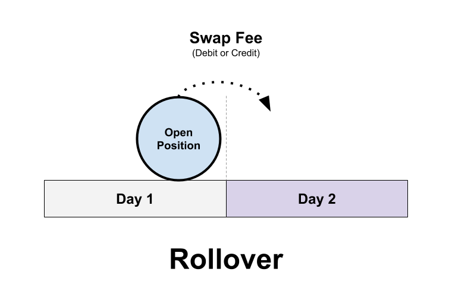

## Table of Contents

## What is a rollover in the forex market?

A rollover in the forex market is when you keep a trade open overnight. When you trade currencies, you usually do it for the same day. But if you want to keep your trade going into the next day, you need to do a rollover. This means your trade will be adjusted to account for the interest rate difference between the two currencies you are trading.

When you roll over a trade, you either earn or pay interest, depending on which currency you are holding. If you are holding a currency with a higher interest rate than the one you are selling, you earn interest. If it's the other way around, you pay interest. This interest is usually very small, but it can add up if you keep the trade open for a long time. So, a rollover helps keep your trade going and accounts for the interest rates of the currencies involved.

## How does rollover affect forex trading?

Rollover affects forex trading by adding or subtracting interest from your trading account when you keep a trade open overnight. This happens because forex trading involves borrowing one currency to buy another. If the currency you are holding has a higher interest rate than the one you borrowed, you earn interest. But if the currency you borrowed has a higher interest rate, you have to pay interest. This small amount of interest can make a difference in your trading results, especially if you keep trades open for a long time.

Traders need to think about rollover when planning their trades. If you expect to earn interest from a rollover, it might make sense to keep a trade open longer. On the other hand, if you will have to pay interest, you might want to close the trade before the end of the trading day. Rollover can also affect your trading strategy, as some traders use it to their advantage by focusing on currency pairs with big interest rate differences. So, understanding how rollover works can help you make better trading decisions.

## What are the typical rollover rates for major currency pairs?

Rollover rates for major currency pairs change every day and depend on the interest rates set by central banks of the countries involved. For example, if you are trading the EUR/USD pair, the rate will be based on the difference between the European Central Bank's rate for the euro and the Federal Reserve's rate for the dollar. These rates are usually very small, often just a few pips, but they can add up over time, especially if you keep a trade open for many days or weeks.

Some major currency pairs might have higher rollover rates if there is a big difference in interest rates between the two countries. For instance, if you are trading AUD/JPY, the rate could be higher because Australia usually has higher interest rates than Japan. On the other hand, pairs like EUR/GBP might have very small rollover rates because the interest rates in Europe and the UK are often quite similar. It's important to check the current rates from your broker, as they can change and affect your trading decisions.

## How can traders calculate rollover costs or gains?

Traders can calculate rollover costs or gains by understanding the interest rate difference between the two currencies they are trading. If you are holding a currency with a higher interest rate than the one you are selling, you will earn interest. For example, if you are long on AUD/USD, and the interest rate for the Australian dollar is higher than the US dollar, you will earn interest on the trade. On the other hand, if you are short on the same pair, you will have to pay interest because you are borrowing the Australian dollar, which has the higher interest rate.

To find out the exact amount of rollover costs or gains, traders need to check the swap rates provided by their broker. These rates are usually shown in pips and can be found on the broker's trading platform or website. For example, if the swap rate for AUD/USD is +0.5 pips for holding a long position overnight, and you are holding a standard lot (100,000 units), you will earn $5 (0.5 pips x $10 per pip). If the swap rate is -0.5 pips for a short position, you will have to pay $5. By knowing these rates, traders can better plan their trades and understand the impact of holding positions overnight.

## What is the difference between positive and negative rollover?

Positive rollover happens when you earn money for keeping your trade open overnight. This happens when you are holding a currency with a higher interest rate than the one you are selling. For example, if you are long on a currency pair where the interest rate of the currency you are buying is higher than the one you are selling, you get paid interest. This extra money can make your trade more profitable, especially if you keep the trade open for a long time.

Negative rollover is when you have to pay money to keep your trade open overnight. This happens when you are holding a currency with a lower interest rate than the one you are selling. For example, if you are short on a currency pair where the interest rate of the currency you are borrowing is higher than the one you are selling, you have to pay interest. This cost can make your trade less profitable, so it's important to think about it when planning how long to keep your trade open.

## How does the time of day impact rollover in forex trading?

The time of day impacts rollover in [forex](/wiki/forex-system) trading because it happens at the end of the trading day. Most brokers consider the end of the trading day to be 5 p.m. Eastern Time, which is when the New York market closes. If you keep your trade open past this time, you will either earn or pay interest based on the interest rate difference between the two currencies you are trading. So, if you want to avoid the rollover, you need to close your trade before 5 p.m. Eastern Time.

Knowing when the rollover happens can help you plan your trades better. If you think you will earn interest from the rollover, you might want to keep your trade open past 5 p.m. Eastern Time. But if you will have to pay interest, you might want to close your trade before that time. This way, you can make sure the rollover works in your favor and helps you make more money from your trades.

## What strategies can traders use to minimize negative rollover effects?

Traders can minimize negative rollover effects by closing their trades before the end of the trading day, which is usually 5 p.m. Eastern Time. If you close your trade before this time, you won't have to pay any interest for keeping it open overnight. This is a good strategy if you are trading a currency pair where the interest rate of the currency you are borrowing is higher than the one you are selling. By closing your trade before the rollover time, you can avoid the cost of negative rollover and keep more of your profits.

Another strategy is to choose currency pairs where the interest rate difference works in your favor. If you are long on a currency pair where the interest rate of the currency you are buying is higher than the one you are selling, you will earn interest instead of paying it. This can help offset any negative rollover effects from other trades. By carefully selecting your currency pairs and planning your trades around the rollover time, you can minimize the impact of negative rollover and make your trading more profitable.

## How do brokers handle rollovers and what are the common practices?

Brokers handle rollovers by adjusting the interest on your trade when you keep it open overnight. Most brokers consider the end of the trading day to be 5 p.m. Eastern Time. If you keep your trade open past this time, your broker will either add or subtract interest based on the interest rate difference between the two currencies you are trading. This interest is called the swap rate, and it's usually shown in pips. You can find these rates on your broker's trading platform or website.

A common practice among brokers is to show the swap rates clearly so traders can see what they will earn or pay for keeping a trade open overnight. Some brokers might also offer different swap rates for different types of accounts, like standard or premium accounts. It's important for traders to check these rates with their broker, as they can change and affect your trading decisions. By understanding how brokers handle rollovers, you can plan your trades better and make sure the rollover works in your favor.

## Can rollover be used as part of a trading strategy?

Yes, rollover can be used as part of a trading strategy. Some traders use a strategy called "[carry](/wiki/carry-trading) trading," where they hold onto a currency with a higher interest rate and sell a currency with a lower interest rate. This way, they can earn interest every day they keep the trade open. For example, if a trader buys the Australian dollar (which often has a higher interest rate) and sells the Japanese yen (which often has a lower interest rate), they can earn interest on the difference between the two rates. This can add up over time and make the trade more profitable.

However, using rollover in a trading strategy also has risks. Interest rates can change, and if the currency with the higher interest rate loses value, the trader could lose money even if they are [earning](/wiki/earning-announcement) interest. It's important for traders to watch the news and understand how economic changes might affect interest rates. By carefully planning their trades and keeping an eye on the market, traders can use rollover to their advantage and make their trading strategy more successful.

## What are the tax implications of rollover gains or losses?

When you make money or lose money from rollover in forex trading, you might have to pay taxes on it. If you earn interest from keeping your trade open overnight, that interest is usually considered taxable income. This means you have to report it on your tax return and pay taxes on it, just like you would with money you earn from a job. The tax rate you pay on this income can depend on where you live and how much money you make overall.

On the other hand, if you lose money because of negative rollover, you might be able to use those losses to lower your taxes. In many places, you can use trading losses to reduce the amount of taxes you owe on your other income. But you need to keep good records of your trades and follow the tax rules in your country. It's a good idea to talk to a tax professional to make sure you are doing everything right and taking advantage of any tax benefits you can get.

## How do central bank interest rate decisions influence rollover rates?

Central bank interest rate decisions have a big impact on rollover rates in forex trading. When a central bank changes its interest rate, it changes the difference between the interest rates of the two currencies in a currency pair. If a central bank raises its interest rate, the currency from that country becomes more attractive to traders because they can earn more interest by holding it. This means the rollover rate for trades involving that currency will go up. On the other hand, if a central bank lowers its interest rate, the currency becomes less attractive, and the rollover rate will go down.

Traders need to keep an eye on central bank announcements because these can change their trading strategy. For example, if the Federal Reserve raises interest rates for the US dollar, traders might want to hold onto USD-based currency pairs to earn more interest from the rollover. But if the European Central Bank lowers rates for the euro, traders might avoid holding onto EUR-based pairs to avoid paying more interest. By understanding how central bank decisions affect interest rates, traders can better plan their trades and make the most of rollover rates.

## What advanced tools or platforms provide detailed rollover data for forex traders?

Some advanced trading platforms and tools give forex traders detailed information about rollover rates. MetaTrader 4 and MetaTrader 5 are popular platforms that show the swap rates for each currency pair. These rates tell you how much interest you will earn or pay for keeping a trade open overnight. Other platforms like cTrader and TradingView also provide this information, making it easy for traders to see the exact costs or gains from rollovers before they decide to keep a trade open.

Besides these platforms, some brokers offer special tools or calculators to help traders understand rollover better. For example, brokers like OANDA and FXCM have rollover calculators on their websites. These calculators let you enter the currency pair and the size of your trade to see exactly how much interest you will earn or pay. By using these tools, traders can make smarter decisions about when to keep their trades open and how to use rollover to their advantage.

## What is the Concept of Forex Rollover?

Forex rollover is a fundamental concept in the currency trading landscape, referring to the process by which the settlement of a forex trade is extended at the end of the trading day without actual delivery. This extension is essential as forex trading does not occur in a centralized exchange and is typically leveraged, necessitating a continuous rolling over of positions to avoid settlement. The rollover process involves incurring either a debit or credit in the form of interest, depending on the [interest rate](/wiki/interest-rate-trading-strategies) differentials between the two currencies involved in a pair.

Rollover interest, also known as the swap rate, is calculated based on the difference between the interest rates of the two currencies in a pair. For instance, in a standard forex transaction, traders borrow one currency to buy another. The rollover interest is determined by subtracting the interest rate of the currency being bought from the interest rate of the currency being sold. The formula is commonly represented as:

$$
\text{Rollover Interest} = (i_\text{borrowed} - i_\text{owned}) \times \text{Position Size}
$$

Here, $i_\text{borrowed}$ is the annual interest rate of the currency borrowed, whereas $i_\text{owned}$ is the annual interest rate of the currency owned. If the interest rate of the currency you hold is higher than that of the currency borrowed, you earn rollover interest; otherwise, it results in a cost.

Interest rate differentials play a crucial role in rollover calculations. For example, if a trader holds a position in a currency pair with a high-interest rate currency against a low interest rate currency, they can potentially earn a positive rollover. Conversely, a negative interest rate differential means the trader will incur a cost, underscoring the importance of considering rollover implications when holding positions overnight.

Understanding forex rollover is vital for effectively managing and closing open positions. It allows traders to evaluate the cost implications of maintaining positions beyond the trading day. Additionally, considerations related to rollover can significantly influence strategic decisions, such as choosing pairs with favorable interest rate differentials or closing positions before rollover times to avoid costs.

To minimize rollover costs and potentially maximize profits, traders can adopt several strategies. These include focusing on currency pairs with positive interest rate differentials or utilizing swap-free accounts offered by many forex brokers, which eliminate rollover fees altogether. Additionally, some experienced traders meticulously time their trades to close positions before the rollover period, thereby avoiding associated costs.

Recognizing the dynamics of forex rollover enables traders to incorporate interest rate considerations into their overall trading strategy, balancing potential costs with profit opportunities in a continuously fluctuating forex market.

 to Algo Trading in Forex

Algorithmic trading, often referred to as algo trading, involves the use of computer programs to execute trades in financial markets according to predefined criteria. In the forex market, this approach is particularly significant due to the market's vast size, high [liquidity](/wiki/liquidity-risk-premium), and 24-hour operation. Algorithmic trading allows traders to achieve efficiency, speed, and precision that would be impossible manually.

One of the key advantages of algo trading systems is their ability to perform rapid and accurate trading operations. These systems can process market data, generate orders, and execute trades within milliseconds. This speed enables traders to exploit even the smallest price discrepancies within currency pairs, turning potential pennies into substantial profits over numerous transactions.

The advancement of technology plays a crucial role in enhancing algo trading capabilities. Developments in programming languages, statistical models, and high-speed internet connections have facilitated the design and deployment of complex trading algorithms. As a result, traders can now utilize sophisticated algorithms capable of large-scale data analysis and decision-making in real time.

Various types of algorithms are employed in forex trading, each with its unique approach to market analysis and trade execution. Trend following algorithms are designed to identify and capitalize on sustained movements in currency prices, adjusting positions in the direction of the emerging trend. Arbitrage algorithms, on the other hand, seek to exploit price differentials between related currency pairs or markets, ensuring risk-free profits by simultaneously buying and selling equivalent quantities. Execution algorithms focus on the optimal execution of large orders by breaking them into smaller pieces to minimize market impact and cost.

Despite the many benefits, [algorithmic trading](/wiki/algorithmic-trading) also presents challenges and risks. One potential risk is the reliance on historical data, which may not always predict future market conditions accurately. Moreover, the complexity of algo systems can lead to unforeseen outcomes, particularly during periods of high market [volatility](/wiki/volatility-trading-strategies). There is also the risk of overfitting, where a model is optimized to perform exceptionally well on past data but fails in live trading. Furthermore, technical failures, such as hardware malfunctions or software bugs, can lead to significant financial losses.

In conclusion, algorithmic trading in the forex market offers remarkable advantages in terms of efficiency, speed, and complex data processing. However, it requires a deep understanding of both market dynamics and technological infrastructure. As traders continue to adopt algorithmic methods, awareness of the associated risks and the implementation of robust risk management strategies become increasingly important.

## References & Further Reading

[1]: ["Forex Trading: The Basics Explained in Simple Terms"](https://www.amazon.com/FOREX-TRADING-Explained-Beginners-Strategies/dp/1535198567) by Jim Brown

[2]: ["Trading in the Zone: Master the Market with Confidence, Discipline, and a Winning Attitude"](https://www.amazon.com/Trading-Zone-Confidence-Discipline-Attitude/dp/0735201447) by Mark Douglas

[3]: Dennis, S., & Mayhew, S. (2002). ["Risk-Neutral Implied Probability Distribution Functions of Foreign Exchange Rates."](https://www.jstor.org/stable/3594989) Journal of Derivatives

[4]: ["Algorithmic Trading & DMA: An introduction to direct access trading strategies"](https://www.amazon.com/Algorithmic-Trading-DMA-introduction-strategies/dp/0956399207) by Barry Johnson

[5]: Harris, L. (2003). ["Trading and Exchanges: Market Microstructure for Practitioners."](https://books.google.com/books/about/Trading_and_Exchanges.html?id=Rd9hDRR1Yx4C) Oxford University Press