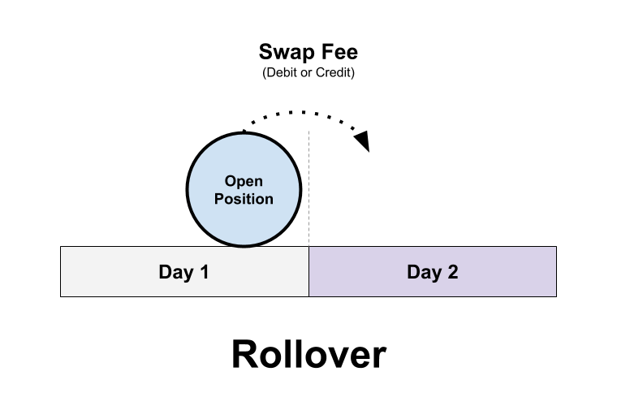

## Table of Contents

## What is the rollover rate in forex trading?

The rollover rate in forex trading is the interest rate that traders either earn or pay for holding a position overnight. When you trade currencies, you're essentially borrowing one currency to buy another. The difference in interest rates between the two currencies involved in the trade determines the rollover rate. If the currency you're buying has a higher interest rate than the one you're selling, you'll earn interest. Conversely, if the currency you're buying has a lower interest rate, you'll have to pay interest.

Rollover rates are important because they can affect the overall profitability of a trade, especially if you plan to hold a position for an extended period. For example, if you're trading a currency pair where the interest rate differential is significant, the daily rollover can either add to your profits or increase your losses. Forex brokers typically calculate and apply these rates at the end of each trading day, which is usually 5 p.m. EST. Understanding how rollover rates work can help traders make more informed decisions about which currency pairs to trade and how long to hold their positions.

## How is the rollover rate calculated?

The rollover rate is calculated based on the difference in interest rates between the two currencies in a forex pair. Let's say you're trading the EUR/USD pair. If the interest rate for the Euro is higher than the interest rate for the US Dollar, you will earn interest on your position. The broker takes the difference between these two interest rates and applies it to the position size you hold overnight.

To figure out the exact amount, brokers usually use a simple formula. They take the interest rate differential, divide it by 365 to get the daily rate, and then multiply it by the position size in the base currency. For example, if the interest rate differential is 1% and you're holding a position of 100,000 Euros overnight, the daily rollover interest would be (0.01 / 365) * 100,000, which equals about 2.74 Euros. This amount is either credited to or debited from your account at the end of each trading day.

## Why is the rollover rate important for forex traders?

The rollover rate is important for forex traders because it can affect how much money they make or lose. When you keep a trade open overnight, you either earn or pay interest based on the difference in interest rates between the two currencies you're trading. If the currency you're buying has a higher interest rate than the one you're selling, you'll earn some money. But if it's the other way around, you'll have to pay. This small amount of money can add up over time, especially if you're holding a big trade or keeping it open for a long time.

Understanding the rollover rate helps traders pick the right currency pairs and decide how long to keep their trades open. For example, if you know the interest rate difference is big, you might choose to trade that pair to earn more interest, or avoid it if you'd have to pay a lot. It's also important for traders who like to hold trades for days or weeks because the daily interest can really change the total profit or loss. So, knowing about rollover rates can help traders make smarter choices and manage their money better.

## What factors influence the rollover rate?

The main thing that affects the rollover rate is the difference in interest rates between the two currencies you're trading. If the country of the currency you're buying has a higher interest rate than the country of the currency you're selling, you'll earn some money every day you keep the trade open. On the other hand, if the currency you're buying has a lower interest rate, you'll have to pay a bit of money each day. This is because when you trade forex, you're basically borrowing one currency to buy another, and the interest rates of those countries matter a lot.

Other things can also change the rollover rate. For example, the size of your trade matters because the bigger your trade, the more money you'll earn or pay each day. Also, some brokers might add a little extra to the interest rate they charge or pay, which can make the rollover rate a bit different from what you might expect just by looking at the interest rates of the two countries. So, it's a good idea to check with your broker to know exactly what you'll be earning or paying.

## How does the rollover rate affect long-term forex positions?

The rollover rate can really change things if you're keeping a forex trade open for a long time. If you're buying a currency with a higher interest rate than the one you're selling, you'll earn a bit of money every day. Over time, this can add up to a nice extra amount on top of any profit you make from the trade itself. But, if the currency you're buying has a lower interest rate, you'll have to pay a little bit every day, which can eat into your profits or make your losses even bigger if the trade isn't going your way.

Because of this, it's important to think about the rollover rate when you're planning to hold a trade for a long time. You might choose to trade currency pairs where you'll earn interest to help boost your overall profit. Or, you might decide to avoid pairs where you'd have to pay a lot in interest, especially if you think the trade might take a while to be profitable. Knowing how the rollover rate works can help you make better decisions about which trades to make and how long to keep them open.

## Can you explain the difference between positive and negative rollover rates?

A positive rollover rate means you earn a little bit of money every day you keep your forex trade open. This happens when the currency you're buying has a higher interest rate than the one you're selling. For example, if you're buying Euros and selling US Dollars, and the interest rate for Euros is higher, you'll get a small amount of money added to your account each day. This can be good for you, especially if you plan to keep the trade open for a long time, because those small daily earnings can add up and make your overall profit bigger.

On the other hand, a negative rollover rate means you have to pay a little bit of money every day you keep your trade open. This happens when the currency you're buying has a lower interest rate than the one you're selling. Using the same example, if you're buying US Dollars and selling Euros, and the interest rate for US Dollars is lower, you'll have to pay a small amount each day. This can make your trade less profitable or increase your losses if the trade isn't going well. It's important to think about whether you'll have a positive or negative rollover rate when you're deciding which trades to make and how long to keep them open.

## How do forex brokers handle rollover rates?

Forex brokers handle rollover rates by calculating the interest rate difference between the two currencies in a trade and applying it to the trader's account at the end of each trading day, usually at 5 p.m. EST. If the currency you're buying has a higher interest rate than the one you're selling, the broker will add a small amount of money to your account. But if the currency you're buying has a lower interest rate, the broker will take a small amount of money out of your account. This daily adjustment is called the rollover rate, and it can make a big difference over time, especially for big trades or trades that last a long time.

Brokers might also add a little extra to the interest rate they charge or pay, which can make the rollover rate a bit different from what you might expect just by looking at the interest rates of the two countries. This extra amount is called the broker's markup, and it's how they make money from the rollover rates. So, it's a good idea to check with your broker to know exactly what you'll be earning or paying. Understanding how your broker handles rollover rates can help you make better choices about which trades to make and how long to keep them open.

## What strategies can traders use to take advantage of rollover rates?

Traders can use a strategy called the carry trade to take advantage of rollover rates. In a carry trade, you borrow money in a currency with a low interest rate and use it to buy a currency with a higher interest rate. This way, you earn the difference between the two interest rates every day you keep the trade open. For example, if you borrow Japanese Yen, which often has a low interest rate, and buy Australian Dollars, which usually have a higher interest rate, you'll earn money every day from the interest rate difference. This can add up over time, making your overall profit bigger, especially if you hold the trade for a long time.

Another strategy is to choose currency pairs where you know you'll have a positive rollover rate. This means picking pairs where the currency you're buying has a higher interest rate than the one you're selling. By doing this, you'll earn a little bit of money every day you keep the trade open, which can help boost your profits. It's important to think about how long you plan to keep the trade open because the longer you hold it, the more you can earn from the rollover rate. Knowing which pairs have positive rollover rates can help you make smarter trading decisions and manage your money better.

## How do central bank interest rates impact the rollover rate in forex?

Central bank interest rates are really important for the rollover rate in forex trading. When a central bank changes its interest rate, it changes the interest rate for that country's currency. If the interest rate goes up, the currency's interest rate goes up too. This means if you're trading that currency and it has a higher interest rate than the other currency in your pair, you'll earn more money every day from the rollover rate. But if the interest rate goes down, you'll earn less or maybe even have to pay money if the other currency in your pair has a higher interest rate.

Traders need to keep an eye on what central banks are doing because changes in interest rates can affect their trades a lot. If you're using a strategy like the carry trade, where you borrow money in a currency with a low interest rate to buy a currency with a higher interest rate, you want to know if those rates might change. If the central bank of the currency you're buying raises its interest rate, your daily earnings from the rollover rate could go up. But if they lower it, your earnings could go down. So, understanding what central banks might do can help you make better trading decisions and manage your money more wisely.

## What are the tax implications of earning income from rollover rates?

Earning money from rollover rates in forex trading can have tax implications, but it depends on where you live and how your country taxes income from trading. In many places, any money you earn from trading, including the small daily amounts from rollover rates, is considered taxable income. You might need to report this income on your tax return and pay taxes on it, just like you would with money earned from a job. It's a good idea to keep good records of all your trades, including the amounts you earn or pay from rollover rates, so you can report it correctly.

Different countries have different rules about how they tax trading income, so it's important to check the tax laws in your country or talk to a tax professional. Some countries might treat rollover rate income as interest income, while others might see it as part of your overall trading profits. Knowing how your country taxes this kind of income can help you plan better and avoid any surprises when it's time to file your taxes.

## How do rollover rates differ between major, minor, and exotic currency pairs?

Rollover rates can be different for major, minor, and exotic currency pairs because of the interest rates in the countries of the currencies being traded. Major currency pairs, like EUR/USD or USD/JPY, usually have smaller differences in interest rates because these are currencies from big economies with stable interest rates. This means the rollover rates for major pairs are often smaller, and you might earn or pay less money each day you keep a trade open.

Minor and exotic currency pairs can have bigger differences in interest rates. Minor pairs, like AUD/CAD or GBP/CHF, involve currencies from smaller economies where interest rates might change more often. Exotic pairs, like USD/TRY or EUR/ZAR, involve one major currency and one from a smaller or emerging market, where interest rates can be much higher or lower. Because of these bigger differences, the rollover rates for minor and exotic pairs can be larger, which means you could earn or pay more money each day, depending on which currency you're buying and selling.

## What advanced techniques can be used to hedge against unfavorable rollover rates?

One advanced technique to hedge against unfavorable rollover rates is to use a strategy called interest rate parity. This means you open two trades at the same time: one where you buy a currency with a higher interest rate and another where you sell the same currency. By doing this, you can balance out the interest you earn and pay, so the rollover rates cancel each other out. This can help you avoid losing money from high negative rollover rates, especially if you plan to keep your trades open for a long time.

Another technique is to use options to hedge your forex positions. Options give you the right, but not the obligation, to buy or sell a currency at a certain price in the future. If you're worried about a big negative rollover rate, you can buy an option that lets you close your trade at a good price before the rollover rate becomes too costly. This way, you can protect your money from the daily interest charges and still keep your trade open if you think it will be profitable in the long run.

## What is the Understanding of Forex Rollover Rate?

Forex rollover rates are pivotal components in the world of foreign exchange (Forex) trading. They play a significant role in dictating the financial outcomes of positions held overnight. The rollover rate, often referred to as the "swap rate," is the interest rate differential between the two currencies involved in a Forex transaction. It is essentially a cost or income resulting from the interest rate differentials between the currency pairs traded. 

### Definition and Role of Rollover Rate

In Forex trading, rollover refers to the process of extending the settlement date of an open position. Most trading platforms automatically close and reopen positions at the end of each trading day, a process known as "tomorrow-next" or "tom-next." The rollover rate is the interest paid or received by a trader for holding a currency position overnight. This rate comes into play because when traders hold a position overnight, they essentially borrow one currency to buy another. The financial institutions facilitating these trades will apply an [interest rate](/wiki/interest-rate-trading-strategies) differential between these two currencies, calculated based on their respective interest rates.

### Calculation of Rollover Rates

Rollover rates are influenced by the interest rates set by the central banks of the countries issuing the currencies. The formula to calculate the rollover rate is:

$$
\text{Rollover Rate} = (r_{\text{base}} - r_{\text{quote}} - \text{broker's markup}) \times \frac{{\text{Trade Size}}}{365}
$$

Here, $r_{\text{base}}$ is the interest rate of the currency being purchased, and $r_{\text{quote}}$ is the interest rate of the currency being sold. The broker's markup is often a small adjustment made by the brokerage firm to earn a profit on the overnight financing.

### Impact on Trading Strategies and Profitability

Rollover rates can significantly impact trading strategies and profitability. Positive rollover rates result in additional income for traders, while negative rates lead to additional costs. This [factor](/wiki/factor-investing) often influences traders' decisions on whether to hold positions overnight, particularly in [carry](/wiki/carry-trading) trade strategies. In a carry trade, investors aim to profit from the difference in interest rates by borrowing a currency with a low-interest rate and investing in a currency with a higher rate.

### Positive vs. Negative Rollover Examples

**Positive Rollover Example:**
If a trader holds a position where the interest rate of the currency being bought (base currency) is higher than the one being sold (quote currency), they will earn a positive rollover. For instance, if a trader buys USD/JPY, and the USD interest rate is 5% while the JPY rate is 0.1%, the trader receives the interest rate differential minus the broker's markup.

**Negative Rollover Example:**
Conversely, if a trader buys a currency pair where the base currency has a lower interest rate than the quote currency, they will incur a cost due to the negative rollover. For instance, holding EUR/USD might result in a negative rollover if the European Central Bank's interest rates are lower than those of the Federal Reserve.

Understanding these concepts allows traders to better manage their open positions and strategically plan trades around interest rate announcements and central bank meetings to maximize profits or minimize losses. While some traders may seek to capitalize on positive rollovers, others might aim to avoid the costs associated with negative rollovers, thus incorporating these considerations into their broader trading strategies.

## References & Further Reading

[1]: Dolan, Brian, and Kathleen Brooks. ["Currency Trading for Dummies."](https://www.amazon.com/Currency-Trading-Dummies-Business-Personal/dp/1119824729) For Dummies, 3rd Edition.

[2]: Lien, Kathy. ["Day Trading and Swing Trading the Currency Market: Technical and Fundamental Strategies to Profit from Market Moves."](https://onlinelibrary.wiley.com/doi/book/10.1002/9781119212997) Wiley, 3rd Edition.

[3]: Nison, Steve. ["Japanese Candlestick Charting Techniques: A Contemporary Guide to the Ancient Investment Techniques of the Far East."](https://archive.org/details/japanesecandlest0000niso) Prentice Hall Press, 2nd Edition.

[4]: Chan, Ernest P. ["Algorithmic Trading: Winning Strategies and Their Rationale."](https://github.com/ftvision/quant_trading_echan_book) Wiley.

[5]: Jansen, Stefan. ["Machine Learning for Algorithmic Trading."](https://github.com/stefan-jansen/machine-learning-for-trading) Packt Publishing, 2nd Edition.